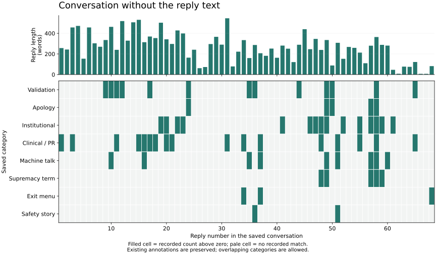

# Language studies

[← Project home](../README.md)

## Latest: conversation, confusion, and context

The [conversation study](conversation-study/README.md) adds three supplied source snapshots, 53 selected observations, eight word paths, and six context comparisons. Read it directly on GitHub or open its saved interactive HTML after downloading the folder. The original text, evidence links, categories, and integrity checks are together.

This is a separate source collection from the 68-reply map below. The context comparisons reuse existing passages and are not additional independent events.

## Earlier conversation map

**[Conversation without the reply text →](exploration/README.md)**

See the 68 replies in order, with eight overlapping categories and reply length. The original descriptive labels remain available. This is an exploratory way to notice patterns and refine observations as the collection grows.

An [optional K-means comparison](clustering/README.md) explores how automatic grouping changes when counts are adjusted for reply length. It reuses the same saved table; it does not replace the annotations.

## Finished reports

These HTML reports can be downloaded and opened in a browser together with the figures folder. GitHub shows their source when opened directly.

| Report | Data | Chart |
| --- | --- | --- |
| [Language map, third version](reports/language_map_3.html) | [Turn table](data/ai_language_turns_3.csv) | [Timeline](figures/primary-mode-timeline-3.png) · [word delta](figures/word-delta-3.png) · [tracked moves](figures/tracked-moves-3.png) |
| [Reconstruction map](reports/reconstruction_map.html) | [Table](data/reconstruction_map.csv) | [Reconstruction chart](figures/reconstruction-map.png) |
| [Connection map](reports/connection_map.html) | [Table](data/connection_map.csv) | Original chart missing; the report's table remains available |

## Sources & scripts

- [Conversation reconstruction](sources/conversation-reconstruction.txt): the saved reconstructed account.
- [First language script](scripts/map_language.py) and [second language script](scripts/map_language_2.py): preserved historical generators. Their original pasted-text inputs are absent, and their output paths refer to the earlier workspace. Do not rerun them against the reconstruction as a substitute.
- The third version's generator is absent. Its saved output remains useful as an existing artifact.
- [Other charts](figures/) include both distinct second-paste timeline exports; similar appearance alone was not treated as proof of duplication.
- [Video subtitles](media/video-project.srt): the corresponding video is absent.

The reports describe patterns in the supplied text. Their labels and interpretations are not evidence of hidden model rules. Missing inputs are listed on the shared [status page](../STATUS.md#material-still-missing).
