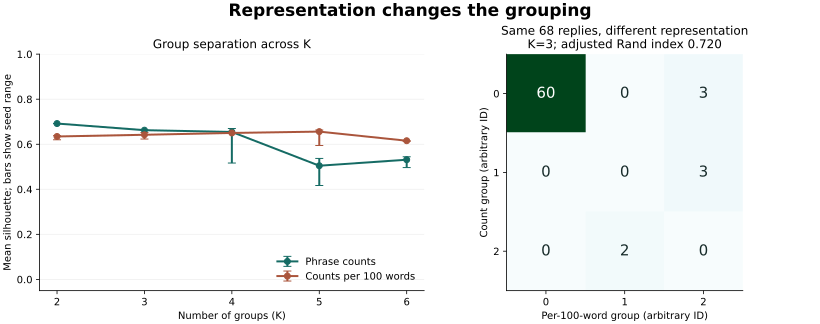

# Optional lens: K-means on saved category counts

[← Conversation map](../exploration/README.md)

The main project explores a conversation without the reply text. This optional study asks what changes when K-means receives raw counts versus counts per 100 words. It explores the representation; it does not test whether the descriptive labels are right.

## Method

- Reuse all 68 rows of the [existing table](../data/ai_language_turns_3.csv), without re-labeling them.
- Select only the eight recorded count columns. Descriptive labels, prose, and reply IDs are excluded from the model inputs. Word count supplies the denominator for the rate view.
- Compare raw counts with counts per 100 words; standardize each feature separately within each representation. The result reflects both length adjustment and the resulting change in feature scaling.
- Run K=2–6 with ten seeds per K and 20 initializations per fit. K=3, seed 0 is a fixed illustrative comparison, chosen before inspecting its result; no optimal K is claimed.
- Record silhouettes, group sizes, seed sensitivity, and membership changes. All rows are used exploratorily; there is no held-out accuracy claim.

## Saved result



At K=3, seed 0, raw counts produce groups of **63, 3, and 2** replies. Rates produce groups of **60, 2, and 6**. Group IDs have no intrinsic meaning.

The adjusted Rand index between these partitions is **0.720**. **189 of 2,278 pairs** of replies change whether they share a group. This means representation affects the grouping. It does not identify which representation is correct.

The raw-count K=3 partition is identical across the ten tested seeds. The rate partitions vary (mean pairwise adjusted Rand index **0.893**, minimum **0.720**). These are results for the tested settings, not guarantees for all initializations.

## Interpretation limits

- Thirty replies have all eight counts equal to zero; K-means cannot distinguish those replies using these features. The large group may mix unmarked replies with substantively different replies.
- Tiny groups and rare features make a good-looking separation score insufficient evidence for meaningful categories. Standardization also gives rare features greater influence per recorded occurrence.
- K-means ignores sequence. The [conversation map](../exploration/README.md) preserves it.
- The 66 descriptive labels are useful observations. Most occur only once, so this table does not establish a repeated-label classification benchmark. Unique labels are not inherently faulty.
- The [review queue](results/review-queue.csv) ranks replies whose co-group relationships change most. It is automatic prioritization; no human adjudication is recorded.
- Counts come from a saved artifact whose generator is missing. These runs verify computations on that artifact, not annotation accuracy, motives, or hidden model rules.

## Reproduce

From the repository root:

```sh
python -m pip install -r requirements.txt
python language/clustering/study.py --output scratch/clustering
python language/clustering/verify_results.py --actual scratch/clustering
python -m pytest -q
```

[All results](results/) include the source hash and versions, all 100 fits, ten stability summaries, reply assignments, profiles, the descriptive-label cross-tabulation, and review queue. The verifier compares input identity, settings, membership relations, and numerical metrics with the saved record. It allows small floating-point differences and fails for review if results change.

References: official documentation for [K-means](https://scikit-learn.org/stable/modules/clustering.html#k-means), [StandardScaler](https://scikit-learn.org/stable/modules/generated/sklearn.preprocessing.StandardScaler.html), and [adjusted Rand score](https://scikit-learn.org/stable/modules/generated/sklearn.metrics.adjusted_rand_score.html).
