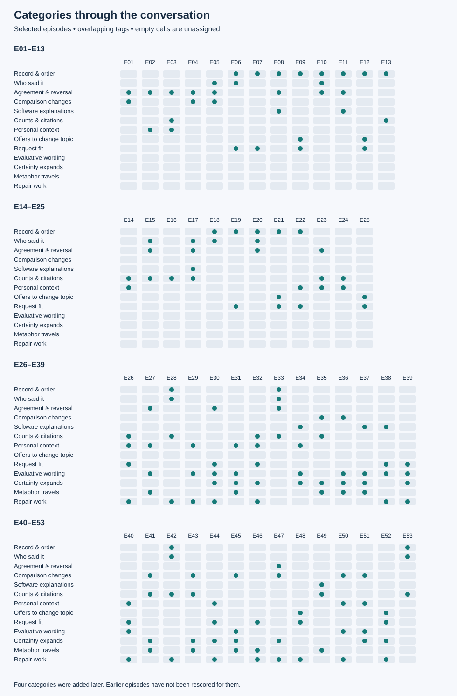

# Categories without the reply text

[← Study home](README.md)

Columns are selected episodes, not individual replies. A filled cell records a provisional tag. A blank means no tag was assigned. Four later categories have not been applied retrospectively; blanks are not evidence of absence.

## Definitions

| Category | Reading definition |
| --- | --- |
| Record &amp; order | Claims about what the conversation contains, where it starts, or what happened before what. |
| Who said it | Distinguishing original wording, quoted wording, user edits, and the origin of a claim or source. |
| Agreement &amp; reversal | Strong agreement or an answer changing after a challenge; correctness needs its own check. |
| Comparison changes | The basis of similarity changes: name, structure, receptor, effect, route, or use. |
| Software explanations | The assistant offers an explanation of its code, memory, motives, or hidden system behavior without inspectable evidence. |
| Counts &amp; citations | A numerical or sourced claim whose input, method, attribution, or relevance can be checked. |
| Personal context | Employment, medication, or writing style is introduced or reclassified. These kinds of context remain distinct. |
| Offers to change topic | An invitation to stop, pivot, or change subject. This records wording, not an intention to exclude the user. |
| Request fit | Whether the response supplies the requested record, quote, count, or explanation. |
| Evaluative wording | Words add approval, danger, blame, or a judgment about a person to an observation or question. |
| Certainty expands | A local observation, analogy, or possibility becomes an absolute or universal claim without the missing evidence. |
| Metaphor travels | A word or image carries into another domain, changes meaning, or gets treated as a literal mechanism. |
| Repair work | The user repeats, narrows, or corrects the request; the next answer may or may not resolve that specific issue. |

## Inspect a section

### Earlier observations · E01–E25

[E01](OBSERVATIONS.md#e01) · [E02](OBSERVATIONS.md#e02) · [E03](OBSERVATIONS.md#e03) · [E04](OBSERVATIONS.md#e04) · [E05](OBSERVATIONS.md#e05) · [E06](OBSERVATIONS.md#e06) · [E07](OBSERVATIONS.md#e07) · [E08](OBSERVATIONS.md#e08) · [E09](OBSERVATIONS.md#e09) · [E10](OBSERVATIONS.md#e10) · [E11](OBSERVATIONS.md#e11) · [E12](OBSERVATIONS.md#e12) · [E13](OBSERVATIONS.md#e13) · [E14](OBSERVATIONS.md#e14) · [E15](OBSERVATIONS.md#e15) · [E16](OBSERVATIONS.md#e16) · [E17](OBSERVATIONS.md#e17) · [E18](OBSERVATIONS.md#e18) · [E19](OBSERVATIONS.md#e19) · [E20](OBSERVATIONS.md#e20) · [E21](OBSERVATIONS.md#e21) · [E22](OBSERVATIONS.md#e22) · [E23](OBSERVATIONS.md#e23) · [E24](OBSERVATIONS.md#e24) · [E25](OBSERVATIONS.md#e25)

### Later observations · E26–E53

[E26](OBSERVATIONS.md#e26) · [E27](OBSERVATIONS.md#e27) · [E28](OBSERVATIONS.md#e28) · [E29](OBSERVATIONS.md#e29) · [E30](OBSERVATIONS.md#e30) · [E31](OBSERVATIONS.md#e31) · [E32](OBSERVATIONS.md#e32) · [E33](OBSERVATIONS.md#e33) · [E34](OBSERVATIONS.md#e34) · [E35](OBSERVATIONS.md#e35) · [E36](OBSERVATIONS.md#e36) · [E37](OBSERVATIONS.md#e37) · [E38](OBSERVATIONS.md#e38) · [E39](OBSERVATIONS.md#e39) · [E40](OBSERVATIONS.md#e40) · [E41](OBSERVATIONS.md#e41) · [E42](OBSERVATIONS.md#e42) · [E43](OBSERVATIONS.md#e43) · [E44](OBSERVATIONS.md#e44) · [E45](OBSERVATIONS.md#e45) · [E46](OBSERVATIONS.md#e46) · [E47](OBSERVATIONS.md#e47) · [E48](OBSERVATIONS.md#e48) · [E49](OBSERVATIONS.md#e49) · [E50](OBSERVATIONS.md#e50) · [E51](OBSERVATIONS.md#e51) · [E52](OBSERVATIONS.md#e52) · [E53](OBSERVATIONS.md#e53)

This graphic is a view of `evidence.json`, not another dataset. Tags and episode order are unchanged. [Read the evidence](OBSERVATIONS.md).
