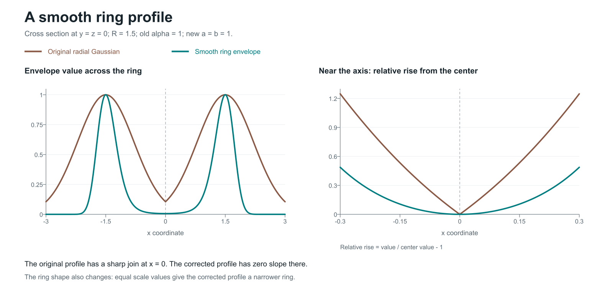

# Math & fluid experiments

[← Project home](../README.md) · [Done & next](../STATUS.md)

## Start here

**The question:** how does a smooth, ring-shaped flow evolve, and how much do the numerical results change when we use a finer grid or smaller time steps?

The **“hug”** is a soft enclosing shape applied to the starting flow. After that preparation, the flow evolves with zero external force. A *velocity field* gives the speed and direction at each position; its *gradient* measures how quickly that velocity changes from place to place.

1. **See the current result:** [the quarter-time-step comparison](notes/hug-boundary.md#quarter-time-step-check-for-the-averaging-method).
2. **Understand the construction:** [how the hug shapes the starting field](notes/hug-boundary.md).
3. **Follow the work:** [completed checks and the next experiment](../STATUS.md#next-math-step).

The original grid-comparison series reaches **model time 0.4** on **256³ and 384³** grids. The grid differences are **0.0875%** in velocity and **0.3710%** in its gradient. On 384³, halving the time step gives **0.0491%** and **0.1245%**. Model time is the simulation time coordinate. These are finite-time numerical measurements; the Clay problem requires a mathematical proof.

**Latest shape measurement:** Both energy-weighted widths decreased at the new saved times in all three runs. [Values and definitions](notes/hug-boundary.md#continuation-to-model-time-04).

## Completed mirror-fluid tests

[Four reproduced tests and charts](imports/hug-ns/mirror-fluid/README.md) and [20-run signed calibration](imports/hug-ns/mirror-calibration/README.md), with source and actual result files.

## Hug-ns code and results

[Open the experiment overview](imports/hug-ns/README.md) for the code, sixteen result tables and measurement definitions. The latest N=64 table reaches time 0.12; the earlier no-stop table reaches 0.35. The [code review](imports/hug-ns/REVIEW.md) lists the corrected pressure diagnostic, 32 focused passes and three known failures. The [results review](imports/hug-ns/RESULTS-REVIEW.md) explains exactly which values were checked. This imported solver uses different starting data from the earlier ring study.

## Background and earlier experiments

1. **[The smooth initial field](notes/smooth-initial-field.md)** — the corrected construction and exact energy.
2. **[The cube experiments](EXPERIMENTS.md)** — saved results, pressure correction, and what the tests establish.
3. **[Review of the original framework](notes/math-review.md)** — mathematical claims still requiring work.
4. **[Norm and Entropy: two mirrored halves](notes/norm-entropy-mirror.md)** — paired samples, K-means before and after alignment, and the separate boundary check.
5. **[A soft envelope: hug, imprint, and pressure](notes/soft-envelope.md)** — small motion and memory prototypes, with explicit opening rules.
6. **[The hug construction and run history](notes/hug-boundary.md)** — the smooth enclosing shape, grid comparisons, saved continuations, and time-step checks.
7. **[Separate trigonometric illustration](notes/hidden-flow-evolution.md)** — assistant-chosen fields with an analytic reduction and refined numerical runs; these do not evolve the project's ring field or establish the proposed conversation-to-fluid mapping.



The right panel zooms into the center and shows `value / center value - 1` for each curve. The figure uses equal parameter numbers, which give different ring widths; the cube experiments separately match the local peak widths.

The editable derivation is [smooth-initial-field.tex](notes/smooth-initial-field.tex). The [original report](https://github.com/NousVolition/Nous-Volition/blob/main/stokes_stream_report.pdf) remains in the companion repository.

## Use the code

| File | Role |
| --- | --- |
| [initial_field.py](initial_field.py) | The single maintained implementation of the smooth field and its energy |
| [stokes.py](stokes.py) | The original Gaussian, kept for reproducing historical comparisons |
| [navier.py](navier.py) | The original cube update plus the corrected discrete projection |
| [box_experiment.py](box_experiment.py) | Configurable comparisons for the original, smooth, and hug profiles and all box sizes |
| [verify_energy.py](verify_energy.py) | The existing independent quadrature check |
| [reflection_probe.py](reflection_probe.py) | Face matching, slope reversal, and divergence for a flipped neighboring copy |
| [mirror_family.py](mirror_family.py) | Norm/Entropy pairing and the illustrative K-means comparison |
| [hug_envelope.py](hug_envelope.py) · [pressure_envelope.py](pressure_envelope.py) | Shared mirrored-arm geometry, timed release, and a separate pressure-triggered opening prototype |
| [hugged_ring.py](hugged_ring.py) | The existing closed hug applied to the existing smooth ring through its stream function; used by `box_experiment.py --profile hug` |
| [hug_refinement.py](hug_refinement.py) | Grid and time-step comparisons of the same hugged ring, using the existing cube stencils; caches completed runs |
| [extend_hug_refinement.py](extend_hug_refinement.py) | Extends the grid study; `--half-step` checks 256³ at time 0.08, and `--finer-grid 384` compares the saved 256³ field with 384³ at time 0.16, preserving checkpoints; `--time-control-grid 384` adds the half-step control; `--continue-to 0.24` resumes all three controls; `--from-study math/results/hug-continued-0.32.json --continue-to 0.4` starts from the later saved state |
| [continue_hug_refinement.py](continue_hug_refinement.py) | Continues the saved 128³ and 256³ states to time 0.16, preserving the original step sizes and zero force; checks restart identity |
| [hidden_flow_experiment.py](hidden_flow_experiment.py) | Unforced periodic Fourier evolution for A/B/C and the three-dimensional continuation |
| [hug_shape.py](hug_shape.py) | Measures energy-weighted widths from existing checkpoint arrays; adds no solver steps |
| [hug_resolution.py](hug_resolution.py) | Checks saved fields for checkerboards, short waves and differences between two discrete gradient measurements; adds no solver steps |
| [hug_energy_balance.py](hug_energy_balance.py) | Compares observed energy loss with viscosity using published measurements; records sensitivity to integration and observation spacing |
| [hug_step_energy.py](hug_step_energy.py) | Traces viscosity, transport, finite-step and pressure-correction energy contributions on disposable copies of saved states |
| [hug_time_method.py](hug_time_method.py) | Compares Euler and projected Heun over the same short interval from saved flow, with one, two and four steps |
| [hug_method_interval.py](hug_method_interval.py) | Continues Euler and Heun from the same saved state, with reusable checkpoints and full-step / half-step controls |
| [hug_method_grid.py](hug_method_grid.py) | Adds the 256³ method controls using the same continuation functions and reuses the completed 384³ results |
| [hug_method_refinement.py](hug_method_refinement.py) | Adds one quarter-step Heun control and reuses both larger-step branches for matched comparisons |
| [tests/](tests/) | Consolidated checks from the repositories and this review |

From the repository root:

```sh
python -m pip install -r requirements.txt
python -m pytest -q
python math/box_experiment.py --profile smooth --start projected --box 18 --points 16
```

Read the [saved CSV](results/box-experiment-results.csv) for the completed full suite. To intentionally reproduce it, use `python math/box_experiment.py --suite --csv scratch/box-results.csv`.

The field construction and the fluid evolution have separate scopes: the analytic initial field is established; the cube is an experimental discretization with known boundary and centered-grid limitations. [Next step →](../STATUS.md#next-math-step)

