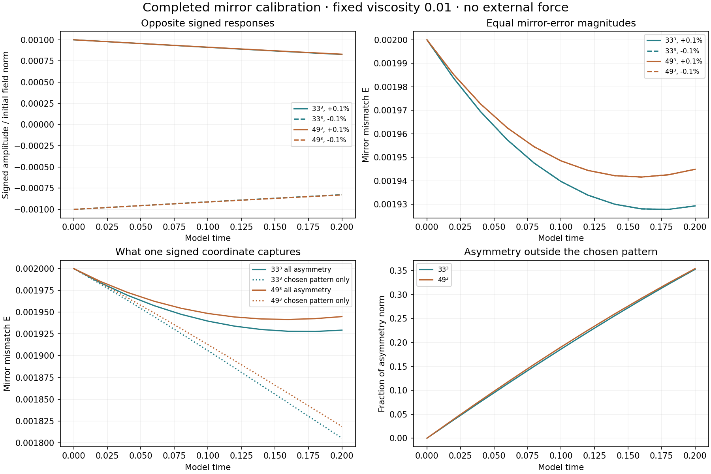

# Signed mirror calibration

[Hug-ns overview](../README.md) · [Detailed measurements](recorded-results/analysis.json) · [Construction](recorded-results/protocol.json)

**20 fluid trajectories completed through model time 0.20:** grids 33³ and 49³, base and half timesteps, and initial amplitudes 0, ±0.1%, ±0.5%. Viscosity is 0.01; the periodic cube has side 6; external force is zero.



| Check | Measured difference |
| --- | --- |
| Reflected full velocity fields | At most 7.14e-15 relative error |
| Zero-bias mirror mismatch E | At most 6.90e-15 |
| Base versus half timestep | At most 0.000172% for signed amplitude and E curves |
| 33³ versus 49³ | At most 0.7791% for those curves |

The two-grid comparison measures agreement of these observables; it does not establish full-field convergence or a convergence order.

## Coordinate and starting field

```text
u0 = u_sym + amplitude * norm(u_sym) * phi
a = <u - M[u], phi> / (2 * <phi, phi>)
signed_fraction = a / norm(u_sym at time 0)
E = norm(u - M[u]) / norm(u)
```

The factor of two makes the starting signed fraction equal the requested amplitude. E includes all antisymmetric patterns; the signed coordinate measures one chosen pattern. The residual outside that pattern is recorded explicitly.

This calibration uses the projected antisymmetric part of the removal-test Gaussian, normalized with the spatial L2 inner product. Its template differs from the one later supplied with the four [mirror-fluid tests](../mirror-fluid/README.md). The results belong to separate, documented constructions.

## Run

```sh
python -m pip install -r requirements.txt
python run_all.py
```

Calculated fields go into `mirror-calibration/`; the report goes into `outputs/`. Recorded observations are in `recorded-results/`. The scripts reuse completed calculations. Run one controller at a time.
