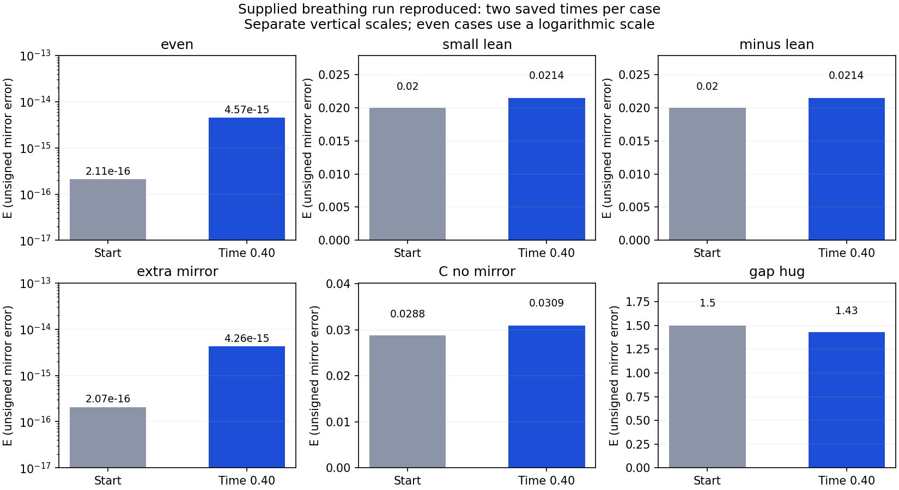

# Breathing rerun: six reproduced driven tests

**All six supplied cases reproduce through time 0.40.** The largest difference from the uploaded E/D values is 1.12e-15. The supplied numerical source was unchanged.

**This driver applies a prescribed velocity push at every step.** Its breathing motion is driven externally. The `clay_hug.py` library advances the unforced equation between those pushes; the complete driver adds the pushes.



## Results

| Start | Initial E | Final E | Initial D | Final D |
| --- | ---: | ---: | ---: | ---: |
| even | 2.1121637e-16 | 4.5659816e-15 | -5.2959911e-20 | -3.6434248e-17 |
| small lean | 0.019999 | 0.021437604 | 0.0041318735 | 0.0029537237 |
| minus lean | 0.019999 | 0.021437604 | -0.0041318735 | -0.0029537237 |
| extra mirror | 2.0678289e-16 | 4.2565499e-15 | -4.0852385e-19 | -3.1705173e-17 |
| C no mirror | 0.028754502 | 0.030913043 | 0.0059347743 | 0.0042398697 |
| gap hug | 1.4985387 | 1.4286406 | -0.031815781 | -0.021575035 |

The even and extra-mirror starts remain symmetric to numerical roundoff. Positive and negative leans retain equal unsigned E and opposite signed D. The gapped start ends with a smaller E. Only the initial and final values were saved, so no intervening growth or decay pattern is established.

## Exact update and timestep limitation

```text
gap = 0.15 * sin(2*pi*t/0.4)
u = u + gap * breath_u
u = advance(u, dt)
```

`breath_u` is a fixed, divergence-free velocity profile. `gap` is its multiplier; this code does not measure a geometric opening or a material boundary.

**The added velocity is not multiplied by dt.** Halving dt doubles the peak equivalent forcing amplitude and approximately doubles the sum of positive kicks. A half-step rerun of this exact driver would change the applied driving as well as the integration accuracy.

The driver also chooses a different step count for different starts:

| Start | Steps | dt | Equivalent force amplitude (mean L2 norm) |
| --- | ---: | ---: | ---: |
| even | 74 | 0.005405405 | 0.771166 |
| small lean | 76 | 0.005263158 | 0.792008 |
| minus lean | 76 | 0.005263158 | 0.792008 |
| extra mirror | 75 | 0.005333333 | 0.781587 |
| C no mirror | 75 | 0.005333333 | 0.781587 |
| gap hug | 134 | 0.002985075 | 1.396436 |

Consequently, comparisons between starts also include differences in applied driving per unit model time. These results reproduce the supplied experiment; they do not isolate a change in starting shape under identical continuous forcing.

## Measurements and numerical setting

- Grid: 33 cubed; periodic cube side 6; viscosity 0.01; endpoint 0.40.
- Fourier derivatives, projection, the supplied inclusive component cutoff at n//3, and two-stage Heun stepping.
- `E = norm(u - M[u]) / norm(u)`: unsigned, dimensionless mirror difference.
- `D = <u - M[u], phi>`: signed projection onto the normalized antisymmetric C template. Inner products use spatial means.
- `M` reflects the x coordinate and reverses the x velocity component.
- This is a supplied-grid reproduction. Grid convergence, timestep convergence, resolved core widths and energy budgets were not established by these two-point records.
- The supplied x>0 cutoff, sign(x) profile and filtering were preserved. No smooth limiting initial field is asserted here.

## Reproduce

```sh
python -m pip install -r requirements.txt
python reproduce.py
```

The wrapper copies the unchanged driver and library into `rerun/`, runs all six cases there and checks against `reference-results.json` with absolute tolerance 1e-12.

[Driver](breathing_rerun.py) · [Solver](clay_hug.py) · [Reproduced results](results.json) · [Verification](verification.json) · [Initialization and forcing audit](initialization-audit.json)

The uploaded marble plot, marble animation and breathing illustration have no generating script in this package. Their movement is not verified by this fluid rerun.

[Mirror-fluid overview](../README.md) · [All reports](../../../../../reports/README.md)
