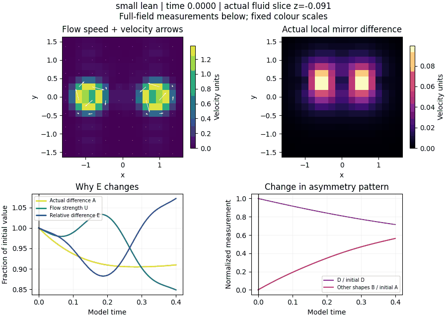
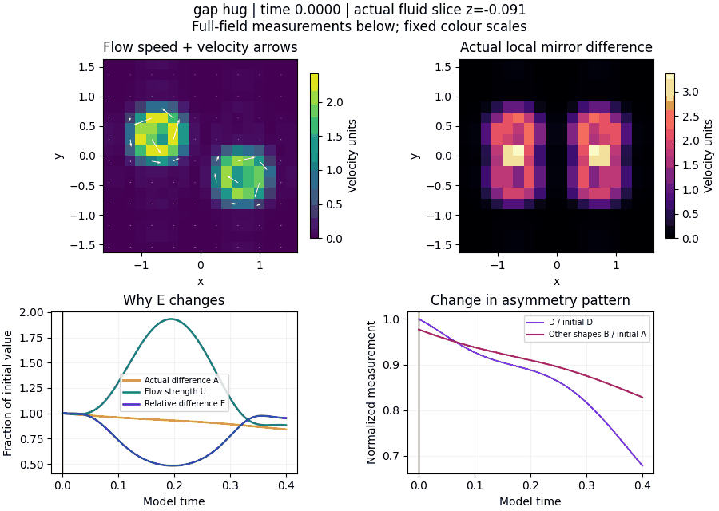
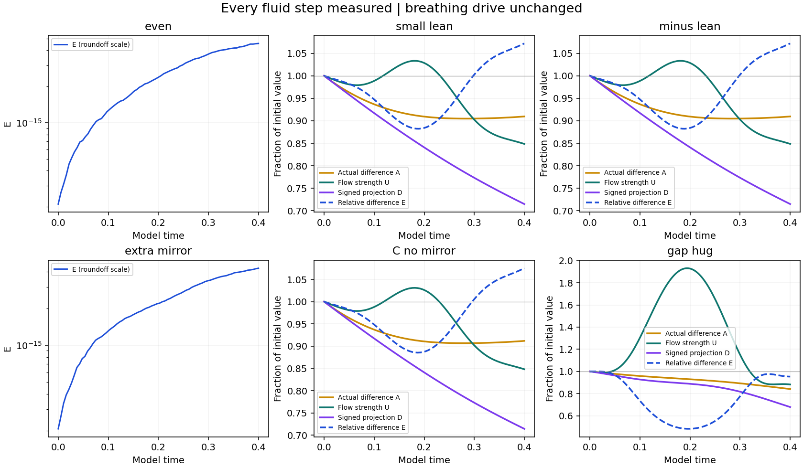

# Following the breathing run through time

**The small-lean imbalance ends 9.04% smaller, while total flow strength ends 15.14% smaller. Their ratio E therefore rises 7.19%. The imbalance also changes spatial pattern: its signed projection D falls 28.51%.**

All six supplied starts were followed through every fluid step to time 0.40. The original breathing pushes, grid, viscosity, timestep choices and initial fields were preserved. Every one of the 516 saved full velocity fields was checked independently. The endpoints reproduce the earlier supplied results.

## Watch the actual fluid

### Small lean



### Gapped hug



The upper panels show an actual saved fluid slice near the middle plane, at z = -0.090909. The left colours show speed; arrows show velocity in that plane. The right colours show the local mirror difference. The view crops the central part of the side-6 cube. Each movie uses 33 saved frames and fixed colour scales within that movie. The pixels expose the supplied 33-grid sampling; they are not a drawing of a moving boundary. The lower measurements use the entire 3D field at every step. Playback speed is illustrative.

## What happened between the endpoints

- **Small lean:** E first falls to 88.23% of its starting value around time 0.1895, then rises to 107.19%. The actual mirror difference A reaches its minimum around 0.2842 and recovers slightly, ending at 90.96% of its initial size. Flow strength U ends at 84.86%.
- **Changed pattern:** the initial small-lean asymmetry lies entirely in the chosen template. At the endpoint, 38.24% of its squared norm lies outside that template. This is a change in the shape of the imbalance, alongside the decrease in its overall size.
- **Gapped hug:** E reaches 48.16% of its initial value around time 0.1970, while flow strength has risen to about 193% of its initial value. The actual difference has declined much less. The pronounced dip in E therefore includes a large effect from its changing denominator.
- **Mirror pairs:** positive and negative leans remain reflected full velocity fields at every saved step, with maximum relative error 4.75e-15. The even and extra-mirror starts remain at roundoff-scale mirror error.

## Endpoint changes

| Start | Actual difference A | Flow strength U | Signed projection magnitude | Relative difference E |
| --- | ---: | ---: | ---: | ---: |
| small lean | -9.04% | -15.14% | -28.51% | +7.19% |
| minus lean | -9.04% | -15.14% | -28.51% | +7.19% |
| C no mirror | -8.81% | -15.18% | -28.56% | +7.51% |
| gap hug | -15.92% | -11.80% | -32.19% | -4.66% |

The signs of D are retained in the saved data. Neither signed lean crosses zero. The table reports the change in its magnitude. Percentage changes are not used for the two roundoff-scale controls.



## How the quantities separate the changes

```text
a = u - M[u]
U = norm(u)                  overall flow strength
A = norm(a)                  actual mirror difference
D = <a, phi>                 signed part in the original template
B = norm(a - D*phi)          part outside that template
E = A/U
A^2 = D^2 + B^2
```

The norm is the square root of the spatial mean of squared vector magnitude. The fixed antisymmetric template phi has unit norm. U, A, D and B use the simulation velocity units; E is dimensionless. This is the same D measurement used by the supplied breathing script; it is not the name of source D.

`log(E/E0) = log(A/A0) - log(U/U0)` accounts exactly for the relative-change result. It separates a change in actual imbalance from a change in the flow used as its reference. This accounting does not establish a causal comparison against a run without the breathing drive.

## What the prescribed push does directly

The breathing profile is mirror-symmetric. Adding it changes U and energy, while leaving A and D unchanged to numerical roundoff at that instant. Across all steps, the largest direct change in A during a kick is 2.78e-17 and in D is 6.94e-18. A and D subsequently change during the fluid advance. The drive can still influence later evolution through the altered velocity field.

This remains a **driven, 33-grid calculation**. The velocity kick has no dt multiplier, so timestep changes also change the driving. Step counts differ between starts. No new grid/timestep convergence or spontaneous boundary-breathing claim is made. The supplied initial cutoff and filtering remain unchanged.

## Verification and files

- [Every-step measurements](results.json) and [independent field verification](analysis.json).
- 516 saved full fields verified against their hashes, measurements, and rendered slices. Largest remeasurement discrepancy: 4.45e-16.
- Maximum divergence: 3.92e-15; maximum recorded speed CFL: 0.04040.
- [Tracing code](trace.py) and [analysis/rendering code](analyze_trace.py). The unchanged driver and library are in the parent folder.
- Full restart fields and slice arrays are retained in the local calculation workspace. GitHub contains measurements, field hashes, code, figures and movies.

From this folder, reproduce into a new local rerun directory:

```sh
python -m pip install -r requirements.txt
python trace.py --out rerun
python analyze_trace.py --data rerun
```

[Original six-case reproduction](../README.md) · [All reports](../../../../../../reports/README.md)
