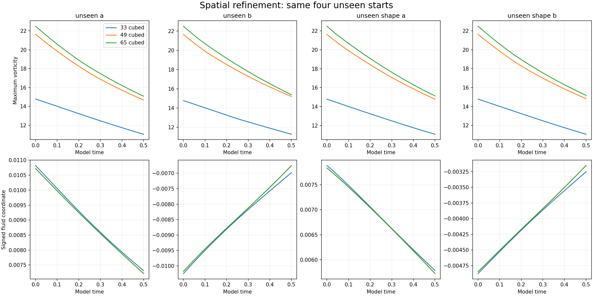

# Additional 65-grid check

**Refinement reduces the peak-spin gap from about 28% to 3.16–3.43%. The signed fluid coordinate changes by at most 0.03281%. The fitted full equation still has no consistent advantage over simpler source models, and the cubic term adds no benefit.**

Four further runs repeat the same unseen starts at 65 cubed, through time 0.5. The fluid equation, initial formulas, viscosity and frozen training coefficients are unchanged. No 65-grid result is used for fitting.

| Start | Peak-spin difference 33 to 49 | Peak-spin difference 49 to 65 | Signed-coordinate difference 49 to 65 |
| --- | ---: | ---: | ---: |
| unseen_a | 27.864% | 3.431% | 0.02278% |
| unseen_b | 28.452% | 3.158% | 0.02657% |
| unseen_shape_a | 28.272% | 3.317% | 0.02605% |
| unseen_shape_b | 28.060% | 3.360% | 0.03280% |

Each value is the relative curve L2 difference against the finer grid.

## Predictions with the original fitted coefficients

| Model | With measured source histories | With inputs frozen after 0.1 |
| --- | ---: | ---: |
| decay only | 2.1617% | 1.6861% |
| AB only | 2.9412% | 2.2425% |
| AB C | 1.8214% | 1.5697% |
| AB C D | 1.8794% | 1.6011% |
| full linear | 1.8908% | 1.5966% |
| full cubic | 1.8908% | 1.5966% |

No 65-grid timestep repeat. Its base CFL target is the unchanged 0.04; previous half-step controls were at 33. Smaller grid differences do not alone establish spatial convergence.

All four final fields were independently remeasured. Field hashes, divergence, energy changes and spectral fractions are recorded in [grid65-analysis.json](grid65-analysis.json).

[Original 26-run test](README.md) · [Extension protocol](refine65-protocol.json) · [Runner](refine65.py) · [Analyzer](analyze65.py)

## What the refinement changes

The 65-grid full model gives 1.8908% conditional curve error and 1.5966% frozen-input forecast error. The AB-plus-C model gives slightly smaller errors, 1.8214% and 1.5697%. Model rankings change from the coarse grid; the full equation is not established by these results.

The maximum source-feature curve change between 49 and 65 is 0.2842%. The largest high-band enstrophy fraction on 65 is 0.00854%. Energy decreases at saved samples. The starting formulas and their existing x>0 cutoffs were retained; this study does not establish a smooth continuum limit for those formulas.

To repeat only this extension in a fresh directory, install the existing requirements and run `python reproduce65.py`. The prior 33/49 measurements and frozen fits are used as references; all four 65-grid fields are evolved again.
