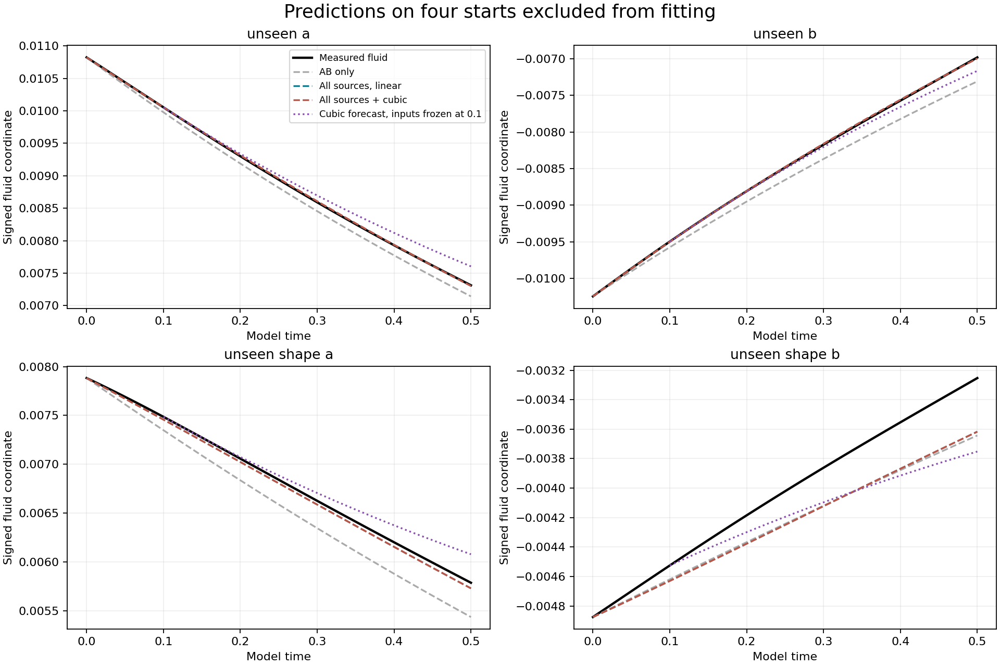
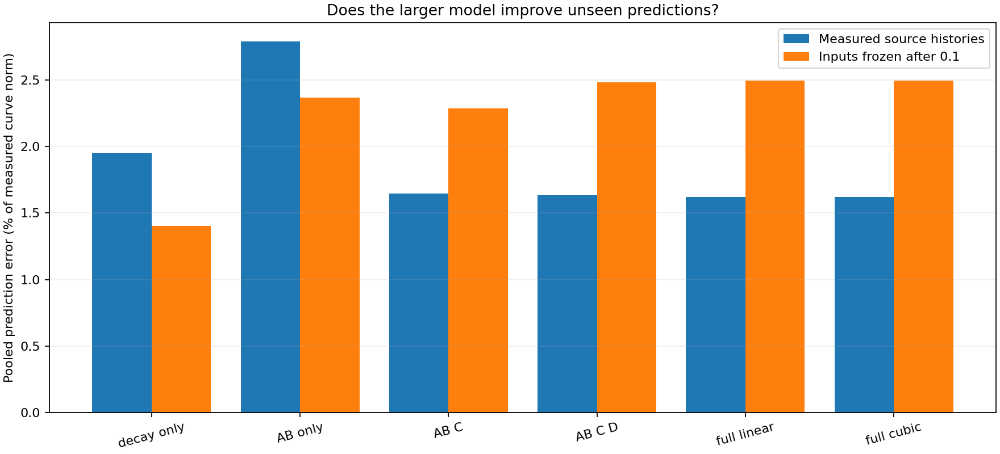

# Dynamic source weights and cubic term

**The source features improve predictions when their measured histories are supplied. The cubic term adds no benefit. Forecasting without future source measurements is worse than simple decay, and the fluid remains sensitive to grid resolution. These tests do not establish the full proposed model.**

26 fluid runs completed: 10 training starts, 4 unseen starts, and 12 mirror, timestep and grid controls. The fluid equation and supplied time stepper were unchanged. No fitted term forces the fluid.

## What was tested

The historical q is a passive record computed by a known linear rule. It cannot independently prove a nonlinear feedback law. This test therefore measures a separate fluid coordinate `q_fluid = <u,phi>/norm(AB0)`, and fits the proposed equation to its full fluid derivative. The original record is also saved as `q_record`; the two are not interchangeable.

A six-template spatial projection defines four dynamic input features: AB interactions, AB–C and C interactions, AB–D and D interactions, and C–D interactions. The full fluid derivative is measured independently. The interaction feature is a specified measurable candidate for the cross term; it does not establish competition between alternative pairings. Definitions and all reserved cases were fixed in [protocol.json](protocol.json) before fitting.

AB bias varies independently. D has a different position, width and velocity direction from reflected C. Two unseen starts additionally change D’s shape.

## Unseen prediction errors

| Model | Measured input histories | Inputs frozen after time 0.1 |
| --- | ---: | ---: |
| decay only | 1.9485% | 1.4019% |
| AB only | 2.7914% | 2.3674% |
| AB C | 1.6486% | 2.2873% |
| AB C D | 1.6361% | 2.4830% |
| full linear | 1.6201% | 2.4940% |
| full cubic | 1.6201% | 2.4940% |

Errors are pooled curve L2 errors divided by the measured curve norm. Conditional prediction starts from the initial fluid coordinate and uses the unseen run’s measured source histories, without future q values. It requires those input histories. The separate forecast uses only information through time 0.1 and assumes subsequent source inputs remain fixed.

## Fitted full equation

| Coefficient | Fit | Range after omitting one training run |
| --- | ---: | ---: |
| gamma | 1.089619 | 1.062922 to 1.173461 |
| w_AB | -12.65495 | -14.01369 to -12.3092 |
| w_C | -0.4038681 | -0.562315 to -0.3543191 |
| w_D | -0.1127765 | -0.2187627 to -0.07896073 |
| w_cross | -0.2620967 | -0.9072466 to 0.3524587 |
| g | 5.827603e-16 | 4.31835e-17 to 128.413 |

Adding the cubic term changes unseen conditional RMSE by an improvement of 0.00000% (negative means worse). The six-column scaled design condition number is 50.0674; rank is 6/6. Fits use nonnegative damping gamma and g; source weights may have either sign.

The full-data cubic coefficient is effectively zero. Its value changes substantially when individual training runs are omitted. The cross coefficient even changes sign. These coefficients should not be treated as established physical constants. The fourth unseen start, which changes D’s shape, has a 5.82% conditional curve error; the pooled 1.62% error hides that weaker result.

## Existing passive q record

The same full and reduced equations were also fitted to q_record, with its known derivative -0.2 q_record + 0.8 S. This target is created by that linear rule. The comparison checks how well the candidate source features reproduce the record; it is not evidence of cubic feedback in the fluid. The chosen signed template is the source-study template, which differs from the older fluid_correction.py template.

| Model | Unseen record prediction error |
| --- | ---: |
| decay only | 100.0000% |
| AB only | 58.7576% |
| AB C | 38.6800% |
| AB C D | 1.1721% |
| full linear | 1.0132% |
| full cubic | 1.0132% |

## Numerical controls

| Unseen start | q curve change: half timestep | q curve change: 33 to 49 grid | Peak-spin curve change: 33 to 49 grid |
| --- | ---: | ---: | ---: |
| unseen_a | 0.000131% | 0.747348% | 27.864% |
| unseen_b | 0.000249% | 1.118727% | 28.452% |
| unseen_shape_a | 0.000141% | 0.441489% | 28.272% |
| unseen_shape_b | 0.000199% | 1.011548% | 28.060% |

All 26 final fields were remeasured. Maximum mirror-pair signed sum: 1.46e-16; maximum E difference: 1.82e-15. Worst retained high-band enstrophy fraction: 16.670%. Energy decreases at all saved samples. Peak-spin curves differ by about 28% between grids, including a substantial initial peak difference. The relatively stable global q measurement does not make the full fluid field resolved.

## Branch selection

For gamma>=0,g>=0, derivative of the drift in q is -gamma-3g*q^2<=0. Constant inputs cannot produce two isolated stable branches.

A sign produced by signed source inputs is a response to those inputs. This model does not demonstrate spontaneous selection of either sign from an unsigned start.

## Files

[All measurements, fits and errors](analysis.json) · [Training fits](fitted-training-models.json) · [Protocol](protocol.json) · [Fluid runner](study.py) · [Analysis code](analyze.py) · [Run index](runs/index.json)
