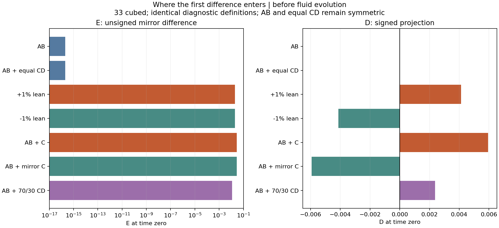
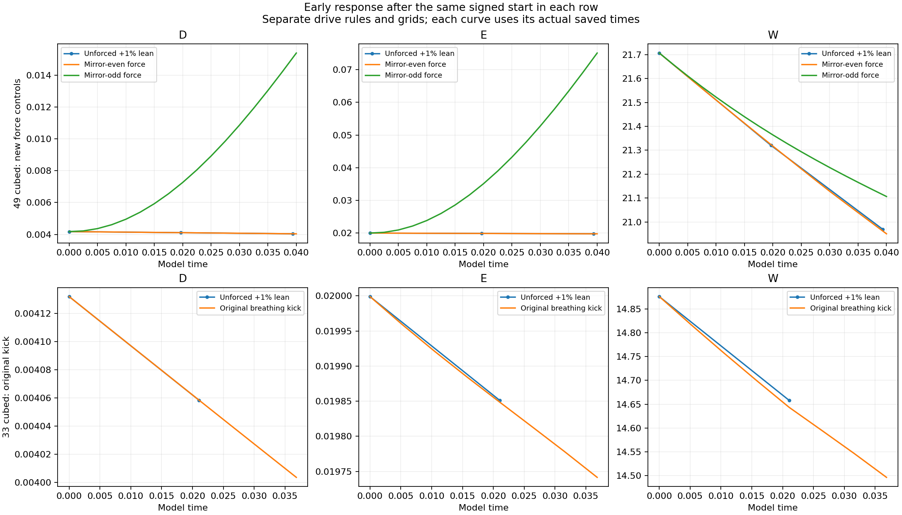

# Where each experiment first changes

**The signed lean and unmatched C alter the starting field. Breathing alters the stepping rule. Matched stretch uses a separate starting field.**

This audit reconstructs 23 first steps and checks them against available saved fields or measurement records. It reuses completed histories and refinement audits. No long run was restarted. Here, “difference” means a changed experiment; the spatial divergence error separately measures incompressibility.

## Choices and errors

A different start or an added drive is an experimental choice. Describing a per-step velocity kick as a timestep-independent force is an error: reducing the timestep applies more kicks over the same interval. The newer driven controls integrate a prescribed acceleration at both Heun stages. Their amplitude, period, normalization and grids are separately specified; they are not an exact replacement of the old breathing experiment.

| Experiment | First change | Equation after initialization |
| --- | --- | --- |
| Exact AB or equal mirrored CD | No imposed mirror-odd part | Unforced Navier–Stokes |
| Positive/negative lean | Add a signed antisymmetric field at time zero | Unforced Navier–Stokes |
| Unmatched C, or unequal C/D | Change the starting geometry at time zero | Unforced Navier–Stokes |
| Original breathing | Add a velocity kick before each fluid step | Driven discrete update |
| New breathing controls | Add force at both Heun stages | Forced Navier–Stokes approximation |
| Matched stretch | Replace the start with tube plus aligned strain | Unforced Navier–Stokes |

## Starting measurements

E = norm(u − M[u]) / norm(u). D = mean((u − M[u]) · phi), where phi is the normalized mirror-odd template. D retains a direction; E is nonnegative. D has velocity units with this normalization; E is dimensionless. W is maximum vorticity magnitude. Other quantities use model units.

| Start, 33 cubed | E(0) | D(0) | W(0) |
| --- | ---: | ---: | ---: |
| AB | 2.11216e-16 | -5.29599e-20 | 14.78380 |
| AB + equal CD | 2.09798e-16 | 6.725e-19 | 14.78422 |
| +1% lean | 0.019999 | 0.00413187 | 14.87570 |
| -1% lean | 0.019999 | -0.00413187 | 14.87570 |
| AB + C | 0.0287545 | 0.00593477 | 14.78463 |
| AB + mirror C | 0.0287545 | -0.00593477 | 14.78463 |
| AB + 70/30 CD | 0.0115028 | 0.00237391 | 14.78438 |

The opposite leans already have opposite D before evolution. Equal CD cancels the mirror-odd part at initialization. Unmatched C has E = 0.0287545 initially. In its saved unforced run E first decreases, then reaches 0.0329282 at time 0.5, while D falls from 0.00593477 to 0.00379039 and W falls from 14.78463 to 11.04645. An increase in normalized E does not itself mean an increasing spin peak.

## First breathing step

**Original driver:** `u <- u + 0.15*sin(2*pi*t/0.4)*gap_field`, then the unforced fluid step. The kick is not multiplied by dt. Its first application is at t = dt, not at zero.

**New drive:** `F(t) = A*U0/0.4*sin(2*pi*t/P)*unit_template`, included as acceleration at both Heun stages. F(0) = 0, but the second stage of the first step uses F(dt).

| Case | dt | Relative field difference from one unforced step | Direct signed contribution |
| --- | ---: | ---: | --- |
| Original kick, 33 cubed | 0.00526316 | 0.00166625 | -5.32856e-20 (kick in D) |
| New even force, 49 cubed | 0.00250000 | 0.000122733 | -1.52684e-20 (D rate at second stage) |
| New odd force, 49 cubed | 0.00250000 | 0.000122733 | 0.0409722 (D rate at second stage) |

The mirror-even kick changes the velocity field while its direct projection onto signed D is at roundoff. It can still affect later D through the changing fluid, and E through both its numerator and denominator. The odd force directly drives D. The two direct-contribution columns use different units because one is a velocity increment and the other a rate.

The statement “breathing stops, therefore force was only applied at initialization” is not established. A measured response may weaken even while forcing continues. The actual loop confirms repeated application.

## Early response

| Case | Slope window | E slope | D slope | W slope |
| --- | --- | ---: | ---: | ---: |
| Unforced lean, 49 | 0.000–0.03934 | -0.00551664 | -0.00348339 | -18.7544 |
| New even force, 49 | 0.000–0.04000 | -0.0056421 | -0.00348058 | -18.9674 |
| New odd force, 49 | 0.000–0.04000 | 1.40774 | 0.286839 | -14.8918 |
| Original kick, 33 | 0.000–0.03684 | -0.00692989 | -0.00348351 | -10.2632 |

These are fitted slopes over saved observations, not instantaneous derivatives or growth exponents. All three 49-grid curves start from the same lean. The mirror-odd drive raises D and E in this early window while W still decreases. The source-only history has its first stored sample near time 0.1; it cannot supply equally fine early timing.

## Reflection and numerical controls

| Check | Largest first-step relative field discrepancy |
| --- | ---: |
| C_vs_reflected_C | 3.61e-16 |
| mirror-33 | 4.05e-16 |
| mirror-49 | 4.61e-16 |
| mirror-65 | 5.22e-16 |

For the completed unforced lean controls through 0.4:

| Refinement | W curve difference | E curve difference | D curve difference |
| --- | ---: | ---: | ---: |
| 49 to 65 cubed | 3.28595% | 0.07208% | 0.01674% |
| 65 cubed, half timestep | 0.0000571% | 0.00166% | 0.00036% |

These are different measurements with different convergence behavior. Preserved reflection does not establish resolution of W. The completed [methods controls](../methods-controls/README.md) include spectra; the [adaptive peak audit](../../../../../reports/matched-stretch/adaptive-peak/README.md) contains physical core widths and high-wavenumber checks for the separate matched-stretch field.

## Matched stretch

The reconstructed 64-grid start matches its saved spectral field to roundoff. It begins at W = 59.27995 and kinetic energy 17545.88279, compared with W = 14.78380 and energy 4.60954 for the 33-grid AB reference. The fields, viscosity and grids differ. Their different later behavior does not isolate one causal change.

The matched-stretch peak is near the periodic join, and the raw strain has a mismatch there. It is not established that the central tube is the location responsible for its largest peak. The original start still fails the six-cell width requirement on every audited grid. It remains a diagnostic of that supplied construction.

## Files and scope

[All measurements and source hashes](results.json) · [Audit code](audit.py) · [Plot code](report.py)

Raw component arrays and restart fields remain with the local study because of their size; their hashes are recorded here. Measurement records, charts and code are on GitHub and in the local repository mirror. To rerun this audit with the saved arrays, install `requirements.txt` and run `python audit.py --study-root PATH_TO_MATCHED_STRETCH_STUDY`, followed by `python report.py`.

Six original breathing first-step fields and two new-drive first-step measurement records were matched directly. The other first steps are diagnostic reconstructions: their starting fields or initial measurements were matched to saved data, and opposite-pair steps were compared. The included solver copies are unchanged. The audit exposes raw components, measures before and after projection, reconstructs the first step, reads early saved observations, checks reflected partners, and reuses refinement evidence. It does not assert a new smoothness theorem or a verified reduced-to-fluid model.
