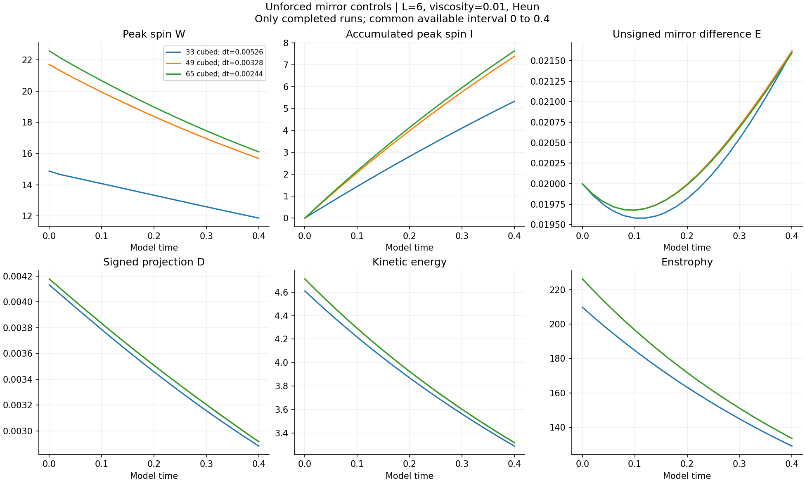
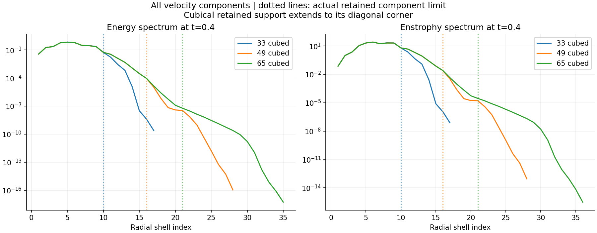
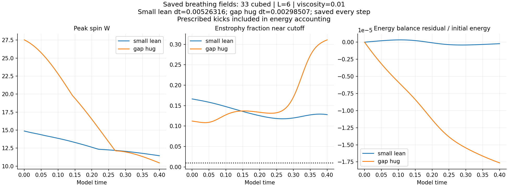

# Corrected measurements and control tests

**Mirror responses reproduce, but the coarse grid misses substantial peak spin.** The corrected spectrum check exposes energy and enstrophy near the retained cutoff that the uploaded dashboard's empty-band check could not see.

[Definitions and methods](METHODS.md) · [Measured comparisons](analysis.json) · [Field verification](field-verification.json) · [Breathing animations](../breathing-rerun/timeline/README.md)

## Completed in this publication

Snapshot: 2026-10-09T02:20:33.328629+00:00. **22 of 22 new control runs complete through 0.4.** All 22 controls are complete. [Fixed protocol](protocol.json).

- All 48 one-step checks: 3 grids × 2 timesteps × 2 starts × 4 transformations. Largest mirror residual: 2.84e-16; largest transformation residual: 5.51e-16.
- All 516 previously saved breathing fields remeasured, including the prescribed input in energy and enstrophy accounting. No breathing evolution was repeated.
- Five existing source starts audited for energy, enstrophy, circulation and spectra.
- Completed opposite pairs compared using full saved fields. Largest relative mirror error: 2.93e-14.

## What was corrected

| Supplied dashboard measurement | Correction |
| --- | --- |
| Cutoff fraction always zero | Use all three components and the upper 20% of **retained** modes. The old band contains zero retained modes on 33 cubed. |
| Curl has the opposite sign | Use the standard curl. Vorticity magnitude is unchanged; signed terms use the corrected orientation. |
| Unsigned velocity advection and viscosity compared with vorticity stretching | Save separate, signed velocity and vorticity budgets at the same vorticity-peak cell. Pressure belongs to the velocity budget. |
| Integral uses right endpoints | Preserve that reference; use and label per-step trapezoidal integration in the corrected measurements. |
| Cell counts without physical size | Add physical threshold volumes, peak positions and an explicitly labelled equivalent-sphere diameter. |

The original [code](uploaded/dashboard.py), [reference](uploaded/reference-dashboard.json), [reproduced values](uploaded/reproduced-dashboard.json) and [reproduction check](uploaded/verification.json) remain available. Corrections change diagnostics; the supplied solver is unchanged.

The additional supplied `with-spin.json` data extend to 0.8, but their generating loop was not supplied. They are preserved locally pending verification and are not included in these control comparisons. The missing step-10/11 and removal-sweep drivers are also still needed to reproduce those earlier tables.

## Unforced grid comparison

L=6; viscosity=0.01; Heun; no force. Each row is the positive 1% odd-amplitude start. `W` is maximum vorticity magnitude. The high-band column is the maximum fraction during the run, not only at its endpoint.

| Grid | dt | W at 0.4 | E at 0.4 | D at 0.4 | Maximum high-band enstrophy |
| --- | --- | --- | --- | --- | --- |
| 33 cubed | 0.00526316 | 11.870019 | 0.02161338 | 0.00288145 | 16.6389% |
| 49 cubed | 0.00327869 | 15.686906 | 0.02161918 | 0.00291551 | 0.8400% |
| 65 cubed | 0.00243902 | 16.108088 | 0.02159385 | 0.00291534 | 0.0085% |



`W`, `I`, energy and enstrophy are recorded every step. `E`, `D`, term budgets, geometry and spectra are saved about every 0.02. The [run records](runs/) contain exact times, dt, step count, hashes and all diagnostics. All quantities use the simulation units defined in [Methods](METHODS.md).

| Comparison | W curve difference | I curve difference | E curve difference | D curve difference |
| --- | --- | --- | --- | --- |
| n33-s1-shape0-none-base vs n49-s1-shape0-none-base | 28.0999% | 28.6842% | 0.6269% | 1.3245% |
| n49-s1-shape0-none-base vs n65-s1-shape0-none-base | 3.2859% | 3.3807% | 0.0721% | 0.0167% |
| n65-s1-shape0-none-base vs n65-s1-shape0-none-half | 0.0001% | 0.0001% | 0.0017% | 0.0004% |
| n33-s1-shape0-none-base vs n33-s1-shape0-shift1-base | 0.0000% | 0.0000% | 0.0000% | 0.0000% |
| n33-s1-shape0-none-base vs n33-s1-shape0-shifthalf-base | 8.3484% | 8.4749% | 0.0000% | 0.0000% |
| n33-s1-shape0-none-base vs n33-s1-shape0-rotate-base | 0.0000% | 0.0000% | 0.0000% | 0.0000% |

Errors are relative curve L2 differences against the finer control, through the common available endpoint 0.4. Energy and enstrophy comparisons are in [analysis.json](analysis.json). These are available-window comparisons; they are not labelled a common resolved interval. Initial peak spin already changes across the grids, so the whole discrepancy cannot be attributed to later evolution.



## Translation, rotation and shape controls

A half-cell translation changes the raw grid-point W curve by 8.348%. After translating the entire field back to the original coordinates, the full-field difference is at most 2.54e-15, and W agrees within 1.22e-15. This difference is peak sampling on the coarse grid, not changed evolution. The one-cell and 90-degree tests are also recorded in analysis.json.

The two additional odd-template shapes have matching initial velocity norm and energy, with separately recorded enstrophy and spectra. Their positive and negative runs are included in the full-field mirror checks. Shape changes are controlled initial differences, not demonstrations of spontaneous branch selection.

## Saved breathing fields



The small-lean run uses dt=0.4/76 and the gap-hug run dt=0.4/134. Outputs occur every step. All six runs use 33 cubed, L=6, viscosity=0.01 and their original prescribed kicks.

The small-lean final energy residual is -2.21e-07 of its initial energy; the gap-hug residual is -1.76e-05. This accounting includes the kicks. Their maximum high-band enstrophy fractions are 16.64% and 31.09%. Small energy residuals therefore coexist with inadequate spatial resolution.

[Six-case summary](breathing-audit-summary.json) · [Per-step measurements](breathing-diagnostics/) · [Unforced enstrophy budgets](enstrophy-budgets.json)

Unforced enstrophy-budget quadrature uses full diagnostic outputs about 0.02 apart; breathing budgets use every step. This difference is recorded explicitly and must be retained when comparing residuals.

## Source controls: initial conditions are not energy-matched

| Start | Energy | Enstrophy | Left-loop circulation | Right-loop circulation |
| --- | --- | --- | --- | --- |
| no_C | 4.60954224 | 209.719392 | -2.326706 | 2.326706 |
| mirrored_CD | 4.59971265 | 209.604375 | -2.301669 | 2.301669 |
| C_only | 4.60066363 | 209.626762 | -2.326800 | 2.276537 |
| mirrored_C | 4.60066363 | 209.626762 | -2.276537 | 2.326800 |
| uneven_70_30 | 4.59986480 | 209.607957 | -2.311721 | 2.291616 |

The loops are counterclockwise 0.6-by-0.6 rectangles centered at x=−0.9 and +0.9, y=0, z=0. Values are exact line integrals of each retained Fourier interpolant. Source addition changes energy by up to 0.213% in this set. The new odd-shape controls match velocity norm and energy; their enstrophy and spectra are measured separately.

## Reading the outcome

Verified mirror equivariance and mirror-paired response concern symmetry. They can pass while peak-spin resolution fails. A supplied signed initial difference can remain measurable without showing spontaneous branch selection. This 0.4 window does not test a persistent asymmetric state.

The separate matched-stretch 48-run matrix, its raw periodic-join limitation, and the separate adversarial matrix remain in their existing reports. Their results are not mixed with this starting field.

## Reproduce in a fresh copy

```sh
python -m pip install -r requirements.txt
python check_diagnostics.py
python check_circulation.py
python study.py
```

The runner skips already complete local results and refuses a duplicate controller lock. To recompute the published controls from scratch, use a fresh copy without its `runs/` directory. Full arrays remain in the local workspace; published records include their hashes. The source files and formulas identify the starting fields; these controls use no random seeds.

To regenerate breathing arrays, use `../breathing-rerun/timeline/trace.py` with its original source folder and a fresh output folder, then pass that folder to `audit_saved.py --trace-dir`. The audit accepts `--source-file` for the unchanged breathing driver. After the audit and control runs, `python analyze.py` rebuilds comparisons and charts. [Source and result hashes](manifest.json).
