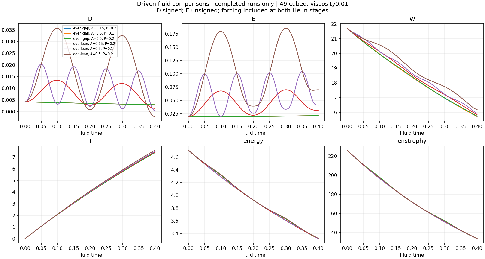
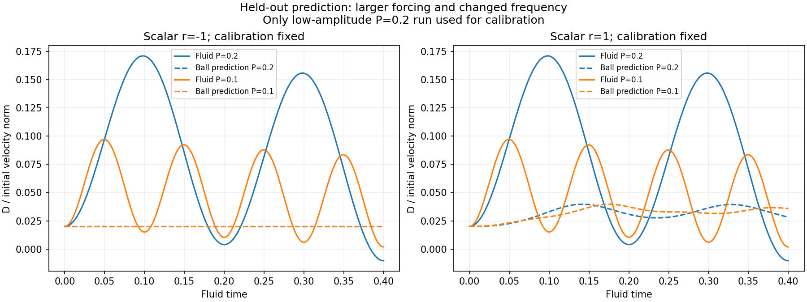

# Completed driven-fluid comparison

**All 17 runs reached time 0.40. The prescribed reflection tests passed. The two tested scalar-to-fluid mappings failed the prediction check. The spin peak remains under-resolved.**

This completes the fluid portion of the [model-layer study](README.md). Four reduced layers were already computed separately. Here the measured fluid trajectories test one fixed quantitative mapping from the scalar ball model, plus the symmetry consequences of the chosen forcing patterns.

## What was run

- Same mirrored starting construction, periodic cube side 6, viscosity 0.01 and Heun stepping.
- Initial lean is plus or minus 1% of the baseline velocity norm; one control has zero lean.
- Mirror-even gap drive or mirror-odd lean drive; amplitudes A = 0.15 and 0.5, periods P = 0.2 and 0.1.
- Six reflected pairs at 49 cubed; strong-drive 65-grid and half-timestep controls for both drive types; one even-drive zero-bias control.

The acceleration is `F(t) = A*U0/0.4*sin(2*pi*t/P)*unit_template`. It is integrated with dt at both Heun stages. The original unforced studies are separate. The older breathing upload used an unscaled per-step velocity kick; its results are not a timestep control for this new equation.

E = norm(u − M[u])/norm(u) is unsigned. D = mean((u − M[u])·phi) is the signed projection onto the unit antisymmetric template. U0 is the initial baseline velocity norm. W is maximum vorticity magnitude, and I is its time integral. Energy = one half the integral of speed squared; enstrophy = one half the integral of vorticity squared. Units are model units.

## Observed fluid response

| Drive | Grid | A | P | Initial sign | Step | Final D | Final E | Final W | Final I |
| --- | ---: | ---: | ---: | ---: | --- | ---: | ---: | ---: | ---: |
| even-gap | 49 | 0.15 | 0.2 | -1 | base | -0.0029194 | 0.0216139 | 15.70387 | 7.39313 |
| even-gap | 49 | 0.15 | 0.2 | 1 | base | 0.0029194 | 0.0216139 | 15.70387 | 7.39313 |
| even-gap | 49 | 0.5 | 0.1 | -1 | base | -0.0029220 | 0.0216114 | 15.71474 | 7.39531 |
| even-gap | 49 | 0.5 | 0.1 | 1 | base | 0.0029220 | 0.0216114 | 15.71474 | 7.39531 |
| even-gap | 49 | 0.5 | 0.2 | -1 | base | -0.0029285 | 0.0216041 | 15.74009 | 7.40008 |
| even-gap | 49 | 0.5 | 0.2 | 0 | base | -0.0000000 | 0.0000000 | 15.58023 | 7.34590 |
| even-gap | 49 | 0.5 | 0.2 | 1 | base | 0.0029285 | 0.0216041 | 15.74009 | 7.40008 |
| even-gap | 49 | 0.5 | 0.2 | 1 | half | 0.0029285 | 0.0216041 | 15.74011 | 7.40008 |
| odd-lean | 49 | 0.15 | 0.2 | -1 | base | -0.0014051 | 0.0313970 | 15.83250 | 7.45683 |
| odd-lean | 49 | 0.15 | 0.2 | 1 | base | 0.0014051 | 0.0313970 | 15.83250 | 7.45683 |
| odd-lean | 49 | 0.5 | 0.1 | -1 | base | -0.0003929 | 0.0413222 | 15.92319 | 7.50084 |
| odd-lean | 49 | 0.5 | 0.1 | 1 | base | 0.0003929 | 0.0413222 | 15.92319 | 7.50084 |
| odd-lean | 49 | 0.5 | 0.2 | -1 | base | 0.0021741 | 0.0699624 | 16.18431 | 7.60879 |
| odd-lean | 49 | 0.5 | 0.2 | 1 | base | -0.0021741 | 0.0699624 | 16.18431 | 7.60879 |
| odd-lean | 49 | 0.5 | 0.2 | 1 | half | -0.0021761 | 0.0699847 | 16.18449 | 7.60885 |
| even-gap | 65 | 0.5 | 0.2 | 1 | base | 0.0029284 | 0.0215799 | 16.04616 | 7.62046 |
| odd-lean | 65 | 0.5 | 0.2 | 1 | base | -0.0021770 | 0.0697822 | 16.70204 | 7.81738 |

The even gap drive has no direct projection onto signed D to numerical precision. It still changes the velocity field and can change later D through evolution. The odd drive directly supplies a signed contribution; its reflected counterpart reverses the force as well as the starting lean.

At A = 0.5 and P = 0.2, the positive odd-drive run ends with negative D while E remains nonzero. Reversing the whole experiment gives opposite D and equal E. This is a forced directional response; it does not show spontaneous side selection from an unsigned start.

## Prediction test

The [prediction protocol](prediction-protocol.json) was fixed before the low-amplitude odd-drive training run completed. Only that positive run, A = 0.15 and P = 0.2 at 49 cubed, fits the nonnegative scale k. The reflected training run is a symmetry check, not an independent unseen case.

Two ball candidates use `x'' = r*x − x^3 − 0.4*x' + sign*A*sin(2*pi*t_ball/(20*P))`, with r = −1 or +1 and `t_ball = 20*t_fluid`. The fixed mapping is `predicted D/U0 = initial D/U0 + k*(x − x0)`, with x0 = sign*0.1. No coefficient or time scale is adjusted to held-out results.

| Candidate r | Fitted k | Training curve error |
| --- | ---: | ---: |
| -1 | 0.00000000 | 59.385% |
| 1 | 0.01627653 | 50.757% |

| Positive held-out run | r = −1 error | r = +1 error | Constant baseline error | Linear baseline error |
| --- | ---: | ---: | ---: | ---: |
| n49-odd-lean-A0.5-P0.1-s1-base | 72.020% | 60.545% | 72.020% | 62.350% |
| n49-odd-lean-A0.5-P0.2-s1-base | 84.410% | 75.158% | 84.410% | 77.712% |
| n49-odd-lean-A0.5-P0.2-s1-half | 84.419% | 75.172% | 84.419% | 77.725% |
| n65-odd-lean-A0.5-P0.2-s1-base | 84.410% | 75.158% | 84.410% | 77.713% |

All 12 held-out candidate/run scores exceed the fixed 10% exploratory threshold. The fitted r = −1 scale is zero, so that predictor reduces to the constant baseline. The r = +1 mapping also misses the fluid curve substantially. These results reject predictive use of these particular mappings and parameters.

This does not test every possible reduced model. A numerical mapping for the four-node coupling, listening feedback and scalar diffusion coefficients has not been defined. Their reduced-model results and structural symmetry checks remain separate evidence. No fitted q feedback is applied to the fluid.

## Grid and timestep controls

| Comparison | W error | I error | E error | D error | Energy error | Enstrophy error |
| --- | ---: | ---: | ---: | ---: | ---: | ---: |
| n49-even-gap-A0.5-P0.2-s1-base vs n65-even-gap-A0.5-P0.2-s1-base | 3.016583% | 3.149200% | 0.067203% | 0.015747% | 0.000649% | 0.011902% |
| n49-even-gap-A0.5-P0.2-s1-base vs n49-even-gap-A0.5-P0.2-s1-half | 0.000068% | 0.000136% | 0.000237% | 0.000044% | 0.000351% | 0.000363% |
| n49-odd-lean-A0.5-P0.2-s1-base vs n65-odd-lean-A0.5-P0.2-s1-base | 2.874218% | 2.981230% | 0.065981% | 0.020425% | 0.000621% | 0.004594% |
| n49-odd-lean-A0.5-P0.2-s1-base vs n49-odd-lean-A0.5-P0.2-s1-half | 0.001571% | 0.000865% | 0.045389% | 0.050758% | 0.000378% | 0.000178% |

Errors are relative L2 differences between curves interpolated to common times in [0, 0.4], using the finer grid or smaller step as reference. Close D or E curves do not establish a resolved spin maximum.

| Positive strong drive | Grid | Step | Smallest width (cells) | Largest upper-band enstrophy | Largest energy-budget residual |
| --- | ---: | --- | ---: | ---: | ---: |
| even-gap | 49 | base | 2.5077 | 0.83997% | 0.0000753% |
| even-gap | 49 | half | 2.5077 | 0.83997% | 0.0000070% |
| odd-lean | 49 | base | 2.5077 | 0.83997% | 0.0001273% |
| odd-lean | 49 | half | 2.5077 | 0.83997% | 0.0000167% |
| even-gap | 65 | base | 3.3399 | 0.03651% | 0.0000653% |
| odd-lean | 65 | base | 3.3399 | 0.00852% | 0.0001185% |

Width is the shortest of 12 transverse half-peak chords through the current spin maximum, sampled by interpolation and expressed in grid cells. The six-cell width screen fails. The physical width is cells times 6/N. Spectral fractions refer to the upper 20% of retained component modes.

Energy accounting includes force work and viscous loss. Raw Meter vorticity/velocity RHS entries contain the unforced terms only; [extended diagnostics](fluid-extended-diagnostics.json) add force and curl(force) at the same peak location. This batch does not include an independently integrated, fully forced enstrophy budget at every time step.

## Verification

- All saved fields are finite and their hashes match the run manifests.
- 357 saved fields checked; independently remeasured endpoints agree within 6.37e-16 in the stated scaled error.
- Six reflected full-field pairs agree to relative error 1.5e-14.
- Zero-bias even-force control: maximum E = 7.64e-15; maximum |D| = 2.46e-17.
- The analytic forced-shear check shows approximately fourfold error reduction when dt is halved, consistent with second-order stepping.
- Divergence, energy balance and speed-CFL checks passed for all 17 runs.

[Run records](fluid-runs/) · [Analysis and prediction scores](fluid-analysis.json) · [Field verification](fluid-field-verification.json) · [Report verification](fluid-report-verification.json) · [Analytic forcing check](forcing-verification.json)

## Reproduction

Install `requirements.txt`. `python run_fluid.py` executes exactly the 17 listed jobs, or resumes saved checkpoints. For a fresh computation, copy the Python scripts, protocols, requirements and source directory into a new folder; omit the published fluid-runs measurement directory. Those published records mark completed jobs but do not include the raw arrays needed for resuming or reanalysis. `python analyze_fluid.py` measures completed results and applies the frozen prediction protocol. After all jobs complete, `python report_fluid.py` rebuilds this report. `python check_forcing.py` runs the separate exact-shear implementation check.

Measurement records, code and figures are published on GitHub and copied to the local repository mirror. Large raw restart arrays stay in the local study; their SHA256 identities are included in each run record.
