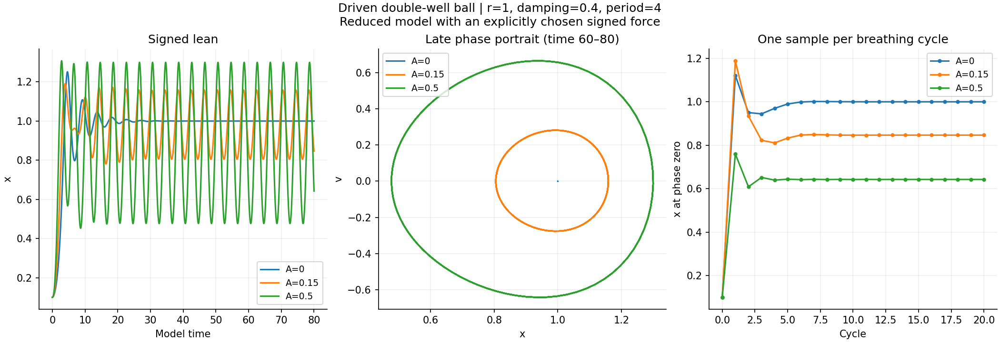
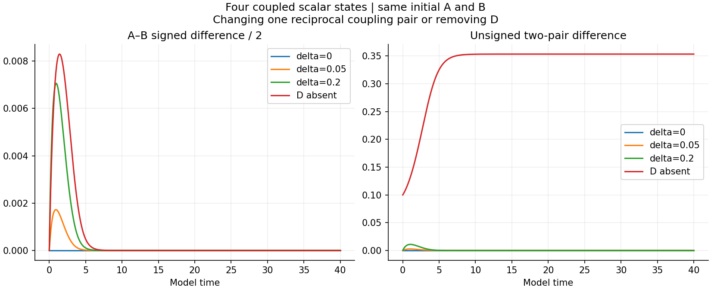
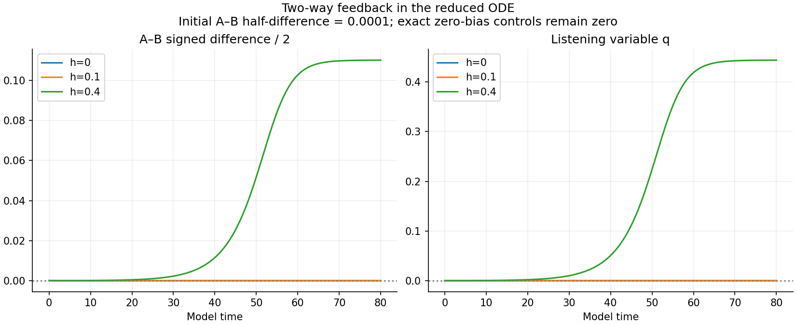
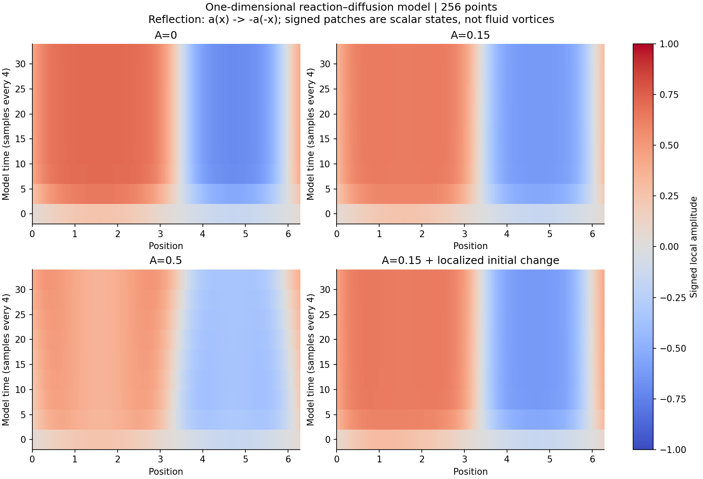

# Enlarging the lean model in layers

**Four reduced-model layers are complete: 46 runs. Seventeen separate driven fluid controls are underway.** The reduced models show their own measured behavior; a match to fluid behavior must be checked separately.

## 1. Motion and breathing

dx/dt = v; dv/dt = r*x - x^3 - 0.4*v + A*sin(2*pi*t/4).

The paired reflected run negates x, v and the applied force. Keeping a signed additive force unchanged while negating only the start would not preserve this symmetry.

| r | A | Crossings through 80 | Crossings during 60–80 | Final x |
| --- | --- | --- | --- | --- |
| -1 | 0 | 25 | 6 | -0.00000 |
| -1 | 0.15 | 39 | 10 | -0.03726 |
| -1 | 0.5 | 39 | 10 | -0.13519 |
| 1 | 0 | 0 | 0 | 1.00000 |
| 1 | 0.15 | 0 | 0 | 0.84654 |
| 1 | 0.5 | 0 | 0 | 0.64248 |

There is no chaos classification from these finite records. The once-per-cycle values and crossing counts are measurements. The chosen double-well force supplies its side states.

## 2. A–B–C–D coupling

The four-state model uses f(z)=0.5*z-z^3 and the reciprocal coupling matrix in each record. Reflection swaps A/B and C/D and transforms the entire coupling matrix. Both outgoing and incoming cross couplings obey that transformation.

q_AB=(A-B)/2; q_CD=(C-D)/2; E_model=sqrt(q_AB^2+q_CD^2).

The coupling changes are 0, 0.05 and 0.2. The unmatched-source case removes D and all its edges; its reflected partner removes C. An imposed coupling difference is a controlled input, not spontaneous direction selection.

## 3. Listening and feedback

dA/dt=-A-A^3+0.3*(B-A)+h*q;
dB/dt=-B-B^3+0.3*(A-B)-h*q;
dq/dt=-0.2*q+0.8*(A-B)-q^3.

| Feedback h | Final (A-B)/2 from +0.0001 | Final q |
| --- | --- | --- |
| 0 | -0.000000 | 0.000000 |
| 0.1 | 0.000000 | 0.000000 |
| 0.4 | 0.110107 | 0.443780 |

All exact zero-bias controls remain zero. Opposite biases give opposite responses. This feedback is in the reduced model only. No q feedback has been added to the existing Navier–Stokes studies.

## 4. Spatial lean

da/dt=0.5*a-a^3+0.05*Laplacian(a)+A*sin(2*pi*t/4)*sin(x), on a periodic line of length 2*pi.

Here reflection maps a(x) to -a(-x). The odd spatial forcing sin(x) is invariant under that full transformation. Negating a alone, without reflecting position or changing the forcing, would be a different test.

The 128/256 final-field relative differences are at most 1.75e-10. Halving dt from 0.005 to 0.0025 changes the tested strong-drive final field by 2.11e-07. These controls concern this scalar equation.

## 5. Fluid comparison: underway

The new fluid matrix uses the existing mirrored starting field, L=6, viscosity=0.01 and Heun integration through 0.4. It tests two forcing patterns:

- **Even gap:** opening and closing preserves reflection and does not itself supply a signed lean.
- **Odd lean:** the force has the antisymmetric template's direction; the reflected test reverses that force.

The amplitudes are 0.15 and 0.5 and periods are 0.2 and 0.1. The force has units U0/time and is included at both Heun stages with dt. This differs from the older uploaded per-step kick, whose strength changed with timestep.

Tests include mirrored pairs at 49 cubed, stronger-drive 65-grid and half-step controls, and a zero-bias even-gap control. Existing unforced controls are reused. [Fluid protocol](fluid-protocol.json).

The comparison records E, D, peak spin, its integral, spectra, divergence, energy input and the center-line half-peak gap. A gap diagnostic is not an imposed wall. Signed D and normalized unsigned E are not numerically identified with scalar x or E_model.

A scalar-to-fluid calibration will be fitted on the low-amplitude odd-drive run and tested on the other drive settings without refitting. Four-node, listening and spatial coefficients have no established numerical mapping to the fluid. Their symmetry predictions are compared with fluid controls; their coefficients are not presented as fluid measurements.

## Verification and code

- Ball tolerance-refinement discrepancy: 1.26e-10.
- Four-node mirror discrepancy after tighter integration: 6.32e-11.
- Spatial mirror discrepancy: 9.68e-13.
- All stored numbers are finite.

[Fixed reduced protocol](protocol.json) · [Reduced results](reduced-results.json) · [Verification](reduced-verification.json) · [Reduced runner](run_reduced.py) · [Fluid runner](run_fluid.py).

These are defined mechanism tests. A reduced model earns predictive use only when its held-out fluid comparison succeeds; structural symmetry alone does not establish that.
