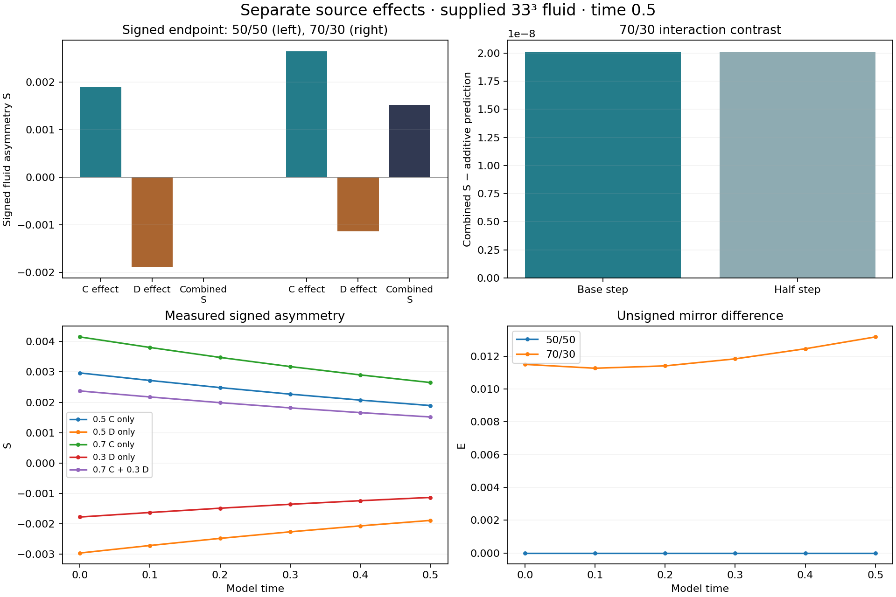

# Separate C and D contributions

**At 50/50, the measured directions cancel. At 70/30, the separate C and D effects account for all but 0.00133% of the combined signed asymmetry at time 0.5.**

Ten additional fluid runs completed: four missing single-source controls and six half-step checks. Five existing source trajectories were reused. The supplied AB starting field, C, D=mirror(C), 33³ grid, viscosity 0.01, periodic cube side 6, Heun solver and zero force were retained.



## Results

| Setting | C contribution | D contribution | Combined S | Interaction contrast |
| --- | ---: | ---: | ---: | ---: |
| 50/50 | 0.001893096386 | -0.001893096386 | -3.191244614e-17 | 7.725154135e-17 |
| 70/30 | 0.002651719888 | -0.001135142094 | 0.001516597935 | 2.014048694e-08 |

The table uses half-step endpoints. The 70/30 interaction contrast changes by 0.00502% when the timestep is halved. Equal-source runs keep E at roundoff, and the C-only and D-only final velocity fields match after reflection within 8.33e-15 relative error.

## What was measured

S is `<u − M[u], phi>`, using the supplied fixed antisymmetric template. It is the signed measurement called D in the original source JSON. **Source D** is C's reflected field. E remains the unsigned normalized mirror difference.

S measures one fixed direction; E measures the full mirror difference relative to the current velocity norm. They can change in different directions over time.

At a fixed endpoint, let S0 be the AB-only result:

```text
C contribution = S(AB + a*C) − S0
D contribution = S(AB + b*D) − S0
interaction = S(AB + a*C + b*D) − S(AB + a*C) − S(AB + b*D) + S0
```

The interaction is the difference from simple addition. These effects depend on the chosen AB background, source weights, observable and endpoint. They do not assign permanent identities to pieces of the evolving fluid.

## What this establishes

For these two source settings, additive effects describe the signed endpoint closely. A large cross-pair term is not needed to explain these measured endpoints. E is not decomposed by adding signed contributions.

This is a retrospective comparison with already recorded combined runs. The full q equation has not been fitted or tested on unseen runs. The cubic term, separate dynamic coupling weights, independent AB bias and independently shaped D remain untested here.

The half-step checks address time integration. The endpoint has about 11.7% of enstrophy near the retained grid cutoff; this experiment does not establish spatial convergence or a continuum mechanism.

## Files and reproduction

[Measured contrasts and verification](analysis.json) · [Protocol](protocol.json) · [Reused source results](reference-fluid-sources.json) · [Run measurements](runs/)

Install the packages in `requirements.txt`, then run `python reproduce.py`. It copies the scripts and reference data into `rerun/`, evolves the controls there, and checks their saved fields. Published measurement records remain available for comparison. The unchanged received source files are in `source/`.
