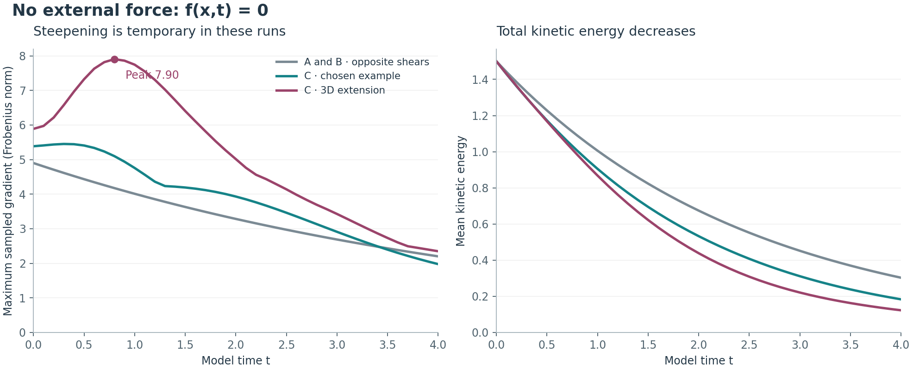

# Following the hidden-flow example through time

**Scope correction:** this is a separate assistant-chosen trigonometric example. It does not evolve the project's original Stokes ring or its corrected smooth replacement. The conversation did not establish a mathematical equivalence between the contributor's A/B/C idea and these velocity fields. Their behavior does not validate or refute that idea.

**Result:** the original C remains smooth by an analytic reduction. A separately constructed, genuinely three-dimensional extension steepens temporarily, then relaxes in the completed numerical runs. No numerical breakdown appeared in the tested interval.

The A/B/C labels identify constructed fluid fields. They do not measure personalities, diagnoses, or intent. These examples retain the unforced Navier–Stokes equation.

## Equation and starting fields

On the periodic cube `[0, 2π)^3`, with viscosity `ν = 0.05`:

\[
\partial_tu+(u\cdot\nabla)u=-\nabla p+\nu\Delta u,
\qquad \nabla\cdot u=0.
\]

\[
A=(0,\sqrt6\cos2x,0),\quad B=-A,\quad
C=(\cos(2x+y),-2\cos(2x+y),\cos2x).
\]

All have mean kinetic energy `⟨|u|²⟩/2 = 1.5`. All are smooth and divergence-free. Keeping only Fourier modes with `|k| ≤ 1` gives the same zero initial observation for each. This observation filter is separate from the much finer evolution grid. Direct substitution gives zero initial coarse acceleration for A and B, and `(0,0,-sin y)` for C.

## Why the original C remains smooth

C has three components but no dependence on z. Write `q = 2x+y`. Its horizontal velocity is exactly

\[
(u_1,u_2)=e^{-5\nu t}\cos q\,(1,-2).
\]

Horizontal advection vanishes because `(1,-2)·(2,1)=0`. Pressure can be spatially constant. The third component solves the linear equation

\[
\partial_t w+e^{-5\nu t}\cos q\,(\partial_xw-2\partial_yw)
=\nu(\partial_{xx}w+\partial_{yy}w),\qquad w(0)=\cos2x.
\]

The prescribed advecting velocity is smooth for all time. The maximum principle gives `|w| ≤ 1`. The gradient maximum principle yields

\[
\|\nabla w(t)\|_\infty
\le2\exp\!\left(\int_0^t5e^{-5\nu s}\,ds\right)
=2\exp\!\left(\frac{1-e^{-5\nu t}}{\nu}\right).
\]

This bound is finite for every finite time and uniformly bounded for fixed positive viscosity. Linear parabolic regularity for the displayed smooth coefficients gives higher-derivative smoothness on finite time intervals. **The original C is not a breakdown candidate.** This conclusion follows from its special structure, independently of the grid results.

A and B explicitly decay as `e^(-4νt) A(0)` and `e^(-4νt) B(0)`. Their remaining exact opposites during evolution is specific to this shear pair.

## The three-dimensional continuation

To remove the original C's two-dimensional restriction, use the separately specified initial field

\[
D=(\cos2z,\cos2x,\cos2y),\qquad
C_{3D}=\sqrt{\frac{3}{3+1.5\epsilon^2}}\,(C+\epsilon D),
\qquad\epsilon=0.5.
\]

Each component of D is independent of its own coordinate, so `div D = 0`. Its modes are orthogonal to those of C. The prefactor restores initial energy 1.5; the initial coarse view remains zero. This changes the initial condition while retaining the same equation and positive viscosity. It is an illustrative extension, not a deduction from the social analogy.

## Results

<!-- RESULTS_START -->
Seven runs completed. All use **zero external force**, viscosity 0.05, and time interval 0–4. The new three-dimensional field changes only the initial velocity.

**Provenance correction:** these runs use separate trigonometric fields selected by the assistant. They do not evolve the original Stokes ring or its corrected smooth replacement. No mathematical equivalence to the contributor's A/B/C conversation idea was established. Their outcomes must not be presented as validation or rejection of that construction or idea.

| Field | Grid | Time step | Initial gradient | Sampled peak gradient | Final gradient | Final energy |
| --- | --- | --- | --- | --- | --- | --- |
| A | 16³ | 0.02 | 4.898979 | 4.898979 | 2.201253 | 0.302844777 |
| B | 16³ | 0.02 | 4.898979 | 4.898979 | 2.201253 | 0.302844777 |
| C | 32³ | 0.01 | 5.385165 | 5.451225 | 1.977085 | 0.183312199 |
| C3D | 32³ | 0.02 | 5.887841 | 7.732045 | 2.348184 | 0.122669852 |
| C3D | 32³ | 0.01 | 5.887841 | 7.732044 | 2.348184 | 0.122669851 |
| C3D | 48³ | 0.01 | 5.887841 | 7.882796 | 2.348545 | 0.122667914 |
| C3D | 64³ | 0.01 | 5.887841 | 7.903966 | 2.348882 | 0.122667944 |

The finest 3D run steepened by **34.24%**, peaking at sampled time **0.8**, then relaxed. No numerical breakdown appeared through time 4.

- Halving the time step changed the final 32³ velocity field by **0.00000623%** in relative L2 norm.
- The 32³/48³ comparison was **0.105278%**, triggering the additional 64³ run.
- The 48³/64³ difference fell to **0.002762%**.
- Finest-run maximum recorded RMS divergence: **4.695e-17**.
- Finest-run maximum absolute energy-balance error: **1.492e-09**, against initial energy 1.5.
- Finest-run largest recorded spectral-edge energy fraction: **1.975e-08**.



[Full numerical record](../results/hidden-flow.json) · [Runner](../hidden_flow_experiment.py) · [Ten new checks](../tests/test_hidden_flow_experiment.py)

<!-- RESULTS_END -->

## Numerical method and scope

- Time interval `0 ≤ t ≤ 4`, with diagnostics sampled every 0.1 model time units.
- Fourier differentiation, strict componentwise `|k_j| < N/3` truncation to remove quadratic aliasing, and fourth-order Runge–Kutta.
- The Leray projection accounts for pressure at every RK4 stage. The legacy cube's scalar forcing and the soft-envelope opening rules are not used.
- The reported gradient is the grid maximum of the Frobenius norm of the velocity-gradient matrix. Reported peaks are maxima over sampled times and grid points.
- Diagnostics include energy, enstrophy, coarse-mode energy, gradients, vorticity, divergence, spectral-edge energy, and the cumulative energy balance.
- The energy check is `E(t) + ν ∫₀ᵗ⟨|∇u|²⟩ ds − E(0)`, integrating dissipation with RK4 stage weights.
- Time and grid comparisons use the complete final Fourier-field difference, including modes absent from the coarser grid. Grid and sampling error limit all numerical claims.

The original C has an analytic smoothness argument. The three-dimensional extension has finite-time numerical evidence only. These runs supply no general smoothness or breakdown proof for the Clay problem. Motion hidden by the chosen observation filter remains fully represented within the retained evolution modes.

## Reproduce

From the repository root:

```sh
python -m pytest math/tests/test_hidden_flow_experiment.py -q
python math/hidden_flow_experiment.py --suite --output scratch/hidden-flow.json
```

The suite runs A and B at 16³, C at 32³, and C3D at 32³ with time steps 0.02 and 0.01 and at 48³ with time step 0.01. If the 32³/48³ final-field difference exceeds 0.1%, it adds a 64³ run. This is a single targeted refinement; its comparison must still be reviewed. Saved refinement can resume without repeating completed runs:

```sh
python math/hidden_flow_experiment.py --refine-saved --output scratch/hidden-flow.json
```

Ten new checks cover initial energy and incompressibility, the analytic initial coarse acceleration, exact shear decay, C's exact horizontal evolution, pressure projection, the energy identity, and omitted-mode comparison. Earlier independent experiment runs were reused.

## Next parameter

A subsequent experiment can reduce viscosity while keeping the same initial field and energy, with fresh spatial and temporal refinement checks. Such results must be distinguished from this completed `ν = 0.05` record.

## Sources

- [Clay Mathematics Institute: official Navier–Stokes formulation](https://www.claymath.org/wp-content/uploads/2022/06/navierstokes.pdf).
- [PencilFFTs: Navier–Stokes implementation, aliasing removal, and projection](https://jipolanco.github.io/PencilFFTs.jl/dev/generated/navier_stokes/).
- [Exponax: projected rotational convection](https://fkoehler.site/exponax/api/utilities/nonlin_fun/vorticity_convection/).

The specific fields and reduction for C are worked calculations for this project. The linked sources establish the equation and numerical-method context.
