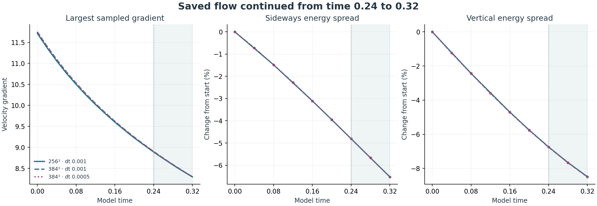
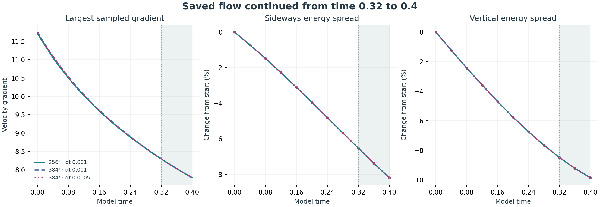
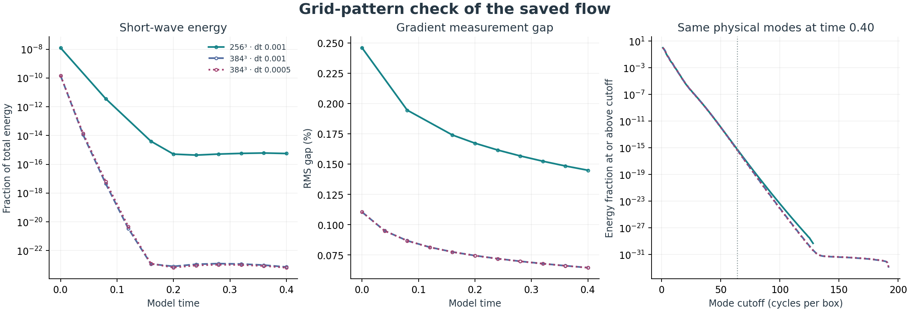
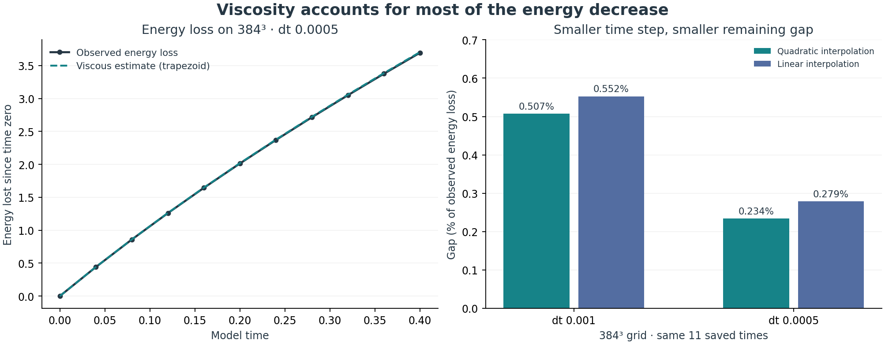
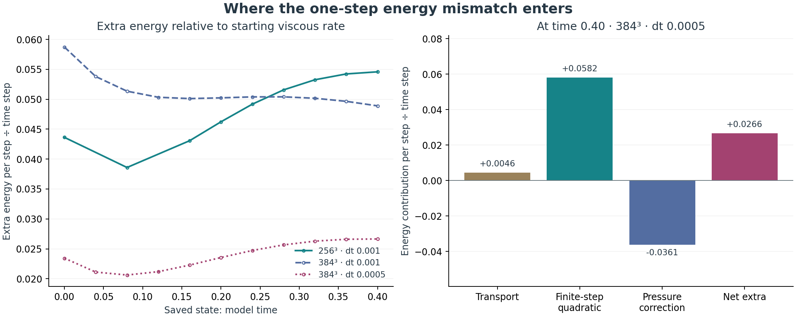
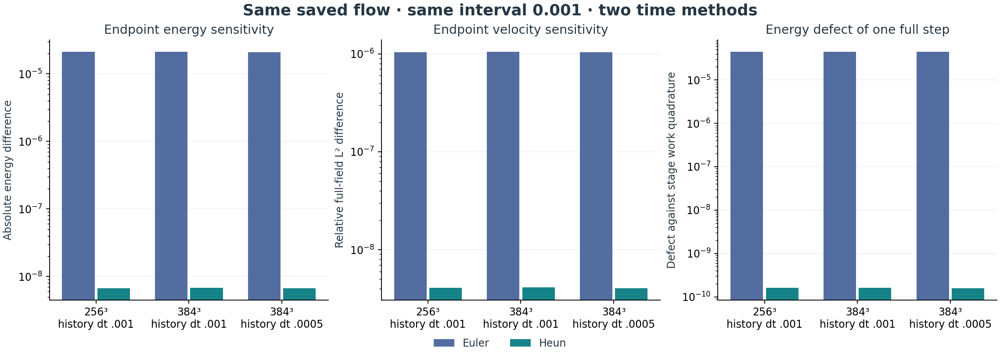

# The hug now prepares the ring's boundary

**Latest:** [Local time-method comparison](#local-time-method-comparison-at-model-time-04).

**Completed:** the existing closed hug shapes the existing smooth ring's initial field. Velocity becomes zero smoothly before every cube face, so opposite faces and all their derivatives match. The continuum field remains divergence-free. The Navier–Stokes equation and zero-external-force choice remain unchanged.

## Direct connection to the existing work

- Starting field: `box_experiment.SMOOTH`, the maintained `SmoothRingField` with ring radius 1.5, radial scale √3, axial scale 1, and both rates 1.
- Hug geometry: the actual `hug_envelope.state_at(4.0)` closed pose, including its reciprocal axis stretch.
- Mapping: interpret the hug's horizontal and vertical axes as radial distance and height in a meridional section; rotate the closed ellipse about the z axis.
- Scale: its largest semiaxis is 90% of the cube half-width. For the length-6 cube the radial and axial semiaxes are 2.7 and approximately 2.314815.
- The inner ellipse scaled by 0.7 is an unchanged core. The surrounding layer provides a smooth transition to rest. These spatial scale choices are explicit construction parameters.

The hug's four-second pose is sampled once to prepare fluid time `t=0`. The subsequent fluid motion is governed by Navier–Stokes; the earlier timed animation and imposed pressure-opening rule are not applied during evolution.

## The construction

For the two semiaxes `R_h` and `Z_h`, set

$$
s=\frac{x^2+y^2}{R_h^2}+\frac{z^2}{Z_h^2},\qquad a=0.7^2.
$$

Define `b(t)=exp(-1/t)` for `t>0`, and `b(t)=0` otherwise. Let `W(s)=1` for `s≤a`, `W(s)=0` for `s≥1`, and in between set

$$
t=\frac{s-a}{1-a},\qquad
W(s)=\frac{b(1-t)}{b(t)+b(1-t)}.
$$

All derivatives match at both joins: this is a C∞ spatial gate. The old quintic interpolation was a timing rule for the animation; it is not substituted for this all-orders spatial smoothness.

Apply the hug to the stream function before taking derivatives:

$$
\psi_h=W\psi_0,\qquad
u_r^h=-\frac1r\partial_z\psi_h,\qquad
u_z^h=\frac1r\partial_r\psi_h,\qquad
u_\theta^h=Wu_\theta^0.
$$

The existing ring uses `ψ₀=A r² z φ`. Writing `q=x²+y²` and `W_s=dW/ds`, the implementation evaluates the smooth Cartesian formula

$$
u_x^h=Wu_x^0-\frac{2A xz^2\phi W_s}{Z_h^2},\quad
u_y^h=Wu_y^0-\frac{2A yz^2\phi W_s}{Z_h^2},\quad
u_z^h=Wu_z^0+\frac{2A qz\phi W_s}{R_h^2}.
$$

It has no division by radius. The meridional divergence vanishes by equality of mixed stream-function derivatives, and axisymmetric swirl adds no divergence. This identity extends smoothly through the axis. Simply multiplying the old velocity by W would generally add divergence; a negative-control check detects that error.

The field is identically zero in an open strip next to every cube face. Consequently its periodic extension is C∞, including edges and corners. Viewed on all of space, it is also a smooth, compactly supported, finite-energy initial field. The whole-space and periodic evolutions remain distinct domain choices; the recorded runs use the periodic cube.

## Verification and saved runs

<!-- RESULTS_START -->
**Boundary mismatch:** 0.053709416 before the hug; **0 after**. The zero value follows from the field vanishing in a neighborhood of every face, as well as the sampled face check.

**Force:** `σ = 0`, `P_U = 0`; no external force. The existing solver and pressure projection were reused. No sine/cosine replacement was used.

Four short comparisons reached the same final time 0.08. All values are nondimensional. The raw finite-difference divergence of a sampled continuum field is not exactly zero; the existing projection corrects it before the two evolution branches begin.

| Grid | Time step | Raw sampled max divergence | Initial projection change (L2) | Final projected max divergence | Final projected max gradient | Final projected energy |
| --- | --- | --- | --- | --- | --- | --- |
| 16³ | 0.02 | 1.352074 | 13.2596% | 8.882e-16 | 5.553309 | 39.006958 |
| 32³ | 0.02 | 0.908968 | 3.3073% | 1.776e-15 | 8.078380 | 39.479609 |
| 64³ | 0.02 | 0.514969 | 0.7831% | 3.553e-15 | 9.768902 | 39.555986 |
| 32³ | 0.01 | 0.908968 | 3.3073% | 1.332e-15 | 8.068097 | 39.441322 |

The initial grid correction drops from 13.26% to 3.31% to 0.78% as the grid is refined. It modifies the sampled velocity, including the core; the exact unchanged-core statement applies to the analytic construction before this discrete correction. The gradient values still change with grid resolution, so evolution accuracy is not yet established. The zero seam and analytic smoothness do not rely on that evolution comparison.


[Saved JSON](../results/hug-boundary.json) · [All rows, including the branch without projection](../results/hug-boundary.csv)

<!-- RESULTS_END -->

The nine new checks cover reuse of the actual hug geometry, unchanged inner core, zero values in face neighborhoods, flat transitions, agreement with independent stream-function differences, local divergence convergence, the failure of naive velocity masking, rejection of open hug poses, and zero force during use of the existing box runner. Seven existing box-integration checks also passed.

## Run this construction

From the repository root:

```sh
python -m pytest math/tests/test_hugged_ring.py math/tests/test_box_integration.py -q
python math/box_experiment.py --profile hug --start projected --box 6 --points 16 32 64 --dt 0.02 --steps 4 --csv scratch/hug-boundary.csv
python math/box_experiment.py --profile hug --start projected --box 6 --points 32 --dt 0.01 --steps 8 --csv scratch/hug-half-step.csv
```

Implementation: [hugged_ring.py](../hugged_ring.py), using [hug_envelope.py](../hug_envelope.py), [initial_field.py](../initial_field.py), and the maintained [box_experiment.py](../box_experiment.py).

**Scope:** the boundary preparation is established analytically and checked numerically. The recorded short evolution runs are implementation checks; their gradients are not yet spatially converged. This supplies no long-time regularity or breakdown result.

<!-- REFINEMENT_START -->
## Finer-grid evolution check

The same hug-shaped ring was evolved to model time **0.08** on **32³, 64³, 128³, 256³** grids with time step **0.001**. The latest time-step check uses **256³ / 0.0005**; the earlier 128³ control is retained. All use the length-6 periodic cube, viscosity 0.01, zero external force (`sigma=0`, `P_U=0`), and the existing centered update with pressure projection.

**Closer agreement:** the final velocity difference is **3.1766% → 0.8613% → 0.2261%** between successive grids. The full-gradient difference is **17.0262% → 6.1472% → 1.7510%**. On the latest pair (128³ vs 256³), the differences are **0.2261%** and **1.7510%**, respectively. Halving the time step on the **256³ grid** changes velocity by **0.0140%** and gradient by **0.0582%**. These comparisons support refinement over this interval, with remaining spatial differences.

The 256³ half-step check is complete. Its starting array is identical to the 256³ full-step run. All previously completed runs and the earlier 128³ time-step control are preserved.

| Grid | Time step | Start max gradient | End max gradient | End energy | End max divergence |
| --- | --- | --- | --- | --- | --- |
| 32³ | 0.0010 | 8.496596 | 8.059470 | 39.407642 | 1.33e-15 |
| 64³ | 0.0010 | 10.710468 | 9.771791 | 39.473866 | 2.89e-15 |
| 128³ | 0.0010 | 11.516387 | 10.348072 | 39.486739 | 5.77e-15 |
| 128³ | 0.0005 | 11.516387 | 10.347793 | 39.484522 | 6.00e-15 |
| 256³ | 0.0010 | 11.715300 | 10.501479 | 39.489805 | 1.27e-14 |
| 256³ | 0.0005 | 11.715300 | 10.500958 | 39.487549 | 1.18e-14 |


### Method and verification

- `navier.py` now has an optional NumPy step backend that evaluates the same centered stencils and explicit Euler update as its retained Python loop. The FFT projection uses the same centered derivative symbols. No PDE term or initial profile was replaced.
- **All 146 repository tests passed in the publication check.** These include the array-backend comparisons, independent projection checks, and physical-coordinate interpolation checks. The 256³ extension uses the same numerical source as the completed grid study.
- Each grid samples and projects the same analytic initial field. The projection change depends on the grid. Raw and projected starts are recorded separately.
- Even cell-centered grids are not nested. Fine fields are sampled at the coarse grid's physical coordinates with periodic cubic interpolation; its approximation error is not included in a rigorous error bound. A known smooth wave checks coordinate alignment and fourth-order interpolation refinement.
- Relative L2 differences divide the coarse-minus-fine norm by the interpolated fine norm. Gradient comparisons use all nine centered derivatives. The maximum-gradient plot is a separate pointwise diagnostic.
- Centered derivatives retain checkerboard null modes. Small discrete divergence does not by itself establish continuum accuracy. Positive viscosity and energy decay here are measured properties of these runs, not a general numerical stability guarantee.
- The largest sampled gradient decreases within every run, but the maxima still differ between grids. These results do not establish a blowup or all-time smoothness result.

### Reproduce without duplicating completed work

```sh
python -m pytest math/tests/test_array_step.py math/tests/test_refinement_comparison.py math/tests/test_projection.py math/tests/test_hugged_ring.py math/tests/test_box_integration.py math/tests/test_navier.py math/tests/test_legacy_parameters.py -q
python math/hug_refinement.py
python math/extend_hug_refinement.py --half-step
```

The runner retains full initial/final arrays and per-run measurements in ignored `scratch/hug-refinement/`. It reuses completed runs only when the source fingerprint and parameters match. Reviewed JSON/CSV are in `math/results/`; the earlier four-run boundary study is preserved separately. NumPy and SciPy are already in the repository requirements.

[Refinement JSON](../results/hug-refinement.json) · [Rows by time](../results/hug-refinement.csv)

**Completed next step:** [The continuation to time 0.16](#longer-run-to-model-time-016) is recorded below.

<!-- REFINEMENT_END -->

<!-- LONGER_START -->
## Longer run to model time 0.16

**Completed:** the 128³ / 0.001, 256³ / 0.001, and 256³ / 0.0005 runs now reach model time **0.16**. Each continued directly from its saved **0.08** velocity array. The earlier interval was reused, and the original six-run refinement record is preserved.

**The largest sampled gradient decreased at every recorded time in all three continuations.** On 256³ with the smaller time step, the largest sampled gradient changes from **10.500958** at 0.08 to **9.600445** at 0.16. Energy changes from **39.487549** to **38.702630**. The final centered divergence is **1.31e-14**.

| Comparison at time 0.16 | Velocity difference | Full-gradient difference |
| --- | --- | --- |
| 128³ vs 256³, both dt 0.001 | 0.3287% | 1.8051% |
| 256³, dt 0.001 vs 0.0005 | 0.0240% | 0.0819% |

The differences between calculations are larger at time 0.16 than at 0.08, even though the largest sampled gradient decreases. These are different measurements. The grid differences remain larger than the time-step differences, so spatial resolution accounts for the larger remaining discrepancy in these comparisons.


| Grid | Time step | Max gradient at 0.08 | Max gradient at 0.16 | Energy at 0.16 | Max divergence at 0.16 |
| --- | --- | --- | --- | --- | --- |
| 128³ | 0.0010 | 10.348072 | 9.490098 | 38.701445 | 6.22e-15 |
| 256³ | 0.0010 | 10.501479 | 9.601384 | 38.706818 | 1.31e-14 |
| 256³ | 0.0005 | 10.500958 | 9.600445 | 38.702630 | 1.31e-14 |

### What was preserved and checked

- The same smooth initial field, length-6 periodic cube, viscosity 0.01, centered update, and pressure projection are used. **External force remains zero** (`sigma=0`, `P_U=0`), and the scalar stays zero.
- The numerical source fingerprint matches the earlier runs. Every continuation records hashes of its source checkpoint and of the continuation code. The same grid and time step continue from that checkpoint; the clock is not reset.
- The saved velocity is restored exactly. No new initial projection is applied at the restart. Pressure is recomputed by the existing projection during each new time step.
- A small-grid regression check confirms that the restarted final array is **bit-for-bit equal** to uninterrupted evolution. A second check rejects a checkpoint from different numerical source code. Both checks passed.
- Comparisons reuse the earlier physical-coordinate interpolation and full-gradient measurement. These are differences between numerical runs, not exact-solution error bounds. The centered-grid null modes and finite resolution remain limitations.

The result describes this finite interval. It does not establish an all-time smoothness or breakdown proof.

### Continue or reproduce

```sh
python -m pytest math/tests/test_hug_continuation.py -q
python math/continue_hug_refinement.py
```

The continuation command uses the original checkpoint arrays under ignored `scratch/hug-refinement/`. On a fresh checkout, first follow the earlier refinement commands to generate those arrays. Completed matching continuations are cached and reused. The saved numerical summaries and figures can be read immediately without running the simulations.

[Continuation code](../continue_hug_refinement.py) · [Results and provenance](../results/hug-longer-time.json) · [Measurements by time](../results/hug-longer-time.csv)

**Completed next step:** [The 384³ grid comparison](#finer-grid-at-time-016) is recorded below.

<!-- LONGER_END -->

<!-- GRID384_START -->
## Finer grid at time 0.16

**Completed:** a new **384³** run reaches model time **0.16** with time step **0.001**. The saved **256³ / 0.001** result is reused. Both use the same initial-field construction, length-6 periodic box, viscosity 0.01, and **zero external force**.

**Both measured differences are smaller on the new grid pair.** The final velocity difference changes from **0.3287%** (128³ vs 256³) to **0.0619%** (256³ vs 384³). The full-gradient difference changes from **1.8051%** to **0.3509%**.

| Comparison at time 0.16 | Velocity difference | Full-gradient difference |
| --- | --- | --- |
| 128³ vs 256³, dt 0.001 | 0.3287% | 1.8051% |
| 256³ vs 384³, dt 0.001 | 0.0619% | 0.3509% |
| Earlier 256³ time-step control | 0.0240% | 0.0819% |

The grid changes have different refinement ratios: **2** and **1.5**. A smaller difference on the new pair therefore does not, by itself, establish a convergence order. The time-step control at this stage was at 256³. The [384³ half-step result](#half-time-step-on-the-384-grid) is now recorded below.


| Grid | Initial max gradient | Final max gradient | Final energy | Final max divergence |
| --- | --- | --- | --- | --- |
| 128³ | 11.516387 | 9.490098 | 38.701445 | 6.22e-15 |
| 256³ | 11.715300 | 9.601384 | 38.706818 | 1.31e-14 |
| 384³ | 11.751008 | 9.620783 | 38.707794 | 1.95e-14 |

The new 384³ run starts with a sampled maximum gradient of **11.751008** and ends at **9.620783**. This maximum is a different measurement from the relative L2 difference of the full gradient tensor.

### Verification and reuse

- The numerical source fingerprint matches the previous runs. The existing centered update, pressure projection, analytic starting field, and force settings were retained.
- The 384³ field was sampled on its own grid from the same analytic construction. It was not created by stretching a saved 256³ result.
- Checkpoints at **0.04, 0.08, 0.12, and 0.16** preserve the new work. Restarts use the saved velocity exactly, without a new initial projection; the scalar remains zero.
- Six targeted checks passed: four field-comparison checks, including a new **3:2 grid-alignment check**, and two checkpoint-restart checks. The new transfer ratio is tested at matching physical coordinates.
- The comparison uses the existing periodic cubic interpolation and centered-gradient tensor. The interpolation error is not enclosed by a rigorous bound. Centered-grid null modes and finite resolution remain limitations.

These are finite-time numerical measurements. They do not establish an all-time smoothness or breakdown proof.

### Reproduce this comparison

```sh
python -m pytest math/tests/test_refinement_comparison.py math/tests/test_hug_continuation.py -q
python math/extend_hug_refinement.py --finer-grid 384
```

This command extends the saved longer-time study. On a fresh checkout, first follow the preceding refinement and continuation commands to create the earlier checkpoint arrays. Completed matching runs and checkpoints are reused; raw arrays remain under ignored `scratch/hug-refinement/`.

[Measured results](../results/hug-grid-384.json) · [Rows by time](../results/hug-grid-384.csv) · [Shared extension runner](../extend_hug_refinement.py)

**Completed next step:** [The 384³ half-step comparison](#half-time-step-on-the-384-grid) is recorded below.

<!-- GRID384_END -->

<!-- HALF384_START -->
## Half time step on the 384 grid

**Completed:** the existing 384³ hug-shaped field reaches model time **0.16** using time step **0.0005**, compared with the saved **0.001** run. The numerical equation, starting field, length-6 periodic box, viscosity 0.01, and **zero external force** are retained.

**Halving the time step changes the final velocity field by 0.0242% and the full gradient by 0.0840%.** Both time-step differences are smaller than the latest grid differences.

| Comparison at time 0.16 | Velocity difference | Full-gradient difference |
| --- | --- | --- |
| 384³: dt 0.001 vs 0.0005 | 0.0242% | 0.0840% |
| Earlier 256³ time-step control | 0.0240% | 0.0819% |
| Earlier 256³ vs 384³, dt 0.001 | 0.0619% | 0.3509% |


The gradient-history curves nearly overlap. The percentages compare the complete velocity arrays and all nine centered-gradient components, rather than only the largest sampled gradient. Both time-step runs use the same grid, so this comparison involves no spatial interpolation.

| Time step | Steps | Final max gradient | Final energy | Final max divergence |
| --- | --- | --- | --- | --- |
| 0.001 | 160 | 9.620783 | 38.707794 | 1.95e-14 |
| 0.0005 | 320 | 9.619762 | 38.703592 | 1.95e-14 |

### What was checked

- The initial arrays matched **exactly before the first new time step** and again when the saved arrays were compared at completion. The two runs start at model time zero and both finish at 0.16.
- The completed 160-step baseline was reused. The new control uses 320 half-sized steps, with checkpoints at 0.04, 0.08, 0.12, and 0.16.
- The numerical source fingerprint is unchanged. Checkpoint restarts retain the saved velocity exactly and recompute pressure through the existing projection; they do not project the starting field again.
- **Eight targeted checks passed:** the new half-step sequence matches a direct small-grid run, completed controls are reused, and a changed initial field is rejected before evolution; the existing restart and comparison checks also pass.

These measurements assess sensitivity over the tested interval. Two time steps do not establish a temporal convergence order, a rigorous error bound, or an all-time smoothness or breakdown result. The existing centered-grid null modes and finite resolution remain limitations.

### Reproduce this control

```sh
python -m pytest math/tests/test_hug_time_control.py math/tests/test_hug_continuation.py math/tests/test_refinement_comparison.py -q
python math/extend_hug_refinement.py --time-control-grid 384
```

The command requires the completed 384³ / 0.001 baseline and its checkpoint arrays from the preceding grid study. Matching half-step checkpoints are reused. Raw arrays stay under ignored `scratch/hug-refinement/`; the small numerical record is published here.

[Measured results](../results/hug-time-384.json) · [Measurements by time](../results/hug-time-384.csv) · [Shared runner](../extend_hug_refinement.py)

**Completed next step:** [The continuation to time 0.24](#continuation-to-model-time-024) is recorded below.

<!-- HALF384_END -->

<!-- CONTINUED024_START -->
## Continuation to model time 0.24

**Completed:** the same three saved runs now reach **model time 0.24**, continuing directly from **0.16**. The 256³ / 0.001, 384³ / 0.001, and 384³ / 0.0005 settings are retained. The hug-shaped starting field, length-6 periodic box, viscosity 0.01, numerical update, and **zero external force** are unchanged.

**The largest sampled velocity gradient decreased at every recorded time in all three continuations.**

| Comparison at time 0.24 | Velocity difference | Full-gradient difference |
| --- | --- | --- |
| 256³ vs 384³, dt 0.001 | 0.0749% | 0.3639% |
| 384³, dt 0.001 vs 0.0005 | 0.0328% | 0.0977% |


### What changed over the extra interval?

- Grid velocity difference increased: 0.0619% → 0.0749%.
- Grid gradient difference increased: 0.3509% → 0.3639%.
- Time-step velocity difference increased: 0.0242% → 0.0328%.
- Time-step gradient difference increased: 0.0840% → 0.0977%.

The gradient history measures how sharply velocity varies within each simulated flow. The percentages measure differences between calculations over the entire velocity field and all nine gradient components. They answer different questions.

| Grid | Time step | Gradient at 0.16 | Gradient at 0.24 | Energy at 0.16 | Energy at 0.24 | Divergence at 0.24 |
| --- | --- | --- | --- | --- | --- | --- |
| 256³ | 0.001 | 9.601384 | 8.891290 | 38.706818 | 37.981798 | 1.29e-14 |
| 384³ | 0.001 | 9.620783 | 8.902324 | 38.707794 | 37.982804 | 2.04e-14 |
| 384³ | 0.0005 | 9.619762 | 8.900557 | 38.703592 | 37.976874 | 1.95e-14 |

### What was preserved and checked

- Each run resumed its exact saved velocity at 0.16. The earlier interval was reused. There was no extra projection when restarting; the existing pressure correction operates during each new step.
- New checkpoints were saved at **0.20** and **0.24** for each run. The two full-step runs added 80 steps each; the half-step run added 160.
- The numerical source fingerprint matches the earlier study. Each checkpoint records hashes of its input summary, input arrays, and continuation code. The scalar stays zero.
- The two 384³ time-step controls have exactly identical original initial arrays, checked before continuation and at completion. Their time-step comparison involves no interpolation.
- The 256³/384³ grid comparison uses the existing periodic cubic interpolation at matching physical cell centers. It includes interpolation and discretization effects.
- **Eight targeted checks passed.** The staged continuation matches uninterrupted evolution bit for bit on a small grid, adds only the required new steps, reuses completed checkpoints, and rejects invalid schedules. Existing restart and comparison checks also pass.

These are finite-time numerical sensitivity measurements. The percentages are not rigorous bounds on error relative to an exact solution. Two grids and two time steps do not establish convergence orders or an all-time smoothness or breakdown proof. Centered-grid null modes and finite resolution remain limitations.

### Reproduce this continuation

```sh
python -m pytest math/tests/test_hug_checkpoint_sequence.py math/tests/test_hug_continuation.py math/tests/test_refinement_comparison.py -q
python math/extend_hug_refinement.py --continue-to 0.24
```

The command needs the three original 0.16 checkpoint arrays under ignored `scratch/hug-refinement/`. On a fresh checkout, follow the preceding grid and half-step studies to create them. Matching completed continuations are reused. The published tables and chart can be read without running the simulation.

[Measured results and provenance](../results/hug-continued-0.24.json) · [Measurements by time](../results/hug-continued-0.24.csv) · [Continuation runner](../extend_hug_refinement.py)

<!-- CONTINUED024_END -->

<!-- SHAPE_START -->
## How the motion changes shape

**The motion becomes more concentrated: 4.81% narrower sideways and 6.75% narrower vertically.** These numbers use the 384³ run with time step 0.0005, from model time 0 to 0.24. Both widths decreased at every saved snapshot in all three runs.

This adds a shape measurement to the already completed evolution. **No fluid steps were repeated or added.** Sixteen saved checkpoint files supply 19 observations, including the starting field for each run. The equation, hug construction, viscosity and zero external force are preserved.


| Grid | Time step | Sideways spread change | Vertical spread change |
| --- | --- | --- | --- |
| 256³ | 0.001 | -4.8094% | -6.7420% |
| 384³ | 0.001 | -4.8086% | -6.7558% |
| 384³ | 0.0005 | -4.8084% | -6.7498% |

### What the widths mean

At each grid position, use squared speed as a weight: `w = u_x² + u_y² + u_z²`. Faster-moving regions count more. Find the weighted center `c = Σ(w x)/Σw`, then take the root mean square distance from that center:

$$
R_E=\sqrt{\frac{\sum w[(x-c_x)^2+(y-c_y)^2]}{\sum w}},\qquad
Z_E=\sqrt{\frac{\sum w(z-c_z)^2}{\sum w}}.
$$

These are the sideways and vertical **spread of kinetic energy**, in model length units. Dividing by each initial width gives the plotted percentage change. Multiplying every velocity by the same factor leaves the widths unchanged, so uniform slowing alone cannot cause this narrowing.

### What this says about breathing

The sampled sequence records a narrowing phase. It contains no measured widening phase and does not establish a repeating breathing cycle. The earlier hug animation is sampled once to prepare the initial field; its timed closing and opening are not imposed during fluid evolution.

The widths follow where motion is concentrated. They do not track a material wall or the same fluid particles. Uneven slowing, transport and redistribution can all change these widths; this measurement does not identify which caused the trend. Changes between saved times remain unresolved.

### Agreement and coordinate limits

- At time 0.24, 256³/384³ differences in these widths are 0.00111% sideways and 0.01329% vertically.
- On 384³, full/half time-step differences are 0.00024% and 0.00646%.
- Moments use the fixed `[-3,3)` coordinates of the periodic box. At most 0.026210% of the energy falls in the union of face bands `max(|x|,|y|,|z|) ≥ 2.7`. The largest measured center offset is 1.02e-16. These localization checks do not make the widths intrinsic periodic distances or give a numerical error bound.

**Three targeted checks passed:** a distribution with exactly known center and widths, invariance under uniform speed rescaling with no double-counting of corners, and rejection of undefined inputs. Recomputed energies match the checkpoint diagnostics. Results record checkpoint and analysis hashes. This is a finite-time numerical observation, without an all-time smoothness conclusion.

### Reproduce the measurement

```sh
python -m pytest math/tests/test_hug_shape.py -q
python math/hug_shape.py
```

The second command reads existing arrays under ignored `scratch/hug-refinement/`; it never advances the solver. A fresh checkout needs the checkpoint-producing runs documented above. The saved tables and figure are available directly.

[Measurements and provenance](../results/hug-shape.json) · [Measurement table](../results/hug-shape.csv) · [Analysis code](../hug_shape.py)

<!-- SHAPE_END -->

<!-- CONTINUED032_START -->
## Continuation to model time 0.32

**Completed:** three saved simulations advanced from **0.24 to 0.32**. The grids remain 256³ and 384³; time steps remain 0.001 and 0.0005. The periodic box length is 6, viscosity is 0.01, and external force is zero.

**The largest sampled velocity gradient decreased at every recorded new time in all three runs.**



The shaded interval is the new calculation. Shape markers show saved observations; connecting lines do not resolve the flow between checkpoints.

### Differences between calculations

| Comparison at 0.32 | Velocity difference | Full-gradient difference |
| --- | --- | --- |
| 256³ vs 384³, dt 0.001 | 0.0829% | 0.3697% |
| 384³, dt 0.001 vs 0.0005 | 0.0410% | 0.1099% |

For reference, at 0.24 the grid differences were 0.0749% and 0.3639%; the time-step differences were 0.0328% and 0.0977%. These percentages compare numerical fields; they are not errors measured against a known exact solution.

| Grid | Time step | Peak gradient 0.24 | Peak gradient 0.32 | Energy 0.24 | Energy 0.32 | Discrete divergence 0.32 |
| --- | --- | --- | --- | --- | --- | --- |
| 256³ | 0.001 | 8.891290 | 8.297373 | 37.981798 | 37.303221 | 1.29e-14 |
| 384³ | 0.001 | 8.902324 | 8.301088 | 37.982804 | 37.303918 | 2.04e-14 |
| 384³ | 0.0005 | 8.900557 | 8.298887 | 37.976874 | 37.296414 | 2.00e-14 |

### Changes in energy spread

**Both energy-weighted widths decreased at the new saved times in all three runs.** The width definition remains the [kinetic-energy-weighted central second moment](#how-the-motion-changes-shape). The earlier 19 observations are reused exactly; six measurements are added at 0.28 and 0.32.

| Grid | Time step | Sideways change 0.24→0.32 | Vertical change 0.24→0.32 | Sideways change from 0 | Vertical change from 0 |
| --- | --- | --- | --- | --- | --- |
| 256³ | 0.001 | -1.8038% | -1.8710% | -6.5264% | -8.4869% |
| 384³ | 0.001 | -1.8045% | -1.8718% | -6.5264% | -8.5012% |
| 384³ | 0.0005 | -1.8033% | -1.8686% | -6.5250% | -8.4923% |

Widths measure the distribution of motion. They do not measure material-boundary displacement or isolate pressure as a cause. The timed breathing animation is not imposed during fluid evolution. At most 0.040314% of energy lies in the selected outer face bands at the new shape checkpoints. The fixed periodic coordinate cut and finite sampling remain limitations.

### Work performed and verification

- Reused the three exact 0.24 velocity checkpoints, preserving all prior diagnostic rows and the original starting arrays. No earlier evolution interval was repeated.
- Added 80 steps on 256³, 80 on 384³ with dt 0.001, and 160 on 384³ with dt 0.0005. Saved complete checkpoints at 0.28 and 0.32.
- Numerical source fingerprint, viscosity, initial-field construction and zero external force match the prior study. The scalar remains zero. The half-step controls retain identical original initial arrays.
- **Ten restart and comparison checks passed**, including the new selection of an explicit later baseline. **Four shape checks passed**, including retention of old observations and reading only new arrays. The earlier code paths remain available.
- Recomputed new shape energies match the solver diagnostics; CSV rows, checkpoint provenance, and report links are checked before publication.

The periodic grid comparison uses cubic interpolation at matching physical centers. The time-step comparison uses the same grid. Centered derivatives retain checkerboard null modes. This finite-time study gives no rigorous exact-solution error bound or all-time smoothness proof.

### Reproduce this interval

```sh
python math/extend_hug_refinement.py --from-study math/results/hug-continued-0.24.json --continue-to 0.32
python math/hug_shape.py --from-study math/results/hug-shape.json --stops 0.28 0.32 --out math/results/hug-shape-0.32.json
```

These commands use the saved checkpoint arrays in ignored `scratch/hug-refinement/`. A fresh checkout needs the earlier checkpoint-producing runs. Published tables and figures are readable without rerunning them.

[Evolution results and provenance](../results/hug-continued-0.32.json) · [Evolution measurements](../results/hug-continued-0.32.csv) · [Shape results and provenance](../results/hug-shape-0.32.json) · [Shape measurements](../results/hug-shape-0.32.csv)

<!-- CONTINUED032_END -->

<!-- CONTINUED040_START -->
## Continuation to model time 0.4

**Completed:** three saved simulations advanced from **0.32 to 0.4**. The grids remain 256³ and 384³; time steps remain 0.001 and 0.0005. The periodic box length is 6, viscosity is 0.01, and external force is zero.

**The largest sampled velocity gradient decreased at every recorded new time in all three runs.**



The shaded interval is the new calculation. Shape markers show saved observations; connecting lines do not resolve the flow between checkpoints.

### Differences between calculations

| Comparison at 0.4 | Velocity difference | Full-gradient difference |
| --- | --- | --- |
| 256³ vs 384³, dt 0.001 | 0.0875% | 0.3710% |
| 384³, dt 0.001 vs 0.0005 | 0.0491% | 0.1245% |

For reference, at 0.32 the grid differences were 0.0829% and 0.3697%; the time-step differences were 0.0410% and 0.1099%. These percentages compare numerical fields; they are not errors measured against a known exact solution.

| Grid | Time step | Peak gradient 0.32 | Peak gradient 0.4 | Energy 0.32 | Energy 0.4 | Discrete divergence 0.4 |
| --- | --- | --- | --- | --- | --- | --- |
| 256³ | 0.001 | 8.297373 | 7.787213 | 37.303221 | 36.660951 | 1.31e-14 |
| 384³ | 0.001 | 8.301088 | 7.785330 | 37.303918 | 36.661122 | 2.00e-14 |
| 384³ | 0.0005 | 8.298887 | 7.782820 | 37.296414 | 36.652180 | 1.95e-14 |

### Changes in energy spread

**Both energy-weighted widths decreased at the new saved times in all three runs.** The width definition remains the [kinetic-energy-weighted central second moment](#how-the-motion-changes-shape). The earlier 25 observations are reused exactly; six measurements are added at 0.36 and 0.4.

| Grid | Time step | Sideways change 0.32→0.4 | Vertical change 0.32→0.4 | Sideways change from 0 | Vertical change from 0 |
| --- | --- | --- | --- | --- | --- |
| 256³ | 0.001 | -1.7785% | -1.4887% | -8.1888% | -9.8493% |
| 384³ | 0.001 | -1.7793% | -1.4874% | -8.1896% | -9.8621% |
| 384³ | 0.0005 | -1.7778% | -1.4844% | -8.1868% | -9.8506% |

Widths measure the distribution of motion. They do not measure material-boundary displacement or isolate pressure as a cause. The timed breathing animation is not imposed during fluid evolution. At most 0.054675% of energy lies in the selected outer face bands at the new shape checkpoints. The fixed periodic coordinate cut and finite sampling remain limitations.

### Work performed and verification

- Reused the three exact 0.32 velocity checkpoints, preserving all prior diagnostic rows and the original starting arrays. No earlier evolution interval was repeated.
- Added 80 steps on 256³, 80 on 384³ with dt 0.001, and 160 on 384³ with dt 0.0005. Saved complete checkpoints at 0.36 and 0.4.
- Numerical source fingerprint, viscosity, initial-field construction and zero external force match the prior study. The scalar remains zero. The half-step controls retain identical original initial arrays.
- The unchanged continuation and shape-analysis code retains its previously passed **ten restart/comparison checks and four shape checks**. New data and checkpoint provenance are validated for this interval. The earlier code paths remain available.
- Recomputed new shape energies match the solver diagnostics; CSV rows, checkpoint provenance, and report links are checked before publication.

The periodic grid comparison uses cubic interpolation at matching physical centers. The time-step comparison uses the same grid. Centered derivatives retain checkerboard null modes. This finite-time study gives no rigorous exact-solution error bound or all-time smoothness proof.

### Reproduce this interval

```sh
python math/extend_hug_refinement.py --from-study math/results/hug-continued-0.32.json --continue-to 0.4
python math/hug_shape.py --from-study math/results/hug-shape-0.32.json --stops 0.36 0.4 --out math/results/hug-shape-0.4.json
```

These commands use the saved checkpoint arrays in ignored `scratch/hug-refinement/`. A fresh checkout needs the earlier checkpoint-producing runs. Published tables and figures are readable without rerunning them.

[Evolution results and provenance](../results/hug-continued-0.4.json) · [Evolution measurements](../results/hug-continued-0.4.csv) · [Shape results and provenance](../results/hug-shape-0.4.json) · [Shape measurements](../results/hug-shape-0.4.csv)

<!-- CONTINUED040_END -->

<!-- GRID_RESOLUTION_START -->
## Grid-pattern check through model time 0.4

**Completed:** inspected the existing 256³ and 384³ controls for alternating patterns that centered derivatives can miss. The equation, saved velocities, initial field, viscosity and external force were unchanged. **No evolution steps were added.**

**The largest measured energy fraction in the seven exact checkerboard modes was 4.061e-22. The broader short-wave band held at most 1.266e-08 of the energy.** These measurements do not show a substantial hidden checkerboard component in the saved arrays.



The first panel uses each grid's own four-cell wavelength cutoff. Its physical cutoff differs between grids. The last panel compares tails at the **same physical mode numbers** in the same length-6 box; its dotted line marks mode 64. The middle panel compares two discrete RMS gradient measurements, not the previously reported maximum gradient.

### What was measured

For a Fourier coordinate mode m on N points with spacing h, the centered derivative has magnitude |sin(2πm/N)|/h. It vanishes at m=N/2. The adjacent-cell difference has magnitude 2|sin(πm/N)|/h and detects every nonconstant grid mode. Summing their squared symbols times Fourier power gives the two RMS norms, independently checked against differences taken directly in real space.

- **Exact checkerboards:** the seven nonconstant modes whose three coordinates are each zero or Nyquist. All centered partial derivatives vanish on these modes.
- **Nyquist planes:** any coordinate at Nyquist, including patterns that still vary visibly in another direction. These include the seven checkerboards.
- **Short waves:** any coordinate with |m|≥N/4, equivalent to wavelength ≤four cells in at least one direction. This broader band includes the Nyquist planes. The three fractions overlap; do not add them.
- **RMS gap:** 100×(1 − centered RMS / adjacent-cell RMS). This includes normal finite-difference attenuation of resolved waves and is not a measured continuum error.

The real FFT uses one copy of DC and Nyquist power and two copies of interior reduced-axis power. The resulting energy matches a direct sum of squared velocities (Parseval check). [SciPy transform convention](https://docs.scipy.org/doc/scipy/reference/generated/scipy.fft.rfftn.html).

### Largest fractions over all saved times, including the start

Fractions use **1 = all energy**, or all squared adjacent-cell gradients in the last column. Each column reports its own maximum; maxima need not occur at the same time.

| Grid | Time step | Exact checkerboard energy | Nyquist-plane energy | Short-wave energy | Short-wave squared-gradient share |
| --- | --- | --- | --- | --- | --- |
| 256³ | 0.001 | 4.061e-22 | 1.754e-13 | 1.266e-08 | 5.674e-06 |
| 384³ | 0.001 | 1.131e-23 | 2.903e-16 | 1.487e-10 | 1.438e-07 |
| 384³ | 0.0005 | 1.131e-23 | 2.903e-16 | 1.487e-10 | 1.438e-07 |

### Derivative comparison at time 0.40

| Grid | Time step | Centered gradient RMS | Adjacent-cell gradient RMS | RMS gap | Energy fraction at modes ≥64 |
| --- | --- | --- | --- | --- | --- |
| 256³ | 0.001 | 1.90905951 | 1.91182926 | 0.144874% | 5.667e-16 |
| 384³ | 0.001 | 1.91081373 | 1.91204658 | 0.064478% | 4.463e-16 |
| 384³ | 0.0005 | 1.91031898 | 1.91155049 | 0.064425% | 4.128e-16 |

The largest RMS gap anywhere in these saved histories is **0.245939%**. At the endpoint it is **0.144874%** on 256³ and **0.064478%** on 384³ at the same time step. The smaller-step 384³ value is **0.064425%**.

### Verification and limits

- **15 focused checks passed:** all seven pure checkerboards; ordinary sinusoids along all three axes; a near-Nyquist wave; a Nyquist plane with visible variation in another direction; constant and random fields; invalid inputs. The random-field check uses independent real-space derivatives and confirms translation invariance and unchanged input arrays.
- **31 observations from 30 distinct saved fields.** The identical 384³ starting field's diagnostic was reused across time steps. All 28 checkpoint-file hashes match the existing study; every measured energy matches its earlier record. Earlier fluid intervals were not repeated.
- The spatial and temporal settings are identical to the [completed 0.40 comparison](#continuation-to-model-time-04). This is postprocessing, not a solver replacement or a filtering operation.
- The test cannot detect signals that aliased before sampling, content above the grid's resolution, or events between saved times. Very small FFT tails can reflect floating-point roundoff. Small tails and small differences between the two derivative norms give no rigorous continuum-error bound or all-time smoothness proof.

From the repository root, with the existing local checkpoints:

```sh
python math/hug_resolution.py
python -m pytest -q math/tests/test_hug_resolution.py
```

The analysis caches each measurement in ignored `scratch/hug-resolution/`. Cached values are reused only with matching checkpoint and analysis hashes. A fresh checkout can read the published tables and figure immediately; reproducing this analysis requires the checkpoint-producing runs recorded above.

[Diagnostic code](../hug_resolution.py) · [Independent checks](../tests/test_hug_resolution.py) · [Measurements and spectra](../results/hug-resolution.json) · [Measurement table](../results/hug-resolution.csv)

<!-- GRID_RESOLUTION_END -->

<!-- ENERGY_BALANCE_START -->
## Viscous energy check through model time 0.4

**Question:** does viscosity account for the energy decrease already observed?

**Viscosity accounts for most of the observed energy decrease. On the 384³ half-step run, the two time-integration estimates leave a gap of 0.234% and 0.279% of the observed energy loss.** On the same grid with the larger time step, those gaps are 0.507% and 0.552%. Halving the time step reduces the remaining gap with both estimates. The balance is close, but it does not close exactly.



The left curves nearly overlap. The right panel shows their small difference more clearly using two ways to integrate between saved observations. These are two estimates, **not upper and lower error bounds**. All percentages in this section use **observed energy lost**, not initial energy, as the denominator.

### The equation being checked

For a smooth, incompressible, unforced periodic solution, multiplying the velocity equation by the velocity and integrating over one periodic box gives

$$E(t)=\frac12\int |u(x,t)|^2\,dx,\qquad E(0)-E(t)=\nu\int_0^t\int |\nabla u(x,s)|^2\,dx\,ds.$$

The pressure and transport terms integrate to zero under those assumptions. This identity follows by integration by parts from the [stated Navier–Stokes equation](https://www.claymath.org/wp-content/uploads/2022/06/navierstokes.pdf); it is not a new force or a replacement equation.

For the **existing discrete Laplacian**, the corresponding instantaneous viscous loss rate is

$$Q_h(t)=-\nu\langle u,L_hu\rangle_h=\nu h^3\sum_{x,i,j}\left(\frac{u_i(x+h e_j)-u_i(x)}h\right)^2=\nu L^3G_{\mathrm{adj}}(t)^2.$$

Here L=6 is the box length, h=L/N, viscosity is 0.01, and the adjacent-cell gradient RMS was already measured in the [grid-pattern check](#grid-pattern-check-through-model-time-04). This norm matches the solver's nearest-neighbor Laplacian; the centered-gradient RMS does not give the same viscous identity. A separate small-grid check verifies this equality directly using the Laplacian's work.

The full discrete update also includes centered advection, forward Euler time stepping and pressure projection. It does not satisfy the exact continuous-time energy identity automatically. This test measures the remaining gap without attributing it to any one numerical operation.

### Measured loss and estimated viscous loss, 0 to 0.40

The **gap** is estimated viscous loss minus observed loss. A **positive** gap means the saved flow retained more energy than the viscosity-only estimate predicts.

| Grid | Time step | Saved times | Observed loss | Viscous estimate: quadratic | Gap: quadratic | Gap: linear |
| --- | --- | --- | --- | --- | --- | --- |
| 256³ | 0.001 | 9 | 3.686426 | 3.703536 | 0.4641% | 0.5848% |
| 384³ | 0.001 | 11 | 3.686260 | 3.704958 | 0.5073% | 0.5525% |
| 384³ | 0.0005 | 11 | 3.695202 | 3.703839 | 0.2337% | 0.2789% |

The half-step 384³ energy falls from **40.347382** to **36.652180**. Its measured loss is **3.695202**; the quadratic estimate predicts **3.703839**, leaving **0.008637** in simulation energy units. Energy and the viscous loss rate decrease at every saved observation in all three runs.

### Sensitivity to the gaps between saved observations

We integrate the same recorded loss rates using piecewise linear interpolation (trapezoids) and quadratic interpolation ([composite Simpson integration](https://docs.scipy.org/doc/scipy/reference/generated/scipy.integrate.simpson.html)). We also repeat the trapezoidal integration after dropping every other observation while keeping both endpoints.

| Grid | Time step | Linear–quadratic difference | As % of observed loss | Difference after thinning | As % of observed loss |
| --- | --- | --- | --- | --- | --- |
| 256³ | 0.001 | 0.004447 | 0.1206% | 0.013340 | 0.3619% |
| 384³ | 0.001 | 0.001666 | 0.0452% | 0.004998 | 0.1356% |
| 384³ | 0.0005 | 0.001670 | 0.0452% | 0.005009 | 0.1356% |

On the finer half-step run, changing the integration method changes the estimated loss by **0.001670**, or **0.0452% of observed loss**. The two full-resolution estimates both leave a positive gap. These sensitivity checks cannot bound behavior between observations; the residual has not been separated exactly into numerical and temporal-quadrature contributions.

### Compare grids at matching observation times

256³ has nine saved times; 384³ has eleven. To avoid mixing a grid change with an observation-schedule change, all three controls are also compared at the nine common times: 0, 0.08, 0.16, 0.20, 0.24, 0.28, 0.32, 0.36, 0.40. A second comparison uses only 0.16 to 0.40, where every control has spacing 0.04.

| Grid | Time step | Common times: quadratic gap | Common times: linear gap | 0.16–0.40: quadratic gap | 0.16–0.40: linear gap |
| --- | --- | --- | --- | --- | --- |
| 256³ | 0.001 | 0.4641% | 0.5848% | 0.5555% | 0.5866% |
| 384³ | 0.001 | 0.5143% | 0.6362% | 0.5494% | 0.5806% |
| 384³ | 0.0005 | 0.2408% | 0.3627% | 0.2764% | 0.3075% |

Refining the grid alone does **not** consistently reduce this energy gap across these intervals. Halving the time step on 384³ reduces it in every listed comparison. That supports time-step sensitivity; two time steps do not establish a convergence order or a rigorous exact-solution error.

### Verification and reproducibility

- **15 focused checks passed:** independent viscous work versus gradient norm; exact linear loss at uneven times; exact quadratic-rate integration; an analytically decaying sine shear with a known Simpson error bound; positive and negative gap signs; constant velocity; invalid inputs.
- Reused **31 observations** and their prior checkpoint provenance. No saved field was changed or remeasured, and no solver steps were added. The equation, original hug field, viscosity, grids, time steps and zero external force are unchanged.
- Source hashes link this report to the earlier grid measurements, shape history and evolution record. Input energies are checked against the earlier record. The computation requires only files already on GitHub; large checkpoint arrays are not needed to reproduce this budget.
- The calculation uses discrete gradients and finite observations. It does not prove a continuous energy identity for the numerical trajectory or an all-time Clay result.

From the repository root:

```sh
python math/hug_energy_balance.py
python -m pytest -q math/tests/test_hug_energy_balance.py
```

[Calculation](../hug_energy_balance.py) · [Independent checks](../tests/test_hug_energy_balance.py) · [All estimates and provenance](../results/hug-energy-balance.json) · [Measurement table](../results/hug-energy-balance.csv)

<!-- ENERGY_BALANCE_END -->

<!-- STEP_ENERGY_START -->
## One-step energy trace through model time 0.4

**Question:** which part of a calculation step contributes to the small energy mismatch?

**The positive finite-step contribution, after pressure correction removes part of it, is the largest non-viscous contribution in every sampled step. Transport adds or removes a smaller amount.** Every probe's total energy change is accounted for within **5.527e-14 energy units** of roundoff. This is a check of the numerical update's accounting.



The plot divides each one-step contribution by its time-step size so the controls use the same units. These are sampled one-step quantities, not a continuously measured physical energy source. The left panel is relative to viscosity evaluated at the **start** of a step. It is not the same quantity as the earlier integrated viscous-budget gap.

### What ran

**31 independent one-step probes** started from the existing saved 256³ and 384³ fields. Each probe uses the actual unchanged NumPy predictor and FFT pressure correction in [navier.py](../navier.py). Copies at time 0.40 are probed to 0.401 or 0.4005 and then discarded; the saved trajectory still ends at **0.40**. No checkpoint was replaced, no new continuation was saved, and the original field, viscosity, grid settings and zero external force are retained.

### The accounting identity

Let F = −(u·D)u + νLₕu be the existing discrete transport-plus-viscosity update. The predictor is w = u + Δt F, and pressure correction gives v = Pₕw. For the grid inner product ⟨a,b⟩ₕ = h³∑ a·b and Eₕ(u)=½‖u‖²ₕ,

$$E_h(v)-E_h(u)=\underbrace{-\Delta t\langle u,(u\cdot D)u\rangle_h}_{\text{transport work}}+\underbrace{\Delta t\nu\langle u,L_hu\rangle_h}_{\text{viscous work}}+\underbrace{\tfrac12\Delta t^2\lVert F\rVert_h^2}_{\text{finite-step quadratic term}}+\underbrace{E_h(v)-E_h(w)}_{\text{pressure correction}}.$$

This follows by expanding the squared norm of u+ΔtF. The finite-step term contains cross terms between transport and viscosity; those parts of the predictor happen together. This is not a sequence of separate transport-only and viscosity-only simulations.

The compatible orthogonal pressure projection also satisfies

$$E_h(v)-E_h(w)=-\tfrac12\lVert w-v\rVert_h^2.$$

Both the measured energy difference and this negative squared-norm expression are checked. Viscous work agrees with the previously measured adjacent-cell gradient norm. A positive contribution increases the numerical energy; a negative contribution decreases it. The positive quadratic term is part of discrete energy accounting, **not an added external force**.

### Contributions from the saved state at time 0.40

Values below are energy changes for **one probe step**, without division by Δt.

| Grid | Time step | Viscosity | Transport | Finite-step quadratic | Pressure correction | Total change | Accounting remainder |
| --- | --- | --- | --- | --- | --- | --- | --- |
| 256³ | 0.001 | -7.894997e-03 | +1.032523e-05 | +1.163558e-04 | -7.210212e-05 | -7.840418e-03 | +2.758210e-16 |
| 384³ | 0.001 | -7.896792e-03 | +4.598201e-06 | +1.165331e-04 | -7.224011e-05 | -7.847901e-03 | -2.339795e-14 |
| 384³ | 0.0005 | -3.946347e-03 | +2.286770e-06 | +2.909009e-05 | -1.805320e-05 | -3.933024e-03 | +1.098427e-14 |

The pressure correction removes much of the positive quadratic contribution. Their combined contribution is still positive and larger than the magnitude of transport work in every saved-state probe. Transport work changes sign during these histories. This identifies the main sampled numerical contribution without assuming that transport is always energy-neutral on the centered grid.

### Relation to the earlier energy-budget gap

The [previous test](#viscous-energy-check-through-model-time-04) compared total measured loss with a time integral of viscous dissipation. Each actual Euler step evaluates viscosity at its start. Those two ways of accumulating viscosity differ even when every individual step balances exactly.

For an approximate check across 0 to 0.40, integrate the sampled transport rate and the quadratic and projection contributions divided by Δt. Include the leading viscous start-of-step sampling correction, Δt[Qₕ(0.40)−Qₕ(0)]/2. The table uses quadratic interpolation between saved times; linear-interpolation values are also saved in JSON.

| Grid | Time step | Integrated transport | Quadratic | Projection | Leading viscous sampling correction | Estimated gap | Earlier measured gap | Remaining difference |
| --- | --- | --- | --- | --- | --- | --- | --- | --- |
| 256³ | 0.001 | -0.003186 | +0.061790 | -0.040034 | -0.001719 | +0.016850 | +0.017110 | +0.000260 |
| 384³ | 0.001 | -0.001405 | +0.061903 | -0.040108 | -0.001723 | +0.018666 | +0.018699 | +0.000033 |
| 384³ | 0.0005 | -0.001406 | +0.030928 | -0.020051 | -0.000863 | +0.008609 | +0.008637 | +0.000028 |

For the finer half-step control, this estimate gives **0.008609**, compared with the previously measured **0.008637**. The difference is **+0.000028**, or **+0.0008% of observed energy lost**.

This interval comparison is approximate: the probes are sparse; they do not reconstruct the intervening steps. Only the leading **viscous** sampling correction is included; endpoint corrections for the other sampled rates, higher-order terms and quadrature uncertainty remain. The close step identities do not make that approximate interval reconstruction exact.

### Verification and limits

- **14 focused checks passed:** unchanged constant fields; known forward-Euler sine-shear decay on two grids; a steady inviscid flow whose pressure correction cancels the entire quadratic term; a random field checked against the original loop implementation; expected scaling with Δt on identical inputs; removal of initial gradient energy; invalid inputs.
- All 28 input checkpoint hashes match prior provenance. Each probe starts at the previously recorded energy and viscous loss rate. The input arrays are preserved by the diagnostic, and the existing numerical-source fingerprint is unchanged.
- Independent slab calculations match the solver's predictor; the full-step identity and projection norm identity are checked separately. The largest full-step accounting remainder is **5.527e-14**.
- This diagnoses the current numerical method at sampled states. It does not establish a continuum error bound, prove global smoothness, or change the physical model.

With the existing local checkpoints, from the repository root:

```sh
python math/hug_step_energy.py
python -m pytest -q math/tests/test_hug_step_energy.py
```

Probe summaries are cached in ignored `scratch/hug-step-energy/` with the checkpoint, numerical settings and analysis hash. A fresh checkout can read the complete published tables; recomputation of the probes requires the earlier checkpoint-producing runs.

[Probe calculation](../hug_step_energy.py) · [Independent checks](../tests/test_hug_step_energy.py) · [All contributions and provenance](../results/hug-step-energy.json) · [One-step table](../results/hug-step-energy.csv)

<!-- STEP_ENERGY_END -->

<!-- TIME_METHOD_START -->
## Local time-method comparison at model time 0.4

**Question:** does averaging the starting and predicted rates reduce the time-step calculation's energy mismatch?

**Heun gives smaller energy and velocity changes when the time step is halved in all three local controls.** For the finest saved input, the endpoint energy sensitivity is **3,115.0 times smaller** and the relative velocity sensitivity is **257.2 times smaller**. These factors compare sensitivity to halving a step, not exact errors against the continuum solution.



Every panel has a logarithmic vertical axis: equal vertical spacing represents equal multiplication, not equal subtraction. The first two panels compare one step of 0.001 with two steps of 0.0005. The last panel measures a different quantity: the one-step energy defect relative to the method's own stage work quadrature.

### What changed in this control

The physical Navier–Stokes equation, length-6 periodic box, viscosity 0.01, zero external force, centered spatial transport, nearest-neighbor Laplacian and compatible FFT pressure projection are retained. **Only the time integration is varied.** The original solver and saved Euler trajectory are unchanged.

Three saved inputs are used at time **0.40**: 256³ with history dt 0.001, 384³ with history dt 0.001, and 384³ with history dt 0.0005. “History dt” identifies the earlier run that supplied the input. Each of those inputs supplies both methods, with exactly the same starting arrays.

Each local control covers **0.40 to 0.401**, using one, two, or four substeps of 0.001, 0.0005, or 0.00025. There are **18 short controls**, containing **63 calls** to the existing Euler predictor/projection. Their endpoint arrays are discarded after comparison. The recorded long trajectory still ends at **0.40**; this is not a Heun rerun from time zero or a new saved continuation.

### The two formulas

Let $G(u)=P_h[-(u\cdot D)u+\nu L_hu]$ be the existing projected spatial right-hand side, and let $\Delta t$ be the time step. For a divergence-free grid input, the existing map is $A_{\Delta t}(u)=u+\Delta t G(u)$, up to floating-point roundoff.

**Euler:** $v=A_{\Delta t}(u)$.

**Projected Heun:** first $y=A_{\Delta t}(u)$, then $z=A_{\Delta t}(y)$, then $v=(u+z)/2$. Equivalently,

$$y=u+\Delta t G(u),\qquad v=u+\tfrac{\Delta t}2[G(u)+G(y)].$$

Both stages reuse the actual solver's predictor and pressure correction. The average of two projected fields is projected as well. Heun is a second-order explicit method; Euler is first-order ([method reference](https://www.mathworks.com/help/simulink/ug/fixed-step-solvers-in-simulink.html)). Heun requires two predictor/projection calls per step. Its higher order does not remove time-step stability restrictions.

### Comparison at the same endpoint

Energy sensitivity is $|E_1-E_2|$, where subscripts count substeps over the common interval. Relative velocity sensitivity is $\|u_1-u_2\|_{L^2_h}/\|u_2\|_{L^2_h}$, using the complete arrays on the same grid. Both are differences between numerical estimates, not rigorous error bounds.

The refinement ratio compares the 1-versus-2 difference with the 2-versus-4 difference. Ratios near 2 for Euler and 4 for Heun are consistent with their expected orders in this local setting. Energy can have cancellations; the complete velocity norm is checked separately.

| Input grid | History dt | Method | Energy sensitivity | Relative velocity sensitivity | Energy refinement ratio | Velocity refinement ratio |
| --- | --- | --- | --- | --- | --- | --- |
| 256³ | 0.001 | Euler | 2.108868e-05 | 1.044196e-06 | 2.0009 | 2.0003 |
| 256³ | 0.001 | Heun | 6.744465e-09 | 4.074396e-09 | 3.9604 | 4.0019 |
| 384³ | 0.001 | Euler | 2.111289e-05 | 1.048335e-06 | 2.0009 | 2.0004 |
| 384³ | 0.001 | Heun | 6.812428e-09 | 4.134314e-09 | 3.9605 | 4.0020 |
| 384³ | 0.0005 | Euler | 2.104035e-05 | 1.041410e-06 | 2.0009 | 2.0003 |
| 384³ | 0.0005 | Heun | 6.754597e-09 | 4.048948e-09 | 3.9607 | 4.0019 |

Each comparison is within one saved input. The different earlier histories are not treated as identical initial arrays across grids or across the two 384³ runs. All resulting fields and diagnostics remain finite; maximum stage divergence is **2.132e-14**.

### Energy accounting for the two methods

Use the grid kinetic energy $E(u)=\tfrac12\langle u,u\rangle_h$, where the inner product includes cell volume. Write $f=G(u)$ and $g=G(y)$. The energy rate of this spatially discrete system is $\langle u,G(u)\rangle_h$; it includes transport and viscosity.

Euler uses $Q_E=\Delta t\langle u,f\rangle_h$. Expanding its squared norm gives

$$E(v)-E(u)-Q_E=\tfrac12\Delta t^2\|f\|_h^2.$$

Heun uses the stage quadrature $Q_H=\tfrac{\Delta t}2[\langle u,f\rangle_h+\langle y,g\rangle_h]$. Its corresponding identity is

$$E(v)-E(u)-Q_H=\tfrac18\Delta t^2\|g-f\|_h^2.$$

These identities follow directly from the update formulas. The right sides are measured using stage increments, and compared with measured energy change minus stage work. No extra physical energy source or force is introduced. The largest accumulated identity remainder is **1.058e-14 energy units**.

| Input grid | History dt | Method | Energy change, one full step | Stage work quadrature | Temporal energy defect | Identity remainder |
| --- | --- | --- | --- | --- | --- | --- |
| 256³ | 0.001 | Euler | -7.840417853e-03 | -7.884671571e-03 | 4.425372e-05 | +2.678e-16 |
| 256³ | 0.001 | Heun | -7.882591228e-03 | -7.882591388e-03 | 1.598073e-10 | +8.452e-15 |
| 384³ | 0.001 | Euler | -7.847900623e-03 | -7.892193598e-03 | 4.429297e-05 | -2.082e-15 |
| 384³ | 0.001 | Heun | -7.890122411e-03 | -7.890122572e-03 | 1.610777e-10 | -4.085e-15 |
| 384³ | 0.0005 | Euler | -7.843973506e-03 | -7.888121079e-03 | 4.414757e-05 | +4.895e-15 |
| 384³ | 0.0005 | Heun | -7.886050200e-03 | -7.886050359e-03 | 1.589176e-10 | +4.786e-16 |

**This defect is not the earlier viscosity-only gap over 0 to 0.40.** It uses method-dependent stage quadrature and includes the spatial transport work. A smaller defect alone does not establish solution accuracy, which is why the same-endpoint refinement comparison is included. The prior Euler history and spatial error remain in each starting input.

### Checks, limits and reproduction

**17 focused checks passed:** unchanged constants; known Euler/Heun amplification of a viscously decaying sine shear on two grids; Heun compared with two original Python-loop solver maps and their average; refinement against the exact spatially discrete shear solution; unchanged input arrays; rejection of invalid or unprojected inputs. All three checkpoint hashes and the original numerical-source fingerprint match the prior record.

This is a local numerical control at the final saved states. It supports improved local time accuracy where measured. It does not establish the accumulated improvement over the full prior interval, long-time stability, a continuum error bound, or a Clay proof. No further test or continuation starts automatically.

With the existing local checkpoints, from the repository root:

~~~sh
python math/hug_time_method.py
python -m pytest -q math/tests/test_hug_time_method.py
~~~

Completed summaries are cached in ignored scratch/hug-time-method/ with input, checkpoint and source hashes. A fresh checkout can read the published tables; recomputing them requires the earlier saved fields.

[Control code](../hug_time_method.py) · [Independent checks](../tests/test_hug_time_method.py) · [Measurements, comparisons and provenance](../results/hug-time-method.json) · [All 18 controls](../results/hug-time-method.csv)

<!-- TIME_METHOD_END -->
