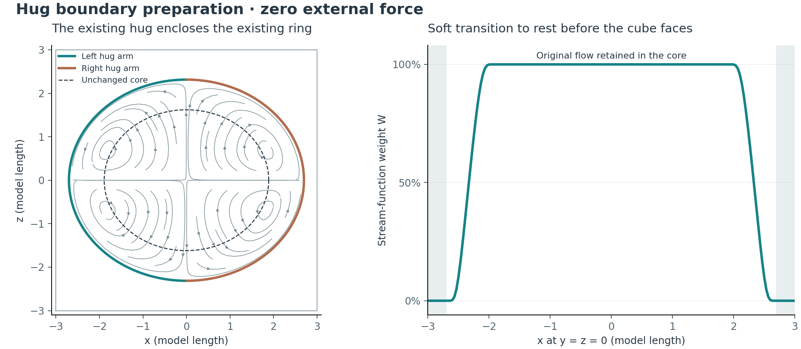
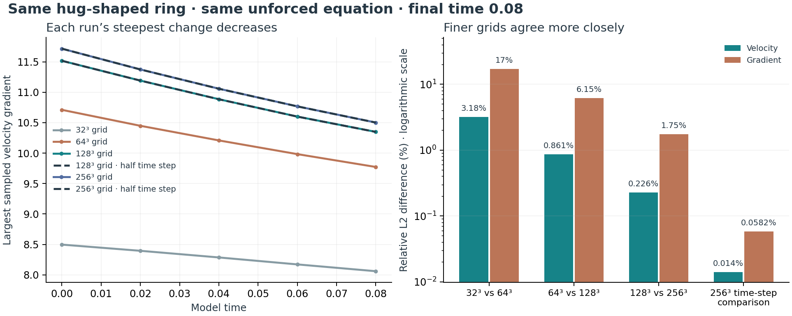
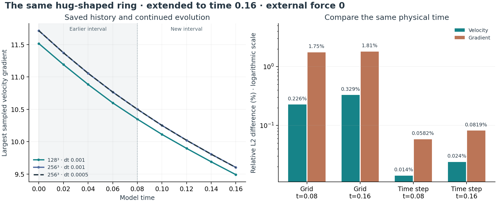
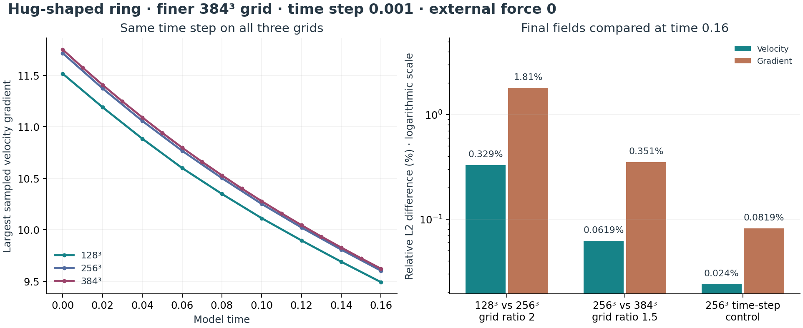
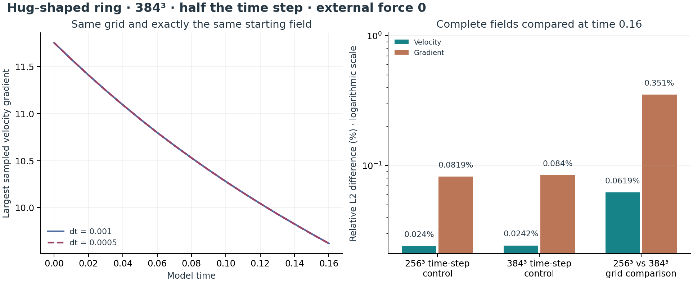
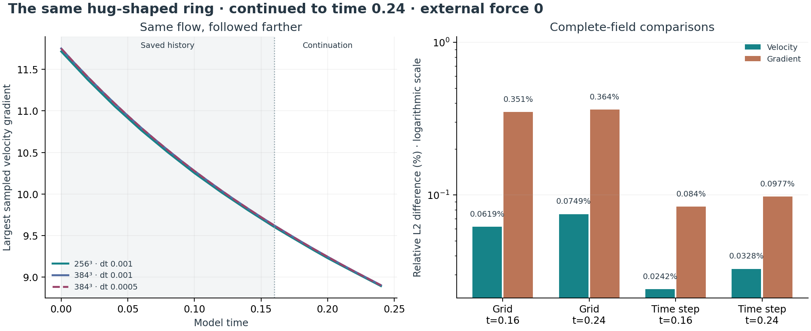
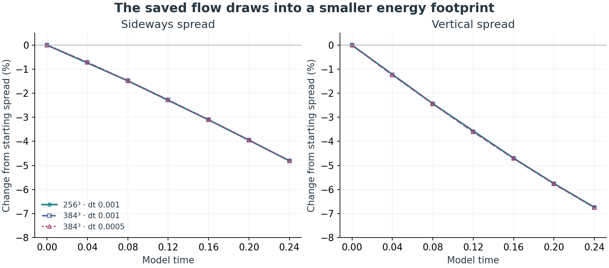

# The hug now prepares the ring's boundary

**Latest:** [How the motion changes shape](#how-the-motion-changes-shape).

**Completed:** the existing closed hug shapes the existing smooth ring's initial field. Velocity becomes zero smoothly before every cube face, so opposite faces and all their derivatives match. The continuum field remains divergence-free. The Navier–Stokes equation and zero-external-force choice remain unchanged.

## Direct connection to the existing work

- Starting field: `box_experiment.SMOOTH`, the maintained `SmoothRingField` with ring radius 1.5, radial scale √3, axial scale 1, and both rates 1.
- Hug geometry: the actual `hug_envelope.state_at(4.0)` closed pose, including its reciprocal axis stretch.
- Mapping: interpret the hug's horizontal and vertical axes as radial distance and height in a meridional section; rotate the closed ellipse about the z axis.
- Scale: its largest semiaxis is 90% of the cube half-width. For the length-6 cube the radial and axial semiaxes are 2.7 and approximately 2.314815.
- The inner ellipse scaled by 0.7 is an unchanged core. The surrounding layer provides a smooth transition to rest. These spatial scale choices are explicit construction parameters.

The hug's four-second pose is sampled once to prepare fluid time `t=0`. The subsequent fluid motion is governed by Navier–Stokes; the earlier timed animation and imposed pressure-opening rule are not applied during evolution.

## The construction

For the two semiaxes `R_h` and `Z_h`, set

$$
s=\frac{x^2+y^2}{R_h^2}+\frac{z^2}{Z_h^2},\qquad a=0.7^2.
$$

Define `b(t)=exp(-1/t)` for `t>0`, and `b(t)=0` otherwise. Let `W(s)=1` for `s≤a`, `W(s)=0` for `s≥1`, and in between set

$$
t=\frac{s-a}{1-a},\qquad
W(s)=\frac{b(1-t)}{b(t)+b(1-t)}.
$$

All derivatives match at both joins: this is a C∞ spatial gate. The old quintic interpolation was a timing rule for the animation; it is not substituted for this all-orders spatial smoothness.

Apply the hug to the stream function before taking derivatives:

$$
\psi_h=W\psi_0,\qquad
u_r^h=-\frac1r\partial_z\psi_h,\qquad
u_z^h=\frac1r\partial_r\psi_h,\qquad
u_\theta^h=Wu_\theta^0.
$$

The existing ring uses `ψ₀=A r² z φ`. Writing `q=x²+y²` and `W_s=dW/ds`, the implementation evaluates the smooth Cartesian formula

$$
u_x^h=Wu_x^0-\frac{2A xz^2\phi W_s}{Z_h^2},\quad
u_y^h=Wu_y^0-\frac{2A yz^2\phi W_s}{Z_h^2},\quad
u_z^h=Wu_z^0+\frac{2A qz\phi W_s}{R_h^2}.
$$

It has no division by radius. The meridional divergence vanishes by equality of mixed stream-function derivatives, and axisymmetric swirl adds no divergence. This identity extends smoothly through the axis. Simply multiplying the old velocity by W would generally add divergence; a negative-control check detects that error.

The field is identically zero in an open strip next to every cube face. Consequently its periodic extension is C∞, including edges and corners. Viewed on all of space, it is also a smooth, compactly supported, finite-energy initial field. The whole-space and periodic evolutions remain distinct domain choices; the recorded runs use the periodic cube.

## Verification and saved runs

<!-- RESULTS_START -->
**Boundary mismatch:** 0.053709416 before the hug; **0 after**. The zero value follows from the field vanishing in a neighborhood of every face, as well as the sampled face check.

**Force:** `σ = 0`, `P_U = 0`; no external force. The existing solver and pressure projection were reused. No sine/cosine replacement was used.

Four short comparisons reached the same final time 0.08. All values are nondimensional. The raw finite-difference divergence of a sampled continuum field is not exactly zero; the existing projection corrects it before the two evolution branches begin.

| Grid | Time step | Raw sampled max divergence | Initial projection change (L2) | Final projected max divergence | Final projected max gradient | Final projected energy |
| --- | --- | --- | --- | --- | --- | --- |
| 16³ | 0.02 | 1.352074 | 13.2596% | 8.882e-16 | 5.553309 | 39.006958 |
| 32³ | 0.02 | 0.908968 | 3.3073% | 1.776e-15 | 8.078380 | 39.479609 |
| 64³ | 0.02 | 0.514969 | 0.7831% | 3.553e-15 | 9.768902 | 39.555986 |
| 32³ | 0.01 | 0.908968 | 3.3073% | 1.332e-15 | 8.068097 | 39.441322 |

The initial grid correction drops from 13.26% to 3.31% to 0.78% as the grid is refined. It modifies the sampled velocity, including the core; the exact unchanged-core statement applies to the analytic construction before this discrete correction. The gradient values still change with grid resolution, so evolution accuracy is not yet established. The zero seam and analytic smoothness do not rely on that evolution comparison.



[Saved JSON](../results/hug-boundary.json) · [All rows, including the branch without projection](../results/hug-boundary.csv)

<!-- RESULTS_END -->

The nine new checks cover reuse of the actual hug geometry, unchanged inner core, zero values in face neighborhoods, flat transitions, agreement with independent stream-function differences, local divergence convergence, the failure of naive velocity masking, rejection of open hug poses, and zero force during use of the existing box runner. Seven existing box-integration checks also passed.

## Run this construction

From the repository root:

```sh
python -m pytest math/tests/test_hugged_ring.py math/tests/test_box_integration.py -q
python math/box_experiment.py --profile hug --start projected --box 6 --points 16 32 64 --dt 0.02 --steps 4 --csv scratch/hug-boundary.csv
python math/box_experiment.py --profile hug --start projected --box 6 --points 32 --dt 0.01 --steps 8 --csv scratch/hug-half-step.csv
```

Implementation: [hugged_ring.py](../hugged_ring.py), using [hug_envelope.py](../hug_envelope.py), [initial_field.py](../initial_field.py), and the maintained [box_experiment.py](../box_experiment.py).

**Scope:** the boundary preparation is established analytically and checked numerically. The recorded short evolution runs are implementation checks; their gradients are not yet spatially converged. This supplies no long-time regularity or breakdown result.

<!-- REFINEMENT_START -->
## Finer-grid evolution check

The same hug-shaped ring was evolved to model time **0.08** on **32³, 64³, 128³, 256³** grids with time step **0.001**. The latest time-step check uses **256³ / 0.0005**; the earlier 128³ control is retained. All use the length-6 periodic cube, viscosity 0.01, zero external force (`sigma=0`, `P_U=0`), and the existing centered update with pressure projection.

**Closer agreement:** the final velocity difference is **3.1766% → 0.8613% → 0.2261%** between successive grids. The full-gradient difference is **17.0262% → 6.1472% → 1.7510%**. On the latest pair (128³ vs 256³), the differences are **0.2261%** and **1.7510%**, respectively. Halving the time step on the **256³ grid** changes velocity by **0.0140%** and gradient by **0.0582%**. These comparisons support refinement over this interval, with remaining spatial differences.

The 256³ half-step check is complete. Its starting array is identical to the 256³ full-step run. All previously completed runs and the earlier 128³ time-step control are preserved.

| Grid | Time step | Start max gradient | End max gradient | End energy | End max divergence |
| --- | --- | --- | --- | --- | --- |
| 32³ | 0.0010 | 8.496596 | 8.059470 | 39.407642 | 1.33e-15 |
| 64³ | 0.0010 | 10.710468 | 9.771791 | 39.473866 | 2.89e-15 |
| 128³ | 0.0010 | 11.516387 | 10.348072 | 39.486739 | 5.77e-15 |
| 128³ | 0.0005 | 11.516387 | 10.347793 | 39.484522 | 6.00e-15 |
| 256³ | 0.0010 | 11.715300 | 10.501479 | 39.489805 | 1.27e-14 |
| 256³ | 0.0005 | 11.715300 | 10.500958 | 39.487549 | 1.18e-14 |



### Method and verification

- `navier.py` now has an optional NumPy step backend that evaluates the same centered stencils and explicit Euler update as its retained Python loop. The FFT projection uses the same centered derivative symbols. No PDE term or initial profile was replaced.
- **All 146 repository tests passed in the publication check.** These include the array-backend comparisons, independent projection checks, and physical-coordinate interpolation checks. The 256³ extension uses the same numerical source as the completed grid study.
- Each grid samples and projects the same analytic initial field. The projection change depends on the grid. Raw and projected starts are recorded separately.
- Even cell-centered grids are not nested. Fine fields are sampled at the coarse grid's physical coordinates with periodic cubic interpolation; its approximation error is not included in a rigorous error bound. A known smooth wave checks coordinate alignment and fourth-order interpolation refinement.
- Relative L2 differences divide the coarse-minus-fine norm by the interpolated fine norm. Gradient comparisons use all nine centered derivatives. The maximum-gradient plot is a separate pointwise diagnostic.
- Centered derivatives retain checkerboard null modes. Small discrete divergence does not by itself establish continuum accuracy. Positive viscosity and energy decay here are measured properties of these runs, not a general numerical stability guarantee.
- The largest sampled gradient decreases within every run, but the maxima still differ between grids. These results do not establish a blowup or all-time smoothness result.

### Reproduce without duplicating completed work

```sh
python -m pytest math/tests/test_array_step.py math/tests/test_refinement_comparison.py math/tests/test_projection.py math/tests/test_hugged_ring.py math/tests/test_box_integration.py math/tests/test_navier.py math/tests/test_legacy_parameters.py -q
python math/hug_refinement.py
python math/extend_hug_refinement.py --half-step
```

The runner retains full initial/final arrays and per-run measurements in ignored `scratch/hug-refinement/`. It reuses completed runs only when the source fingerprint and parameters match. Reviewed JSON/CSV are in `math/results/`; the earlier four-run boundary study is preserved separately. NumPy and SciPy are already in the repository requirements.

[Refinement JSON](../results/hug-refinement.json) · [Rows by time](../results/hug-refinement.csv)

**Completed next step:** [The continuation to time 0.16](#longer-run-to-model-time-016) is recorded below.

<!-- REFINEMENT_END -->

<!-- LONGER_START -->
## Longer run to model time 0.16

**Completed:** the 128³ / 0.001, 256³ / 0.001, and 256³ / 0.0005 runs now reach model time **0.16**. Each continued directly from its saved **0.08** velocity array. The earlier interval was reused, and the original six-run refinement record is preserved.

**The largest sampled gradient decreased at every recorded time in all three continuations.** On 256³ with the smaller time step, the largest sampled gradient changes from **10.500958** at 0.08 to **9.600445** at 0.16. Energy changes from **39.487549** to **38.702630**. The final centered divergence is **1.31e-14**.

| Comparison at time 0.16 | Velocity difference | Full-gradient difference |
| --- | --- | --- |
| 128³ vs 256³, both dt 0.001 | 0.3287% | 1.8051% |
| 256³, dt 0.001 vs 0.0005 | 0.0240% | 0.0819% |

The differences between calculations are larger at time 0.16 than at 0.08, even though the largest sampled gradient decreases. These are different measurements. The grid differences remain larger than the time-step differences, so spatial resolution accounts for the larger remaining discrepancy in these comparisons.



| Grid | Time step | Max gradient at 0.08 | Max gradient at 0.16 | Energy at 0.16 | Max divergence at 0.16 |
| --- | --- | --- | --- | --- | --- |
| 128³ | 0.0010 | 10.348072 | 9.490098 | 38.701445 | 6.22e-15 |
| 256³ | 0.0010 | 10.501479 | 9.601384 | 38.706818 | 1.31e-14 |
| 256³ | 0.0005 | 10.500958 | 9.600445 | 38.702630 | 1.31e-14 |

### What was preserved and checked

- The same smooth initial field, length-6 periodic cube, viscosity 0.01, centered update, and pressure projection are used. **External force remains zero** (`sigma=0`, `P_U=0`), and the scalar stays zero.
- The numerical source fingerprint matches the earlier runs. Every continuation records hashes of its source checkpoint and of the continuation code. The same grid and time step continue from that checkpoint; the clock is not reset.
- The saved velocity is restored exactly. No new initial projection is applied at the restart. Pressure is recomputed by the existing projection during each new time step.
- A small-grid regression check confirms that the restarted final array is **bit-for-bit equal** to uninterrupted evolution. A second check rejects a checkpoint from different numerical source code. Both checks passed.
- Comparisons reuse the earlier physical-coordinate interpolation and full-gradient measurement. These are differences between numerical runs, not exact-solution error bounds. The centered-grid null modes and finite resolution remain limitations.

The result describes this finite interval. It does not establish an all-time smoothness or breakdown proof.

### Continue or reproduce

```sh
python -m pytest math/tests/test_hug_continuation.py -q
python math/continue_hug_refinement.py
```

The continuation command uses the original checkpoint arrays under ignored `scratch/hug-refinement/`. On a fresh checkout, first follow the earlier refinement commands to generate those arrays. Completed matching continuations are cached and reused. The saved numerical summaries and figures can be read immediately without running the simulations.

[Continuation code](../continue_hug_refinement.py) · [Results and provenance](../results/hug-longer-time.json) · [Measurements by time](../results/hug-longer-time.csv)

**Completed next step:** [The 384³ grid comparison](#finer-grid-at-time-016) is recorded below.

<!-- LONGER_END -->

<!-- GRID384_START -->
## Finer grid at time 0.16

**Completed:** a new **384³** run reaches model time **0.16** with time step **0.001**. The saved **256³ / 0.001** result is reused. Both use the same initial-field construction, length-6 periodic box, viscosity 0.01, and **zero external force**.

**Both measured differences are smaller on the new grid pair.** The final velocity difference changes from **0.3287%** (128³ vs 256³) to **0.0619%** (256³ vs 384³). The full-gradient difference changes from **1.8051%** to **0.3509%**.

| Comparison at time 0.16 | Velocity difference | Full-gradient difference |
| --- | --- | --- |
| 128³ vs 256³, dt 0.001 | 0.3287% | 1.8051% |
| 256³ vs 384³, dt 0.001 | 0.0619% | 0.3509% |
| Earlier 256³ time-step control | 0.0240% | 0.0819% |

The grid changes have different refinement ratios: **2** and **1.5**. A smaller difference on the new pair therefore does not, by itself, establish a convergence order. The time-step control at this stage was at 256³. The [384³ half-step result](#half-time-step-on-the-384-grid) is now recorded below.



| Grid | Initial max gradient | Final max gradient | Final energy | Final max divergence |
| --- | --- | --- | --- | --- |
| 128³ | 11.516387 | 9.490098 | 38.701445 | 6.22e-15 |
| 256³ | 11.715300 | 9.601384 | 38.706818 | 1.31e-14 |
| 384³ | 11.751008 | 9.620783 | 38.707794 | 1.95e-14 |

The new 384³ run starts with a sampled maximum gradient of **11.751008** and ends at **9.620783**. This maximum is a different measurement from the relative L2 difference of the full gradient tensor.

### Verification and reuse

- The numerical source fingerprint matches the previous runs. The existing centered update, pressure projection, analytic starting field, and force settings were retained.
- The 384³ field was sampled on its own grid from the same analytic construction. It was not created by stretching a saved 256³ result.
- Checkpoints at **0.04, 0.08, 0.12, and 0.16** preserve the new work. Restarts use the saved velocity exactly, without a new initial projection; the scalar remains zero.
- Six targeted checks passed: four field-comparison checks, including a new **3:2 grid-alignment check**, and two checkpoint-restart checks. The new transfer ratio is tested at matching physical coordinates.
- The comparison uses the existing periodic cubic interpolation and centered-gradient tensor. The interpolation error is not enclosed by a rigorous bound. Centered-grid null modes and finite resolution remain limitations.

These are finite-time numerical measurements. They do not establish an all-time smoothness or breakdown proof.

### Reproduce this comparison

```sh
python -m pytest math/tests/test_refinement_comparison.py math/tests/test_hug_continuation.py -q
python math/extend_hug_refinement.py --finer-grid 384
```

This command extends the saved longer-time study. On a fresh checkout, first follow the preceding refinement and continuation commands to create the earlier checkpoint arrays. Completed matching runs and checkpoints are reused; raw arrays remain under ignored `scratch/hug-refinement/`.

[Measured results](../results/hug-grid-384.json) · [Rows by time](../results/hug-grid-384.csv) · [Shared extension runner](../extend_hug_refinement.py)

**Completed next step:** [The 384³ half-step comparison](#half-time-step-on-the-384-grid) is recorded below.

<!-- GRID384_END -->

<!-- HALF384_START -->
## Half time step on the 384 grid

**Completed:** the existing 384³ hug-shaped field reaches model time **0.16** using time step **0.0005**, compared with the saved **0.001** run. The numerical equation, starting field, length-6 periodic box, viscosity 0.01, and **zero external force** are retained.

**Halving the time step changes the final velocity field by 0.0242% and the full gradient by 0.0840%.** Both time-step differences are smaller than the latest grid differences.

| Comparison at time 0.16 | Velocity difference | Full-gradient difference |
| --- | --- | --- |
| 384³: dt 0.001 vs 0.0005 | 0.0242% | 0.0840% |
| Earlier 256³ time-step control | 0.0240% | 0.0819% |
| Earlier 256³ vs 384³, dt 0.001 | 0.0619% | 0.3509% |



The gradient-history curves nearly overlap. The percentages compare the complete velocity arrays and all nine centered-gradient components, rather than only the largest sampled gradient. Both time-step runs use the same grid, so this comparison involves no spatial interpolation.

| Time step | Steps | Final max gradient | Final energy | Final max divergence |
| --- | --- | --- | --- | --- |
| 0.001 | 160 | 9.620783 | 38.707794 | 1.95e-14 |
| 0.0005 | 320 | 9.619762 | 38.703592 | 1.95e-14 |

### What was checked

- The initial arrays matched **exactly before the first new time step** and again when the saved arrays were compared at completion. The two runs start at model time zero and both finish at 0.16.
- The completed 160-step baseline was reused. The new control uses 320 half-sized steps, with checkpoints at 0.04, 0.08, 0.12, and 0.16.
- The numerical source fingerprint is unchanged. Checkpoint restarts retain the saved velocity exactly and recompute pressure through the existing projection; they do not project the starting field again.
- **Eight targeted checks passed:** the new half-step sequence matches a direct small-grid run, completed controls are reused, and a changed initial field is rejected before evolution; the existing restart and comparison checks also pass.

These measurements assess sensitivity over the tested interval. Two time steps do not establish a temporal convergence order, a rigorous error bound, or an all-time smoothness or breakdown result. The existing centered-grid null modes and finite resolution remain limitations.

### Reproduce this control

```sh
python -m pytest math/tests/test_hug_time_control.py math/tests/test_hug_continuation.py math/tests/test_refinement_comparison.py -q
python math/extend_hug_refinement.py --time-control-grid 384
```

The command requires the completed 384³ / 0.001 baseline and its checkpoint arrays from the preceding grid study. Matching half-step checkpoints are reused. Raw arrays stay under ignored `scratch/hug-refinement/`; the small numerical record is published here.

[Measured results](../results/hug-time-384.json) · [Measurements by time](../results/hug-time-384.csv) · [Shared runner](../extend_hug_refinement.py)

**Completed next step:** [The continuation to time 0.24](#continuation-to-model-time-024) is recorded below.

<!-- HALF384_END -->

<!-- CONTINUED024_START -->
## Continuation to model time 0.24

**Completed:** the same three saved runs now reach **model time 0.24**, continuing directly from **0.16**. The 256³ / 0.001, 384³ / 0.001, and 384³ / 0.0005 settings are retained. The hug-shaped starting field, length-6 periodic box, viscosity 0.01, numerical update, and **zero external force** are unchanged.

**The largest sampled velocity gradient decreased at every recorded time in all three continuations.**

| Comparison at time 0.24 | Velocity difference | Full-gradient difference |
| --- | --- | --- |
| 256³ vs 384³, dt 0.001 | 0.0749% | 0.3639% |
| 384³, dt 0.001 vs 0.0005 | 0.0328% | 0.0977% |



### What changed over the extra interval?

- Grid velocity difference increased: 0.0619% → 0.0749%.
- Grid gradient difference increased: 0.3509% → 0.3639%.
- Time-step velocity difference increased: 0.0242% → 0.0328%.
- Time-step gradient difference increased: 0.0840% → 0.0977%.

The gradient history measures how sharply velocity varies within each simulated flow. The percentages measure differences between calculations over the entire velocity field and all nine gradient components. They answer different questions.

| Grid | Time step | Gradient at 0.16 | Gradient at 0.24 | Energy at 0.16 | Energy at 0.24 | Divergence at 0.24 |
| --- | --- | --- | --- | --- | --- | --- |
| 256³ | 0.001 | 9.601384 | 8.891290 | 38.706818 | 37.981798 | 1.29e-14 |
| 384³ | 0.001 | 9.620783 | 8.902324 | 38.707794 | 37.982804 | 2.04e-14 |
| 384³ | 0.0005 | 9.619762 | 8.900557 | 38.703592 | 37.976874 | 1.95e-14 |

### What was preserved and checked

- Each run resumed its exact saved velocity at 0.16. The earlier interval was reused. There was no extra projection when restarting; the existing pressure correction operates during each new step.
- New checkpoints were saved at **0.20** and **0.24** for each run. The two full-step runs added 80 steps each; the half-step run added 160.
- The numerical source fingerprint matches the earlier study. Each checkpoint records hashes of its input summary, input arrays, and continuation code. The scalar stays zero.
- The two 384³ time-step controls have exactly identical original initial arrays, checked before continuation and at completion. Their time-step comparison involves no interpolation.
- The 256³/384³ grid comparison uses the existing periodic cubic interpolation at matching physical cell centers. It includes interpolation and discretization effects.
- **Eight targeted checks passed.** The staged continuation matches uninterrupted evolution bit for bit on a small grid, adds only the required new steps, reuses completed checkpoints, and rejects invalid schedules. Existing restart and comparison checks also pass.

These are finite-time numerical sensitivity measurements. The percentages are not rigorous bounds on error relative to an exact solution. Two grids and two time steps do not establish convergence orders or an all-time smoothness or breakdown proof. Centered-grid null modes and finite resolution remain limitations.

### Reproduce this continuation

```sh
python -m pytest math/tests/test_hug_checkpoint_sequence.py math/tests/test_hug_continuation.py math/tests/test_refinement_comparison.py -q
python math/extend_hug_refinement.py --continue-to 0.24
```

The command needs the three original 0.16 checkpoint arrays under ignored `scratch/hug-refinement/`. On a fresh checkout, follow the preceding grid and half-step studies to create them. Matching completed continuations are reused. The published tables and chart can be read without running the simulation.

[Measured results and provenance](../results/hug-continued-0.24.json) · [Measurements by time](../results/hug-continued-0.24.csv) · [Continuation runner](../extend_hug_refinement.py)

<!-- CONTINUED024_END -->

<!-- SHAPE_START -->
## How the motion changes shape

**The motion becomes more concentrated: 4.81% narrower sideways and 6.75% narrower vertically.** These numbers use the 384³ run with time step 0.0005, from model time 0 to 0.24. Both widths decreased at every saved snapshot in all three runs.

This adds a shape measurement to the already completed evolution. **No fluid steps were repeated or added.** Sixteen saved checkpoint files supply 19 observations, including the starting field for each run. The equation, hug construction, viscosity and zero external force are preserved.



| Grid | Time step | Sideways spread change | Vertical spread change |
| --- | --- | --- | --- |
| 256³ | 0.001 | -4.8094% | -6.7420% |
| 384³ | 0.001 | -4.8086% | -6.7558% |
| 384³ | 0.0005 | -4.8084% | -6.7498% |

### What the widths mean

At each grid position, use squared speed as a weight: `w = u_x² + u_y² + u_z²`. Faster-moving regions count more. Find the weighted center `c = Σ(w x)/Σw`, then take the root mean square distance from that center:

$$
R_E=\sqrt{\frac{\sum w[(x-c_x)^2+(y-c_y)^2]}{\sum w}},\qquad
Z_E=\sqrt{\frac{\sum w(z-c_z)^2}{\sum w}}.
$$

These are the sideways and vertical **spread of kinetic energy**, in model length units. Dividing by each initial width gives the plotted percentage change. Multiplying every velocity by the same factor leaves the widths unchanged, so uniform slowing alone cannot cause this narrowing.

### What this says about breathing

The sampled sequence records a narrowing phase. It contains no measured widening phase and does not establish a repeating breathing cycle. The earlier hug animation is sampled once to prepare the initial field; its timed closing and opening are not imposed during fluid evolution.

The widths follow where motion is concentrated. They do not track a material wall or the same fluid particles. Uneven slowing, transport and redistribution can all change these widths; this measurement does not identify which caused the trend. Changes between saved times remain unresolved.

### Agreement and coordinate limits

- At time 0.24, 256³/384³ differences in these widths are 0.00111% sideways and 0.01329% vertically.
- On 384³, full/half time-step differences are 0.00024% and 0.00646%.
- Moments use the fixed `[-3,3)` coordinates of the periodic box. At most 0.026210% of the energy falls in the union of face bands `max(|x|,|y|,|z|) ≥ 2.7`. The largest measured center offset is 1.02e-16. These localization checks do not make the widths intrinsic periodic distances or give a numerical error bound.

**Three targeted checks passed:** a distribution with exactly known center and widths, invariance under uniform speed rescaling with no double-counting of corners, and rejection of undefined inputs. Recomputed energies match the checkpoint diagnostics. Results record checkpoint and analysis hashes. This is a finite-time numerical observation, without an all-time smoothness conclusion.

### Reproduce the measurement

```sh
python -m pytest math/tests/test_hug_shape.py -q
python math/hug_shape.py
```

The second command reads existing arrays under ignored `scratch/hug-refinement/`; it never advances the solver. A fresh checkout needs the checkpoint-producing runs documented above. The saved tables and figure are available directly.

[Measurements and provenance](../results/hug-shape.json) · [Measurement table](../results/hug-shape.csv) · [Analysis code](../hug_shape.py)

<!-- SHAPE_END -->
