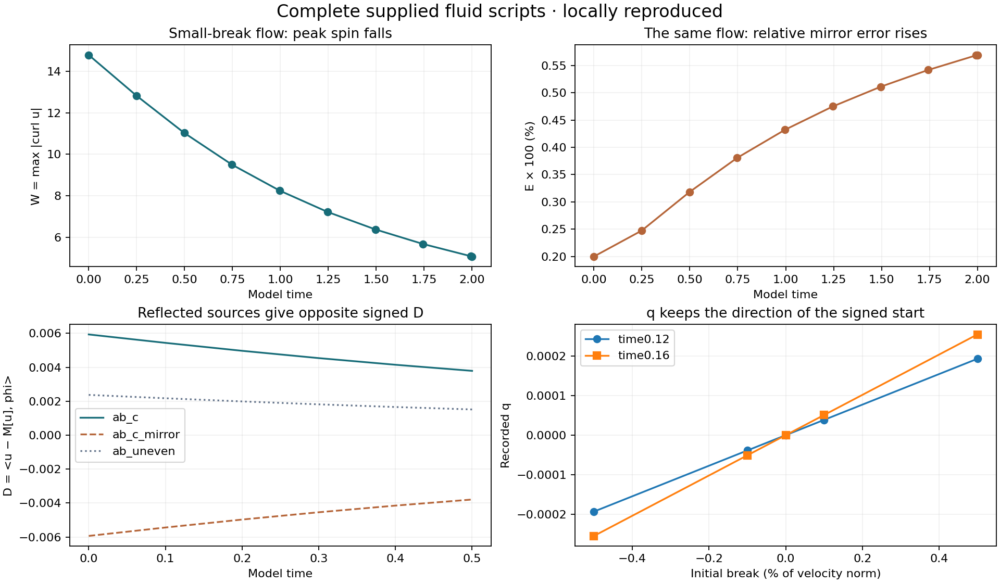
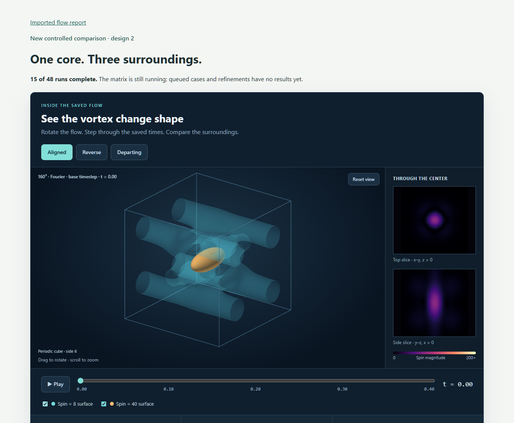

# Reports and visuals

These reports are saved on the author’s computer and copied into this GitHub folder.

**To use the interactive controls:** [download the project](https://github.com/NousVolition/My-Sources-Project-ALL/archive/refs/heads/main.zip), extract it, and open `reports/index.html`. GitHub’s file viewer displays HTML source rather than running its controls.

## Numerical reports and earlier snapshots

- **[Matched-stretch controls](matched-stretch/README.md): 5/48 runs in this earlier snapshot.** Charts, time-step comparisons, widths and budgets; spatial resolution remains inadequate in the current 64³ runs.
- **[Three vortex surroundings](study/README.md): 36/48 completed locally; 32 verified results published.** All aligned and compressive runs are published, including [four 160-grid controls](study/completed-compressive160-final/README.md). Departure runs are progressing; the older interactive display remains dated separately below.
- [Verification of this saved snapshot](numerical-progress-verification.json).

## Completed mirror tests — October 8

- **[Separate C and D contributions](../math/imports/hug-ns/mirror-fluid/source-attribution/README.md):** ten new fluid controls and [chart](../math/imports/hug-ns/mirror-fluid/source-attribution/source-effects.png).

- **[Four reproduced fluid tests](../math/imports/hug-ns/mirror-fluid/README.md):** [charts](files/fluid-tests-completed.png), [HTML report](files/fluid-tests-completed.html), code and result tables.
- **[Signed mirror calibration](../math/imports/hug-ns/mirror-calibration/README.md):** 20 completed runs, [charts](files/mirror-calibration.png) and [HTML report](files/mirror-calibration.html).
- [Files and hashes for this addition](verified-mirror-publication.json).

Earlier vortex snapshot: 2026-10-08T20:40:59.597392+00:00. The vortex matrix is still running; this copy contains saved results available at publication. Later local results need another publication.

| Report | Purpose |
| --- | --- |
| [Vortex shapes and movement](files/adversarial-vortex-study.html) | Rotate the 3D field and play saved times. Aligned, reverse and departing surroundings. |
| [Flow results and controls](files/change-influence-result.html) | Imported results, fixed thresholds, and what each numerical check measured. |
| [Hugged-ring calculations](files/hug-boundary-results.html) | The earlier ring calculation, grid comparisons, energy and time-step checks. |
| [Peak and reference](visuals/peak-and-reference.html) | Compare the largest spin with its changing reference. |
| [Norm, Entropy and the hug](visuals/norm-entropy-mirror.html) | The earlier mirror and timed-envelope illustration; this is a separate prototype. |
| [Flip and join](visuals/flow-edge-seam.html) | The illustrated join between flipped copies. |
| [Why the corner matters](visuals/why-the-corner-matters.html) | Explore the difference between a tall smooth peak and a corner. |
| [People in context](visuals/people-in-context.html) | The A/B/C conversation illustration. |
| [Conversation without words](visuals/conversation-without-words.html) | Inspect categories, reply order and lengths. |
| [Conversation study](../language/conversation-study/README.md) | Source-linked observations and conversation patterns. |

## Earlier experiments

- [Earlier test using a different starting flow](files/hidden-flow-results.html)

## Supporting files

- [File inventory and source hashes](manifest.json)
- [Vortex protocol](study/protocol.json), [saved comparisons](study/comparisons.json), and [run measurements](study/runs)
- [Earlier math notes and code](../math/README.md)
- [Conversation sources](../language/conversation-study/README.md)

The full restart arrays remain in the local calculation workspace. They are large solver files; this folder includes the display data, measurement tables and source code needed to inspect the reports. Private next-step notes and temporary verification screenshots are not part of this report collection.

## Newly completed comparisons

- [Dynamic source weights and cubic term: 26 runs, four unseen starts](../math/imports/hug-ns/mirror-fluid/dynamic-q/README.md).
- [Original 48/64/80 replay: fixed and moving cutoff measurements](support/fixed-cutoff-run/README.md).
- [Three completed 0.1% perturbation seeds](matched-stretch/completed-seeds/README.md).
- [Four additional 65-grid controls for the dynamic q model](../math/imports/hug-ns/mirror-fluid/dynamic-q/GRID65.md).

- [Breathing rerun: six reproduced cases with prescribed per-step driving](../math/imports/hug-ns/mirror-fluid/breathing-rerun/README.md).

- [Breathing run followed through every step: actual-fluid animations and the changing E/D measurements](../math/imports/hug-ns/mirror-fluid/breathing-rerun/timeline/README.md).

- [Three completed 0.5% perturbation seeds](matched-stretch/completed-halfpercent/README.md).
- [Reproduced one-lean ball and breathing-fluid series](../math/imports/hug-ns/mirror-fluid/breathing-rerun/one-lean/README.md).

## Adaptive peak-spin check

- [Original start: resolution gate and five charts](matched-stretch/adaptive-peak/README.md). The largest initial peak spans about two cells on all five checked grids. The requested minimum is six, so this adaptive extension stops at initialization.

## Measurements and definitions

- [Corrected fluid dashboard, explicit definitions, 516 saved-field checks and completed controls](../math/imports/hug-ns/mirror-fluid/methods-controls/README.md).
- [Norms, signs, reflection, numerical methods and evidence categories](../math/imports/hug-ns/mirror-fluid/methods-controls/METHODS.md).

The matched-stretch count above describes the saved October 8 snapshot; the vortex count was updated October 9. Later verified batches are linked under Newly completed comparisons; unfinished local runs are not presented as completed GitHub results.

## New completed tests

- [Separate periodic starting field: five initial grids](matched-stretch/periodic-start-check/README.md). The 256-grid width check passes; the large change in starting energy is reported.
- [Four reduced-model layers: 46 completed runs and plots](../math/imports/hug-ns/mirror-fluid/model-layers/README.md). All 17 driven fluid comparisons are complete: [prediction scores and numerical controls](../math/imports/hug-ns/mirror-fluid/model-layers/FLUID.md). The tested scalar mappings fail the unseen-run prediction check.
- [All 22 numerical controls completed](../math/imports/hug-ns/mirror-fluid/methods-controls/README.md), including grid, timestep, translation, rotation and initial-shape checks.

## Identical water molecules: positional influence

- [Reproducible toy-network and TIP3P water experiment](water-molecule-influence/README.md): methods, figures, complete saved trajectories, numerical controls, and limits on interpreting temporary response rankings as a hierarchy.

## Marker-history prediction pilot

- [Does past marker geometry predict future deformation?](matched-stretch/history-prediction/README.md) — 32 independent initial conditions, 64 simulations, whole-run holdouts, 13 passing local tests, complete numerical recordings and control plots. A small continuous-error gain; event results depend on the threshold, and the finer-grid comparison remains inconclusive.
