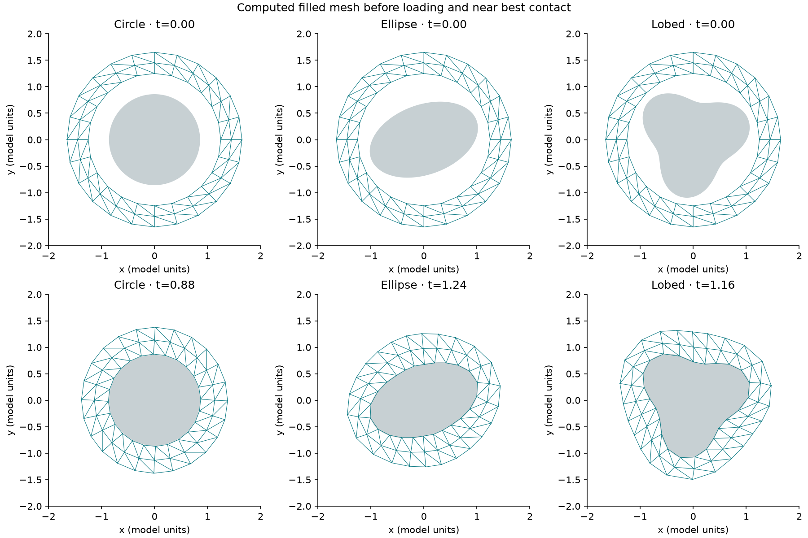
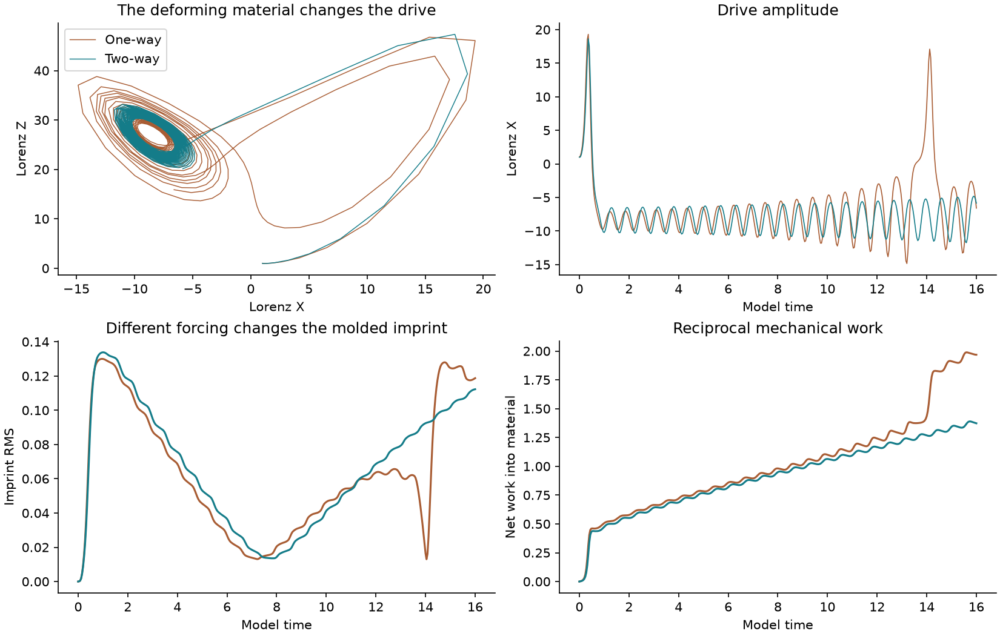
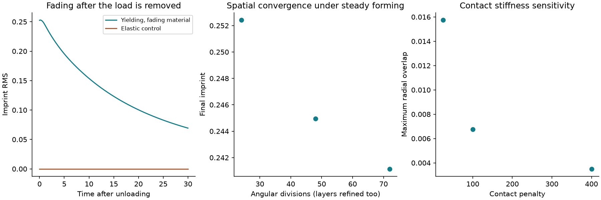

# The hug as a moldable material

[Open the computed molding and reciprocal-drive report](report.html).

This implements the user's idea of a clay-like hug that yields, molds around an object and retains a fading imprint. It uses a **filled 2-D annular material mesh**, frictionless contact with a rigid object, low-threshold viscoplastic bond flow, and internal relaxation. Its shape is computed from material forces. The square now contributes a wall force. The earlier reduced curve models remain in their original packages.

The Lorenz drive applies a mechanical force to this material. With return enabled, material motion reacts back on Lorenz through a reciprocal work connection. The work exchanged cancels in the combined continuous energy balance. The one-way control keeps the same force connection while disabling its return.

The tests include circular, tilted elliptical and concave three-lobed objects; two Lorenz starting states; several forcing strengths; changed reservoir capacities; short solver comparisons; three spatial meshes; contact stiffness variation; unloading and an elastic control; longer runs; strong forcing; low viscosity; stiff contact; and high Lorenz parameters. Actual trajectories and stopped numerical attempts are retained in `data/`. Read the report and JSON results for completed counts, convergence and limitations.

<!-- RESULTS_START -->
## Completed results

52 saved configurations and one independent adaptive integration were run. 48 finished their requested interval; 4 stopped at the numerical guard. Stopped or inaccurate numerical attempts remain in the dataset.



The round band molds into contact with the circle, tilted ellipse and concave lobed object for the second Lorenz start, (-8, 8, 27). Selected peak near-contact fractions are 100.0%, 100.0% and 100.0%. This means radial gap magnitude below 0.03 at the sampled inner surface; it is not zero-overlap hard contact.

Starting pressure history matters: the first Lorenz start, (1, 1, 1), never reaches the circle in this interval and gives only 27.0% and 44.1% peak near-contact for the ellipse and lobed object. The figure/object playback uses the second start; the force-strength playback and time-series figure use the first. The model does not guarantee full molding for every drive.

For the moderate ellipse case over time 4–16, enabling the return changes Lorenz activity RMS by +0.66%, mean material imprint by +6.12% and material motion RMS by -52.95%. Other shapes, initial states, observation windows and port choices give different changes; no universal effect size or confidence interval is established.

On the finer coupled mesh, material motion changes by -52.49% and Lorenz Z fluctuations by -40.74%. Those effects persist closely; the imprint change is +3.62% and remains sensitive to mesh resolution. The hug can mold into contact and later pull away when Lorenz forcing reverses. These runs do not establish permanent adhesion or full continuum convergence.



The force changes the material; the material's changing shape reacts back on Lorenz. The continuous reciprocal work terms cancel. Saved trajectories also contain intervals of work returning from material to drive. The approximate forward/return integrals sampled every 0.04 units are labeled sampled in the JSON; the signed net work is integrated along with the equations.

Thirteen initial validation checks pass. The independent DOP853 comparison has maximum scaled state error 1.621e-07. The original strong-drive step-0.001 runs have energy-balance errors 4.063e+00 and 2.953e+01; their step-0.00025 repeats reduce these to 1.264e-08 and 1.704e-08. Only the refined strong results enter the playback/table.



After unloading for 30 time units, 27.46% of the loaded imprint remains while the object stays present. The elastic control's bond rest lengths do not change, so its internal imprint is zero. Adjacent spatial refinements give boundary radial RMS differences 0.00643 and 0.00100. Those differences measure numerical sensitivity; the finest mesh is still an approximation.

Completed cases missing the 0.02 radial-overlap target: **alpha2-one, alpha2-two, step-strong-base, step-strong-fine, stress-high-rho-resolved, resolved-alpha2-one, resolved-alpha2-two, resolved-step-strong-base, resolved-step-strong-fine**. Cases missing the 0.001 work-balance target: **alpha2-one, alpha2-two**. Numerical guard stops: **stress-strong-coarse, stress-fast-coarse, stress-stiff-coarse, stress-high-rho-coarse**. Review [all measured comparisons](data/analysis.json), [original runs](data/runs.json), [refined follow-up](data/followup.json), [solver checks](data/solver-checks.json), and [evidence audit](data/audit.json).

<!-- RESULTS_END -->

This is a dimensionless prototype of the abstract hug. It is not calibrated real clay. The band already surrounds the object at startup. It tests reshaping into contact, rather than wrapping a disconnected slab. It covers a 2-D cross-section, fixed objects and compressible cohesive deformation. Adhesion, friction, fracture, full 3-D contact and remeshing are not implemented. Contact and the wall use penalties, so the overlap must be checked and convergence tested. No Navier–Stokes or quantum result is inferred from this experiment.

## Reproduce

```sh
python -m pip install -r requirements-lock.txt
python validate_model.py
python run_stress.py
python run_followup.py
python run_mesh_feedback.py
python build_report.py
python verify_results.py
```

Optional browser verification requires Node, Playwright and Chrome:

The completed calculations used Python 3.12.14; exact package versions are in `requirements-lock.txt` and [environment.json](data/environment.json). `requirements.txt` supplies broader compatible ranges for other environments. `run_mesh_feedback.py` checks the matched reciprocal response on a finer mesh, beyond the steady-forming spatial tests.

```sh
node test_playback.cjs
```

`clay_hug.py` defines the model and integrators. `validate_model.py` checks independent analytic bond responses, energy gradients, contact gradients, reciprocal work, rotation symmetry and uncoupled Lorenz behavior. `run_stress.py` saves each actual configuration. `run_followup.py` repeats the strong drive with smaller time steps, retaining the inaccurate original attempts. `build_report.py` derives comparisons, charts and playback from those saved trajectories. `verify_results.py` audits the evidence, provenance and boundary crossings at saved times.

In saved states, columns are all node coordinates, all bond rest lengths, Lorenz X/Y/Z, accumulated Lorenz-native work, viscous loss, internal-flow loss, and work into the material. Each run saves its mesh, reference coordinates, times and object outline. A positive port-work rate means work entering the material; a negative rate means work returning from it.

The scalar bond flow follows an overstress construction with a separate fading term. The papers and established models cited in the report provide background; their calibrated clay constitutive laws are not claimed to be implemented here. Numerical verification and physical validation remain distinct.
