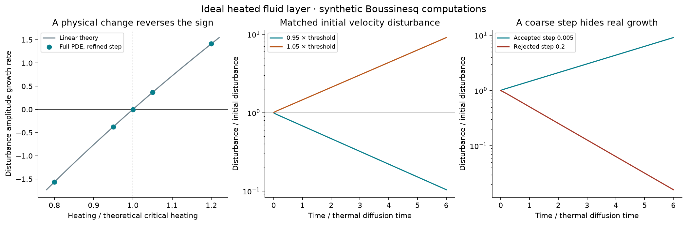
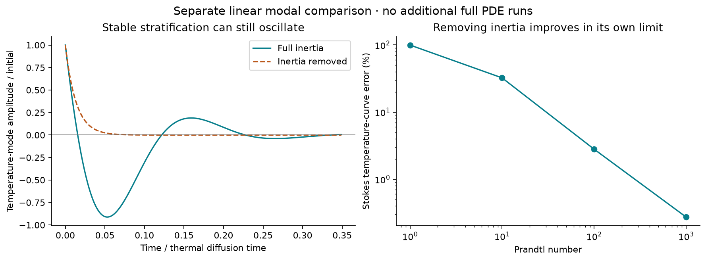

# Heating can switch a fluid disturbance from decay to growth

**Completed synthetic fluid benchmark, with full inertia.** Increasing the maintained bottom-to-top temperature difference changes the outcome in this ideal layer. At 95% of the theoretical critical heating, the initial velocity mode falls to **0.1042 times** its starting amplitude after six thermal diffusion times; at 105%, it reaches **9.078 times** its starting amplitude. These are numerical model results, not water or pond measurements.



## What was completed

79 full nonlinear 2D Boussinesq runs, including controls and selected repeats; 12 separate linear modal full-inertia/Stokes comparisons; **20/20 declared final checks** and **15/15 independent tests** passed. Final matrix elapsed time: 72.48 seconds on the recorded machine; this excludes the rejected initial attempt, test execution and report generation. The complete 79-run matrix was not independently repeated. Selected N=32, Ra/Ra_c=1.05 trajectories were repeated exactly at two steps; the refined comparison includes all recorded arrays.

| Heating / critical heating | Rayleigh number | Refined measured growth rate | Analytic infinitesimal rate | Final / initial mode amplitude |
| --- | ---: | ---: | ---: | ---: |
| 0.80 | 526.009 | -1.56294480 | -1.56294279 | 8.01269e-05 |
| 0.95 | 624.636 | -0.37485902 | -0.37485595 | 0.104153 |
| 1.00 | 657.511 | -0.00000348 | +0.00000000 | 0.999979 |
| 1.05 | 690.387 | +0.36559203 | +0.36559595 | 9.07773 |
| 1.20 | 789.014 | +1.41300283 | +1.41300829 | 5037.35 |

Growth is the slope of log amplitude of the critical vertical-velocity Fourier mode over t=1…6. Energy would grow at twice the amplitude rate for a pure growing mode; those rates are not interchangeable. Each refined row averages four independently seeded mixtures with matched seed across heating conditions. The four horizontal phases nearly collapse onto the same slow linear mode after the transient. Their t intervals in the raw summary are therefore extremely narrow, mainly roundoff-scale, and **are not useful bounds on numerical error or real-world uncertainty**. Step/grid changes, analytic discrepancies and modeling limitations are reported separately.

## Physical mechanism and the actual equations

Rising fluid carries temperature perturbations; buoyancy changes its vertical acceleration. With sufficient heating from below, that feedback beats diffusion and viscous loss. This is classical Rayleigh–Bénard convection. [Fabre's university lecture notes](https://basilisk.fr/sandbox/easystab/LectureNotes_RayleighTaylor.md) describe this mechanism and the stress-free neutral curve; [Ó Náraigh's course notes](https://maths.ucd.ie/~onaraigh/acm40740/acm_40740_jan2016_v1.pdf) provide further theory. These sources supply theoretical context, not experimental data analyzed here.

The model is u_t + u·grad(u) = −grad(p) + Pr Lap(u) + Pr Ra theta e_z; theta_t + u·grad(theta) = Lap(theta) + w; div(u)=0. The conductive state is motionless with temperature decreasing linearly upward. Here Ra=g alpha DeltaT H^3/(nu kappa), Pr=nu/kappa=1. Length is scaled by H, time by H^2/kappa, velocity by kappa/H, and temperature perturbation by each run's imposed DeltaT. Changing Ra represents changing DeltaT while holding geometry, coefficients and gravity fixed. No actual water properties, temperature in degrees or pond dimensions were calibrated.

The horizontal period is 2 sqrt(2) H. At z=0,H the layer is impermeable, stress-free and held at fixed temperatures: w=0, d_z u=0, theta=0. These ideal walls differ from a no-slip pond bed or a free water surface. Uniform horizontal velocity is constrained to zero; no claim of decay of an unconstrained uniform translation is made.

The same dimensionless velocity perturbation is used at every Ra, so the initial dimensional velocity matches when kappa and H are fixed. The primary thermal perturbation is the same *fraction* of DeltaT, not the same absolute temperature at different DeltaT. Two additional controls divide initial theta by Ra/Ra_c to keep its absolute size relative to the critical DeltaT fixed; they recover the same growth-rate conclusion. Halving the overall seed amplitude also preserves the linear-regime result. Four weak higher spatial modes accompany the critical roll, with independently seeded horizontal phases. Zero disturbance remains exactly zero even above the threshold in these deterministic equations.

For horizontal wavenumber k and vertical mode sin(pi z), let q=k^2+pi^2 and a=k^2/q. The independently evaluated modal matrix on (W,Theta) is [[−Pr q, Pr Ra a],[1,−q]]. Its determinant changes sign at Ra=q^3/k^2. Minimization gives k_c=pi/sqrt(2), Ra_c=27 pi^4/4=657.511364480. At Pr=1, the leading eigenvalue is −q+sqrt(Ra a). The full PDE runs retain nonlinear advection and inertia; they are compared with this infinitesimal prediction, rather than generated by that formula. This study brackets the observed sign change and checks the predicted neutral point; it does not infer an exact experimental threshold from five sample settings.

## Resolution, budgets and rejected calculations

Fourier differentiation uses N=16,24,32 on the horizontally periodic domain and a reflected vertical extension of length 2H. Thus the physical half-domain has N/2 intervals in depth; N is not the number of independent vertical physical cells. Strict 2/3 filtering removes quadratic aliases. Horizontal velocity is even under vertical reflection; vertical velocity and temperature are odd. Both reflection parity and the divergence-free projection are enforced at every stage. Time advancement uses exact half diffusion steps around RK4 for advection and coupling. The split scheme is generally second order; the equal-diffusivity linear Pr=1 benchmark has commuting diffusion/coupling operators and approaches fourth order. That special result is not claimed for arbitrary nonlinear runs or Pr.

The accepted primary step is 0.005, with 0.01 and selected 0.0025 comparisons. Maximum 0.01-to-0.005 growth-rate change is 7.62e-05; maximum refined N=24-to-32 change is 7.22e-16. Separate larger-amplitude runs at theta amplitude 0.02 compare full final fields using Fourier interpolation: N=16→24 difference 1.98e-09; N=24→32 difference 9.49e-13. These smoothly resolved roll cases do not establish resolution for turbulence or different starting fields.

Kinetic energy K=mean(|u|^2)/2 obeys K'=Pr Ra mean(w theta)−Pr mean(|grad u|^2); temperature variance V=mean(theta^2)/2 obeys V'=mean(w theta)−mean(|grad theta|^2). The code integrates production with RK stages and diffusion loss through its exact substeps. It records their separate accumulated residuals, divergence and wall errors. Energy need not remain constant: the maintained thermal background supplies the growing disturbance. These budgets are for the two-dimensional nondimensional model, not total thermodynamic energy of an apparatus.

The original step 0.01 passed growth-rate checks but missed the unchanged 0.1% budget limit near neutrality: the worst relative residual was about 0.155%. Those [initial failed budget checks](data/initial-budget-checks.json) are retained. The complete finer ensemble and finer-grid controls bring the maximum refined budget residual to **0.01018%**. All 7 coarse runs failing the budget screen remain marked false in [cases.csv](data/cases.csv); passing final refinement does not relabel them as accepted. At step 0.2, a deliberate negative control turns the true positive growth rate into -0.690985: a bounded, decaying numerical trajectory can conceal a genuine physical instability.

An earlier implementation relied on analytical reflection symmetry without enforcing it each stage. Forbidden wall modes amplified roundoff and produced invalid/nonfinite results. That interrupted attempt and original source are preserved in [rejected-boundary-run](data/rejected-boundary-run/README.md), excluded from every physical conclusion. A regression test now injects a forbidden mode and verifies removal. The initial test XML also records a separate near-neutral cancellation tolerance error: the repaired comparison scales roundoff by the cancelling terms, not their nearly zero difference. These histories are not successful fluid runs.

## Does removing inertia lose real oscillations?



This is a separate linear modal calculation using matrix exponentials, cross-checked against an independent adaptive integrator. Removing inertia imposes W=(Ra a/q)Theta and gives Theta'=(Ra a/q−q)Theta. It preserves the linear onset threshold here, but can change the timing and erase oscillations. Matching the threshold alone does not validate a reduction.

For stable stratification Ra=−4 Ra_c and Pr=1, the full eigenvalues are −14.804407 ± 29.608813 i. The thermal disturbance oscillates while its modal envelope decays. The Stokes reduction predicts monotonic decay. Initial velocity and temperature are matched using the algebraic Stokes velocity at time zero, so the difference is not a mismatched initial velocity. Its temperature-curve error over the recorded interval falls from 99.46% at Pr=1 to 0.273% at Pr=1000. This tests selected modes; it is not a proof for arbitrary initial data. [Wang (2004)](https://doi.org/10.1002/cpa.3047) treats the infinite-Prandtl limit rigorously and identifies its initial-layer character.

## What this means for the user's fluid question

**Yes, changing a physical condition can switch a small fluid disturbance from shrinking to growing.** This is a verified example in a thermally driven Boussinesq layer. The energy source is the maintained temperature difference. A footstep could seed a disturbance in a suitable physical setting, but this study has no footstep input and does not measure how much motion would reach a pond or suspended organisms.

The existing unforced Navier–Stokes study, the fitted dynamic-q equation and the pond-vibration model remain distinct. Their equations and results have not been changed. This calculation does not establish that the existing fluid runs undergo the same transition, that a positive cubic-feedback law is supported by their data, or that microbes select a branch. In a horizontally translation-invariant layer the roll phase is a continuum; opposite signed roll amplitudes can be translations of the same pattern. We therefore do not claim exactly two isolated physical states or prove a global pitchfork basin from these runs. Long-time saturation, hysteresis, nonlinear branch continuation, real no-slip/free-surface boundaries and physical calibration remain untested.

## Reproduce and inspect

Use the pinned dependencies in the parent dynamics package. Run from this directory:

```text
python -m pytest test_convection.py -q --junitxml=data/independent-tests.xml
python run_study.py
python make_report.py
python verify.py
```

Then regenerate the parent package manifest with its `make_report.py` and run its `verify_package.py`. The historical rejected artifacts are preserved, not recreated by a successful rerun. Keep copies before reproducing because current outputs are overwritten.

[Declared plan and refinement rationale](plan.json) · [All case metrics and individual pass/fail](data/cases.csv) · [Summary and environment](data/summary.json) · [Checks](data/checks.json) · [Independent test record](data/independent-tests.xml) · [Delivery audit](data/delivery-audit.json) · [Recorded column names](data/record_columns.json) · [Modal comparison metrics](data/inertia.json).

Every PDE NPZ contains the complete recorded diagnostic time series plus initial, midpoint and final fields (u,w,theta) on the reflected grid. It does **not** contain every internal integration stage. Modal NPZ files contain their time grid, full-state matrix-exponential solution and reduced solution. Sources and the plan are fingerprinted in the summary. Parent manifests cover all delivered files, including clearly rejected historical evidence.
