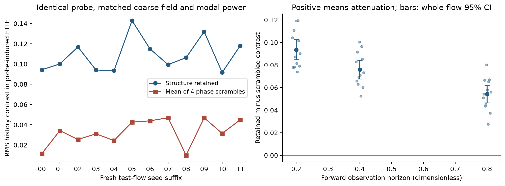
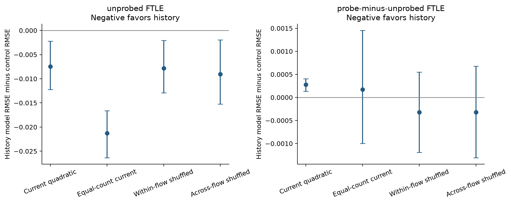
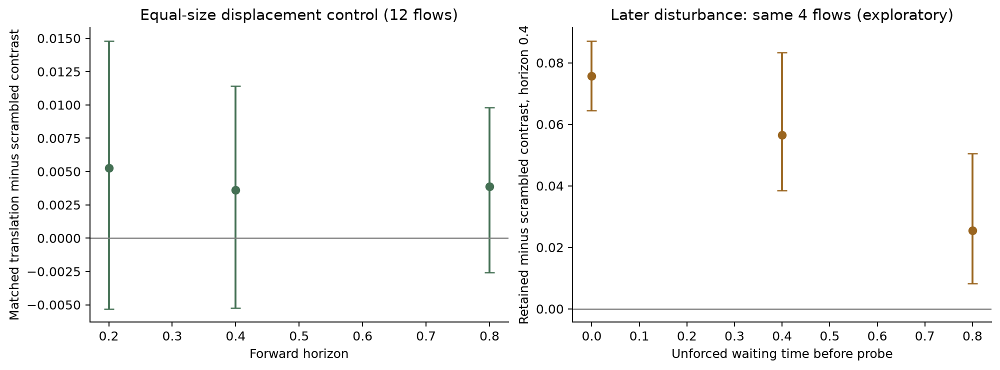
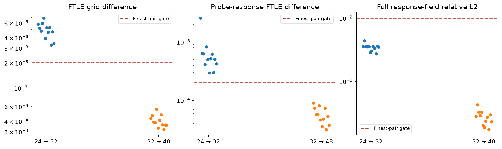
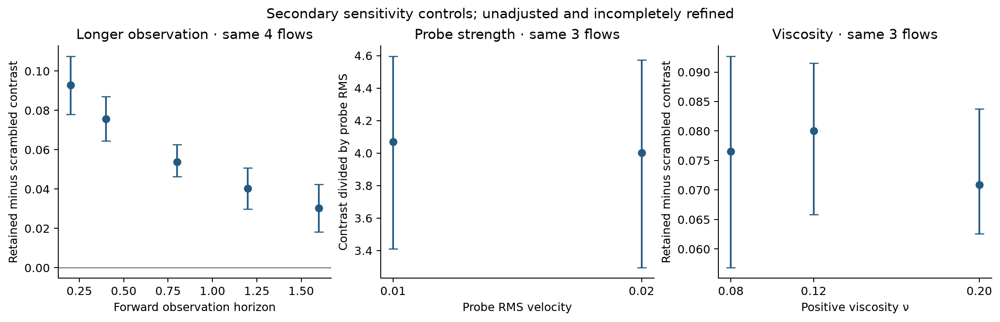
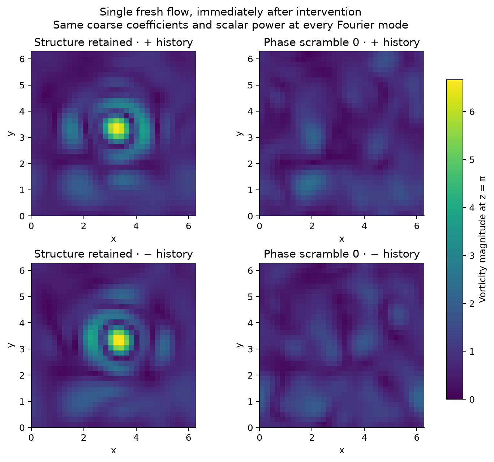

# Fluid memory: fresh flows, structure erasure and delayed probes

## Finding

Phase scrambling attenuated the mean history-conditioned probe-response contrast in this ensemble. The primary operational attenuation criterion is supported. Additional attenuation beyond a strength-matched structured displacement is not established. Primary retained-minus-scrambled contrast: 0.0759185 [0.067697, 0.0840288]. Relative attenuation: 69.86%; paired dz: 5.000.

## What was completed

135 simulation configurations including 6 numerical pilots; 40 fresh production flows, with 12 independent held-out flows for the primary result. Ninety-one base/refinement/sensitivity configurations, 26 matched-displacement configurations and 12 delayed-probe configurations. Full fields, marker trajectories, tangent matrices, numerical diagnostics and frozen held-out predictions are saved.

## History prediction

At horizon 0.4, history improves prediction of ordinary forward deformation by 7.36% over the present-observation model, with an interval favoring history and agreement on the finer grid. It does not improve prediction of the probe-induced change: its error is 0.77% higher. These are different questions; the positive erasure result cannot be substituted for a predictive-response benefit. native unprobed forward FTLE: history-versus-current RMSE difference -0.00746887 [-0.0122392, -0.00222219]; relative RMSE benefit 7.36%; equal-capacity difference -0.0212525 [-0.0263628, -0.0166242]. native probe-minus-unprobed forward FTLE: history-versus-current RMSE difference 0.00027528 [0.000131851, 0.000405998]; relative RMSE benefit -0.77%; equal-capacity difference 0.000169393 [-0.000996338, 0.00145244].

## Fluid and measurement

The fluid obeys ∂u/∂t + (u·∇)u = −∇p + ν∇²u + f, ∇·u = 0 in a periodic box [0,2π)³. Pressure projection, a rotational nonlinearity and strict 2/3 Fourier truncation enforce the discrete equations. Float64/complex128 synchronous RK4 advances the field, passive coordinates dx/dt = u(x,t), and tangent matrices dF/dt = ∇u(x,t)F. Velocity and gradients at markers are evaluated directly from the retained Fourier polynomial. FTLE = log σmax(F)/T is a local forward deformation rate, not a molecular bond or leader measure. All times and fields are dimensionless. ν = 0.12 and initial RMS velocity = 0.6; this is a smooth, modest-Reynolds-number regime, not a turbulence universality survey.

## Writing and matching histories

Forty fresh analytic random starting flows are split into 20 training, 8 validation and 12 held-out test seeds; two additional numerical pilot seeds are excluded from inference. Two preparations receive opposite divergence-free high-band forcing until t = 0.2, followed by unforced evolution to t = 0.4. Causal arms then share the complete low-mode field (|k|∞ ≤ 2) and exactly the same scalar power at every high Fourier mode. Each high mode can retain a different vector polarization and phase structure. The fixed probe is a divergence-free velocity impulse of RMS 0.02. Paired unprobed branches remove background evolution. Ten common observation centers and their finite neighbors are passive measurements; they do not exert force.

## Erasure and controls

Four seeded high-mode phase scrambles target spatial phase organization while preserving incompressibility, coarse coefficients, energy, enstrophy and every scalar modal power at erasure. A small translation is a sham. A second translation preserves the high-band pattern and matches the mean initial L2 displacement caused by scrambling; it also changes position relative to the probe and background, so it is an imperfect specificity control. A common complete-state replacement makes both preparation states identical; identical subsequent responses are expected deterministically and provide a control, not evidence for a new memory law. Delayed-probe runs wait 0.4 or 0.8 before applying the disturbance. Longer-response runs observe out to 1.6, a different question. The same velocity impulse need not do the same work: its energy increment is the velocity–impulse inner product plus half the impulse norm squared. A separate post-result work audit is saved in impulse-energy-audit.json. Phase-dependent work is a possible response pathway; the study does not isolate it. Equal-work disturbances and alternate writer/probe positions remain unrun.

## Inference

The primary outcome at forward horizon 0.4 is, per independent test flow, the RMS over common centers of the difference between the two preparations' probe-minus-unprobed FTLE responses, retained minus the mean of four scrambles. Positive values mean attenuation by scrambling. Means and 95% percentile intervals resample whole flow seeds 4,000 times; centers, preparations, grids and scramble replicates are not additional independent samples. There is one prespecified primary contrast and many unadjusted exploratory follow-ups. Twelve test seeds give limited precision and the bootstrap is not a guarantee of nominal small-sample coverage. Paired effect size dz uses the between-flow standard deviation of the signed contrast. Protocol files were written locally before scientific effects were examined; there was no external registration or blind third-party audit.

## Frozen prediction comparison

Current observations contain exact local velocity, the full local gradient, strain/rotation summaries, finite-neighbor geometry and instantaneous separation rates. Past features add distance and angle changes at lookbacks 0.1, 0.2 and 0.3 and cannot access future fields or tangent matrices. Quadratic ridge current features (560 inputs) are compared with the same features plus 48 history inputs. Controls add 48 current cubic features or shuffle histories within or across flows. Standardization uses training flows; regularization is selected only on validation flows. Thirty models were frozen before opening test observations. Frozen models are also evaluated on finer-grid test data. Every model observes an incomplete local present state; better prediction with past data would support useful partial-observation history, not fundamental non-Markovian Navier–Stokes dynamics.

## Numerical verification

An analytic divergence-free shear benchmark checks arbitrary-location velocities/gradients, tracer paths, tangent evolution, energy dissipation and fourth-order time convergence. CPU/GPU pilot comparisons agree near roundoff. The former interpolation issue is removed by direct spectral evaluation. Pilot numerical errors triggered a documented promotion from 24³ to 32³ before production effects were examined. All twelve test flows have 24³/32³/48³ controls, all have half-step 32³ controls, and two have half-step 48³ controls. Production numerical gates: {'divergence': True, 'gradient_trace': True, 'energy_budget': True, 'cfl': True, 'tail': True, 'volume': True, 'finest_ftle': True, 'finest_response': True, 'finest_response_fields': True, 'three_grid_decrease': True, 'single_executed_source': True, 'time_response': True}. Additional-control gates: {'divergence_rms': True, 'gradient_trace': True, 'energy_budget_relative': True, 'max_cfl': True, 'tail_enstrophy': True, 'tangent_volume_error': True, 'matched_grid': True, 'matched_half_step': True, 'delayed_grid': True, 'delayed_half_step': True}. Mean absolute change in the primary contrast from 32³ to 48³ is 2.73644e-05, compared with mean effect 0.0759185; the 10%-of-effect gate is True. Integrity/analytic/relabeling verification passes: True (15 unit tests). Gates at the primary horizon do not prove global continuum convergence or validate all extended durations. Numerical intervals are assessed separately from sampling intervals. The smaller-step controls keep the endpoint fixed. Separate longer-window runs extend forward observation to 1.6; their earlier trajectory/response prefixes agree exactly with the short runs for all four checked flows. Delayed probes test waiting before the disturbance separately.

## Limits and unanswered questions

Changing a present velocity field can change its future under ordinary Navier–Stokes. This experiment targets how deliberately written history is represented in the current field and modifies response under limited matching. It does not compare identical complete states with different physical histories. Phase scrambling leaves vector polarization relations within each Fourier mode, need not erase every carrier, is an external instantaneous intervention, and can create other structures. The experiment cannot uniquely identify a carrier or transfer Josephson hysteresis, heteroclinic memory, molecular isotope effects, learning, leadership, evolutionary changes in water or new Navier–Stokes physics. No isotope masses or actual molecules are simulated. Fresh flows come from one ensemble family and use one implementation, although CPU/GPU and analytic controls are included. Larger domains, forced turbulent regimes, other writer/probe locations and independent solvers remain untested. The four-flow waiting/long-duration and three-flow viscosity/probe-amplitude controls are exploratory; two-flow delayed resolution checks do not cover every waiting branch.

## Reproduce and inspect

Install requirements.txt with Python 3.12 (CPU) or add requirements-gpu.txt for a compatible CUDA GPU. To reanalyse the exact recordings, download the code/results ZIP and raw-recordings.json plus every numbered raw part from the GitHub release into a fresh folder, then run `python restore_recordings.py --parts DOWNLOAD_FOLDER --out STUDY_FOLDER`, `python analyze.py`, `python followup_analysis.py`, `python template_analysis.py`, `python impulse_energy.py`, `python verify.py`, and `python report.py` from the study folder. Default archived data use GPU filenames; reanalysis requires no GPU calculation. To rerun the entire design, run `python reproduce.py --destination NEW_EMPTY_PATH --backend cpu` (or gpu). The CPU rerun is implemented but the complete experiment was actually run on GPU; CPU/GPU equivalence was tested on two short pilots. No complete CPU rerun is claimed. The split tar.gz archive copies the original compressed NPZ containers byte for byte, preserving every NPY member and all float64/complex128 values. Checksums, original container hashes, execution sources, protocols and exact fitting-source snapshots are retained. After restoration, verify all source/data hashes before interpreting results. Published raw checkpoints permit every response and feature calculation to be repeated without rerunning the fluid.

## Quantitative controls

| Forward horizon | Retained − scrambled (95% CI) | Matched translation − scrambled (95% CI) |
|---|---|---|
| 0.2 | 0.0935733 [0.0847204, 0.102698] | 0.00524781 [-0.00530741, 0.0148031] |
| 0.4 | 0.0759185 [0.067697, 0.0840288] | 0.00361231 [-0.00525309, 0.0114337] |
| 0.8 | 0.0543546 [0.0464174, 0.0619277] | 0.00388016 [-0.00259232, 0.00981274] |

| Wait before probe | Primary contrast, same four flows (95% CI) |
|---|---|
| 0.0 | 0.0757854 [0.0644524, 0.0871184] |
| 0.4 | 0.0565417 [0.0385029, 0.0832806] |
| 0.8 | 0.0254392 [0.00825812, 0.0505374] |

[GitHub study](https://github.com/NousVolition/My-Sources-Project-ALL/tree/main/reports/fluid-memory-erasure) · [Raw recordings and release](https://github.com/NousVolition/My-Sources-Project-ALL/releases/tag/fluid-memory-erasure-2026-10-10)

Numerical verification context: [NASA grid convergence tutorial](https://www.grc.nasa.gov/www/wind/valid/tutorial/spatconv.html). Three-grid/time checks are performed here; Richardson extrapolation is not asserted for this nonlinear trajectory ensemble.
