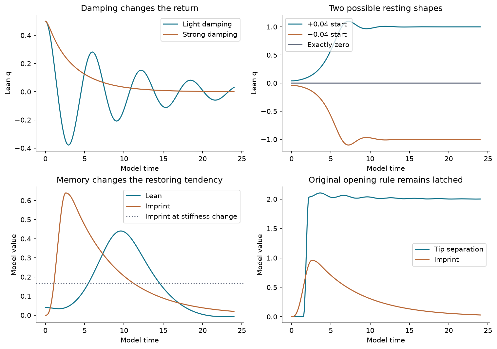

# The hug with pressure memory and dynamics

A tested extension of the existing hug geometry and pressure-memory prototype, using the supplied pages on damping, stability, pendulums, numerical methods and buckling.

**272/272 checks passed.** 81 parameter configurations were run at two time steps. The largest time-step discrepancy was 7.024397e-06; the eight displayed presets differed from an independent solver by at most 1.1329538e-06 in model units.



Download and open [report.html](report.html) to play the original hug, damped motion, buckling, memory feedback and pressure opening. GitHub's file viewer displays its source; the downloaded report works offline.

The unchanged original pressure model is a control. The extension adds a signed lean and velocity, cubic restoring force, damping and an optional memory-dependent stiffness. The original pressure limit still opens the arms irreversibly. The square guide shows the existing initial gate; it is not an active wall.

## What the supplied pages add

- Damping, oscillation, buckling and stability calculations now run in the reduced hug extension.
- Euler, Heun and RK4 are compared with exact and independent reference solutions.
- Pendulum phase and energy, vector-field winding, degenerate equilibria, nonuniqueness, logistic/autocatalytic, Gompertz and Allee examples have executable checks or analytic controls. The report maps all 14 images, including the duplicate.
- Every sweep keeps both time resolutions in `data/`, alongside reference trajectories, protocol, provenance and verification.

## Limits

This is a proposed reduced dynamics model, with chosen coefficients and no material calibration. It does not yet couple an evolving boundary to Navier–Stokes, simulate permeability, or predict measured water behavior. The mathematical consistency checks do not establish those physical claims. The original fluid calculations remain unchanged.

## Reproduce

```sh
python -m pip install -r requirements.txt
python run_study.py
python build_report.py
```

[Model](hug_model.py) · [Completed verification](data/verification.json) · [Fixed protocol](data/protocol.json) · [Original source hashes](data/sources.json) · [Full report](report.html)

The source baseline is My-Sources-Project-ALL commit `f5a2106f69bd1c4a0f8eb7a64f5291952c4c5e25`. Original pressure/geometry tests are executed without changing their assertions. The report cites the supplied pages and primary numerical documentation.
