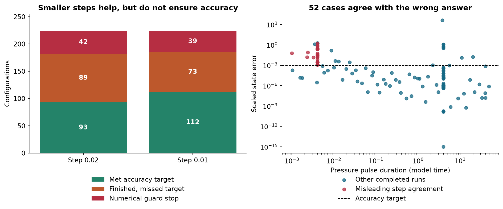

# The hug under stress

**Lorenz dynamics are now added:** [play the Lorenz-driven hug](lorenz-report.html). A new bounded pressure connection drives the existing imprint, lean and opening equations. Five playable modes, 84 additional configurations, independent solver checks and four positive finite-time Lyapunov estimates for the Lorenz drive are included. This is an explicit one-way modeling choice; it does not yet implement fluid permeability or an active square wall.

The earlier mild checks passed, but a harder 224-configuration study exposes limits in the original fixed-step solver and in what the reduced model represents.



| Original RK4 result | Step 0.02 | Step 0.01 |
|---|---:|---:|
| Met the accuracy target | 93 | 112 |
| Finished but missed the target | 89 | 73 |
| Stopped by the numerical guard | 42 | 39 |
| Total configurations | 224 | 224 |

The accuracy target is a maximum scaled state error of 0.001, against a pulse-resolving adaptive calculation. This is **not** relative percentage error near zero. Counts describe the selected stress cases, not real-world failure probabilities.

## What failed, and what it means

- **52 misleading convergence results:** the two step sizes agree within 0.0001 while the finer result misses the reference target. A pulse of duration 0.001 and peak pressure 100 is missed entirely at both original steps, giving zero imprint instead of a peak near 0.0624614. Explicit pulse subdivision reduces its checked error to 1.58e-7.
- **Strong damping causes numerical stiffness:** with damping 500, the original step sizes run away and stop at t=0.08. Independent adaptive methods instead give bounded relaxation from lean 2 to 1.63094 by t=24. The stopped calculation is not physical rupture or a singularity.
- **29 shapes go outside the square guide:** the largest sampled coordinate magnitude is 8.39098, versus the guide at 3. Even without lean feedback, pressure stretch reaches 6.97067. No confining wall force exists in the tested equations.
- **Opening remains an imposed threshold:** peak pressure 0.99999999 never opens the arms, whereas 1 does. Pressure remains prescribed after opening, so venting does not relieve it.
- **Long runs need tighter references:** 41 of 43 initial independent solver comparisons passed; both runs to t=1000 failed the stricter reference target. Tightening both adaptive methods by 100 times reduced their discrepancies to 2.56e-7 and 3.46e-7, below the unchanged 2e-6 target. The conservative run also agrees with an analytic elliptic-function solution. Original failures are retained.

Download and open [report.html](report.html) for six scientific figures, equations, numerical uncertainty, a finite-time bound for this reduced system, and the model's limitations. The report works offline. This package extends [the earlier hug study](../hug-dynamics/README.md); it does not replace its results.

## Completed design

144 full-factorial cases, 64 Latin-hypercube cases with seed 20261010, and 16 adversarial, threshold, starting-bias and long-run cases. This gives 448 original fixed-step attempts and 224 pulse-resolving DOP853 references. A selected 43 have independent Radau runs; four tighter adaptive runs and one analytic trajectory follow up the two long-run disagreements. Two pulse-subdivided RK4 runs and 11 targeted controls are also saved.

The matrix includes pressure up to 100, damping up to 500, short pulses, positive/negative stiffness and zero/strong memory feedback. The seeded design adds signed starting lean and velocity. Every value is in chosen model units. Full settings and selection rules are in [the protocol](data/protocol.json).

## Reproduce

```sh
python -m pip install -r requirements.txt
python run_stress.py
python refine_long_runs.py
python build_report.py
python run_lorenz.py
python align_lorenz_control.py
python validate_lorenz_sweep.py
python build_lorenz_report.py
python verify_package.py
```

Run the commands separately: `run_stress.py` intentionally exits with status 1 because the two initial long-run reference checks fail. Continue with the refinement command to reproduce the follow-up. The original result files are never relabeled as passes. The screen reuses saved case files; independent checks and controls rerun. To recompute the entire screen, use a copy of the package and remove its `data/` directory first. Output bytes and timing can vary by environment; archive checksums verify the delivered files, not future regenerations.

`stress_solver.resolved(..., method='Radau')` provides the pulse-resolving, stiffness-aware driver without changing the equations. `fixed(..., resolve_pulse=True)` demonstrates subdivision of the known forcing interval. The old browser demonstration is not silently changed by this study.

## Data and provenance

- [Screen summary](data/summary.json), [all case records](data/screen.json), [initial independent comparisons](data/independent-solvers.json), [long-run refinement](data/long-refinement.json), and [controls](data/controls.json).
- Every case has JSON parameters/diagnostics and compressed NPZ time/state arrays. State columns are lean, lean velocity, memory, accumulated work and accumulated dissipation. Guard-stopped trials retain their accepted finite states and the reason for stopping.
- `baseline/` contains the unchanged equations and original geometry/pressure source, pinned to commit `991704f2c4d708d2ab3fd29532ce176426ef78c9`. Source SHA256 values are in the protocol.
- [Editorial amendment](data/editorial-amendment.json) records a comment-only correction from “288” to “144” factorial settings. The original protocol remains available; executable statements and numerical results did not change.
- [Checksums](checksums.json) cover the delivered package, excluding interpreter caches and the manifest itself.

## Interpretation and limits

This tests a proposed reduced ordinary-differential-equation model, with no measured material coefficients. It supports a mathematical representation of lean, damping, prescribed opening and fading imprint. It does not yet supply fluid permeability, evolving pressure from containment, a responding square boundary, contact, fracture, temperature dependence, or quantum physics. The independent solvers estimate numerical error, not experimental uncertainty. Peaks and first exits are sampled in time.

The supplied Lorenz screenshot prompted the separate added drive in `lorenz_hug.py`. Numerical runaway at an unsuitable time step does not establish chaos. Neither do the two opposite resting states produced by tiny signed hug disturbances. The Lorenz control parameter and its bifurcation thresholds do not transfer to the hug's stiffness parameter. Four finite-time Lyapunov estimates for the added Lorenz drive range from 0.8993 to 0.9090 per model time, across two starts and two solver settings. That evidence is specific to the drive, not an independent chaotic-attractor claim for the hug. [Lorenz's original paper](https://journals.ametsoc.org/view/journals/atsc/20/2/1520-0469_1963_020_0130_dnf_2_0_co_2.xml).

The 84 added Lorenz-driven cases span seven control-parameter values, three damping values, two memory-coupling settings and two pressure amplitudes. `lorenz-data/` preserves every trajectory and its pressure, plus five playback presets to time 40, independent short-horizon comparisons, an opening-crossing check, energy diagnostics and sensitivity histories. The pressure mapping and all choices are in its protocol. Long chaotic trajectories are not certified pointwise accurate by the short-horizon comparisons.

The displayed coupling-off control uses the **identical saved pressure and memory history** as the active-coupling case. Because Lorenz and memory do not depend on lean, the lean equation can be solved independently when coupling is zero. This avoids confusing long-time numerical phase drift of two separate chaotic integrations with a change in forcing. The independently integrated original control is retained, and the matching step is recorded in `lorenz-data/matched-control.json`.

For bounded nonnegative pressure and nonnegative damping/coupling, the model has an analytic finite-time bound: with `V = v²/2 + q⁴/4 + q²/2`, `V' <= (|r+1| + coupling*P) V`. This prevents finite-time blow-up of this reduced system. It does not settle any three-dimensional Navier–Stokes regularity question or establish the behavior of a physical breathable shield.

Numerical methods: [SciPy solve_ivp](https://docs.scipy.org/doc/scipy/reference/generated/scipy.integrate.solve_ivp.html). Analytic conservative control: [NIST Jacobi elliptic differential equations](https://dlmf.nist.gov/22.13).
