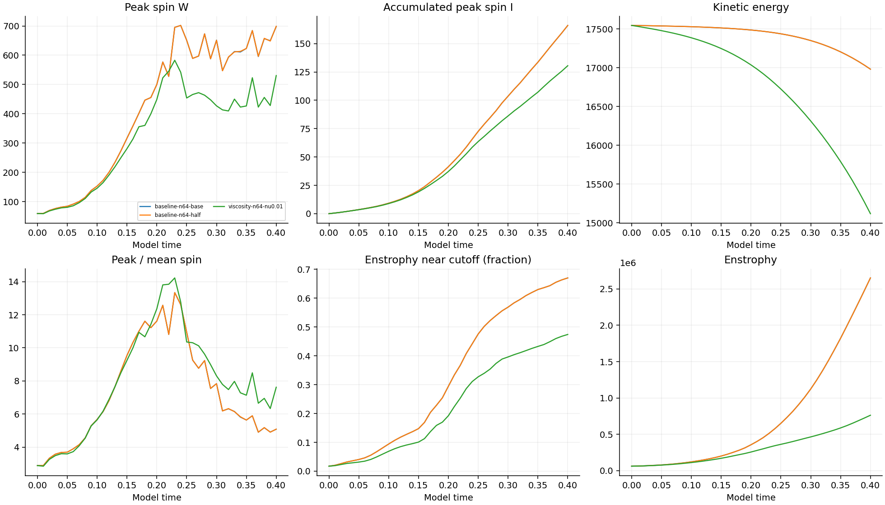
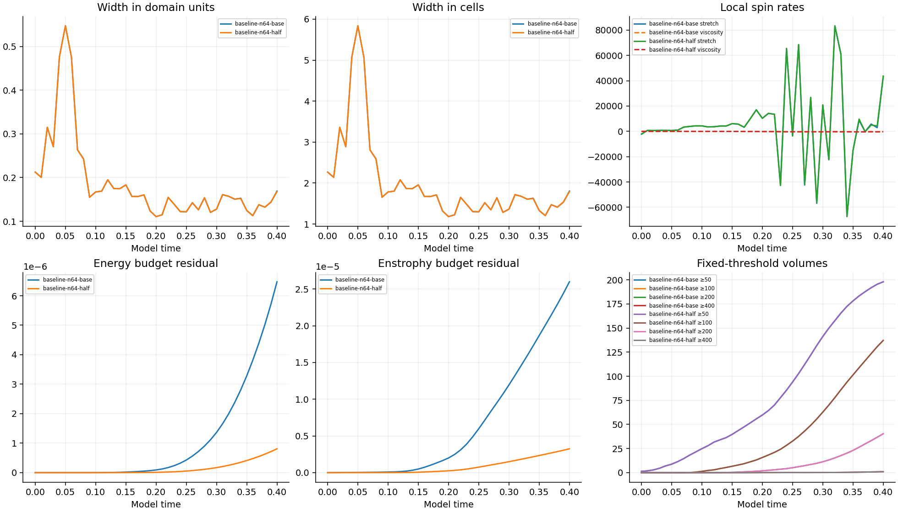
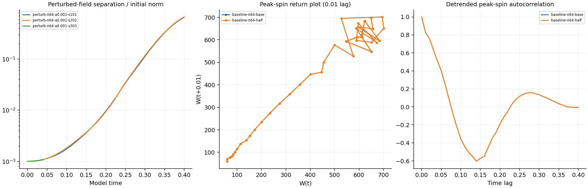

# Matched-stretch numerical controls

**Menger–Koch–Romeo–Juliet comparison:** [Completed marker relationships and motion tests](relationship-fractal-study/README.md). 360 case trajectories; exploratory interaction law with explicit limits, not a demonstrated improvement to Navier–Stokes.

**Completed +5 degree strain-axis tilt:** [Both tilt signs and boundary-join comparison through 0.40](completed-tilt-plus/README.md). All 41 new saved fields verified; peaks remain unresolved.

**Completed -5 degree strain-axis tilt:** [Initial-field, trajectory and boundary-join comparison through 0.40](completed-tilt-minus/README.md). All 41 saved fields verified; peaks remain unresolved.

**Completed 128-grid baseline and higher strain:** [64/128 grid curves and strain x1.1 through 0.40](completed-grid128-strain/README.md). All 82 saved fields verified; peak spatial-resolution checks still fail.

**Two more completed parameter runs:** [Tube spin x1.1 and background strain x0.9 through 0.40](completed-spin-strain/README.md). All 82 saved fields verified; peak spatial-resolution checks still fail.

**Completed marker analyses:** [Individual paths and numerical controls](marker-stress/README.md), [changing fastest-separation labels](marker-stress/separation-roles.md), and [carpet, random-interval and Menger marker tests](marker-stress/fractal/README.md). Passive tracking reuses saved fields; the underlying fluid matrices remain in progress.

**Completed parameter batch:** [Viscosity, radius and tube-spin comparisons through 0.40](completed-parameters/README.md). Five additional runs and 205 saved fields verified. Peak spatial resolution still fails.

**Tracked relationships:** [192 fluid labels, pair motion, local linearization and Runge–Kutta paths](central-response/tracked-patterns/README.md). Completed analysis of saved fields with grid and timestep comparisons.

**New central-tube analysis:** [Follow the moving points, stretching and whole-box peak](central-response/README.md). Four charts from 112 verified saved fields. The rising maximum changes which point it describes; late results still depend on the grid. Original matched-stretch and separate periodic surroundings runs are shown separately.

**Completed join test:** [Remove the central tube and compare the early peak](join-isolation/README.md). Four short unforced controls through time 0.04, including timestep halving; the early peak persists without the tube.

**Completed unforced check:** [Growth rates, the 16% statement, and linear versus squared models](unforced-growth-check/README.md). One saved start and its existing timestep control through 0.35; all 72 fields verified. Spatial resolution remains insufficient.

**Completed batches:** [0.1% perturbations](completed-seeds/README.md), [0.5% perturbations](completed-halfpercent/README.md), and [1% perturbations plus viscosity 0.002](completed-onepercent/README.md). These later batches supersede their entries in the dated snapshot below.

**New diagnostic:** [Adaptive peak-spin check and charts](adaptive-peak/README.md). The original start fails the six-cell width requirement on grids 64, 80, 112, 128 and 256. This completed audit reuses saved observations; the older matrix snapshot below is dated separately.

Snapshot: 2026-10-08T23:28:22.747514+00:00. **5 of 48 runs complete.** Further runs are active or queued.

The available 64³ runs amplify spin but fail the spatial-resolution screen. Small time-step differences alone do not resolve this issue. The 128³ and 256³ evolution comparisons are pending.

The supplied starting formula is retained: periodic cube side 6, Heun stepping, baseline viscosity 0.001, original mean velocity, and zero external force. Other viscosities are explicit in each run. Its raw strain has unequal curl at opposite box faces, and its initial maximum spin lies outside the central tube. A common smooth periodic limiting start is not established by these runs.

## Saved outcomes

| Run | Status | Time | Peak W at saved times | I at endpoint | Largest cutoff enstrophy % |
| --- | --- | --- | --- | --- | --- |
| baseline-n128-base | running | 0.00 | 59.04298 | 0.00000 | 0.773 |
| baseline-n64-base | complete | 0.40 | 701.78986 | 165.97088 | 67.036 |
| baseline-n64-half | complete | 0.40 | 701.77054 | 166.00092 | 67.035 |
| perturb-n64-a0.001-s101 | complete | 0.40 | 766.57401 | 167.39999 | 66.938 |
| perturb-n64-a0.001-s202 | complete | 0.40 | 768.18715 | 164.80941 | 66.793 |
| perturb-n64-a0.001-s303 | running | 0.04 | 81.44513 | 2.78197 | 3.622 |
| viscosity-n64-nu0.01 | complete | 0.40 | 582.85511 | 130.46923 | 47.426 |

## Time-step comparison

| Comparison | Through | W curve L2 difference % | I curve L2 difference % |
| --- | --- | --- | --- |
| timestep-64 | 0.40 | 0.10865 | 0.01478 |

Errors compare identical saved times; the reference is the half-step run. Full definitions and other observables are in [analysis.json](analysis.json).

## Measurements

W is maximum grid-point vorticity magnitude. I integrates W at every accepted step. Energy is ½∫|u|²; enstrophy is ½∫|curl u|². The spin ratio uses mean vorticity magnitude. Width is the shortest measured transverse half-peak chord; both domain units and cell counts are recorded. Fixed thresholds are 50, 100, 200 and 400. All units are model units.

Finite-amplitude perturbation rates and recurrence diagnostics are in the analysis file. They describe the recorded window and do not establish an asymptotic Lyapunov exponent or recurrent attractor.

[Protocol](protocol.json) · [Initial audit](initial-audit.json) · [Implementation checks](implementation-check.json) · [Snapshot verification](../numerical-progress-verification.json) · [Run measurements](runs/)

Source is preserved in numerics.py and run_suite.py. To reproduce the matrix, copy those files, protocol.json, requirements.txt and reproduce.py into a fresh directory, install the requirements, and run `python reproduce.py`. Generated arrays and restart files remain local; the published JSON files are measurement records, not restart checkpoints.
