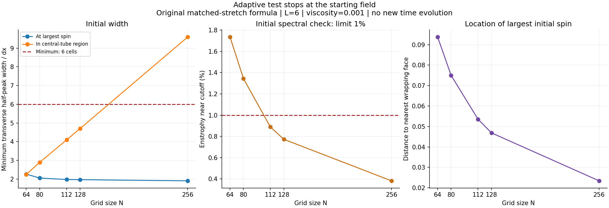
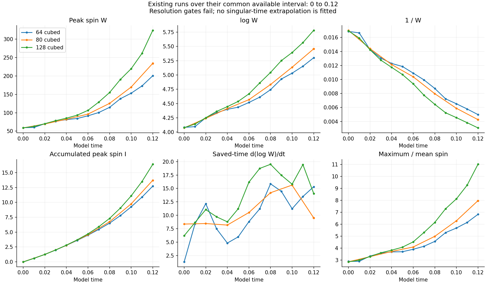
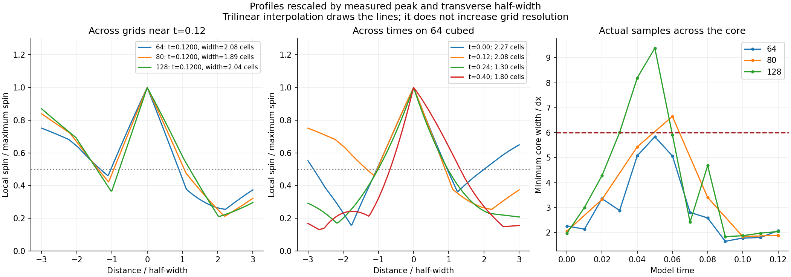
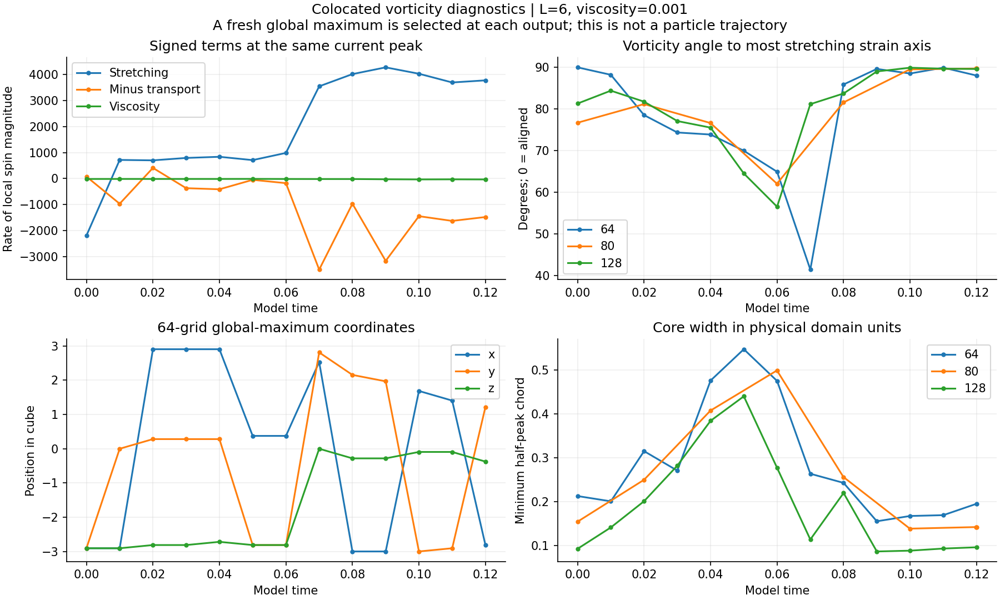
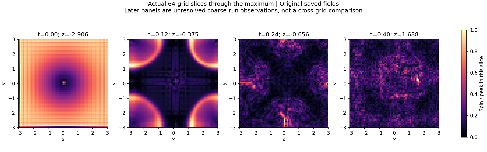

# Adaptive peak-spin test: original start

**The original start fails the requested resolution gate before time evolution.** The strongest-spin region is about two cells wide on every checked grid, including 256 cubed. The central-tube region gets better resolved, but it is not where the largest initial spin occurs.

| Grid | Width at largest spin, in cells | Width in central-tube region, in cells | Enstrophy near cutoff | Adaptive decision |
| --- | --- | --- | --- | --- |
| 64 cubed | 2.267 | 2.251 | 1.736% | Stop |
| 80 cubed | 2.055 | 2.894 | 1.344% | Stop |
| 112 cubed | 1.978 | 4.095 | 0.889% | Stop |
| 128 cubed | 1.969 | 4.700 | 0.773% | Stop |
| 256 cubed | 1.907 | 9.596 | 0.382% | Stop |

The minimum width is a transverse half-peak chord, measured in 12 directions perpendicular to local vorticity. It is not the cube root of the total hot-region volume. The required minimum is 6 cells, with 8 preferred. The enstrophy-band limit is 1%; either failure stops extension. [Fixed protocol](protocol.json).

## What was tested

We retained the original formula, pressure projection, filter, mean, viscosity and unforced equation. Existing 64/128/256 initial audits were reused, 80 was remeasured from its saved initial field, and a new 112 initialization was generated. No new time evolution was started in this adaptive test.

The raw background strain has different curl traces at opposite wrapping faces. Fourier filtering makes each individual grid field smooth, but has not established one smooth periodic limiting start. The largest initial peaks lie near those faces. Their physical width decreases with grid spacing while staying near two cells. This is evidence of a grid-scale feature in the supplied construction.

The user chose to keep this original start for diagnosis. No smooth replacement or energy renormalization was introduced. Initial energies and means differ across grids and are recorded in [results.json](results.json).

## Peak growth on the common available interval

The saved 64, 80 and 128 curves overlap through time 0.12. The 112 check has only time zero because its initial gate fails. Thus the complete requested ladder has no accepted evolution interval. The three existing curves are shown as **unresolved observations**, not as a resolved comparison.

| Existing grids | Relative W-curve L2 difference | 5% curve screen |
| --- | --- | --- |
| 64-80 | 10.496% | Fail |
| 80-128 | 21.312% | Fail |
| 64-128 | 29.605% | Fail |

The available 64-grid half-step study already changes W by only 0.10865% through 0.4. Temporal agreement does not repair the spatial width and spectral failures. `log W`, `1/W`, `I` and the saved-time growth rate are plotted without fitting a singular time to unresolved data.

## Core profiles and location

Rescaling can make even a feature spanning only two cells look similar across grids. Such a collapse cannot override the width failure. The lines use periodic trilinear interpolation; no finer samples were measured between the original grid points.

The three vorticity terms are recorded at the same selected maximum. Transport is shown with its minus sign on the right-hand side. The angle uses the most stretching eigenvector of the local symmetric velocity gradient; an almost degenerate eigenvalue pair makes the angle undefined. The full discrete RHS is compared with the sum of these filtered terms.

The maximum is selected afresh at every output. It can switch locations, especially when several cells nearly tie. This is not a continuously tracked fluid parcel. The records include the number of near-tied maxima and exact peak coordinates.

## Coverage and remaining tests

- 65 saved fields remeasured for W, I, maximum/mean ratio, energy, enstrophy, peak position, physical width, fixed and half-peak volumes, spectra, divergence, local terms and alignment.
- 7 local maxima detected at the saved output cadence. Peaks between saved times cannot be recovered; the report does not claim every within-step event was measured.
- Fixed and relative threshold volumes, shell totals and shell averages are saved together in [results.json](results.json).
- The original fixed 48-run matrix already covers three viscosities requested here, half timesteps, random divergence-free perturbations, amplitude and angle changes. Its status remains in the matched-stretch report. Its longer unresolved records are not an adaptive pass.
- The proposed longer normalized parameter matrix and geometric perturbation ensemble have not been run by this audit. They are held at the failed starting-resolution gate. Normalizing the old field would change it and was not done.

**Decision: unresolved concentration. Do not extend this original peak under the requested adaptive rule.** This diagnoses the numerical start and the sampled evolution; it does not establish a fluid singularity.

## Reproduce and inspect

The copied `source/numerics.py` has the same SHA-256 as the running study; it is not edited. `audit.py` reads immutable checkpoints and adds diagnostics. `report.py` generates these charts. `field-manifest.json` records hashes of the fields read. Full arrays stay in the local calculation workspace.

Run `python audit.py --study-root PATH_TO_MATCHED_STRETCH --legacy-root PATH_TO_FIXED_CUTOFF --max-128-time 0.15`, then `python report.py`. Python dependencies: NumPy, SciPy and Matplotlib. The main saved-time cadence is 0.01; the 80-grid replay uses its recorded exact times approximately 0.02 apart. Actual dt values and all selected times are stored per run.

This publication is a completed audit of saved observations. The fixed 128-grid simulation itself is still running toward 0.4; this audit freezes its available data through 0.15. The 64-grid record ends at 0.4 and the completed 80-grid replay ends at 0.12. Only 0 through 0.12 is used for their cross-grid curves.

## Separate follow-up

At the user’s request, a separate [periodic starting-field candidate](../periodic-start-check/README.md) was tested at initialization. The original results above remain unchanged. The candidate’s geometry and starting energy differences are reported explicitly.
