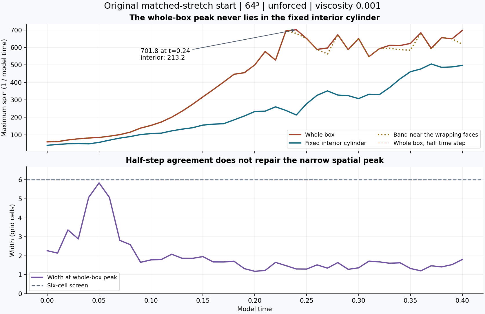
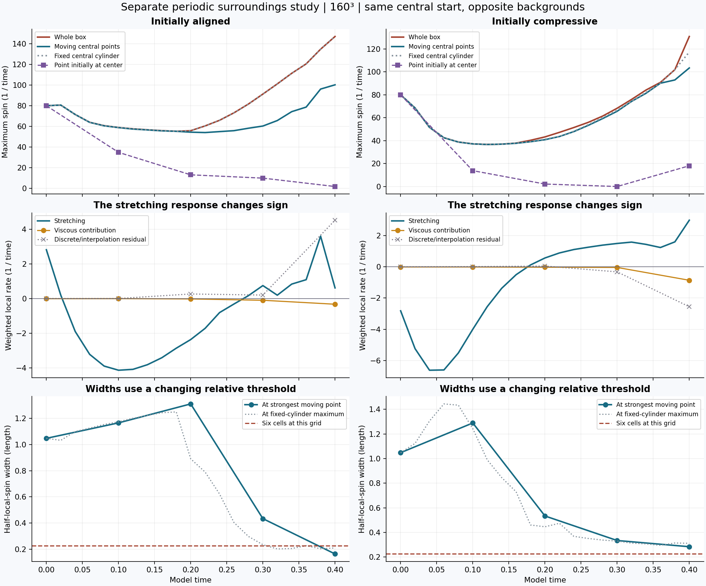
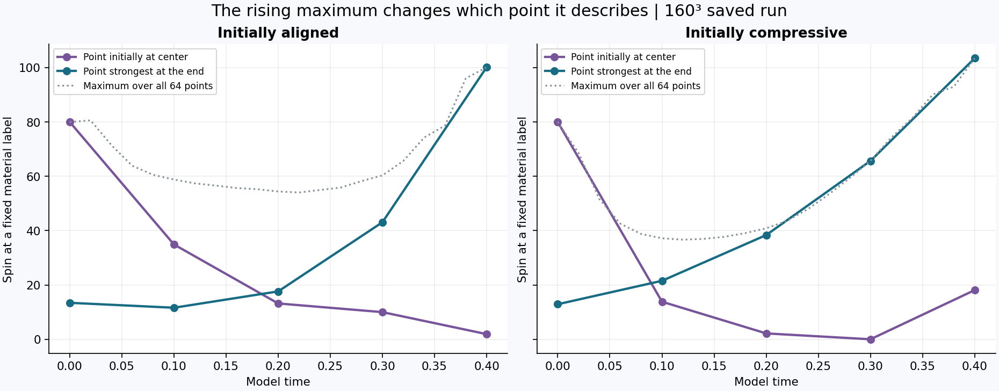
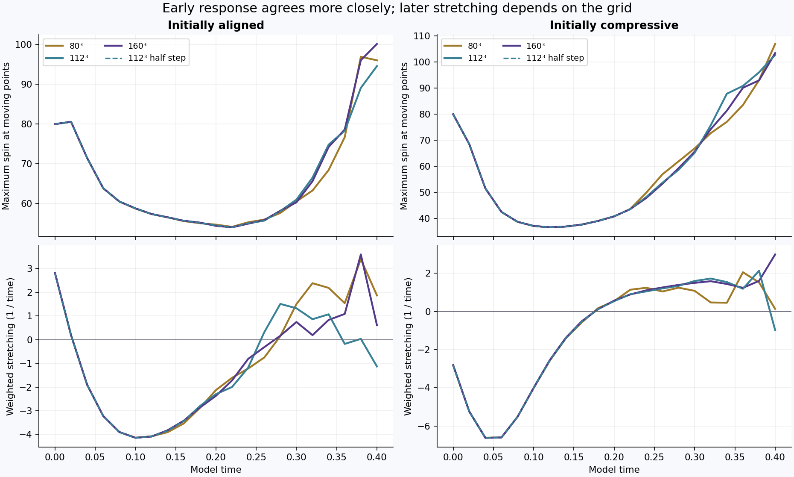

# What happens to the central tube?

**Tracked relationships:** [192 fluid labels, pair motion, local linearization and Runge–Kutta paths](tracked-patterns/README.md). Completed analysis of saved fields with grid and timestep comparisons.

**The initial surroundings do not keep their initial stretching sign. Both tested configurations first lose spin along the moving central points, then regain it. The later response is sensitive to spatial resolution.**

This is an analysis of saved unforced runs. It adds no force, boundary rule, new initial field or time evolution. The original matched-stretch start and the separate periodic surroundings study are shown separately. New analysis is authorized for publication; no private source documents or their extracted contents are included.

[Explore the saved velocity directions](motion.html). The motion view contains 19 saved fields and 125 velocity arrows per field. Arrow locations are fixed samples; arrows are not particle tracks. Dots in the surroundings cases are saved material labels, not individual molecules. No impact or molecular collision was simulated. Data and JavaScript syntax checks passed; automated browser inspection was blocked by the app's local-file URL policy.

## 1. Original matched-stretch start

At all **41 saved times**, the sampled whole-box maximum lies outside the fixed interior cylinder. At the largest saved peak, time **0.24**, whole-box spin is **701.79**, while the interior maximum is **213.18**. The global maximum is in the defined band near the wrapping faces at **34 of 41** times. The largest peak itself is outside that band, at `(0, -2.53125, -0.65625)`; therefore the band count does not establish its cause.

The interior cylinder is `x²+y² <= 0.4², |z| <= 2.5`. The wrapping-face band is `max(|x|,|y|,|z|) >= 2.625` in a side-6 box. These are fixed spatial regions. They do not follow material or establish the identity of the original tube after motion.

The base and half-step whole-box curves differ by at most **0.292% of the reference curve's maximum**. Spatial widths remain below six cells. These findings locate the measured peak; they do not establish resolved concentration or attribute every later peak to the join. The [earlier tube-removal control](../join-isolation/README.md) covers only time 0 to 0.04.

## 2. Separate surroundings comparison

These runs use a different, smooth periodic starting construction, the same central tube in each case, viscosity 0.001 and zero external force. Initially aligned and initially compressive backgrounds differ by sign. The curves use the completed 160³ Fourier runs through time 0.40.

| Initial surroundings | Time | Maximum at moving central points | Whole-box maximum | Weighted stretching |
| --- | ---: | ---: | ---: | ---: |
| aligned | 0.00 | 80.00 | 80.00 | 2.818 |
| aligned | 0.10 | 58.82 | 58.91 | -4.140 |
| aligned | 0.20 | 54.41 | 55.83 | -2.368 |
| aligned | 0.30 | 60.33 | 91.22 | 0.748 |
| aligned | 0.40 | 100.16 | 146.87 | 0.613 |
| compressive | 0.00 | 80.00 | 80.00 | -2.818 |
| compressive | 0.10 | 37.19 | 37.22 | -3.998 |
| compressive | 0.20 | 40.87 | 43.29 | 0.567 |
| compressive | 0.30 | 65.67 | 68.30 | 1.495 |
| compressive | 0.40 | 103.45 | 130.91 | 2.985 |

The two labels describe initialization, not an enforced behavior. In the aligned case, weighted stretching is positive at the start, negative by 0.10, and positive again by 0.30. In the compressive case it is negative at the start and positive by 0.20. Both sets of central points lose spin early and later regain it. The aligned run has a small initial increase before its decline. The snapshots do not establish a recurring cycle or a permanent restoring response.

### Does the same point strengthen?

In the aligned 160³ run, the point initially at the center falls from **80 to 1.90** by time 0.40. The strongest tracked point at the end is a different point: it started at `(0, 0, -2.71875)` with spin **13.43** and ends at **100.16**. In the compressive run, the initially central point ends at **18.11**, while a point starting at `(0, 0, -3)` rises from **12.91 to 103.45**.

The 64 labels span the full initial periodic axis, including its initially weaker portions. The displayed maximum therefore changes which material point it describes. This is a recorded identity change, not evidence that one original high-spin center continuously sharpened. The late numbers are specific to this grid and do not survive all refinement checks.

The width around the strongest sampled moving point initially broadens and later narrows. This width uses half that point's current spin as its threshold; the selected point can change. It is not a tracked material boundary or a fixed-threshold volume.

### Stretching and viscosity

The rates are evaluated at the same 64 moving points. For each point, stretching is `omega · ((omega · grad)u) / |omega|²`, and the viscous contribution is `omega · (nu Laplacian omega) / |omega|²`. Their displayed averages use weights proportional to `|omega|²`. A negative stretching rate means the local velocity gradient reduces the vorticity magnitude there. Viscosity is not assumed to have a negative contribution at every point.

Saved fields permit these additional term measurements every 0.10; existing spin and strain records are spaced by 0.02. The gray residual reports the difference between the sampled discrete fluid RHS plus material advection and stretching plus viscosity. It includes finite spectral truncation and interpolation effects. It becomes material later and must not be interpreted as an extra physical force. Weighted averages of rates are not derivatives of the maximum-spin curve.

## 3. What survives refinement?

Each number below is the largest absolute curve difference divided by the maximum absolute value of the reference curve over that interval. For sign-changing stretching this is a curve-scale error, not a pointwise relative error. Grid compares 112³ with 160³; time step compares 112³ base with half step; method compares FD4 with Fourier at 160³.

| Initial surroundings | Comparison | Through time | Whole-box spin | Moving-point spin | Weighted stretching |
| --- | --- | ---: | ---: | ---: | ---: |
| aligned | grid | 0.10 | 0.025% | 0.020% | 0.078% |
| aligned | grid | 0.40 | 6.023% | 6.947% | 86.114% |
| aligned | time step | 0.10 | 0.000% | 0.000% | 0.001% |
| aligned | time step | 0.40 | 0.002% | 0.000% | 0.002% |
| aligned | method | 0.10 | 0.000% | 0.001% | 0.005% |
| aligned | method | 0.40 | 5.604% | 6.105% | 33.091% |
| compressive | grid | 0.10 | 0.019% | 0.008% | 0.100% |
| compressive | grid | 0.40 | 12.546% | 6.277% | 59.838% |
| compressive | time step | 0.10 | 0.000% | 0.000% | 0.000% |
| compressive | time step | 0.40 | 0.001% | 0.000% | 0.001% |
| compressive | method | 0.10 | 0.000% | 0.000% | 0.004% |
| compressive | method | 0.40 | 9.624% | 2.987% | 7.920% |

Early agreement is closer than late agreement. The late increase and its stretching balance cannot yet be called spatially converged. Half-step agreement alone is insufficient. The finite-difference comparison shares the pressure backend, filter and time integrator with the Fourier implementation.

## What this establishes

- The original whole-box maximum is a different measurement from spin in a fixed interior region.
- In the separate surroundings study, local stretching changes sign during unforced evolution. An initially compressive background does not guarantee continued suppression.
- The observed early broadening and later narrowing provide a response to follow, but these records do not establish repeated breathing, persistent containment or smoothness for all time.
- The departing-surroundings case was still queued at the analysis snapshot; no result is inferred for it.

## Definitions and verification

Spin means the magnitude of vorticity, `|curl u|`, in inverse model-time units. Length and time are model units, not an SI calibration. Moving points were tracked passively during the original simulations. Viscosity can separate vorticity peaks from these points; the centreline samples do not cover the whole core. The fixed cylinder used by the surroundings study has radius 1 and includes the full periodic z direction, unlike the interior cylinder used above.

This analysis checked **112 saved fields**: 82 original fields and 30 surroundings fields. Stored peaks and energy were independently reproduced for the original fields. Surroundings fields reproduced stored global spin, moving-point spin and weighted stretching. Field and result hashes, source hashes, per-point rates, locations and measurements are included in [measurements.json](measurements.json). All values passed finite and consistency checks. These checks verify this analysis, not continuum spatial resolution.

Files: [summary](summary.json), [analysis code](analyze.py), [chart and report code](report.py), [source measurements](measurements.json).

To rebuild charts from the published measurements, install NumPy and Matplotlib, then run `python report.py` in this folder. To recompute from the raw fields, `analyze.py` requires the original workspace layout, saved simulation fields, NumPy and SciPy. It reads solver definitions but never calls a time-stepping routine. Raw binary fields are retained locally.
