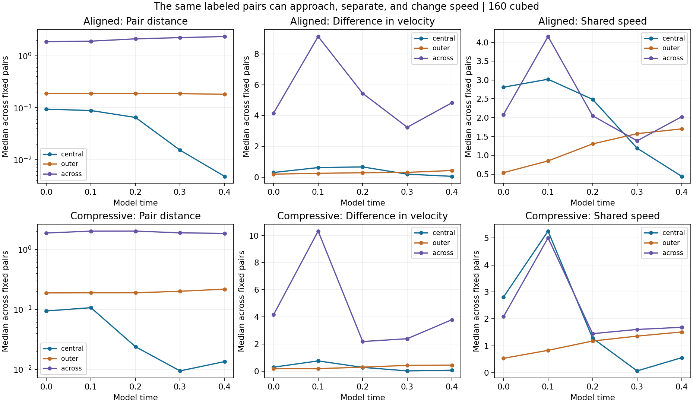
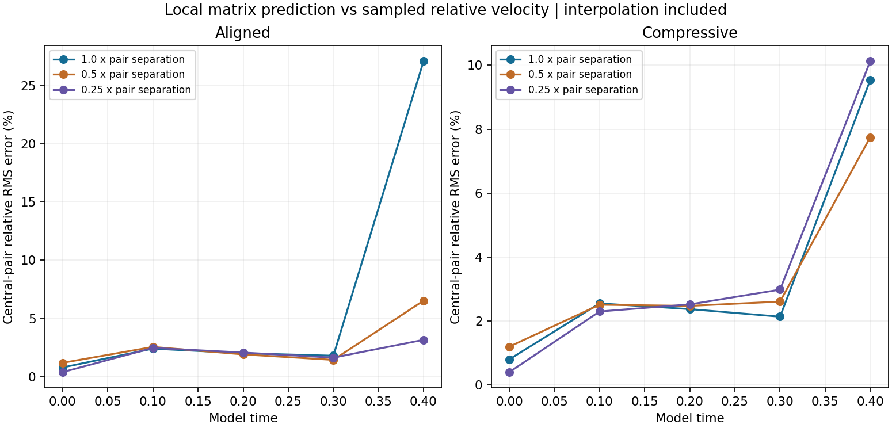
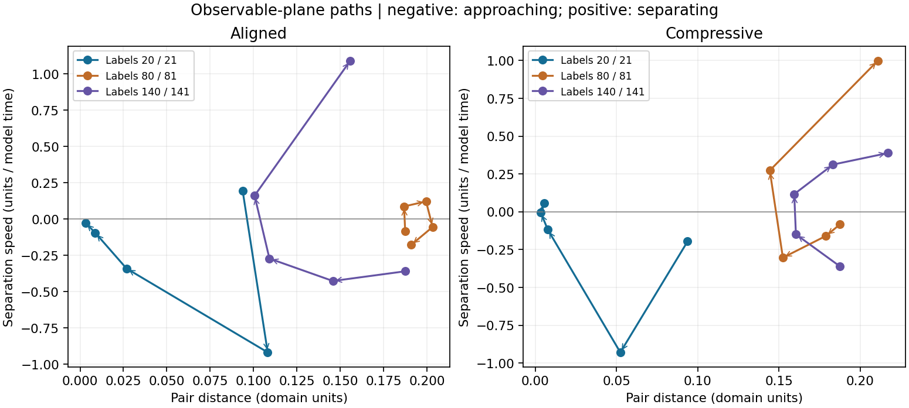
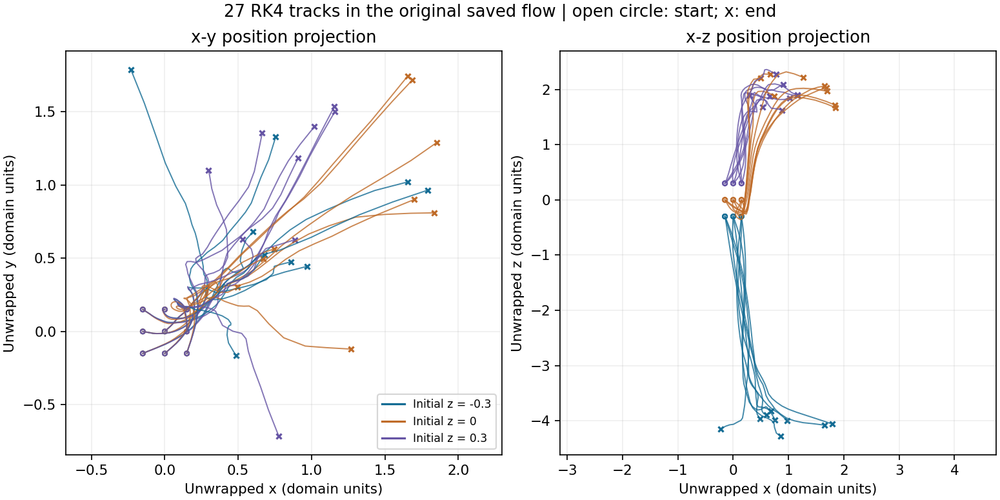

# Relationships tracked in the fluid

**Neighbors can move in the same direction while their spacing and speeds change. The central labels are already directionally aligned at the start; this is not newly acquired alignment. Later detailed paths remain sensitive to numerical resolution.**

[Explore labeled pairs](index.html) · [Back to central-tube results](../README.md)

## What is tracked

The separate periodic surroundings runs already saved 192 moving labels: 64 along the central axis and 32 along each of four surrounding axes. This analysis follows 377 fixed pairs: 64 central-axis neighbors, 128 outer-axis neighbors, and 185 links between axes. Along each initial axis, consecutive labels are linked with periodic closure. Each label also links to its closest label on another axis at time zero; ties use the lowest label index. Duplicate links are removed. The links remain fixed as the fluid evolves. Across-axis links are relationships between sampled points, not claims that they are molecular neighbors.

The labels move according to the existing fluid velocity. No pair force, emotional response law or change to Navier–Stokes is introduced. The textbook word “personality” can describe a measured response pattern; the measurements here use distance, direction and speed. A label represents a fluid parcel, not a resolved molecule.

## The relationship equations

For particle labels `i,j`, `dX_i/dt = u(X_i,t)` and `d(X_j-X_i)/dt = u(X_j,t)-u(X_i,t)`. Thus relative motion is already determined by the fluid. The distance uses the shortest periodic displacement `r`, and `delta_u = u_j-u_i`. Away from changes of shortest periodic image:

- Separation speed: `r dot delta_u / |r|`. Negative means approaching; positive means separating.
- Direction agreement: `u_i dot u_j / (|u_i||u_j|)`. +1 is parallel, -1 is opposite. It is undefined when either speed is near zero.
- Difference in velocity: `|u_j-u_i|`.
- Shared speed: `|(u_i+u_j)/2|`.
- Turning rate of the pair separation: `|delta_u - r_hat*(r_hat dot delta_u)| / |r|`.

Direction agreement and shared speed depend on the chosen reference frame. Pair distance and relative velocity are invariant under adding uniform translation. Smooth rigid rotation can produce opposite particle velocities while maintaining separation; the checks include this case. All quantities are in the existing model units.

## Measured patterns

| Initial surroundings | Initial central spacing | Final central spacing | Final outer spacing | Final across-axis spacing |
| --- | ---: | ---: | ---: | ---: |
| aligned | 0.09375 | 0.00476 | 0.18145 | 2.35503 |
| compressive | 0.09375 | 0.01342 | 0.21658 | 1.84737 |

Values are medians over the same fixed pairs, not widths of a vortex core or density measurements. Incompressibility permits contraction along one direction with expansion in others. The medians of the central direction cosines are +1 at all saved times; four pairs touching stationary labels have undefined direction comparison. That symmetry was present at initialization. Outer neighbors also show high direction agreement, but both relative and shared speeds change. Medians can hide differently behaving pairs, which the interactive view exposes.

The full velocity field changes from its initial state by 88.7% (aligned), 81.9% (compressive) in relative spatial L2 norm at time 0.40. These are evolving flows, not a demonstrated steady pattern.

## Does the local linear model work?

For nearby points, `delta_u` is approximated by `G*r`, where `G` is the velocity-gradient matrix at the pair midpoint. Here G is the exact derivative inside a cell of the trilinear interpolation used to read saved velocity; it changes at cell faces. We compare that prediction with the interpolated velocity difference, then repeat using half and quarter separations about the same midpoint. These shorter probes are diagnostic positions, not newly evolved particles.

The initial central-pair relative RMS discrepancy is about 0.8%. At time 0.40, the aligned case has 27.1% discrepancy at the full separation and 3.2% at quarter separation; the compressive case changes from 9.5% to 10.1%. Smaller neighborhoods do not give a consistent monotone improvement in this test. The discrepancy includes the piecewise interpolation and variation of the velocity field. It is not a measurement of the Navier–Stokes nonlinear term alone.

No fixed point or autonomous two-variable model was identified. These matrices therefore do not establish stable/unstable manifolds or asymptotic stability. In a smooth autonomous system, a hyperbolic saddle is the setting where the textbook local saddle conclusion applies. The moving, time-dependent fluid comparison requires its own trajectory checks.

## Trajectories and the phase-plane connection

These are paths through measured distance and separation speed. Arrows indicate time order. They are projections of a larger evolving system, not a closed two-dimensional phase portrait; crossings do not contradict uniqueness.

Separately, 27 new passive tracks were integrated with RK4 through the **original matched-stretch 64³ saved velocity** from time 0 to 0.40. Initial positions are all combinations of `x,y = -0.15,0,0.15` and `z = -0.3,0,0.3`. They use periodic trilinear spatial interpolation and linear interpolation between velocity snapshots spaced by 0.01. The original fluid solution is not recomputed. These start and field differ from the 192-label surroundings runs above.

The plotted x-y and x-z views are physical-position projections. A crossing can occur at a different depth or time. They are not autonomous planar phase portraits.

| RK4 step | Half step | Maximum position difference |
| --- | --- | ---: |
| 0.0025 | 0.00125 | 0.0233057 |
| 0.00125 | 0.000625 | 0.0120576 |
| 0.000625 | 0.0003125 | 0.0006256 |

At the finest step comparison, the maximum difference is 0.0006256 domain units (cell size 0.09375). Coarsening the saved-velocity interval from 0.01 to 0.02 changes tracks by up to 0.39402; this is a sensitivity test, not an error bound for the original snapshots. Through time 0.10 those two differences are 1.36e-06 and 0.00402. Later plotted tracks must be read as diagnostic reconstructions.

## Separation and refinement

No two of the 192 stored labels occupy exactly the same position at the five checked times. The smallest sampled separations are 0.002763 (aligned), 0.000938 (compressive). These separations can be below a grid cell: a passive interpolation label can move continuously inside a cell, but this does not mean the underlying velocity variation at that scale is resolved. The snapshots do not prove no collision occurred between outputs or establish uniqueness of a limiting continuum solution.

| Case | Comparison | Through time | Maximum corresponding-label position difference | Relative sampled-velocity L2 difference |
| --- | --- | ---: | ---: | ---: |
| aligned | grid | 0.10 | 0.000157 | 0.042% |
| aligned | grid | 0.40 | 0.010642 | 0.703% |
| aligned | time step | 0.10 | 0.000006 | 0.000% |
| aligned | time step | 0.40 | 0.000018 | 0.001% |
| aligned | method | 0.10 | 0.000004 | 0.001% |
| aligned | method | 0.40 | 0.006852 | 0.301% |
| compressive | grid | 0.10 | 0.000206 | 0.036% |
| compressive | grid | 0.40 | 0.009928 | 0.674% |
| compressive | time step | 0.10 | 0.000006 | 0.001% |
| compressive | time step | 0.40 | 0.000006 | 0.001% |
| compressive | method | 0.10 | 0.000003 | 0.000% |
| compressive | method | 0.40 | 0.002203 | 0.175% |

Grid compares 112³ with 160³; time step compares 112³ base with half step; method compares FD4 and Fourier at 160³. The two methods share pressure projection/filter infrastructure. All comparisons use the same labels at the same saved times. The existing late peak-resolution failures remain in force. Original matched-stretch also retains its raw periodic-join limitation. Neither a finite set of particle labels nor small time-step error establishes a resolved fluid peak.

## Verification and reproduction

40 immutable surroundings fields were hashed, source versions checked, and all 192 velocity samples in each field compared with independent SciPy interpolation. Analytic controls check periodic distance, uniform translation, rigid rotation and linear extension. The separate RK4 control follows a known circular orbit and reduces its error by about 16 when halving the step. Original RK4 tracks read and hash 41 saved velocity fields. No running numerical source was edited.

The data files contain numerical measurements and new analysis only. Private uploaded reports and screenshots are excluded. Browser preview was unavailable under the existing local-file URL restriction; data and script checks are recorded separately from visual browser verification.

[Summary](summary.json) · [Local matrix measurements](linearization.json) · [RK4 measurements](rk4-tracks.json) · [Pair-data manifest](data-manifest.json) · [Analysis code](analyze.py) · [Report builder](report.py)

## Known reference: the double well

[View the separately tested textbook equation and its phase portrait](double-well-reference/README.md). RK4 checks distinguish closed motion, the saddle boundary and travel around both wells. This supplies a known-answer comparison; no double-well potential is assigned to the fluid.
