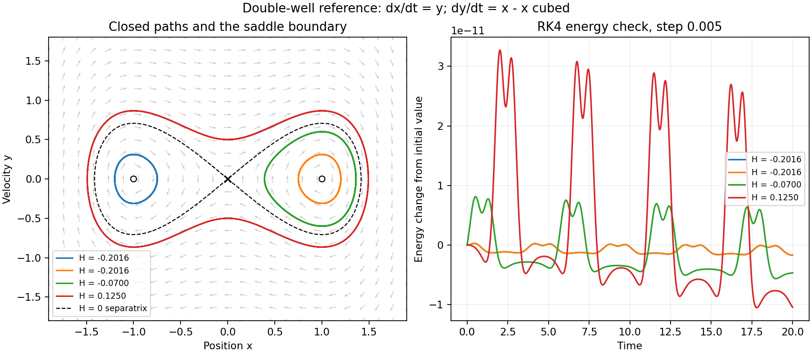

# Double-well reference test

**RK4 reproduces the expected separate loops below the energy barrier and a loop around both wells above it. Energy drift and time-step differences are small over the tested interval.**

This is the exact two-dimensional equation supplied in the screenshot: `dx/dt = y`, `dy/dt = x-x^3`. It is a separate mathematical reference. It does not replace the unforced Navier–Stokes model or add a force to the fluid.

## Results

| Start (x,y) | Initial energy | Largest energy drift | Maximum change after halving the RK4 step |
| --- | ---: | ---: | ---: |
| (-1.2, 0) | -0.2016 | 1.72e-12 | 3e-09 |
| (1.2, 0) | -0.2016 | 1.72e-12 | 3e-09 |
| (1, 0.6) | -0.0700 | 8.12e-12 | 4.65e-09 |
| (0, 0.5) | 0.1250 | 3.27e-11 | 2.15e-08 |

Each regular trajectory runs to time 20 with steps 0.01 and 0.005. Energy is `H = y^2/2 - x^2/2 + x^4/4`; H is used here to avoid confusion with the fluid mirror error E.

The origin is a saddle, with stable tangent y=-x and unstable tangent y=x. The nonlinear manifolds lie on `H=0`, or `y^2=x^2-x^4/2`. Their two homoclinic loops approach the origin as time tends to positive or negative infinity. The dashed lines use the exact paths `x(t)=+/-sqrt(2) sech(t)`, `y(t)=d x/dt`; the plotted tails are truncated. The maximum numerical difference from that exact path through time 6 is 1.36e-09. A finite numerical run cannot complete a homoclinic orbit.

The points (-1,0) and (1,0) are centers. Conservation of H establishes the nearby closed contours; purely imaginary eigenvalues alone would not establish nonlinear centers. For -1/4 < H < 0, trajectories stay around one well. H > 0 gives an outer orbit encircling both wells. The centers are not attracting resting states.

## How this helps the fluid study

This reference checks the distinction between position and velocity, closed motion and settling, energy barriers and attraction, and linear tangent directions versus curved nonlinear manifolds. The fluid measurements can be examined for these patterns, but resemblance of a projection does not establish a double-well potential, a conserved H, or a pair of fluid attractors. No such mapping is fitted here.

[Computed results](results.json) · [Tracked-fluid analysis](../README.md)

## Velocity-reversal check

After each time-20 endpoint, the velocity was negated and the same equation was evolved for another 20 time units at step 0.005. The expected return is the original position with the opposite original velocity. The largest return error was 1.3e-10. This checks the time-reversal symmetry of this undamped reference. It does not establish time reversal for viscous fluid flow, or equate time reversal with a state-dependent change of stretching sign.
