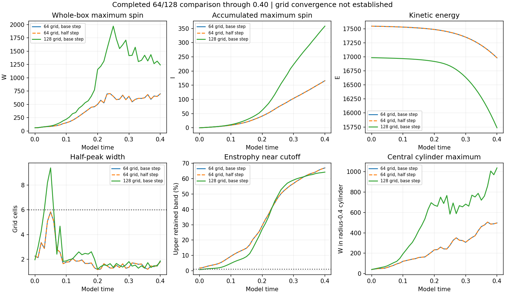
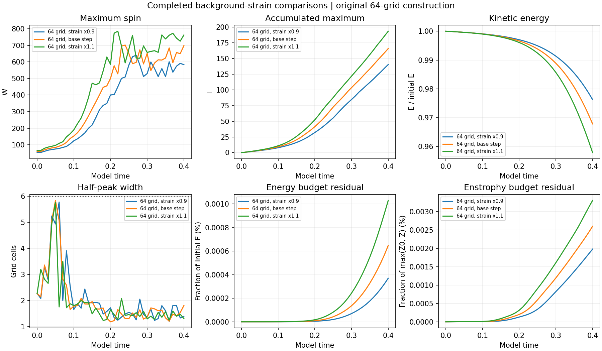
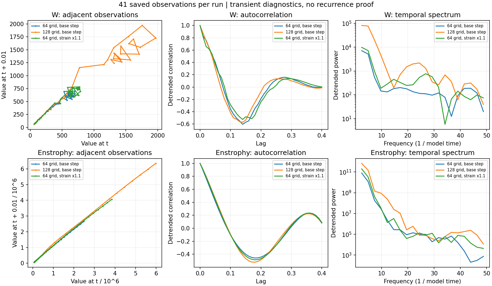

# Completed 128-grid baseline and higher-strain run

**The 128-grid baseline and the 64-grid strain x1.1 case both completed through time 0.40. Their 82 saved fields passed numerical-record verification. Neither passes the spatial-resolution screen.**

[Main study](../README.md) · [Earlier spin/strain tests](../completed-spin-strain/README.md)

## Completed runs

| New run | Largest saved W | Time of saved peak | Final W | Final I | Final central-cylinder W |
| --- | ---: | ---: | ---: | ---: | ---: |
| 128 grid, base step | 1970.475 | 0.25 | 1241.059 | 358.249 | 1037.929 |
| 64 grid, strain x1.1 | 785.031 | 0.22 | 762.098 | 193.606 | 689.980 |

W is maximum grid-point vorticity magnitude. I is its recorded per-step time integral. Saved observations are spaced by 0.01; peak times are sampled. All quantities use model units. The central diagnostic is the cylinder x²+y² ≤ 0.4² across all z, including its periodic ends. It is not a guarantee that an interior tube is resolved.

## What the completed grid comparison says

| Quantity | 64/128 relative curve difference | 64-grid base/half-step relative curve difference |
| --- | ---: | ---: |
| Wmax | 57.4356% | 0.108651% |
| I | 53.0065% | 0.014782% |
| energy | 4.1993% | 0.000085% |
| enstrophy | 58.4499% | 0.003926% |
| max_to_mean_spin | 47.1968% | 0.061844% |

A relative curve difference is `norm(a-b)/norm(b)` over all 41 common saved times. The reference b is the 128-grid run for the grid comparison and the half-step run for the 64-grid timestep comparison. These are the same definitions used by the existing study reporter. Small 64-grid timestep differences coexist with large grid differences. The 128-grid half-step run and 256-grid controls are still unfinished, so no finest-grid convergence trend is available.

| Grid | Initial W | Initial energy | Preserved mean velocity |
| --- | ---: | ---: | --- |
| 64 | 59.279954 | 17545.882795 | 1.040566235, 1.040566235, -2.081132470 |
| 128 | 59.042981 | 16984.665371 | 0.520318890, 0.520318890, -1.040637780 |

Both grids use the supplied construction, cube side 6, viscosity 0.001, Heun method, preserved per-grid mean and zero external force. Their sampled initial fields, energies and means differ. Raw strain does not match smoothly across periodic joins, and the initial global maxima lie outside the central tube. The grid difference combines initial sampling and spatial-discretization effects; it is not a clean convergence test from a demonstrated common smooth periodic field. No field replacement or mean adjustment was applied.

## Background strain x1.1

The final accumulated maximum I is +16.651% relative to the 64-grid baseline. The lower-strain record is reused to complete the 0.9/1.0/1.1 comparison. Changing strain changes the initial energy; it is not an externally driven run. Each uses the prescribed initial-speed CFL rule, so actual timesteps differ.

## Resolution and budgets

| Run | Final half-peak width | Final upper-band enstrophy | Passed screens | Energy change | Max energy residual | Max enstrophy residual |
| --- | ---: | ---: | ---: | ---: | ---: | ---: |
| 64 grid, base step | 1.804 cells | 67.04% | 0/41 | -3.2142% | 0.000648% | 0.002600% |
| 128 grid, base step | 1.878 cells | 64.29% | 0/41 | -7.3523% | 0.001220% | 0.008042% |
| 64 grid, strain x1.1 | 1.304 cells | 68.61% | 0/41 | -4.2094% | 0.001029% | 0.003303% |

The declared screen requires at least six cells across the minimum transverse half-peak chord, less than 0.1% high-band energy and less than 1% high-band enstrophy. The unresolved peaks preclude a physical peak-convergence claim. Energy residuals are normalized by initial energy; enstrophy residuals use max(initial enstrophy, current enstrophy). Small budget residuals check consistency of the discrete evolution. They do not repair the starting-field or spatial-resolution limitations.

## Recurrence diagnostics

Adjacent observations, linearly detrended autocorrelation and a Hann-window temporal spectrum are provided for W and enstrophy. Autocorrelation is normalized at lag zero without correcting for the number of remaining pairs. The 0.40 transient window does not establish a closed orbit, sustained cycle or chaos. These diagnostics are not asymptotic Lyapunov exponents.

## Verification and reproduction

All 82 new fields were finite-checked and hashed. W, energy and enstrophy were independently remeasured using NumPy inverse transforms at every saved time. Prescribed starting fields, conserved means, endpoint spectral and divergence diagnostics, discrete budgets, and direct-versus-RHS enstrophy production were checked. Integrated quantities retain the solver’s recorded accumulations. Numerical source hashes match the approved versions; any historical difference is restricted to the documented metadata-write retry. No fluid simulation was repeated.

Rebuild the summary, three charts and this report with `python report.py` beside `measurements.json`. `verify.py` requires the original saved fields. Reused completed 64-grid and lower-strain records were already verified in prior batches.

[Measurements](measurements.json) · [Summary and curve diagnostics](summary.json) · [Field verification](verification.json) · [Original protocol](../protocol.json)
