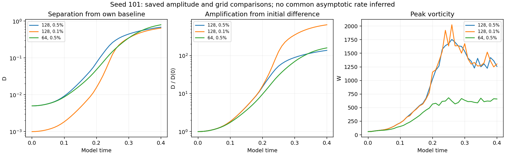
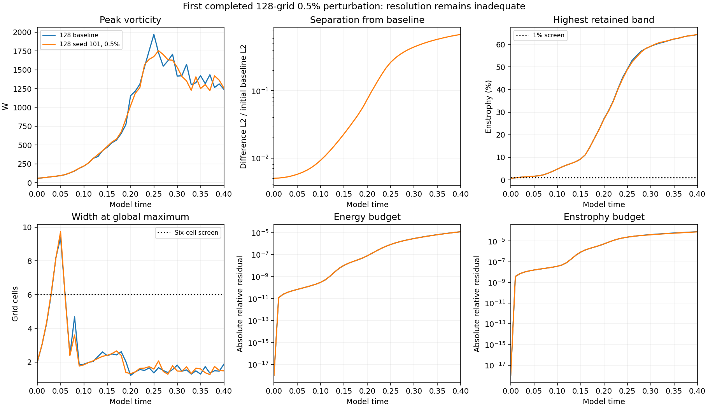
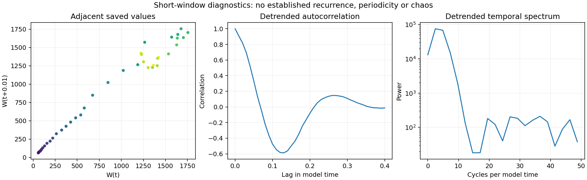

# First 128-grid 0.5% perturbation seed complete

Seed **101** reached **model time 0.40**, bringing the matched-stretch matrix to **29/48 completed, verified and published results**. The 256-grid ordinary baseline and 0.5% seed 202 are running. **19 jobs remain** in the existing matrix. There are no new hard numerical failures; spatial-resolution warnings remain material limitations.

## Separation and amplitude comparison

| Measurement | 128 grid, 0.5% (new) | 128 grid, 0.1% | 64 grid, 0.5% |
| --- | ---: | ---: | ---: |
| Initial D | 0.005 | 0.001 | 0.005 |
| Final D | 0.68542181 | 0.64703759 | 0.79790982 |
| Amplification | 137.08436 | 647.03759 | 159.58196 |
| Endpoint log-growth rate | 12.301491 | 16.181011 | 12.681394 |
| Whole-window fitted log slope | 15.434264 | 20.5463 | 15.329982 |
| Final W | 1257.1063 | 1303.6435 | 659.17349 |
| Final I | 353.58298 | 356.91419 | 166.72859 |

D is the velocity-field L2 difference from the corresponding ordinary-step baseline, divided by that baseline's initial L2 norm. All three comparison curves use seed 101; the grid-64 curve has its own baseline and normalization. The new run starts at D=0.005 and ends at **0.68542181**, an amplification of **137.0844**. Its largest saved W is **1754.729311**, recorded at **t=0.26**; the endpoint W is **1257.106277**.

The fivefold initial amplitude difference between the two 128-grid runs does not produce a fivefold endpoint difference. Their different normalized growth rates do not support a common asymptotic exponent. The endpoint rate is log(D(0.40)/D(0))/0.40; the fitted slope uses all 41 log(D) samples. Both are **finite-time, finite-amplitude separation measurements**, without renormalization. No asymptotic Lyapunov exponent or converged physical instability is inferred. Only one of the three authorized 128-grid 0.5% seeds is complete.

## Numerical limits

The resolution screen fails at **all 41 saved times**. At the endpoint, **64.3837%** of enstrophy lies in the highest retained band, against a 1% screen. The global peak width is **1.4827 cells** and the central-region peak width is **1.6698 cells**, against a six-cell screen. The late peak and separation are not spatially resolved.

The raw supplied strain is **not smooth across periodic joins**, and initial maximum vorticity lies **outside the central tube**. These features were preserved. The [existing 128-grid timestep control](../completed-timestep128/README.md) also fails its W-curve screen and has a 51.82% endpoint velocity difference. Its denominator differs from D's denominator. Good conservation accounting does not remove these resolution and timestep limitations.

The maximum absolute relative energy-budget residual is **1.2178219e-05**, below the declared 0.005 hard stop. The final enstrophy-budget residual is **7.8013669e-05**. Maximum speed CFL is **0.056913903**. These check consistency of the discretized run; the underlying mathematical model remains under examination.

## Verification and preserved scope

All **41 new saved fields** and their separation from **41 baseline fields** were independently checked in physical space. W, energy, enstrophy and D agree with the recorded values to maximum relative error **4.84e-16**. The initial field matches the exact prescribed 0.5% perturbation. Mean preservation, finite arrays, frozen source hashes, CFL, energy gates and monotone recorded I were checked. Endpoint widths, spectra, divergence and stretching were checked with the frozen diagnostics. Earlier comparator records match their previously published Git hashes; their finite-window rates were independently recalculated.

No simulation was restarted or rerun. The Heun method, cube of side 6, supplied starting field and mean, viscosity 0.001 and zero force are unchanged. Stage accumulations supply I and the budget integrals. Large restart arrays remain local; their SHA-256 values are retained in the audit.

Adjacent values, detrended autocorrelation and the temporal spectrum describe this short transient. They do not establish field recurrence, a periodic orbit or chaos. The supplied q remains a passive signed record; E is unsigned; fitted-q and cubic-feedback tests are separate models, and mirror averaging is an explicit intervention.

## Files

- [Measurements and comparison records](measurements.json), [summary](summary.json), [analysis](analysis.json)
- [Verification and all field hashes](verification.json)
- [Audit code](verify.py): `python verify.py /path/to/matched-stretch-study`
- [Chart code](plot.py): `python plot.py` from this folder
- [All three completed 0.1% seeds at grid 128](../completed-n128-three-seeds/README.md)
- [Original grid-64 0.5% batch](../completed-halfpercent/README.md)
- [Protocol](../protocol.json), [numerical source](../numerics.py), [study index](../README.md)

Historical intake reviews and earlier batches retain their original dates and status. The separate vortex matrix is already complete at 48/48 and its [final report](../../study/final-matrix/README.md) is unchanged.
