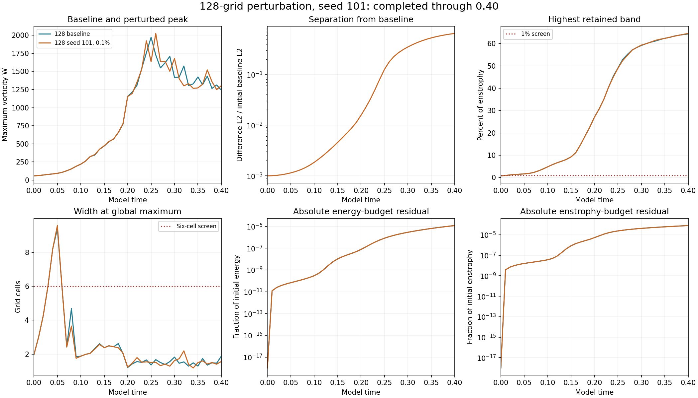
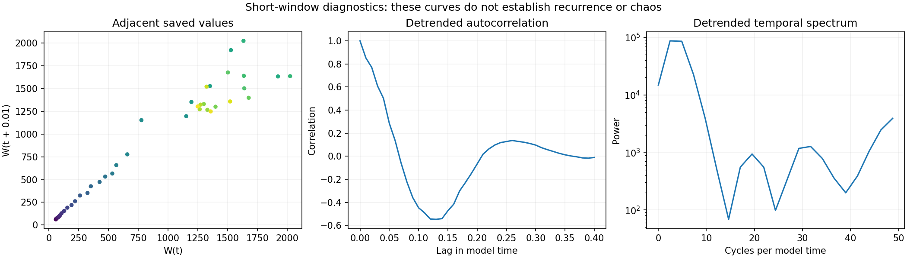

# First completed 128-grid perturbation seed

Seed **101**, initial perturbation **0.1%**, has completed through **t=0.40**. The baseline and this trajectory use the preserved supplied start, domain side 6, mean velocity, viscosity 0.001, zero force and Heun integration. Other 128-grid seeds remain in the authorized queue.

## Saved measurements

- The normalized separation D grows from **0.001000** to **0.647038**, or **647.038 times** its initial value. D is the velocity L2 difference divided by the initial baseline L2 norm.
- Peak saved W is **2024.611681** at **t=0.26**. Final W is **1303.643507**, and final accumulated I is **356.914186**.
- The endpoint log-growth rate is **16.181011** per model-time unit. The whole-window least-squares log slope is **20.546300**. Both measure finite-amplitude separation over this recorded transient, without renormalization; they are not asymptotic Lyapunov exponents.
- The resolution screen fails from **t=0**. At the endpoint, **64.5243%** of enstrophy lies in the highest retained band, and the global peak width is **1.5633 cells**.
- Maximum absolute relative energy-budget residual: **1.21248e-05**. Final relative enstrophy-budget residual: **7.94626e-05**.

The supplied raw strain is not smooth across the periodic joins, and its initial largest vorticity lies outside the central tube. The large recorded separation develops in fields that fail the spatial-resolution screen. This single completed seed does not establish a converged physical instability or a seed-independent rate.

## Verification and diagnostics

All **41 new saved fields** were independently remeasured for maximum vorticity, energy, enstrophy and normalized separation from the corresponding **41 saved baseline fields**. The exact prescribed perturbation, amplitude, frozen source hashes, preserved mean, finite arrays, CFL and budget gates were checked. Endpoint widths, spectra and enstrophy production were remeasured. The earlier baseline audit was reused after confirming its unchanged result hash. No trajectory was rerun.

The return plot, detrended autocorrelation and temporal spectrum reproduce the existing reporter's diagnostics. These short transient recordings do not establish recurrence, periodicity or chaos.

[Measurements](measurements.json) · [Summary](summary.json) · [Verification](verification.json) · [Reporter analysis](analysis.json) · [Earlier baseline verification](../completed-grid128-strain/verification.json) · [Study index](../README.md)

## Reproduction

The [solver](../numerics.py), [runner](../run_suite.py) and [protocol](../protocol.json) retain the original numerical model. Raw restart arrays remain local; their hashes are recorded. With NumPy and SciPy, repeat the audit using the local study directory:

    python verify.py /path/to/matched-stretch-study

With NumPy and Matplotlib, rebuild these charts from the bundled JSON:

    python plot.py
