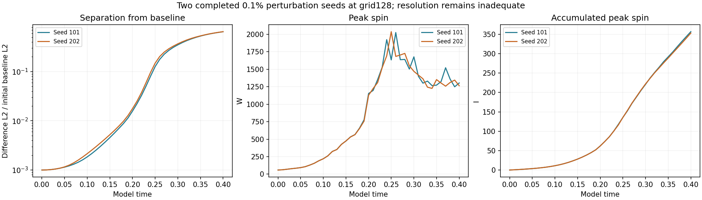
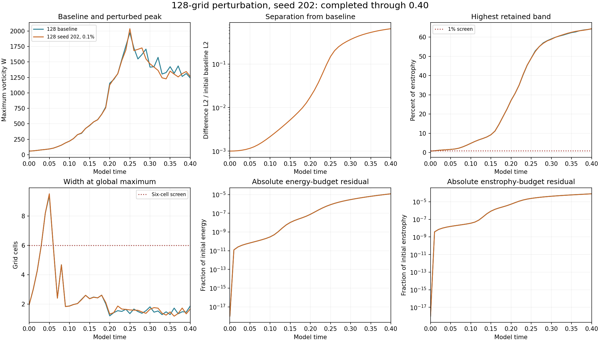
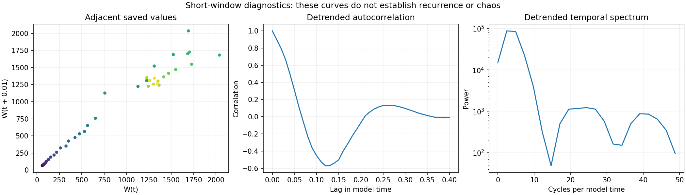

# Second completed 128-grid perturbation seed

Seed **202**, with an initial **0.1%** perturbation, has completed through **model time 0.40**. The matched-stretch matrix now has **27/48 completed results verified and published**. Seed 303 is running; the remaining authorized amplitudes and controls continue.

## Comparison with the first seed

| Measurement | Seed 101 | Seed 202 |
| --- | ---: | ---: |
| Initial D | 0.001 | 0.001 |
| Final D | 0.64703759 | 0.64888856 |
| Amplification | 647.03759 | 648.88856 |
| Endpoint log-growth rate | 16.181011 | 16.188152 |
| Whole-window least-squares log slope | 20.5463 | 20.462024 |
| Peak saved W | 2024.6117 | 2037.0387 |
| Time of saved peak | 0.26 | 0.25 |
| Final W | 1303.6435 | 1264.4891 |
| Final I | 356.91419 | 353.28879 |
| Final global width (cells) | 1.5633199 | 1.6790831 |

D is the velocity-field L2 difference from the ordinary-step baseline divided by the initial baseline L2 norm. Both seeds start at D=0.001 and reach about 0.65. The close endpoint separations are a repeated feature across these two numerical runs. The third seed and other amplitudes remain necessary for the planned comparison.

The endpoint rate is log(D(0.40)/D(0))/0.40. The fitted slope uses all 41 saved values of log(D). These are finite-time, finite-amplitude measurements without renormalization; they are not asymptotic Lyapunov exponents or a demonstrated seed-independent physical rate.

## Resolution and timestep context

The spatial-resolution screen fails at all 41 saved times for both seeds. Seed202 ends with **64.3992%** of enstrophy in the highest retained band and a global peak width of **1.6791 cells**, versus the 1% and six-cell screens. Its maximum absolute relative energy-budget residual is **1.21669e-05**; its final relative enstrophy-budget residual is **7.98415e-05**.

The [completed baseline timestep control](../completed-timestep128/README.md) has a **7.29% maximum W-curve discrepancy** and **51.82% endpoint velocity L2 difference**, normalized by the half-step endpoint field. That denominator differs from D's initial-baseline denominator, so the percentages are not an exact like-for-like comparison. This control shows substantial timestep sensitivity in the same unresolved numerical setting. The large seed separation therefore does not establish converged physical instability.

The raw supplied strain is not smooth across periodic joins, and its initial maximum vorticity lies outside the central tube. Those limitations and the original starting construction are retained. The mathematical model remains under examination.

## Verification

All **41 new saved fields** passed independent physical-space remeasurement of W, energy, enstrophy and normalized separation from the corresponding **41 saved baseline fields**. The prescribed seed202 perturbation and initial amplitude were reproduced exactly; source hashes, mean preservation, finite arrays, CFL and energy-budget gates were checked. Frozen endpoint diagnostics reproduce widths, spectra and enstrophy production. The maximum relative remeasurement error across W, energy, enstrophy and D was **4.92e-16**.

The prior seed101 audit is reused after verifying unchanged result and source hashes. Both finite-window rates in the table were independently recalculated from the saved D curves. No trajectory was rerun. Recorded Heun-stage accumulations supply I and budget integrals.

The model retains the periodic cube of side 6, Heun method, viscosity 0.001, supplied mean and zero external force. This batch adds results from the already authorized matrix.

Return plots, detrended autocorrelation and power spectra describe the recorded transient. They do not establish recurrence, periodicity or chaos.

## Files and reproduction

- [Measurements: baseline and both completed seeds](measurements.json)
- [Comparison summary](summary.json), [new-seed analysis](analysis.json), [new-seed verification and field hashes](verification.json)
- [First-seed report and verification](../completed-n128-seed101/README.md)
- [Audit code](verify.py): run `python verify.py /path/to/matched-stretch-study` with the local saved arrays
- [Chart code](plot.py): run `python plot.py` in this folder with NumPy and Matplotlib
- [Numerical implementation](../numerics.py), [runner](../run_suite.py), [protocol](../protocol.json), [study index](../README.md)

Large restart arrays remain local. Historical intake reviews are preserved.
