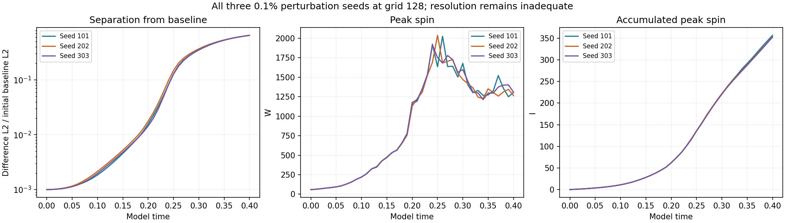
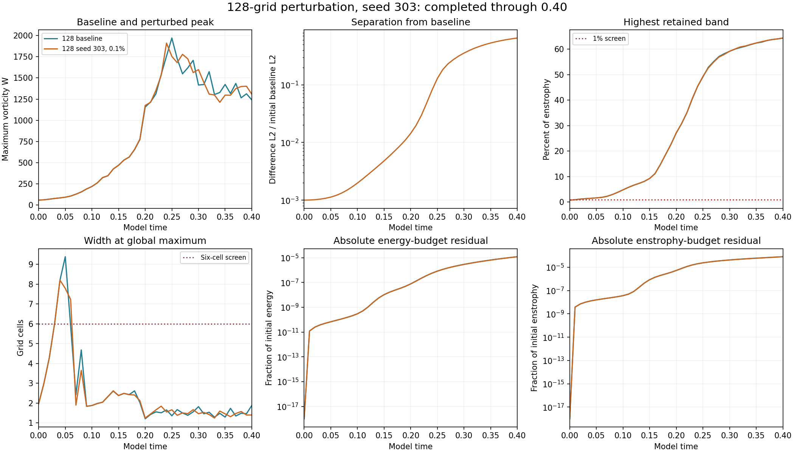
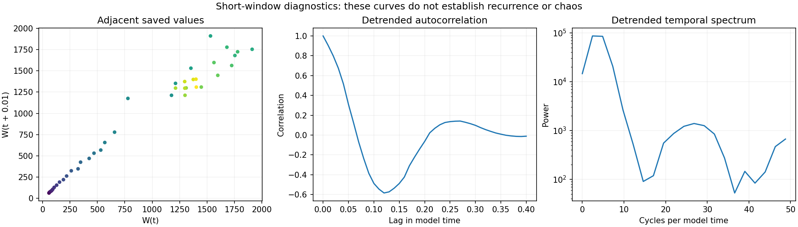

# All three 0.1% perturbation seeds at grid 128 complete

Seed **303** has reached **model time 0.40**, completing the three authorized 0.1% seeds at grid 128. The matched-stretch matrix now has **28/48 completed results verified and published**. The first 0.5% seed and the grid-256 ordinary baseline are running; the other authorized controls remain queued.

## Three-seed comparison

| Measurement | Seed 101 | Seed 202 | Seed 303 |
| --- | ---: | ---: | ---: |
| Initial D | 0.001 | 0.001 | 0.001 |
| Final D | 0.64703759 | 0.64888856 | 0.64696158 |
| Amplification | 647.03759 | 648.88856 | 646.96158 |
| Endpoint log-growth rate | 16.181011 | 16.188152 | 16.180717 |
| Whole-window least-squares log slope | 20.5463 | 20.462024 | 20.499761 |
| Peak saved W | 2024.6117 | 2037.0387 | 1910.5644 |
| Time of saved peak | 0.26 | 0.25 | 0.24 |
| Final W | 1303.6435 | 1264.4891 | 1308.6873 |
| Final I | 356.91419 | 353.28879 | 352.70353 |
| Final global width (cells) | 1.5633199 | 1.6790831 | 1.3997672 |

D is the velocity-field L2 difference from the ordinary-step baseline divided by the initial baseline L2 norm. All three seeds start at D=0.001 and end between **0.646962 and 0.648889**, an amplification of about **647 to 649**. The endpoint range divided by the three-seed mean is **0.2975%**. This close endpoint separation repeats across the three numerical runs, while their saved peak W and peak times differ.

The endpoint rate is log(D(0.40)/D(0))/0.40. The fitted slope uses all 41 saved values of log(D). These are finite-time, finite-amplitude measurements without renormalization. They are not asymptotic Lyapunov exponents or an established seed-independent physical rate.

## Resolution and timestep context

The spatial-resolution screen fails at all 41 saved times for every seed. Seed 303 ends with **64.3288%** of enstrophy in the highest retained band and a global peak width of **1.3998 cells**, versus the 1% and six-cell screens. Its maximum absolute relative energy-budget residual is **1.20592e-05**; its final relative enstrophy-budget residual is **7.9165e-05**.

The [completed baseline timestep control](../completed-timestep128/README.md) has a **7.29% maximum W-curve discrepancy** and **51.82% endpoint velocity L2 difference**, normalized by the half-step endpoint field. That denominator differs from D's initial-baseline denominator, so the percentages are not an exact like-for-like comparison. The control shows substantial timestep sensitivity in this unresolved numerical setting. The large seed separation does not establish converged physical instability.

The raw supplied strain is not smooth across periodic joins, and its initial maximum vorticity lies outside the central tube. Those limitations and the original starting construction are retained. The mathematical model remains under examination.

## Verification

All **41 newly completed seed-303 fields** passed independent physical-space remeasurement of W, energy, enstrophy and normalized separation from the corresponding **41 saved baseline fields**. The prescribed perturbation and initial amplitude were reproduced exactly; source hashes, mean preservation, finite arrays, CFL and energy-budget gates were checked. Frozen endpoint diagnostics reproduce widths, spectra and enstrophy production. The maximum relative remeasurement error across W, energy, enstrophy and D was **6.53e-16**.

The seed-101 and seed-202 audits are reused after checking unchanged result, baseline and source hashes. Both finite-window rates were independently recalculated for all three seeds from their saved D curves. No trajectory was rerun. Recorded Heun-stage accumulations supply I and budget integrals.

The model retains the periodic cube of side 6, Heun method, viscosity 0.001, supplied mean and zero external force. This batch completes an existing part of the authorized matrix.

Return plots, detrended autocorrelation and power spectra describe the recorded transient. They do not establish recurrence, periodicity or chaos.

## Files and reproduction

- [Measurements: baseline and all three completed seeds](measurements.json)
- [Comparison summary](summary.json), [three-seed analysis](analysis.json), [new-seed verification and field hashes](verification.json)
- [Seed-101 report and verification](../completed-n128-seed101/README.md), [seed-202 report and verification](../completed-n128-seed202/README.md)
- [Audit code](verify.py): run `python verify.py /path/to/matched-stretch-study` with the local saved arrays to audit seed 303
- [Chart code](plot.py): run `python plot.py` in this folder with NumPy and Matplotlib
- [Numerical implementation](../numerics.py), [runner](../run_suite.py), [protocol](../protocol.json), [study index](../README.md)

Large restart arrays remain local. Historical intake reviews are preserved.
