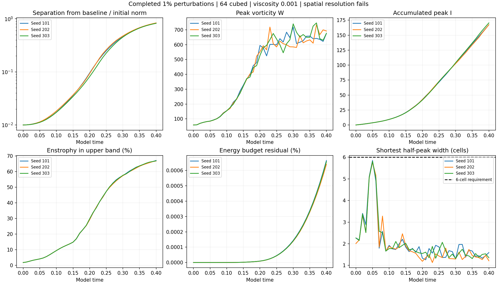
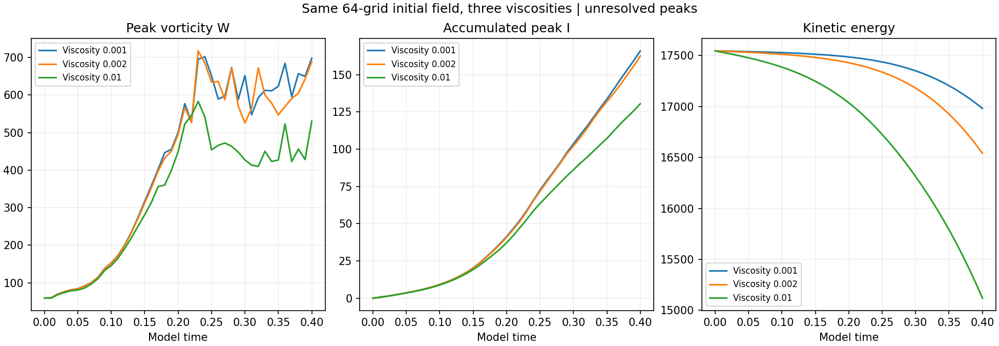

# Completed 1% perturbations and viscosity control

**All four runs reached time 0.40. Their fields are finite and their recorded diagnostics reproduce from the saved fields. Their peak regions remain too narrow to pass the spatial-resolution check.**

The three perturbations start 1% from the baseline in the velocity L2 norm. Seeds change the perturbation shape. The viscosity control uses exactly the baseline starting field and changes viscosity from 0.001 to 0.002. All runs retain the original mean, cube side 6, Heun method and zero external force.

## Results

| Run | Largest saved W | Time of saved peak | Final W | Final I | Final width (cells) | Upper-band enstrophy at end |
| --- | ---: | ---: | ---: | ---: | ---: | ---: |
| 101 | 719.041 | 0.30 | 676.078 | 167.514 | 1.593 | 67.16% |
| 202 | 734.409 | 0.37 | 692.204 | 167.503 | 1.215 | 66.84% |
| 303 | 746.510 | 0.37 | 676.653 | 170.520 | 1.357 | 66.94% |
| Viscosity 0.002 | 717.304 | 0.23 | 688.543 | 162.546 | 1.254 | 65.50% |

W is the largest grid-point vorticity magnitude; I is its accumulated time integral, integrated at every Heun step. Peak timing in this table uses outputs spaced by 0.01, so it is not a continuously located maximum. Width is the shortest measured transverse half-peak chord. All quantities use model units.

| Seed | Final relative separation | Endpoint log rate | Fitted log rate |
| --- | ---: | ---: | ---: |
| 101 | 0.831949 | 11.05297 | 13.49329 |
| 202 | 0.836531 | 11.06670 | 13.48219 |
| 303 | 0.821832 | 11.02238 | 13.44110 |

Separation is divided by the initial baseline velocity norm. The endpoint rate is log(D(0.4)/D(0))/0.4; the fitted rate is the slope of log(D) over the 41 outputs. These are finite-time, finite-amplitude measurements.

## Numerical checks

| Run | Energy decrease | Largest energy-budget residual | Largest enstrophy-budget residual | Largest divergence |
| --- | ---: | ---: | ---: | ---: |
| 101 | 3.345% | 0.000665% | 0.002554% | 1.6e-13 |
| 202 | 3.305% | 0.000641% | 0.002474% | 1.6e-13 |
| 303 | 3.331% | 0.000658% | 0.002553% | 1.6e-13 |
| Viscosity 0.002 | 5.722% | 0.000545% | 0.002523% | 1.6e-13 |

All 164 saved fields were checked for finite values and hashed. Final W, energy, enstrophy, production, spectral fraction and budget residuals were remeasured; initial and final perturbation sizes were checked against baseline fields. Small budget residuals do not establish adequate spatial resolution.

## Interpretation

These runs measure how the supplied calculation responds to changed perturbations and viscosity. The six-cell width requirement fails, and substantial enstrophy occupies the upper retained band. The raw starting strain still has a mismatch across the periodic joins. Physical peak convergence and an asymptotic Lyapunov rate are not established.

[Direct verification](verification.json) · [Original protocol](../protocol.json) · [Earlier 0.5% runs](../completed-halfpercent/README.md) · [Adaptive peak audit](../adaptive-peak/README.md) · [Main study](../README.md)
