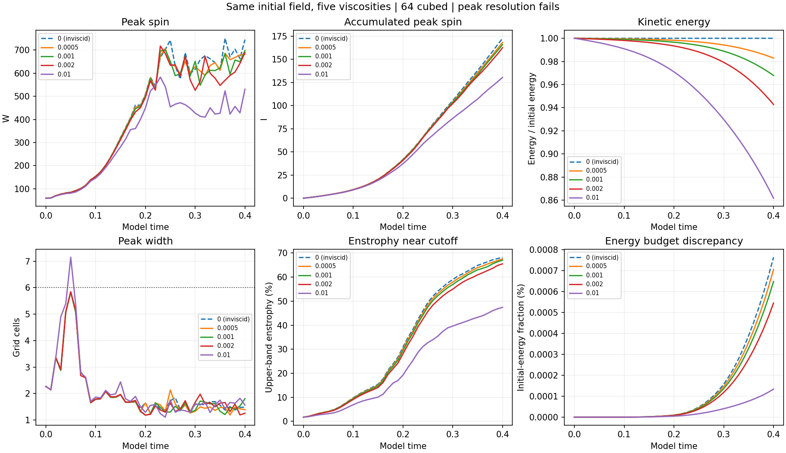
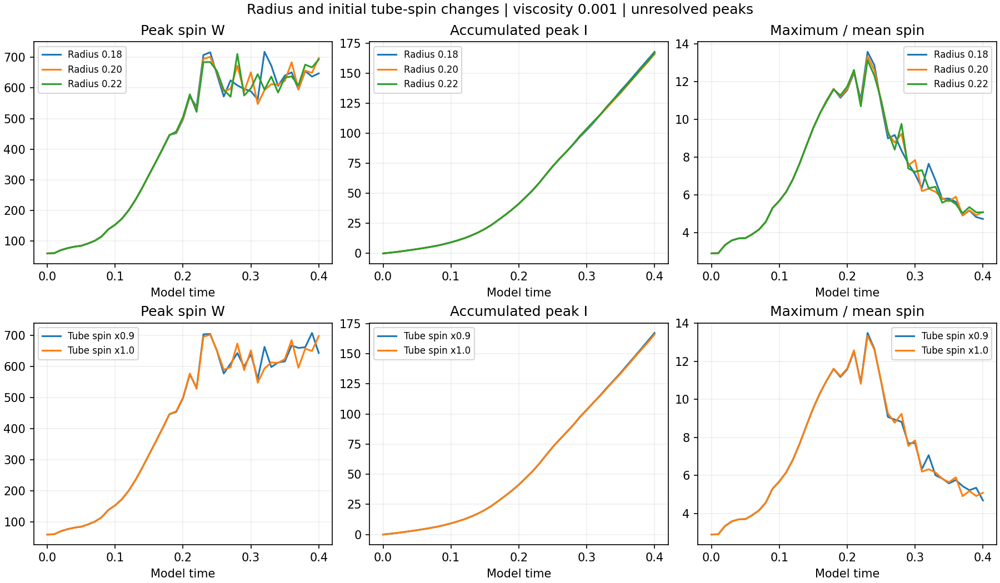

# Completed viscosity, radius and tube-spin comparisons

**Five additional runs reached time 0.40 and passed the saved-data verification. All remain spatially unresolved at their sharpest spin peaks.**

This batch adds viscosity 0.0005, the separate inviscid comparison, radii 0.18 and 0.22, and tube spin multiplied by 0.9. Three already published completed records supply the baseline and viscosities 0.002 and 0.01. The 128³ and 256³ matrix is still in progress.

## What was held fixed

Each run uses the original supplied matched-stretch construction, cube side 6, its preserved mean, the Heun integrator and zero external force. The viscosity comparisons have bit-identical starting fields. Radius changes keep the prescribed analytic tube peak fixed, while changing its shape and starting energy. The spin-factor run scales the tube contribution; it does not scale the entire background or the largest whole-box initial spin. No energy renormalization or periodic repair was introduced. Viscosity zero is an inviscid/Euler comparison, separate from the positive-viscosity Navier–Stokes cases.

## Results

| Run | Largest saved W | Time of saved peak | Final W | Final I | Final maximum/mean spin |
| --- | ---: | ---: | ---: | ---: | ---: |
| viscosity-nu0.0005 | 706.785 | 0.24 | 682.093 | 168.286 | 4.761 |
| viscosity-nu0.0 | 750.912 | 0.36 | 745.245 | 172.710 | 4.990 |
| radius-v0.18 | 718.109 | 0.32 | 647.769 | 167.875 | 4.712 |
| radius-v0.22 | 711.369 | 0.28 | 693.392 | 166.857 | 5.064 |
| spin_factor-v0.9 | 707.427 | 0.39 | 643.083 | 167.276 | 4.677 |

W is maximum grid-point vorticity magnitude, I is its recorded time integral at every integration step, and the spin ratio is W divided by mean vorticity magnitude. Peak timing is sampled every 0.01. All quantities use model units.

## Energy and numerical budgets

| Viscosity | Energy change through 0.40 | Final I | Largest energy-budget residual |
| ---: | ---: | ---: | ---: |
| 0.0 | +0.000764% | 172.710 | 0.000764% |
| 0.0005 | -1.706753% | 168.286 | 0.000705% |
| 0.001 | -3.214217% | 165.971 | 0.000648% |
| 0.002 | -5.722139% | 162.546 | 0.000545% |
| 0.01 | -13.829662% | 130.469 | 0.000134% |

The positive-viscosity cases lose kinetic energy. The inviscid comparison has a small positive energy drift from numerical integration; it is not an external energy source. Small budget residuals check consistency of the discrete calculation, not adequate spatial resolution. The accumulated peak grows less over this interval with higher viscosity in these records; individual peak curves still fluctuate.

## Resolution checks

| New run | Final half-peak width (cells) | Upper-band enstrophy at end | Saved outputs passing the combined screen |
| --- | ---: | ---: | ---: |
| viscosity-nu0.0005 | 1.389 | 67.57% | 0/41 |
| viscosity-nu0.0 | 1.481 | 68.25% | 0/41 |
| radius-v0.18 | 1.553 | 66.71% | 0/41 |
| radius-v0.22 | 1.379 | 67.03% | 0/41 |
| spin_factor-v0.9 | 1.789 | 66.91% | 0/41 |

The six-cell width requirement fails, and a large fraction of enstrophy reaches the upper retained spectral band. The raw starting strain still has a mismatch where the periodic box joins. Whole-box maxima therefore cannot be treated as established central-tube concentration. These comparisons describe the supplied discrete construction. They do not establish physical peak convergence, periodic breathing or global regularity.

## Verification

All 205 saved fields from the five new runs were checked for finite values and hashed. Maximum spin, kinetic energy and enstrophy were independently recomputed using NumPy inverse transforms at every saved time. Initial fields were reconstructed from their prescribed parameters; viscosity starts match baseline exactly. Final divergence, spectral fraction and budget diagnostics were remeasured, and direct enstrophy production was compared with the solver RHS identity. Mean velocity was checked throughout. Integrated quantities retain their recorded step accumulations; the simulations were not repeated. The five new runs match current source hashes. Two reused older records predate the documented metadata-write retry; the numerical solver hash is identical throughout.

Run `python report.py` beside `measurements.json` to rebuild the figures and this report. `verify.py` requires the original workspace and saved fields.

[Verification details](verification.json) · [Summary](summary.json) · [Measurements](measurements.json) · [Original protocol](../protocol.json) · [Tracked relationships](../central-response/tracked-patterns/README.md) · [Main study](../README.md)
