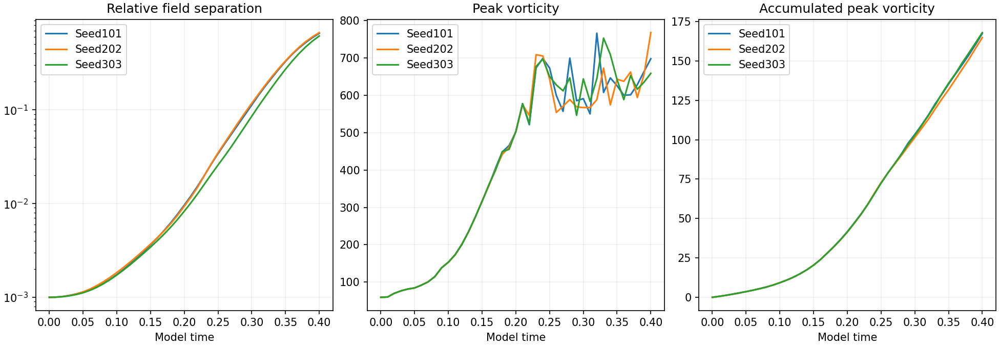

# Three completed 0.1% perturbation runs

All three 64-grid runs reached time 0.40. Their saved final fields were independently remeasured before publication. The original supplied field, viscosity 0.001 and zero force were retained.

| Seed | Largest saved spin | Accumulated peak | Final relative separation | Endpoint log growth rate |
| --- | ---: | ---: | ---: | ---: |
| 101 | 766.57401 | 167.39999 | 0.654688 | 16.21040 |
| 202 | 768.18715 | 164.80941 | 0.666418 | 16.25479 |
| 303 | 753.32142 | 167.97029 | 0.613134 | 16.04646 |

Relative separation is the L2 difference from the baseline, divided by the initial baseline L2 norm. Each initial separation is 0.001. The endpoint log growth rate is log(D(0.4)/D(0))/0.4. It describes a finite window and finite perturbation.

**Spatial resolution fails:** about 67% of endpoint enstrophy is in the upper retained band. This prevents a physical sensitivity or asymptotic Lyapunov conclusion. The original raw-strain periodic-join limitation remains.

[Direct field verification](verification.json) · [Main controls](../README.md) · [Original protocol](../protocol.json)
