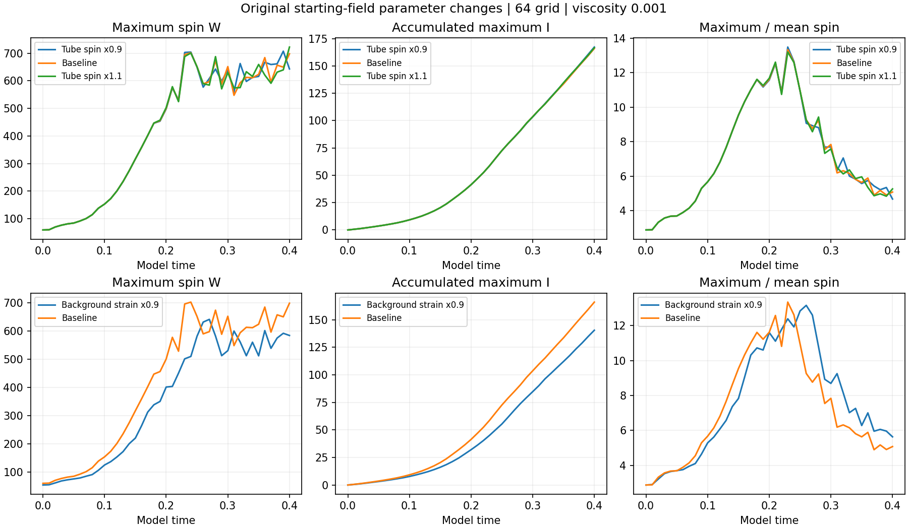
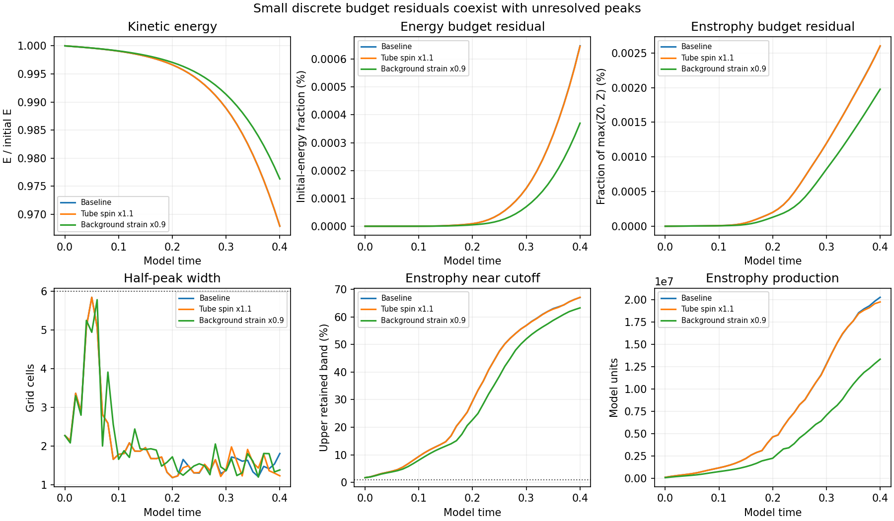
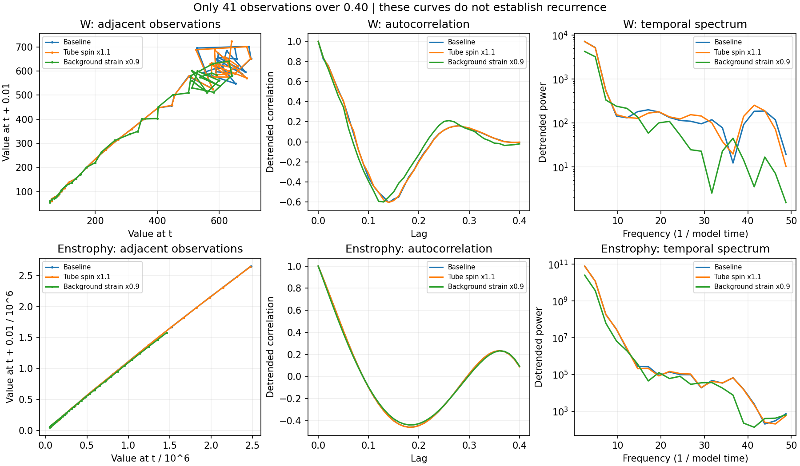

# Completed tube-spin and background-strain comparisons

**Two additional 64-grid runs reached time 0.40. All 82 saved fields passed numerical-record checks; both runs fail the spatial-resolution screen at every saved time.**

[Main study](../README.md) · [Earlier completed parameters](../completed-parameters/README.md) · [Marker roles](../marker-stress/separation-roles.md)

## What changed

This batch adds tube spin multiplied by 1.1 and background strain multiplied by 0.9. The completed baseline and tube-spin 0.9 records are reused. Only the named initial-field parameter changes; the supplied construction, periodic cube side 6, viscosity 0.001, per-run preserved mean, Heun method and zero force remain. The prescribed starting-speed CFL rule determines each run’s step size. No energy normalization or periodic-join repair was added. These runs change the initial field; they are not external forcing. The higher-strain and larger-grid controls remain in the existing queue.

| Run | Largest saved W | Time of saved peak | Final W | Final I | Change in final I from baseline |
| --- | ---: | ---: | ---: | ---: | ---: |
| Tube spin x1.1 | 722.418 | 0.40 | 722.418 | 166.626 | +0.395% |
| Background strain x0.9 | 640.617 | 0.27 | 583.521 | 140.450 | -15.377% |

W is the largest grid-point vorticity magnitude. I is its recorded integral accumulated at every integration step. Peak time refers to saved observations spaced by 0.01. These are model units.

The reduced-strain run accumulates less maximum spin over this interval. Increasing the tube contribution changes the detailed maximum-spin curve while changing the final accumulated maximum much less. The tube contribution and background strain are different parts of the supplied starting field; a 10% tube change does not scale whole-box initial W by 10%. These observations are confined to the tested discrete construction.

## Starting energy, budgets and resolution

| Run | Initial energy | Energy change | Largest energy-budget residual | Largest enstrophy-budget residual | Final half-peak width | Final upper-band enstrophy |
| --- | ---: | ---: | ---: | ---: | ---: | ---: |
| Baseline | 17545.883 | -3.2142% | 0.000648% | 0.002600% | 1.804 cells | 67.04% |
| Tube spin x1.1 | 17546.199 | -3.2122% | 0.000646% | 0.002603% | 1.228 cells | 67.10% |
| Background strain x0.9 | 14212.452 | -2.3716% | 0.000370% | 0.001977% | 1.380 cells | 63.26% |

The energy residual is normalized by initial energy. The enstrophy residual is normalized by the larger of initial and current enstrophy, max(Z0, Z). Small residuals establish consistency of the discrete budgets, not adequate spatial resolution. Both new runs pass 0/41 combined resolution screens; the width requirement is six cells and the enstrophy-tail requirement is below 1%. The raw starting strain is not smooth across periodic joins, and its initial maxima are outside the central tube. Whole-box peak growth cannot be treated as verified central-tube concentration.

## Recurrence diagnostics

The adjacent-observation plots, linearly detrended autocorrelations and Hann-window temporal spectra use the same diagnostics as the existing study reporter. Autocorrelation is normalized by its zero-lag value; it is not adjusted for the decreasing number of pairs at larger lags. Forty-one observations over this transient interval do not establish a closed orbit, repeated cycle, chaos or an asymptotic Lyapunov exponent. A spectral maximum or a returning autocorrelation by itself is insufficient.

## Verification and reproduction

Each new run is complete through 0.40 with 41 immutable fields. All were finite-checked and hashed; W, kinetic energy and enstrophy were independently remeasured using NumPy inverse transforms. Starting fields match their prescribed parameters exactly; mean drift, divergence, saved budgets and the direct-versus-RHS enstrophy-production identity were checked. Recorded step-integrated quantities were preserved. The fluid evolution was not repeated. Source hashes still match the running approved solver.

`python report.py` rebuilds this report, all three figures and summary from `measurements.json`. The independent `verify.py` needs the original saved fields in the study workspace. The baseline and lower-spin record are reused from already verified completed batches.

[Measurements](measurements.json) · [Summary and recurrence arrays](summary.json) · [Field verification](verification.json) · [Original protocol](../protocol.json)
