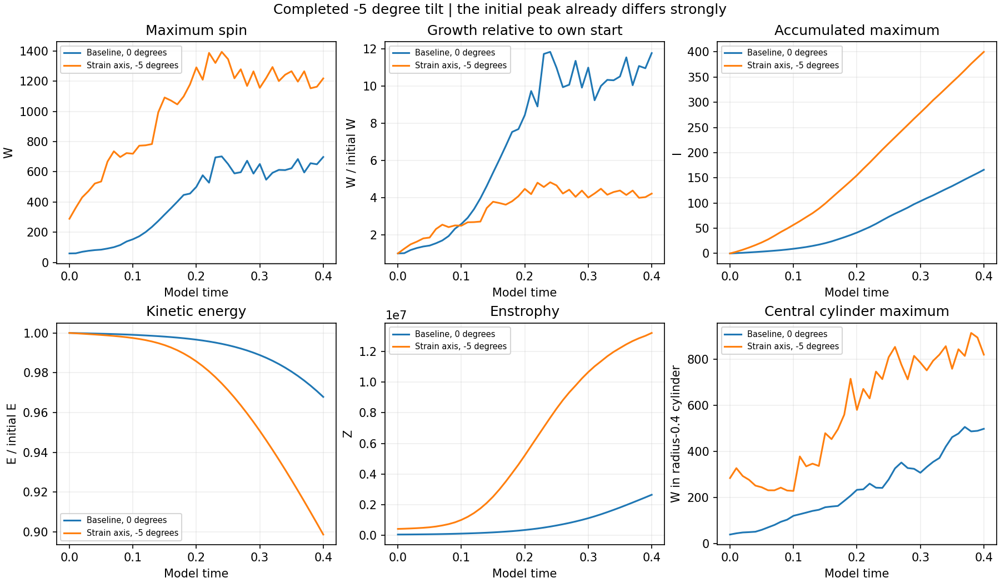
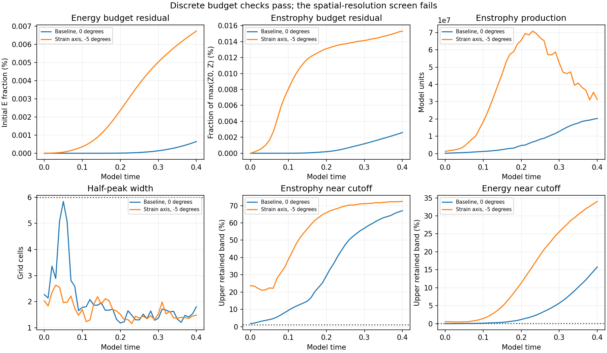
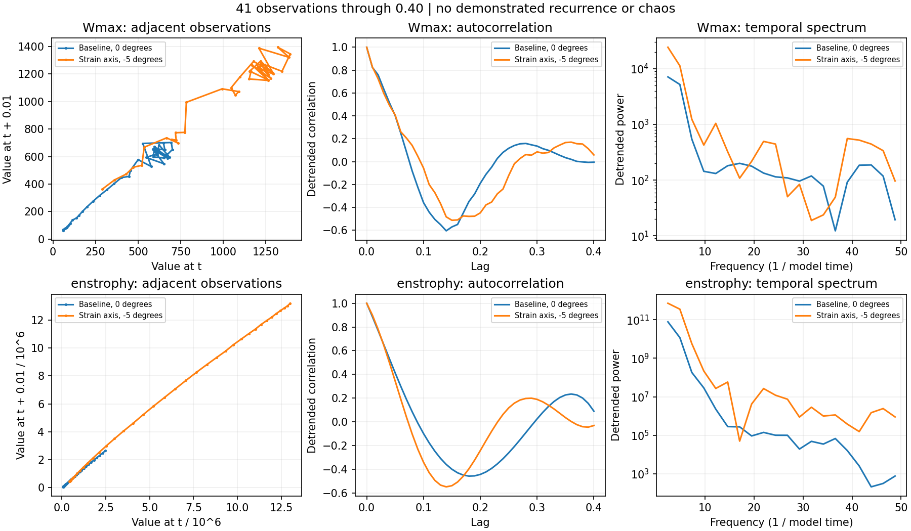

# Completed minus-five-degree strain-axis tilt

**The 64-grid -5 degree run completed through time 0.40. All 41 saved fields passed numerical-record checks. It passes 0/41 spatial-resolution screens.**

[Main study](../README.md) · [Completed grid and strain comparison](../completed-grid128-strain/README.md)

## What this tests

Only the initial background-strain axis is tilted by -5 degrees in the x-z plane. The central tube stays on its original axis. The supplied field construction, radius, spin, strain magnitude, periodic side-6 domain, viscosity 0.001, Heun integration and zero external force are preserved. Each run retains its own sampled mean and uses the prescribed starting-speed CFL rule. The completed baseline is reused; no fluid evolution was repeated.

## A substantial starting-field change

| Quantity | Baseline | -5 degree tilt |
| --- | ---: | ---: |
| Initial W | 59.279954 | 288.870712 |
| Initial energy | 17545.882795 | 46534.154409 |
| Initial enstrophy | 61567.013776 | 426686.380892 |
| Initial upper-band enstrophy | 1.736% | 23.649% |

The initial W is already 4.873 times the baseline. A small angular change is not a small initial-vorticity perturbation for this periodically sampled construction.

The raw strain is `u_raw = S x exp(-0.04 |x|^2)`, with `S = 40(-Id + 3 a a^T)` and `a = (sin(theta), 0, cos(theta))`. Tilting introduces off-diagonal S_xz and S_zx. Across the x and z faces these create tangential velocity jumps in the raw field before filtering/projection. Their maximum face-center magnitude is `6 |S_xz| exp(-0.36)`.
For -5 degrees, S_xz = -10.418891 and that raw jump is 43.614080. At zero tilt this particular tangential jump is zero; the original raw strain still has the previously documented lack of smooth periodic joins. The filtered fields are finite, but the construction has not established a common smooth periodic limiting start.

## Completed trajectory comparison

| Run | Largest saved W | Peak time | Peak / initial W | Final W | Final I |
| --- | ---: | ---: | ---: | ---: | ---: |
| Baseline, 0 degrees | 701.790 | 0.24 | 11.839 | 697.892 | 165.971 |
| Strain axis, -5 degrees | 1394.126 | 0.24 | 4.826 | 1218.109 | 399.973 |

Final I changes by +140.990% relative to the baseline. This combines the different starting field and its subsequent evolution; it cannot be attributed to a clean central-tube alignment effect.

W is maximum grid-point vorticity magnitude; I is its recorded per-step integral. Peak times refer to observations saved every 0.01, not continuous-time maxima. The central diagnostic is a radius-0.4 cylinder spanning all z, including the periodic ends. Initial global maxima lie outside the central tube. All quantities use model units.

## Budgets, spectrum and widths

| Run | Energy change | Max energy residual | Max enstrophy residual | Final half-peak width | Final upper-band enstrophy |
| --- | ---: | ---: | ---: | ---: | ---: |
| Baseline, 0 degrees | -3.2142% | 0.000648% | 0.002600% | 1.804 cells | 67.04% |
| Strain axis, -5 degrees | -10.1301% | 0.006730% | 0.015314% | 1.482 cells | 72.41% |

Energy residuals use initial energy; enstrophy residuals use max(initial Z, current Z). The resolution screen requires a minimum transverse half-peak chord of six cells, upper-band energy below 0.1%, and upper-band enstrophy below 1%. Discrete budget consistency does not establish spatial resolution. No physical peak-convergence or regularity claim follows. The +5 degree counterpart and higher-grid tilt controls remain unfinished as of this batch.

## Recurrence diagnostics

These are adjacent-observation plots, linearly detrended autocorrelations normalized at lag zero, and Hann-window temporal spectra for W and enstrophy. Autocorrelation is not corrected for the decreasing number of pairs at long lags. Forty-one transient observations do not establish recurrence, a closed orbit or chaos, and are not asymptotic Lyapunov exponents.

## Verification and reproduction

All 41 new saved spectral fields were finite-checked and hashed. NumPy inverse transforms independently reproduce W, energy and enstrophy. The initial field matches its prescribed formula exactly. The preserved mean, endpoint divergence and spectral measurements, energy budget gate, and direct-versus-RHS enstrophy production were verified. Step-integrated I and budgets retain the recorded accumulations. Numerical source hashes match the approved solver and documented metadata-only revision.

Run `python report.py` beside `measurements.json` to regenerate this report, three charts and summary. `verify.py` requires the original saved fields in the study workspace. The baseline record was previously verified.

[Measurements](measurements.json) · [Summary](summary.json) · [Field verification](verification.json) · [Original protocol](../protocol.json)
