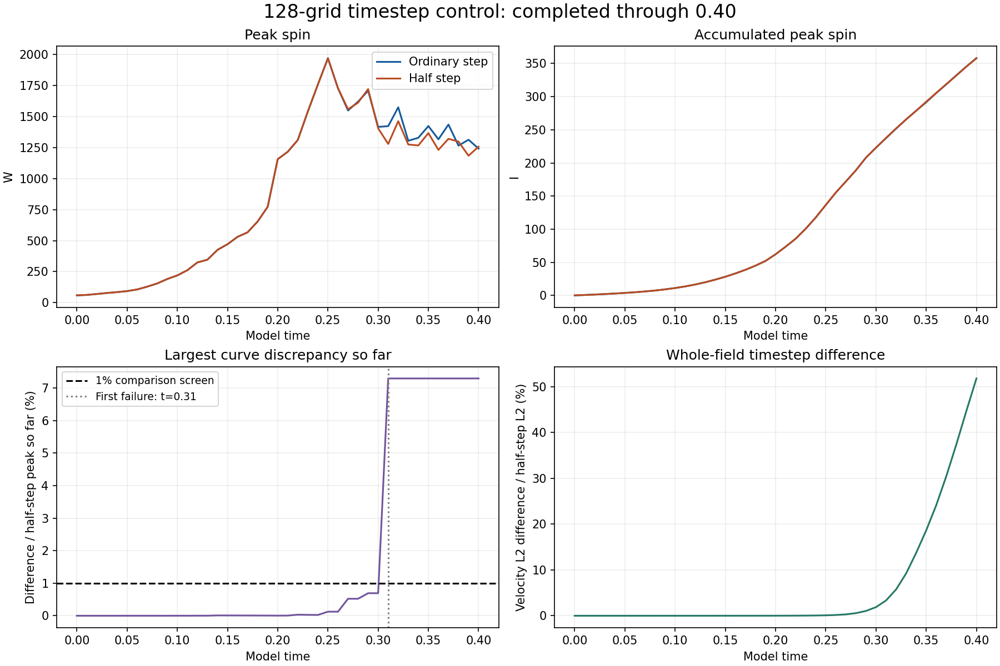
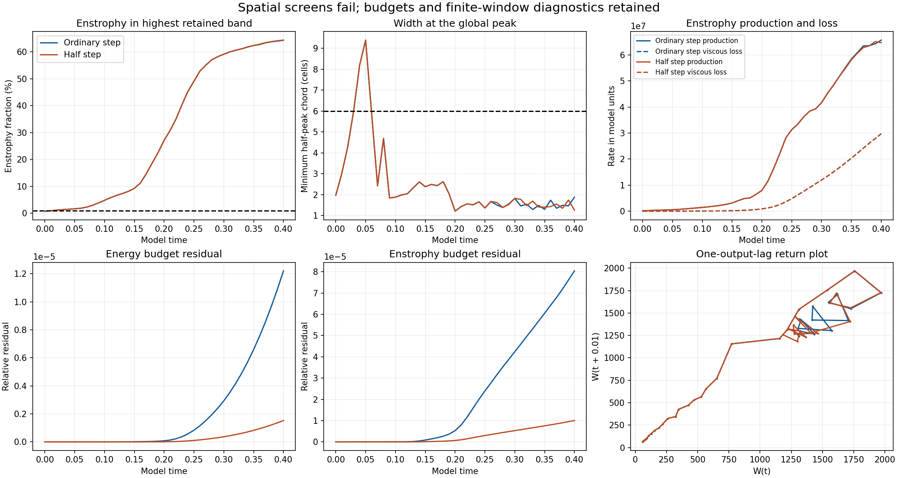

# Completed 128-grid timestep control

Both ordinary-step and half-step runs completed through **model time 0.40**. The matched-stretch matrix now has **26/48 completed results verified and published**. The remaining authorized controls continue.

## Timestep comparison

- Maximum saved W-curve difference, divided by the half-step peak: **7.292532%**. The 1% screen first fails at **t=0.31**.
- W-curve L2 difference: **4.164926%**.
- Endpoint W difference, relative to the half-step endpoint: **1.292211%**.
- Endpoint velocity-field L2 difference, relative to the half-step field: **51.823000%**.
- Endpoint I difference: **0.118445%**.

The smaller integral difference does not remove the discrepancy in peak spin. The first failure was independently traced to the saved fields and changing global-peak locations; its [dated audit](first-failure-audit.json) is retained. At t=0.31 the ordinary-step peak is at (-2.53125, 0.234375, -0.328125), while the half-step peak is at (0.1875, -2.0625, -0.28125).

## Spatial resolution and budgets

| Measurement | Ordinary step | Half step |
| --- | ---: | ---: |
| Final W | 1241.0589 | 1257.3059 |
| Peak saved W | 1970.4747 | 1968.0187 |
| Final I | 358.24925 | 357.82542 |
| Final high-band enstrophy (%) | 64.290741 | 64.33388 |
| Final global width (cells) | 1.8779597 | 1.2592611 |
| Maximum absolute relative energy-budget residual | 1.220355e-05 | 1.5235299e-06 |

Both runs fail the spatial-resolution screen at all 41 saved times. The endpoint has about 64% of enstrophy in the highest retained band, compared with the 1% screen, and a global peak width near one to two cells, below the six-cell requirement. The completed 64-to-128 ordinary-step W-curve L2 difference is **57.4356%**. Spatial convergence remains unestablished.

These results establish finite-grid timestep sensitivity. They do not establish a converged physical instability. The raw supplied strain is not smooth across periodic joins, and its initial maximum vorticity lies outside the central tube. The supplied starting construction is retained.

## Verification and model

All **41 newly completed half-step fields** and **41 ordinary-step reference fields** passed independent physical-space checks of maximum vorticity, energy, enstrophy, mean velocity and peak location. An independently written Fourier curl was used. All 41 paired velocity differences were recomputed. The maximum relative remeasurement error is **6.45e-16**. Frozen endpoint diagnostics reproduce widths, spectral tails, instantaneous enstrophy production, local stretching and budget residuals. Source hashes and identical initial arrays were checked. No trajectory was rerun.

The method remains Heun on the periodic cube of side 6, with viscosity 0.001, supplied mean velocity, and zero external force. The ordinary step is 4.878048780487805e-05; the half step is 2.439024390243903e-05. Recorded Heun-stage accumulations supply I and integrated budgets; this audit does not independently replay their time integrals.

The saved return plots, detrended autocorrelations and power spectra in [analysis.json](analysis.json) describe this short transient. They establish neither a recurrent attractor nor an asymptotic Lyapunov exponent. The mathematical model remains under examination.

## Files

- [Full measurements for both completed runs](measurements.json)
- [Comparisons and finite-window recurrence diagnostics](analysis.json)
- [Verification and all saved-field hashes](verification.json)
- [Audit code](verify.py), using the preserved [numerical implementation](../numerics.py) and local saved arrays
- [Chart code](plot.py); run with this folder as its argument to recreate the figures
- [Protocol](../protocol.json) and [all completed batches](../README.md)

The large restart arrays remain in the local workspace. Historical intake reviews and the dated first-failure audit are preserved.
