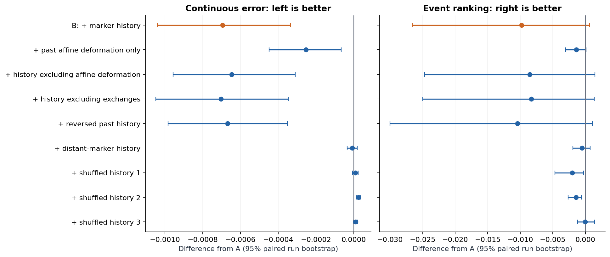
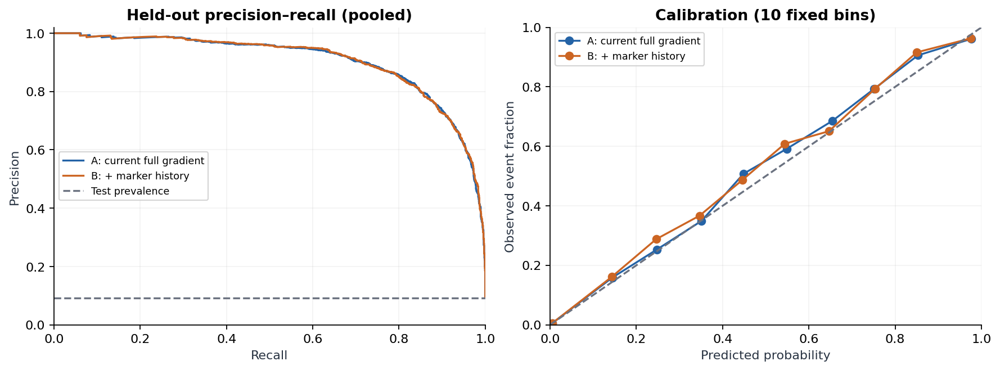

# Causal marker history prediction pilot

**A small out-of-sample continuous-error gain; event results depend on the threshold; resolution-independent benefit remains unproven.**

This study implements the marker-arrangement hypothesis in the existing matched-stretch 3D Navier–Stokes project. It reuses the unchanged parent `numerics.Flow` solver and audits all eight original marker-stress trajectory archives. Those archives share one initial-condition family and cannot constitute independent train/test runs, so a new, explicitly different **smooth random periodic initial-condition ensemble** supplies the prediction experiment. This is not a rerun of the original sharp strain/tube start.

Open [the complete report](results/report.html) for methods, all metrics, plots, controls, numerical failures/limitations, sources and interpretation. [The frozen protocol](protocol.json) specifies seeds and comparisons before evaluation.

## Main results

Thirty-two independent initial-condition seeds are split **16 train / 8 validation / 8 test**. Thirty-two additional simulations change grid, timestep or viscosity for the same test seeds and are dependent sensitivity checks. The primary target is delayed forward FTLE: prediction inputs stop at `t`, while target deformation spans `[t+0.025, t+0.225]`.

| Mean over 8 held-out runs | Current full gradient + current geometry (A) | A + causal geometry history (B) |
|---|---:|---:|
| RMSE | 0.067804 | 0.067109 |
| MAE | 0.050145 | 0.049886 |
| R² | 0.902771 | 0.904660 |
| Top-10% event average precision | 0.872350 | 0.862546 |
| Brier score | 0.023203 | 0.023281 |

The RMSE reduction is **1.025%**. The paired difference is −0.000695, with a run-bootstrap 95% interval [−0.001041, −0.000335]. The event AP difference is −0.009804, with an interval spanning zero. The stricter top-5% secondary event comparison improves AP by 0.033420, but is exploratory, sensitive to rare counts, and requires confirmation. The largest per-run AP change in that comparison comes from a run with two events.

The finer 38³ grid gives an RMSE-difference interval spanning zero. Changes to numerical target values across grids (~0.052 RMS) greatly exceed the tiny prediction gain. Trilinear velocity interpolation introduces volume error despite the spectral fluid field being divergence-free. We therefore report FTLE of the **numerical interpolated flow**, not demonstrated continuum-converged FTLE.





## What A and B observe

A has 31 current features: velocity (3), complete interpolant gradient (9), strain eigenvalues (3), strain/rotation norms and speed (3), and local geometry (13). B appends 23 history features describing pair distance changes, angular paths, neighbor turnover, alignment, finite-neighborhood affine deformation and shape changes. Current neighbors are selected at prediction time and followed backward only within the measured lookback. The target interval is strictly later. Feature names and model coefficients are in `results/`.

Neither model gets seed, particle ID, current position, time, viscosity, future position, future gradient, future velocity, or future tangent matrices. The model has an incomplete local observation; it does not observe the entire current fluid state.

Controls include equally sized current-only nonlinear features, identical-capacity trees, weaker instantaneous inputs, history-only and feature ablations, three independently permuted histories, distant-marker histories, past-time reversal, shuffled training labels and consistent particle-ID permutations. A consistent relabeling preserves features to about 1e-15. Reversed histories retain a similar small gain; the result does not demonstrate that temporal direction is essential. Stratified shuffled-label controls preserve run/time marginals and therefore need not produce chance-level AP.

## Reproduce

Python 3.12 was used. From this directory:

```text
python -m pip install -r requirements.txt
python -m pytest test_history_prediction.py -q
python simulate.py --pilot
python simulate.py --sensitivity
python evaluate.py
python audit_existing.py
python verify_results.py
python export_models.py
python report.py
```

`simulate.py --pilot` runs the first two training seeds as a compute/numerical check. `--sensitivity` then generates or verifies all 64 runs, including base runs. The original eight marker archives are only read by `audit_existing.py`. No new raw field grid snapshots are needed: positions, local gradients, velocities and tangent matrices are retained. Every data file has JSON provenance with content and solver hashes. Existing results are resumed only when hashes and configuration agree; source changes intentionally invalidate cached simulations. The completed numeric trajectories and metadata are published in [recorded-data](recorded-data/), with the original file hashes. Fresh reproductions write to the ignored `data/` directory. The recorded cache requires the exact executed source bytes (including line endings); use a fresh `data/` reproduction when your checkout differs. Do not mix runs from different protocol versions.

`evaluate.py` saves selected regularization, standardized coefficients, macro/pooled/per-run metrics, calibration bins, full held-out predictions, 2,000-replicate paired run bootstrap intervals and unadjusted paired sign-flip comparisons. Ridge and logistic hyperparameters use validation only. No test label is used for preprocessing, selection, calibration, event quantiles or probability cutoffs. Secondary sensitivity tests are one-factor comparisons, not a full factorial analysis or multiplicity-adjusted discovery claim.

For new observations with the same units and measurement definitions:

```text
python predict.py past_observation.npz forecasts.csv
```

The past-only NPZ contains `time[T]`, `positions[T,N,3]`, present `velocity[N,3]`, and present `gradient[N,3,3]` with `gradient[i,j]=du_i/dx_j`. Use nine evenly spaced times spanning the trained 0.2 lookback, including the current endpoint, and comparable marker density (training used 512 markers in volume 216). Coordinates are unwrapped or periodic in the side-6 box. The JSON models are inspectable numbers; no pickle loading is needed. The CSV reports each current marker location, future target window, predicted FTLE and event probability. This is an experimental model trained on the declared smooth-flow distribution, not a validated deployment model for arbitrary flows.

## Files and provenance

- `protocol.json`: prechosen split, solver settings, targets, feature families and comparisons.
- `simulate.py`: independent initial conditions and joint fluid/marker/tangent evolution using the parent solver.
- `features.py`: causal feature extraction and strictly later targets.
- `evaluate.py`: grouped fitting, negative controls, metrics and uncertainty.
- `audit_existing.py`: reuse/audit of the eight original marker-stress archives, excluding companion markers and clones.
- `verify_results.py`: simulation hashes, numerical sensitivity and actual-run identity invariance.
- `export_models.py`, `predict.py`: portable fitted models and past-only inference.
- `test_history_prediction.py`: analytic numerical, causality, identity, split and fitting-leakage tests.
- `report.py`: five PNG/SVG figures, HTML report and CSV tables.
- `results/verification.json`: every simulation's seed group, split, configuration, SHA-256 and numerical diagnostics.
- `results/existing_data_audit.json`: original archive paths and hashes, plus sensitivity results.
- `results/primary_models.json`: exported primary fits, verified to reproduce saved test predictions exactly.

Source repository: [NousVolition/My-Sources-Project-ALL](https://github.com/NousVolition/My-Sources-Project-ALL), source commit `17c14e89940d4c96ec9df315b1a689430d8c5ddf`. Executed parent solver byte SHA-256: `16d11a080c1559d428b33f803c1f83cfabbc3336e0bab9256989b9a2cef40d53`. The original archived solver hash is `22b169971aaf2efd56d47f685495a575e1622edd56c199b07a785fc97e952f46`; normalized source text is identical, but the Windows checkout has different line endings. The source/results bundle preserves the exact executed bytes required by the simulation cache checks. This directory is a local addition on branch `research/marker-history-prediction`; the original checkout and its unrelated in-progress work were preserved.

## Interpretation limits

This is evidence of a small predictive association in an incomplete-observation problem, with unresolved spatial accuracy. It does not identify a particular causal arrangement, marker leadership, an exact event onset time, or a future Eulerian event location. A complete deterministic present fluid state determines subsequent evolution while a unique solution exists; geometry history may proxy omitted spatial information or reduce model approximation error. Nothing here establishes a Navier–Stokes regularity result or breakthrough.

Publication checksums for the uploaded files are recorded in [publication-manifest.json](publication-manifest.json). The original source_manifest.json retains the earlier local-delivery snapshot; publication edits add navigation and data links without changing the numerical analysis.

## Spatial refinement follow-up — 2026-10-10

The [three-grid follow-up](resolution-followup/README.md) adds 12 verified simulations while keeping the original predictors frozen. At 56³ the mean RMSE benefit is about 0.7%, with a paired interval including no improvement; strong-event average precision is slightly lower for the history model. Target differences shrink with refinement, but the numerical stability thresholds still fail. Spatial convergence remains unestablished. The report also explains why reversing a history does not prove that chronology is irrelevant.

## Mirror and handedness follow-up — 2026-10-10

The [mirror follow-up](mirror-followup/README.md) verifies that all 23 existing history descriptors are insensitive to consistent spatial reflection. Three new past-turning descriptors, including signed handedness relative to present geometry, give no clear incremental prediction benefit on the reused eight test runs. Refitted invertible sign controls reproduce predictions exactly, including for reversed histories. This is an exploratory check of the representation, not evidence that arrangement or chronology is physically irrelevant. All 20 analytic and regression checks pass; no new fluid simulations were run.

## Physical velocity reversal — 2026-10-10

The [paired physical intervention](velocity-reversal/README.md) adds nine verified state reconstructions and eighteen short branches. At the same initial marker positions, opposite velocities change a mean 18% of the finer-grid high-deformation classifications and share about 30% of the high-event set. Normal continuations reproduce existing trajectories exactly. Aggregate differences agree between grids 38 and 56, while local numerical convergence remains unestablished. This changes the physical velocity and gradient, rather than merely reordering recorded history. All 24 local tests pass.

## Arrangement mirrored in both motion directions — 2026-10-10

The [four-cell mirror/direction experiment](mirror-direction/README.md) reuses nine verified full-state checkpoints and adds eighteen short joint branches plus two complete-state mirror controls. Reversing motion changes high-event labels in both clouds (18.0% original; 19.2% globally mirrored at grid 56). Mirroring finite neighborhoods around fixed centers changes their measured response with a direction-dependent interaction, while central pointwise targets remain exactly unchanged. Complete-state reflection preserves corresponding deformation within roundoff. The markers remain passive; spatial convergence remains unestablished. All 29 local tests pass.
