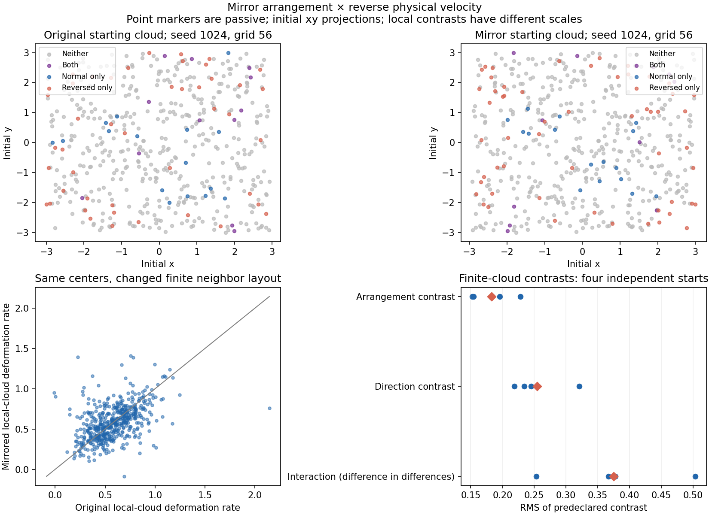

# Mirrored arrangements in both directions of fluid motion

**The finite cluster response depends on its geometry relative to the motion. The passive arrangement does not change the fluid's pointwise deformation field.** Reversing the physical velocity changes high-deformation outcomes in both the original and globally mirrored clouds. Mirroring local neighbors around fixed centers changes a finite-neighborhood deformation measure, with an effect that depends on velocity direction. These are different outcomes and cannot establish that either arrangement or direction alone controls deformation.

## Predeclared experiment

The [protocol](protocol.json) was saved before a manageable pilot. All nine paired jobs are complete and verified; no new numerical failures or interruptions occurred. The first pilot passed before the remaining jobs proceeded. This adds eighteen short fluid branch evolutions and two complete-state mirror control evolutions.

Four independent seeds (1024–1027) reuse the full Fourier velocity checkpoints at time 0.3 from the [physical reversal study](../velocity-reversal/README.md), published at commit c1374fd0330aa703e3d6fbeca20218255947486d. The smooth, divergence-free initial conditions, periodic box of side 6, zero mean, viscosity 0.02, zero force, parent Navier–Stokes solver and Heun integration are unchanged. These prediction-study fields are separate from the original strain/tube starting field, whose raw strain is not smooth across periodic joins and whose initial maxima lie outside the central tube. This experiment does not resolve that original-field limitation.

Each seed uses grids 38³ and 56³ with step 0.005. Seed 1024 also has a 56³ half-step control (0.0025). All branches advance from 0.3 to 0.5, with saved interval 0.025 and prechosen horizons 0.05, 0.1 and 0.2; 0.2 is primary. No original initial-condition replay was needed: nine existing full-state checkpoints were reused directly.

Reflection is R = diag(-1,1,1), about x=0. Both +u and -u evolve forward with positive viscosity. Negating velocity also negates the initial gradient; it is not exact backward evolution.

Three checks distinguish geometry, location and symmetry:

1. **Global four cells:** the original 512 marker positions x and mirrored positions Rx, each with +u and -u. The Eulerian field remains in its original spatial frame. Global reflection preserves distances and angles but relocates sampling; its differences do not isolate orientation from location.
2. **Anchored local neighborhoods:** retain each original center x and mirror its eight initial nearest-neighbor offsets r to x+Rr. Track 4096 virtual neighbor probes alongside the original and global clouds. These independent overlapping probe sets are diagnostics, not a single physical packing. Center, initial radii and angle Gram matrices stay fixed.
3. **Whole-state symmetry:** for seed 1024, grid 38, reflect both the fluid vector field as u_m(x)=R u(Rx) and the marker cloud, in both velocity directions.

Markers are passive and exert no force. Adding probes reproduces every original central trajectory and tangent matrix **exactly**, in all nine pairs.

## Global clouds: which labels experience strong future deformation?

The pointwise target is numerical forward FTLE, log of the largest tangent singular value divided by the horizon, with tangent matrices initialized to identity at branching. The fixed high-event cutoff is **1.0106081570657628**, inherited from the original training-only 90th percentile. It is never retuned; each cell need not have 10% positives.

At horizon 0.2 and grid 56, means across four independent runs are:

| Paired change | FTLE RMS difference | All-label event disagreement | Event intersection / union | Correlation |
|---|---:|---:|---:|---:|
| Reverse motion, original cloud | 0.21997 | 18.02% | 30.36% | 0.684 |
| Reverse motion, globally mirrored cloud | 0.22607 | 19.19% | 33.32% | 0.702 |
| Mirror global cloud, normal motion | 0.30563 | 22.85% | 17.93% | 0.175 |
| Mirror global cloud, reversed motion | 0.38079 | 30.57% | 21.87% | 0.210 |

Corresponding grid-38 event disagreements are 17.82%, 18.60%, 22.71% and 29.54%. Labels are paired across the global mirror, but their starting positions move. A label's changed result therefore does not demonstrate that deformation physically follows a mirrored arrangement.

Descriptive 2000-repeat whole-run bootstraps give direction-reversal disagreement intervals of [13.48%, 22.56%] for the original cloud and [14.06%, 24.32%] for the mirrored cloud. The sample is four reused initial conditions, with no independent new confirmatory test population. Bootstrap intervals describe this small sample; markers, grids and half-step controls are not additional independent runs.

These outcomes map **starting locations to deformation accumulated over a future interval**. They are not measurements of the exact Eulerian peak location or the onset time of the next maximum.

## Same centers: finite geometry relative to motion

For each finite cloud, a regularized least-squares map carries initial neighbor offsets to final offsets. The target is log of its largest singular value divided by horizon. Regularization is 1e-10 times the offset Gram-matrix trace (with a floor). A second diagnostic averages neighbor-center log-distance changes per horizon. Neither target is interchangeable with infinitesimal FTLE; no event cutoff is assigned to them.

Let op, om, mp and mm denote original/normal, original/reversed, mirrored/normal and mirrored/reversed finite-cloud targets. The predeclared contrasts are:

- Arrangement A = [(mp-op)+(mm-om)]/2.
- Direction D = [(om-op)+(mm-mp)]/2.
- Interaction I = (mm-mp)-(om-op).

Each contrast is evaluated at paired centers; the table averages its per-run RMS:

| Finite-cloud contrast | Grid 38 | Grid 56 | Descriptive 95% interval, grid 56 |
|---|---:|---:|---|
| Arrangement, averaged over direction | 0.18114 | 0.18275 | [0.15352, 0.21197] |
| Direction, averaged over arrangement | 0.25249 | 0.25473 | [0.22544, 0.29906] |
| Difference-in-differences interaction | 0.37043 | 0.37515 | [0.28409, 0.46921] |

The interaction means the arrangement change has different effects in the two motion directions. I uses a different scaling from A and D; its size must not be ranked as explained variance or factor dominance. Positive RMS and its bootstrap interval do not themselves supply a null hypothesis test: RMS is nonnegative.

For the pair-distance diagnostic, grid-56 RMS values are 0.03153 (A), 0.21532 (D) and 0.37390 (I). Dependence on the measurement makes a universal statement that “arrangement dominates” or “direction dominates” unjustified.

In a uniform affine flow, our analytic test finds the same largest-singular-value cloud target after reflecting neighbors in the unchanged field. The differences here involve spatially nonuniform flow sampled over finite neighbor offsets, plus numerical error. Changing those probes changes what is measured; it does not reorganize the fluid's stress.

## Symmetry, identity and numerical checks

Reflecting the **complete fluid state and markers together** reproduces reflected trajectories and tangents within 8.88e-16 in both directions. Pointwise target discrepancies are at most 1.31e-14 across all horizons, and 5.89e-15 at horizon 0.2. The consistent whole-state mirror preserves deformation for corresponding labels in this pilot.

Reflecting neighbors around unchanged centers leaves each center's pointwise FTLE unchanged because centers and fluid fields are unchanged. Initial distance and angle-Gram discrepancies are zero. Consistent particle-label permutation in the new tests preserves the geometry calculation; persistent IDs are not inputs to this intervention.

Across the eighteen joint evolutions, maximum CFL is 0.11521, maximum relative energy-budget residual is 2.21e-8, and spectral divergence is below 2.53e-16. However, inherited trilinear marker interpolation is not exactly divergence-free: maximum probe tangent-volume error reaches **5.70%** over all 5120 probes. Good Eulerian budgets do not eliminate local interpolation error.

The half-step control changes pointwise targets by RMS 0.000593–0.000667 across the four cells; all four event sets are identical. Finite-cloud target RMS changes are 5.40e-6–6.73e-6. Across seeds/cells, grid-38 versus grid-56 pointwise RMS differences are 0.02642–0.04469, and finite-cloud differences are 0.00795–0.05071. Aggregate contrasts are similar, but **spatial convergence remains unestablished**. Two grids and one dependent time-step control are insufficient to certify local deformation locations.



The upper panels show initial x-y projections colored by future pointwise events for one illustrative seed. The lower panels show anchored finite-cloud values and per-run contrast RMS; the interaction has different scaling.

## Provenance and reproduction

[recorded-data](recorded-data) contains nine new NPZ trajectory archives and nine metadata files. Metadata records raw SHA-256 hashes for each new archive, its reused trajectory archive, full-state checkpoint and executed sources. [execution.json](execution.json) and [pilot.json](pilot.json) record completion. [results.json](results.json), [per-run.csv](per-run.csv) and [targets.npz](targets.npz) include per-run, all-horizon, grid and half-step comparisons. Publication file checksums are in [publication-manifest.json](publication-manifest.json).

The 27 reused trajectory/metadata/checkpoint files were verified against GitHub blob hashes before the new runs. Full source-hash checks also passed. The executed runner SHA-256 is a0a27be014ffd0d2f066cd2826634ab663c049db1233ccd03ad4e5454ea92362; the analysis SHA-256 is 3cd6a1492b2fc7cd8d464c3303d00fcdcea9228150e4e80654ff60ef184bdb6c. The unchanged parent numerical source has executed CRLF-byte hash 16d11a080c1559d428b33f803c1f83cfabbc3336e0bab9256989b9a2cef40d53. Analysis permits only LF/CRLF-equivalent source checks; actual edits fail validation. Simulation cache reuse requires exact executed-source bytes.

**All 29 local analytic and regression tests pass**, recorded in [tests.xml](tests.xml). Five new tests cover reflected vector dynamics, anchored geometry and label permutation, passive-probe independence, affine finite-cloud deformation, and known factorial contrasts. The initial four-test invocation had a pytest cache permission warning; the final full suite disables that cache and uses a fresh workspace temporary directory.

After installing the parent requirements, regenerate analysis from the published archives:

```text
python reports/matched-stretch/history-prediction/mirror-direction/analyze.py
python -m pytest reports/matched-stretch/history-prediction/test_history_prediction.py reports/matched-stretch/history-prediction/resolution-followup/test_analysis.py reports/matched-stretch/history-prediction/mirror-followup/test_chirality.py reports/matched-stretch/history-prediction/velocity-reversal/test_reversal.py reports/matched-stretch/history-prediction/mirror-direction/test_mirror_direction.py -q -p no:cacheprovider
```

The sibling velocity-reversal archives and checkpoints must be present. The runner supports --pilot and validates completed caches before reuse. To regenerate simulations with different platform/source bytes, preserve originals and use an isolated copy with an empty new mirror-direction/recorded-data folder. This experiment reused the required study environment; it did not change or restart other numerical matrices.

## What this does and does not establish

The current evidence supports a response of finite sampled geometry that depends on its relation to the direction and spatial variation of motion. The underlying strong-deformation field belongs to the evolving fluid state; passive marker arrangement cannot move it. Global rearrangement changes sampling positions, while a complete-state mirror transforms corresponding locations without changing their deformation.

This is a physical forward-velocity intervention and a diagnostic geometry intervention. It does not repeat, refit or strengthen the earlier history predictor's out-of-sample score, and it does not establish material memory, arrangement-induced stress, leadership, or a Navier–Stokes breakthrough.
