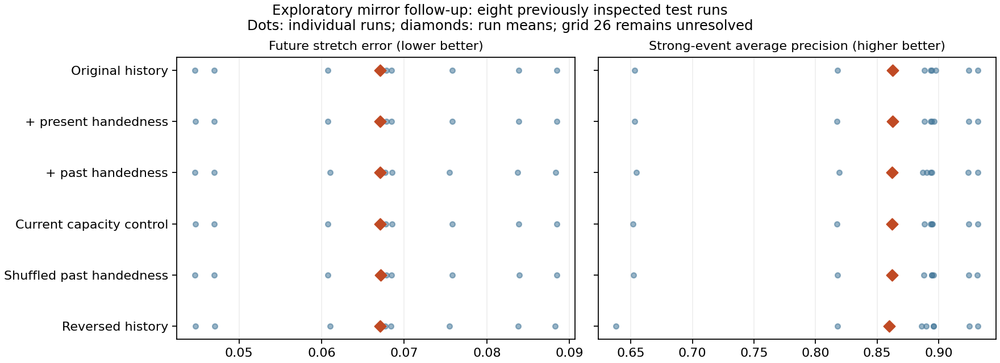

# Mirrored and reversed marker histories

The original 23 history summaries cannot distinguish a consistently reflected arrangement from its mirror. Adding three signed/unsigned turning measurements produced a tiny, uncertain reduction in prediction error and no clear strong-event benefit. Refitting after invertible sign changes produced exactly the same predictions, including for reversed histories. This does **not** show that arrangement, chronology, or handedness is physically irrelevant.

## What was tested

No new fluid simulations were run. This follow-up reuses all 32 original smooth-initial-condition runs at grid 26, viscosity 0.02 and step 0.005: seeds 1000–1015 train, 1016–1023 validation, 1024–1031 test. These are distinct from the original nonsmooth strain/tube simulations. All five original anchors, 512 markers, eight neighbors, 0.2 lookback, 0.025 prediction gap and 0.2 future horizon were retained. The target and past input intervals remain disjoint.

The [protocol](protocol.json) and feature definitions were written before these fits. However, the original test runs had already been examined in earlier studies: this is an exploratory analysis of reused held-out runs, **not fresh confirmation**. Regularization and event decision thresholds are selected using only the original validation runs; the event target uses the training-only 90th percentile. Paired confidence intervals resample entire test runs, 2000 times. Model families, candidate regularizations and scoring are unchanged from the original study.

### A consistent spatial mirror

For R = diag(-1,1,1), positions and velocities are reflected by R and gradients by R J R. The numerical tangent matrices transform by R M R, preserving their forward singular-value target. Reversing a history only reorders the known past; it is not a backward solution of viscous Navier–Stokes. Neighbor selection is always made at the original prediction instant before reversing the recorded window.

Across **160 windows / 81,920 marker-window observations**:

| Check | Maximum absolute discrepancy |
|---|---:|
| Original 23 history summaries before/after consistent mirror | 3.55e-14 |
| Reversed 23 summaries before/after consistent mirror | 6.22e-14 |
| New present signed feature versus its predicted mirror sign | 2.58e-15 |
| New past features versus their predicted mirror signs | 2.12e-16 |
| New past features versus their predicted reversal signs | 0 |
| Consistent particle-array permutation | 0 |
| Future stretch target under reflected tangent matrices | 0 |

Only history summaries are mirror invariant in this audit. The original present-input vector contains signed velocity and gradient components; a frozen full predictor has not thereby been shown reflection invariant.

### Features that can distinguish handedness

[chirality.py](chirality.py) computes a current signed geometry feature c from the normalized determinant of three distance-weighted neighbor-direction averages, with weights 1, relative distance, and relative distance squared. Zero denominators use zero. It uses no particle identifiers or arbitrary ordering of neighbors. It is unchanged under translations and proper rotations and changes sign under reflection. Degenerate or symmetric configurations can give zero; this is one descriptor, not a complete description of chirality.

For each tracked neighbor, the determinant of its unit offset vectors at the beginning, middle and end of the lookback measures signed nonplanar turning. The three added features are its neighbor mean p, mean absolute value a, and p*c. The product measures a relationship between past and present handedness without an absolute preference for left or right. Under a consistent full reflection, c and p change sign while a and p*c do not. Reversing the selected past changes the signs of p and p*c.

These descriptors use three snapshots, rather than capturing every detail of the path. A zero determinant can reflect planar motion or cancellation, not absence of organization. Repeated-eigenvalue and exact nearest-neighbor-tie edge cases in the parent descriptors are not resolved by this study.

## Predictions

The comparison baseline below already includes the original full present gradient and all 23 original histories. This specifically asks whether the new handedness descriptors add information beyond that model; it does not replace the original A-versus-B question.

| Model | Inputs | Mean run RMSE ↓ | Mean run event AP ↑ |
|---|---:|---:|---:|
| Original history model | 54 | 0.06710901 | 0.86254575 |
| Plus current handedness c | 55 | 0.06710787 | 0.86240005 |
| Plus past p, a, p*c | 58 | 0.06706426 | 0.86185787 |
| Matched count: current c², c³, c⁴ instead | 58 | 0.06711218 | 0.86205827 |
| Matched count: shuffled three-feature past blocks | 58 | 0.06711980 | 0.86227177 |
| Reversed original histories and new past features | 58 | 0.06706446 | 0.85998841 |

Adding the three past descriptors to the model containing c reduces mean RMSE by **0.065%**. The paired difference is -0.00004361, with 95% interval **[-0.00015297, +0.00007469]**. Event average precision changes by -0.00054218, interval **[-0.00230985, +0.00079598]**. Comparisons against the equal-input-count current and shuffled controls also have intervals containing zero. No reliable incremental benefit is established. Because the added block contains both signed and unsigned terms, any block-level difference would not on its own identify a signed effect.



Full per-run RMSE, MAE, R², average precision, Brier score, log loss, calibration bins, precision/recall, validation choices and paired intervals are in [results.json](results.json). [predictions.npz](predictions.npz) preserves every held-out prediction and target.

### Why a mirror can be learned away

Two explicit representation controls flip p and p*c while keeping current inputs fixed, then refit the same regularized models. Both ordinary and reversed-history predictions and probabilities match their respective unflipped counterparts exactly (maximum difference 0). An invertible sign transformation retains information, and a linear model with symmetric regularization can compensate by changing coefficient signs.

This control is a sign transformation of the three new historical inputs. It is **not** an independently simulated physical mirror of the history while holding the present flow fixed. The physically consistent mirror was audited separately above. Reflecting past positions alone can change their relationship to the unchanged present strain and create an inconsistent past/present pair; degradation in such a test would not isolate a causal role of handedness.

## Reproduction and provenance

Run from the repository root after installing the parent requirements:

```text
python reports/matched-stretch/history-prediction/mirror-followup/analyze.py
python -m pytest reports/matched-stretch/history-prediction/test_history_prediction.py reports/matched-stretch/history-prediction/resolution-followup/test_analysis.py reports/matched-stretch/history-prediction/mirror-followup/test_chirality.py -q
```

The default data folder is the already published `../recorded-data`. The executed local command used `--data ../data` with identical archived bytes. All 32 NPZ and 32 metadata files were verified against their published Git blob hashes at base commit `57cb3ce1bb2fa0c677952782011f775ad26d8f7d`. `results.json` records exact data and executed-source SHA-256 hashes; the parent solver's existing LF/CRLF distinction remains documented in the parent report. No active numerical source or controller was modified. [tests.xml](tests.xml) records **20 passing tests**, including reflection, rotation, reversal, label/translation invariance, planar/static geometry and past-only access.

The [three-grid report](../resolution-followup/README.md) remains the numerical accuracy assessment: spatial convergence is **unestablished**, and the finest-grid original prediction gain includes zero in its uncertainty interval. This mirror follow-up uses only grid 26 and cannot strengthen that convergence claim. It does not identify a causal arrangement, prove chronology unimportant, establish material memory, model human memory, or demonstrate a Navier–Stokes breakthrough.
