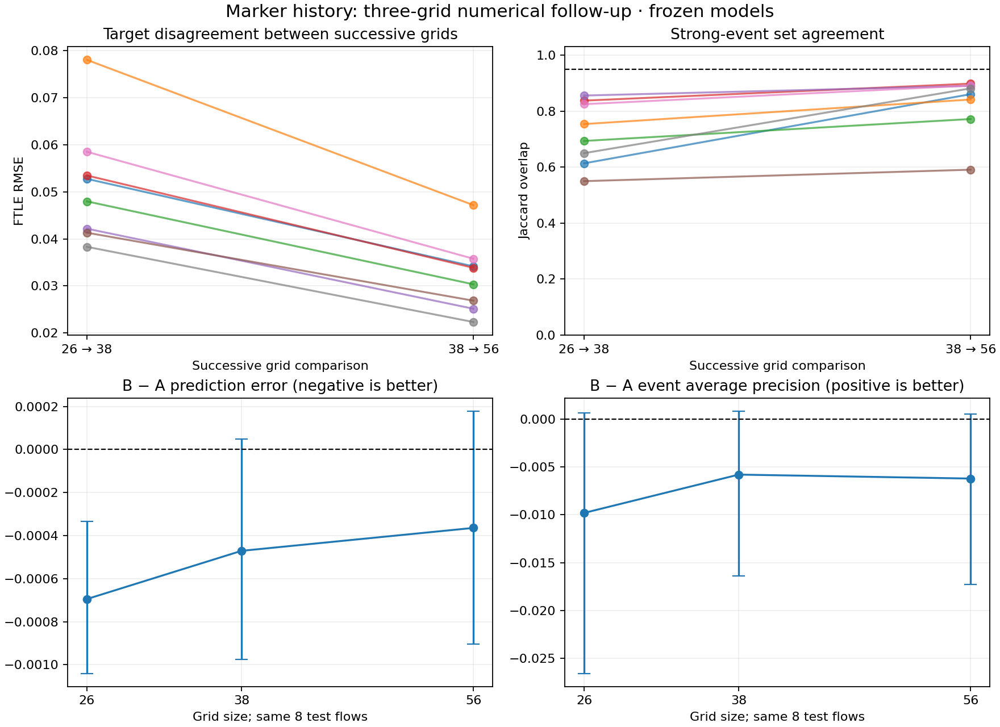

# Marker-history spatial-resolution follow-up

**Spatial convergence remains unestablished.** This bounded follow-up reuses the original 26³/38³ data and adds 56³ for the same eight held-out initial conditions. It also halves the timestep on grids 38³ and 56³ for two prechosen seeds. All 12 new runs retain the same smooth initial fields, viscosity, duration, marker labels, observation times and unchanged Navier–Stokes solver. No predictor was refitted.

These are refinements of the smooth-flow prediction pilot, separate from the original sharp strain/tube matrix. The original test seeds have already been examined; this follow-up is exploratory numerical validation, not a fresh independent statistical confirmation.

A uses current velocity, the full present local velocity gradient and current neighbor geometry. B uses exactly those inputs plus causal marker-history features. Neither predictor observes future positions or persistent marker identity.

| Grid | A RMSE | B RMSE | B − A RMSE (95% paired run interval) | A event AP | B event AP |
|---|---:|---:|---|---:|---:|
| 26³ | 0.067804 | 0.067109 | -0.000695 [-0.001041, -0.000335] | 0.872350 | 0.862546 |
| 38³ | 0.057718 | 0.057247 | -0.000471 [-0.000974, 0.000048] | 0.922345 | 0.916542 |
| 56³ | 0.050839 | 0.050475 | -0.000364 [-0.000905, 0.000177] | 0.918751 | 0.912535 |



Each colored line in the upper panels is one held-out flow. Lower-panel error bars are 95% intervals from 2,000 paired bootstraps of the same eight independent seed groups, not bootstraps of individual markers.

| Successive grids | Mean target RMSE | Mean relative target RMSE | Mean event-set Jaccard |
|---|---:|---:|---:|
| 26-38 | 0.051579 | 7.015% | 0.7224 |
| 38-56 | 0.031963 | 4.323% | 0.8283 |

Events use the original training-derived threshold at every grid, never a new per-grid quantile. Jaccard measures overlap of the sets of material markers classified as strong future deformation; the future Eulerian location and exact first onset are not predicted here.

## Predeclared numerical screens

- Target differences decrease for all eight flows: **pass**.
- Finest-pair target change is below 1% for every flow: **fail**.
- Finest-pair event-set overlap is at least 95% for every flow: **fail**.
- Timestep change is below one tenth of grid change in the checked flows: **pass**.

These tolerances are operational screens, not a proof. Decreasing differences alone do not establish an asymptotic regime. No Richardson order or extrapolated continuum answer is claimed. Three-grid checks and their assumptions follow [NASA's spatial convergence guidance](https://www.grc.nasa.gov/www/wind/valid/tutorial/spatconv.html).

## Timestep checks

- Grid 38³, two prechosen seeds: mean target change on halving timestep = 0.00086781.
- Grid 56³, two prechosen seeds: mean target change on halving timestep = 0.000702285.

## Interpolation diagnostic

The underlying spectral fluid is divergence-free to numerical roundoff, but the velocity interpolated between cells need not be. The gradient saved for each marker is the exact derivative of that interpolant. The following are means over the eight runs; the divergence RMS uses all saved times and markers.

| Grid | Maximum spectral-field divergence | Interpolated divergence RMS |
|---|---:|---:|
| 26³ | 3.28e-16 | 0.0945339 |
| 38³ | 4.68e-16 | 0.0657011 |
| 56³ | 4.56e-16 | 0.0455371 |

This diagnoses an interpolation contribution, not a complete decomposition of all target error. Changing the interpolation would require a separately documented measurement/integration variant and fresh validation.


## What can be concluded

The original small continuous-error benefit was out of sample with respect to initial-condition seeds. Its physical interpretation still depends on numerical accuracy. Marker relabeling invariance demonstrates that the code uses geometry rather than persistent identity; it does not by itself demonstrate predictive usefulness, causal influence, or a necessary role for the direction of time. The original reversed-history control retained a similar benefit.

Trilinear interpolation and its piecewise spatial derivative contribute to the grid dependence of the numerical FTLE. Frozen coarse-trained models may also shift under refined observations. Stronger evidence would require a sufficiently stable velocity/gradient interpolation and trajectory/tangent calculation, additional resolved grid checks, then independently held-out model comparisons with numerical uncertainty small relative to the claimed benefit.

The finest-pair target change is 87.7 times the absolute A/B RMSE difference at grid 56. This is a scale comparison, not a statistical error bar on the paired A/B difference; numerical errors can be correlated across predictors.

Reversing a past history preserves its collection of geometries and transforms several features only by sign. Because the reversed-history predictor was trained on those transformed features, it can compensate. This is a limited control: its similar score does not prove that chronology is physically irrelevant. The study measures stretching/deformation, not mechanical power, and does not establish that the location of power matters more than its organization.

## Separate original matched-stretch matrix

Snapshot comparison uses exactly 8 common samples through t=0.07 for grids 64³, 128³ and 256³. It does not compare different time windows.

- 64-128: maximum-vorticity curve relative difference 13.498%; energy 3.306%; enstrophy 1.491%.
- 128-256: maximum-vorticity curve relative difference 15.900%; energy 0.835%; enstrophy 0.387%.

Partial original matrix. Nonsmooth periodic joins and off-central initial maxima retained. These global vorticity comparisons do not validate marker FTLE or the smooth-flow prediction pilot.

## Reproduce and audit

From this directory, using the original study environment:

```text
python -B run_refinement.py --pilot
python -B run_refinement.py
python -B analyze.py
python -B -m pytest test_analysis.py -q
```

The optional `--matched-root` argument takes the local original matched-stretch-study directory and reads a snapshot only. Numerical hashes and per-run metrics are in `results.json`, raw new trajectories with provenance in `recorded-data/`, predictions in `predictions.npz`, and the bounded design in `protocol.json`. Reused raw data are in the parent study's `recorded-data/` (local execution may use `data/`). No original source or completed result is overwritten.

To audit the published data directly, run `python -B analyze.py`; new simulations are unnecessary. Analysis verifies every data SHA-256 and source hashes, permitting only LF/CRLF variants of otherwise identical current source. The original simulation cache remains stricter and requires exact executed source bytes, including line endings; its recorded Windows solver SHA-256 is `16d11a080c1559d428b33f803c1f83cfabbc3336e0bab9256989b9a2cef40d53`, while the published LF parent is `22b169971aaf2efd56d47f685495a575e1622edd56c199b07a785fc97e952f46`. Their normalized text was verified identical. Run regeneration in a separate fresh study checkout when its source bytes differ from the archived cache.
