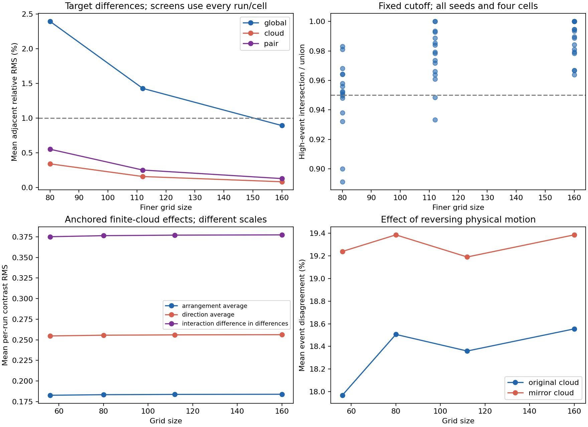

# Initial stage through grid 160: spatial refinement

**The strict spatial-convergence claim remains unestablished: some predeclared numerical-stability screens fail.**

This study tests the same four reused initial conditions at finer grids, with a common saved fluid state and identical marker positions. Arrangement/direction effects and convergence of individual deformation outcomes are evaluated separately. A surviving aggregate effect does not certify local event locations.

## Frozen design and scope

The [protocol](protocol.json) was frozen before the grid-80 pilot. Seeds 1024–1027 start from their verified grid-56, step-0.005 full Fourier checkpoints at time 0.3 from the [velocity-reversal study](../velocity-reversal/README.md). Exact Fourier mode transfer, with FFT normalization, supplies the same band-limited present velocity field at every resolution. Central positions, global mirror positions, neighbor identities and anchored reflected offsets are identical across grids. No initial-condition replay was needed.

The main grid ladder is 56³, 80³, 112³, 160³, with time step 0.0025, half the previous study's step. All four seeds use each grid. Seed 1024 additionally uses step 0.00125 at grids 112, 160. The initial scope is sixteen main pairs and two half-step pairs; the predeclared grid-224 extension adds four main pairs and one half-step pair only if initial screens fail. This completed record contains 18 pairs / 36 forward fluid evolutions, including the pilot once through cache reuse.

Every branch uses the unchanged parent Navier–Stokes solver, Heun method and periodic trilinear velocity sampler with its exact piecewise spatial Jacobian. Domain side 6, viscosity 0.02, zero mean and zero force are preserved. Branches evolve for 0.2 model-time units; saved horizons are 0.05, 0.1 and 0.2, with primary horizon 0.2. Velocity negation is a forward physical intervention with positive viscosity, not exact backward evolution.

The four cells are original/global-mirrored marker clouds in normal/reversed fluid motion. A global mirror moves starting locations relative to a fixed-frame fluid field. For anchored geometry, eight neighbor offsets around each unchanged center are reflected. The 4096 virtual neighbor probes are independent overlapping diagnostic clouds, not a physical packing. All 5120 probes remain passive. They cannot move the fluid's deformation field or alter its stress.

The pointwise target is forward log-largest-tangent-singular-value / horizon (numerical FTLE). High events use the unchanged original training cutoff **1.0106081570657628**. Finite-cloud deformation is a regularized least-squares offset-map log-singular-value rate; the pair target is mean neighbor-center log-distance change / horizon. Those finite targets have no binary cutoff and are not interchangeable with pointwise FTLE. The cloud regularization remains 1e-10 times the Gram trace, with a floor.

## Do arrangement and direction effects persist?

Means below average whole independent runs, rather than pooling labels or treating grids as new seeds.

| Grid | Original-cloud direction RMS difference | Original event disagreement | Original event Jaccard | Mirrored event disagreement | Mirrored event Jaccard |
|---|---:|---:|---:|---:|---:|
| 56 | 0.21995 | 17.97% | 30.50% | 19.24% | 33.21% |
| 80 | 0.21941 | 18.51% | 29.94% | 19.38% | 33.18% |
| 112 | 0.21960 | 18.36% | 30.82% | 19.19% | 33.93% |
| 160 | 0.21980 | 18.55% | 30.23% | 19.38% | 33.55% |

For anchored finite clouds let op, om, mp and mm denote original/normal, original/reversed, mirrored/normal and mirrored/reversed. A=[(mp-op)+(mm-om)]/2, D=[(om-op)+(mm-mp)]/2, I=(mm-mp)-(om-op). The table averages each contrast's per-run RMS. I has different scaling; these numbers do not partition variance or establish which factor dominates.

| Grid | Arrangement A, cloud | Direction D, cloud | Interaction I, cloud | Arrangement A, pair | Direction D, pair | Interaction I, pair |
|---|---:|---:|---:|---:|---:|---:|
| 56 | 0.18274 | 0.25473 | 0.37514 | 0.03153 | 0.21532 | 0.37390 |
| 80 | 0.18344 | 0.25562 | 0.37643 | 0.03175 | 0.21606 | 0.37489 |
| 112 | 0.18377 | 0.25604 | 0.37706 | 0.03185 | 0.21641 | 0.37539 |
| 160 | 0.18395 | 0.25627 | 0.37740 | 0.03190 | 0.21660 | 0.37565 |

Descriptive 2000-repeat bootstraps resample the four whole runs. At the finest grid, finite-cloud contrast intervals are:
- arrangement_average: [0.15437, 0.21353].
- direction_average: [0.22671, 0.30120].
- interaction_difference_in_differences: [0.28573, 0.47179].

These are four reused seeds, not a fresh confirmatory population. RMS is nonnegative, so an interval above zero is not itself a null test. Geometry effects reflect how finite offsets sample nonuniform motion; they do not establish arrangement-induced stress, material memory or persistent-identity control. The consistent-label permutation, passive-probe independence, affine-map and whole-state mirror controls from the parent suite remain applicable. No history predictor was refitted or newly scored out of sample.

## Numerical refinement and frozen screens

The required finest-pair target relative RMS difference is at most 1% in every seed/cell/family, normalized by the finer target's RMS. Pointwise high-event Jaccard must be at least 0.95 in every seed/cell. Successive RMS differences must contract. Finest-grid time-step differences on seed 1024 must be at most one tenth of its adjacent spatial differences. Per-run anchored contrast RMS and global direction RMS must drift by at most 5% between the finest pair. These are operational finite-run screens, not a mathematical convergence proof.

| Adjacent grids | Pointwise relative RMS range | Cloud relative RMS range | Pair relative RMS range | Minimum pointwise event Jaccard | Maximum shared-band Eulerian relative RMS |
|---|---:|---:|---:|---:|---:|
| 56→80 | 1.829–2.914% | 0.276–0.446% | 0.431–0.668% | 0.89130 | 1.096e-05 |
| 80→112 | 1.067–1.728% | 0.122–0.206% | 0.201–0.325% | 0.93333 | 1.325e-07 |
| 112→160 | 0.639–1.171% | 0.067–0.107% | 0.104–0.166% | 0.96386 | 3.355e-14 |

| Screen | Passed / evaluated |
|---|---:|
| difference_contracts | 96 / 96 |
| relative_target_RMSE | 44 / 48 |
| event_Jaccard | 16 / 16 |
| effect_relative_drift | 32 / 32 |
| temporal_fraction | 12 / 12 |

Every failed screen is retained below; tolerances were not relaxed after seeing results.

| Screen and identifier | Value | Required |
|---|---:|---:|
| relative_target_RMSE: s1024/global/mirror_normal | 0.0117078 | <= 0.01 |
| relative_target_RMSE: s1025/global/original_normal | 0.0115295 | <= 0.01 |
| relative_target_RMSE: s1025/global/mirror_normal | 0.0109876 | <= 0.01 |
| relative_target_RMSE: s1025/global/mirror_reversed | 0.0105701 | <= 0.01 |

The frozen pass/fail screens apply to the primary horizon 0.2 only. Shorter horizons are descriptive checks, with no newly calibrated event threshold. Their finest-pair differences are:

| Horizon | Pointwise relative RMS range | Cloud relative RMS range | Pair relative RMS range |
|---|---:|---:|---:|
| 0.05 | 1.220–1.899% | 0.075–0.143% | 0.129–0.190% |
| 0.1 | 0.911–1.574% | 0.072–0.126% | 0.115–0.166% |

## Temporal, interpolation and solver diagnostics

| Main grid | Max CFL | Max absolute relative energy residual | Max spectral divergence | Max probe tangent-volume error |
|---|---:|---:|---:|---:|
| 56 | 0.05760 | 2.749e-09 | 1.940e-16 | 3.994% |
| 80 | 0.08231 | 2.749e-09 | 2.914e-16 | 3.423% |
| 112 | 0.11522 | 2.749e-09 | 1.744e-16 | 1.789% |
| 160 | 0.16462 | 2.749e-09 | 2.921e-16 | 1.318% |

The Eulerian comparison uses normalized endpoint Fourier coefficients on the shared grid-56 frequency band; it does not measure omitted fine-grid modes. High-band energy fractions are recorded separately. The inherited trilinear interpolant is not exactly divergence-free and its Jacobian jumps at grid-cell faces. Good Eulerian budgets cannot remove that marker error. Successive target-difference alignment is recorded, so shrinking norms are not automatically treated as a smooth signed error expansion. No unsupported Richardson extrapolation or formal order is inferred. This follows the distinction between decreasing grid differences and an established asymptotic error regime in the [NASA grid-convergence guidance](https://www.grc.nasa.gov/www/wind/valid/tutorial/spatconv.html).

| Half-step grid, seed 1024 | Pointwise RMS difference range | Cloud RMS difference range | Pair RMS difference range | Minimum pointwise event Jaccard |
|---|---:|---:|---:|---:|
| 112 | 2.054e-04–2.208e-04 | 1.411e-06–1.562e-06 | 5.151e-07–5.684e-07 | 1.00000 |
| 160 | 1.641e-04–2.074e-04 | 1.417e-06–1.499e-06 | 5.153e-07–5.691e-07 | 1.00000 |

## Provenance, execution and reproduction

[input-verification.json](input-verification.json) records the 27 reused archive/checkpoint/metadata/source files checked against GitHub before launching. New per-job metadata records exact trajectory and endpoint-spectrum hashes, the common reference checkpoint hash, transfer invariants, executed-source hashes and diagnostics. [execution.json](execution.json) records the initial matrix; any required extension has a separate execution record. [extension-decision.json](extension-decision.json) retains the initial screen failures. Publication hashes are in [publication-manifest.json](publication-manifest.json).

[scheduling-audit.json](scheduling-audit.json) and per-job claims/logs document disjoint parallel scheduling. The first short-lived-shell launch never initialized numerical work; it created no claims, data or checkpoints. The persistent launcher was verified before retrying. Completed caches are verified by exact source/data hashes. Partial checkpoints are preserved and refused by the sequential controller before any integration; if it arrives before a helper completes, it waits through a documented guarded restart. Numerical sources were not modified while active. Recovery checkpoints are local restart evidence, not published bulk data.

The [results](results-160.json), [all-horizon target arrays](targets-160.npz), [grid comparison table](grid-comparisons-160.csv), individual [recorded trajectories and shared-band spectra](recorded-data) and [plot](convergence-160.png) support the numerical tables. In grid/time comparison records, inherited helper keys named normal/reversed denote the first/second supplied array (coarser/finer grid or main/half step), rather than a change in motion direction. The complete parent and new transfer test suite passed **32 tests**, recorded in [tests.xml](tests.xml). Original long matrices and previously completed studies were not restarted.

```text
python reports/matched-stretch/history-prediction/spatial-convergence/analyze.py
python reports/matched-stretch/history-prediction/spatial-convergence/build_report.py
python -m pytest reports/matched-stretch/history-prediction/test_history_prediction.py reports/matched-stretch/history-prediction/resolution-followup/test_analysis.py reports/matched-stretch/history-prediction/mirror-followup/test_chirality.py reports/matched-stretch/history-prediction/velocity-reversal/test_reversal.py reports/matched-stretch/history-prediction/mirror-direction/test_mirror_direction.py reports/matched-stretch/history-prediction/spatial-convergence/test_refinement.py -q -p no:cacheprovider
```

Install the parent requirements and retain the sibling reversal/mirror archives and full reference checkpoints. The sequential runner supports --pilot and --extension; extension execution requires the saved frozen-screen decision. Preserve originals and use an isolated empty output directory for regeneration on a platform with different source bytes. Simulation cache reuse is byte-strict; analysis allows only LF/CRLF-equivalent source verification, not actual source edits.

## Scope of any convergence conclusion

The common t=0.3 field is a saved band-limited input. Refinement tests evolution and marker interpolation from that identical present state. It does not establish continuum accuracy of the earlier state preparation, the full history-prediction experiment, other Reynolds numbers, or the separate original strain/tube matrix. That original raw strain remains nonsmooth across periodic joins, with initial maxima outside the central tube.

Reported events associate initial locations with deformation accumulated over a future interval. They do not establish exact Eulerian peak onset or location. These results cannot show physical material memory, a marker arrangement forcing the flow, leadership, or a Navier–Stokes breakthrough.




This preserves the completed initial stage. The final study report is [README.md](README.md).
