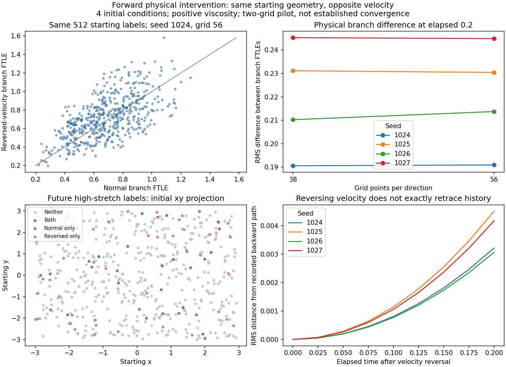

# Same marker arrangement, opposite fluid motion

**Reversing the physical velocity changes which starting markers later experience strong deformation in this pilot.** Across four independent initial conditions, at grid 56, a mean **18.0% of all markers** change their high-deformation classification and the normal/reversed branches share a mean **30.4% of the high-deformation set** (intersection divided by union, averaged over runs). The corresponding values at grid 38 are 17.8% and 29.7%.

This is a forward physical intervention: the same arrangement is subjected to opposite velocity fields. It changes the present velocity gradient as well as motion. It does not isolate a causal effect of past geometry while holding the present fluid state fixed. The original markers remain passive and exert no forces on the fluid.

## Paired experiment

The [protocol](protocol.json) was frozen before running the pilot. Seeds 1024–1027 reuse the original smooth, divergence-free Fourier initial conditions, periodic domain of side 6, mean zero, viscosity 0.02, no forcing, and the unchanged parent Navier–Stokes solver and joint Heun marker/tangent integration. These are separate from the original nonsmooth strain/tube field and its long-running matrix.

At time 0.3, each complete Eulerian velocity field and its 512 marker positions were cloned. One branch continues with +u; the other begins with -u. Both then evolve forward to time 0.5 with the same positive viscosity. Tangent matrices start from identity at the branch instant. The recorded horizons are 0.05, 0.1 and 0.2; the prechosen primary horizon is 0.2. There is no prediction gap in this intervention. The target is log of the largest forward tangent singular value divided by the horizon.

The initial arrangement is identical **within each pair**. Full velocity gradients negate under reversal, and initially expanding directions become contracting directions. The initial energy is the same. Both dynamics and subsequent geometry can diverge. A passive point marker has no front or back; signed deformation relative to neighbor offsets and the cluster's principal axis supplies the relevant orientation measurements.

Both grid 38 and 56 were run for all four seeds, with step 0.005. Seed 1024 at grid 56 was additionally run with step 0.0025. Total: **nine reconstructed states and eighteen short branches**. The normal branches are reproduction controls, not new independent initial conditions. The smaller-step pair is a dependent numerical control.

The earlier trajectory archives contain no full Eulerian field checkpoint. Each branch state therefore required a documented deterministic replay of the original start to time 0.3. Every reconstructed position, sampled velocity, gradient and prior tangent matrix matched its saved archive **exactly**. Normal branch positions, velocities and gradients also matched the original archive exactly through time 0.5; relative tangent target differences were at most **2.17e-14**. This replay is necessary reconstruction, not a repeat of the original 48-job matrix.

## Which starting locations become high deformation?

The event cutoff was fixed at **1.0106081570657628**, the original training-only 90th-percentile FTLE threshold. It is applied to both branches at horizon 0.2 and is not recalibrated to make either branch have 10% positives. The earlier predictor used a delayed window; these immediate branch events are a separate intervention outcome, not a re-evaluation of that predictor's forecast metrics.

| Seed, grid 56 | Normal events | Reversed events | Shared events | All-marker classification changes | Event intersection / union |
|---|---:|---:|---:|---:|---:|
| 1024 | 28 | 56 | 12 | 11.7% | 16.7% |
| 1025 | 97 | 147 | 66 | 21.9% | 37.1% |
| 1026 | 42 | 82 | 23 | 15.2% | 22.8% |
| 1027 | 138 | 175 | 97 | 23.2% | 44.9% |
| Mean of independent runs | 76.25 | 115 | 49.5 | **18.0%** | **30.4%** |

The mean same-label RMS difference between the two forward FTLE fields is **0.21997** at grid 56 and **0.21930** at grid 38. Their mean labelwise correlation is 0.684 at grid 56: some spatial organization is shared, but the outcomes are not identical. Mean FTLE is higher in the reversed branch by 0.05130 for these four starts; this is not a universal claim that reverse motion increases deformation.

Descriptive 2000-repeat bootstraps of the four complete independent runs give mean classification-disagreement interval [13.5%, 22.6%] and mean event-Jaccard interval [19.7%, 41.0%] at grid 56. Four reused seeds provide limited population coverage; these intervals are not a confirmatory hypothesis test. Full horizon, per-run and numerical results are in [results.json](results.json), [per-run.csv](per-run.csv) and [targets.npz](targets.npz).



The spatial panel shows initial marker locations at time 0.3, wrapped into the periodic domain and projected into xy. Colored points indicate the markers that accumulate high stretch over the next 0.2 time units. It is **not a map of the exact future Eulerian peak location or event onset time**. The 3D trajectories and intermediate tangents are preserved in the raw data.

## Numerical accuracy and retracing

Halving the time step for the checked finest-grid seed changes normal/reversed targets by RMS 0.000653 / 0.000632 and leaves both branches' high-event marker sets unchanged (Jaccard 1.0).

Spatial differences remain material. Going from grid 38 to 56 changes the **labelwise branch contrast** by RMS 0.0399–0.0526, about 18.7–22.9% of the corresponding finer-grid contrast. Starting positions between grids differ by RMS 0.00142–0.00207 because of the reconstructed numerical path; within each pair they are identical. Event sets across grids have Jaccard 0.761–0.916 for normal motion and 0.876–0.964 for reversed motion. Agreement of aggregate reversal effects does not establish convergence of local target values or event locations. There are only two spatial grids here, and the [earlier three-grid study](../resolution-followup/README.md) still reports unestablished spatial convergence.

The reversed branch also does not exactly retrace the previously saved backward path. At elapsed 0.2 its position discrepancy is RMS 0.00307–0.00451 at grid 56 (domain side 6). These discrepancies include numerical error as well as physical viscous irreversibility, so this pilot does not separate those contributions. Reversing velocity while evolving forward with positive viscosity is different from solving the equations backward in time.

Across all eighteen branches, maximum CFL is 0.1153, spectral divergence is below 2.53e-16, and maximum relative energy-budget residual is 2.21e-8. However, the inherited trilinear marker velocity interpolant is not exactly divergence-free. Tangent-volume error reaches **4.03%**, and that limitation remains relevant to local stretching values. Spectral incompressibility and accurate energy accounting do not remove interpolation error.

## Provenance, recovery and reproduction

[recorded-data](recorded-data) contains all nine paired trajectory archives, nine complete branch-state checkpoints and nine metadata files with their data SHA-256 hashes, original archive hashes, executed-source hashes and diagnostics. [execution.json](execution.json) records nine verified complete pairs; [pilot.json](pilot.json) records the first pair that passed before proceeding. Checksums for publication files are in [publication-manifest.json](publication-manifest.json).

The run was interrupted after seven completed pairs. The next saved branch state was verified against the original archive and preserved in [recovery/interruption.json](recovery/interruption.json) and its accompanying checkpoint. The interrupted pair was reconstructed again; the seven completed pairs were reused after hash checks, and only the final two pairs needed completion. No numerical instability or fluid-simulation failure occurred. The initial test invocation hit an operating-system permission error for pytest's shared temporary directory; its XML is preserved in [tests-initial-environment-error.xml](tests-initial-environment-error.xml). Rerunning with a fresh workspace scratch directory passed **all 24 tests**, recorded in [tests.xml](tests.xml).

To regenerate the analysis from the published data after installing parent requirements:

```text
python reports/matched-stretch/history-prediction/velocity-reversal/analyze.py
python -m pytest reports/matched-stretch/history-prediction/test_history_prediction.py reports/matched-stretch/history-prediction/resolution-followup/test_analysis.py reports/matched-stretch/history-prediction/mirror-followup/test_chirality.py reports/matched-stretch/history-prediction/velocity-reversal/test_reversal.py -q
```

The original archived prediction/refinement data must also be present for complete reconstruction. `run_pairs.py` reproduces the pilot and `--pilot` limits it to the first pair. To generate new runs on a platform with different source bytes, use a fresh isolated copy with an empty `velocity-reversal/recorded-data` folder and preserve the published originals. The simulation cache deliberately rejects changed executed-source bytes. Analysis checks permit only LF/CRLF-equivalent source, matching the parent report's established newline audit; actual source edits are rejected. No original numerical source was edited.

## Does the earlier reversal test need repeating?

No repeat of the original recorded-history or mirror fits is needed for this question. Those tested the predictor's response to different representations of the known past. This test changes the physical present velocity field. The earlier tests remain valid representation controls, with their existing limitations. The combined automated suite was rerun to verify compatibility.

The physical result supports **direction-dependent deformation for a fixed initial marker arrangement** in these numerical runs. It does not show that markers cause the deformation, that a particular arrangement is necessary, that past geometry adds information beyond a complete present fluid state, or that the fluid has clay-like constitutive memory. Establishing an arrangement-specific mechanism would require a different intervention and better resolved numerical observations.
