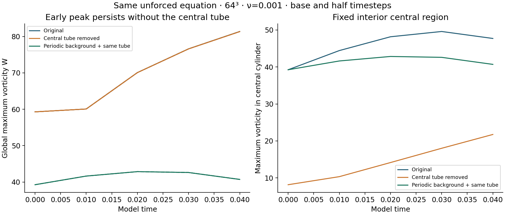
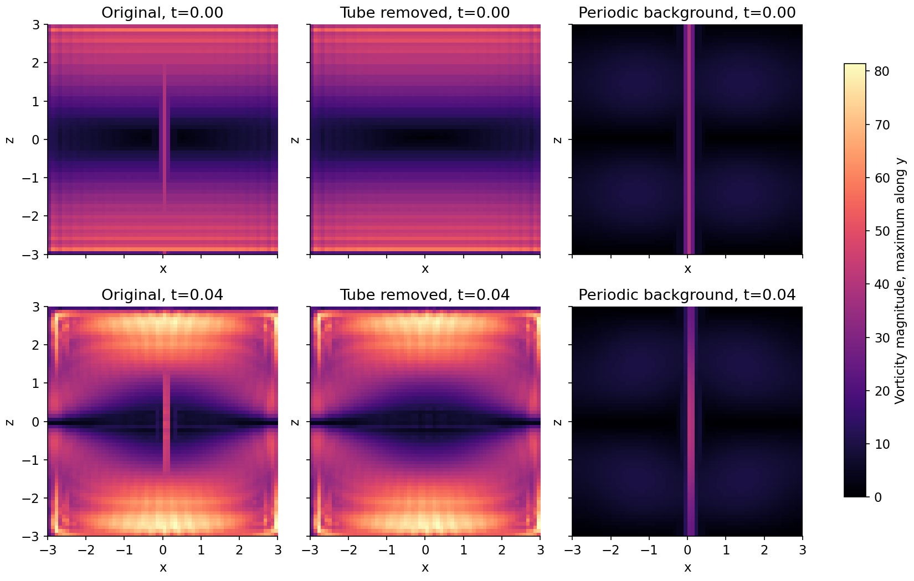

# Does the join-associated peak need the central tube?

**No, over this short numerical interval. Removing the central tube leaves the initial maximum unchanged and the peak still rises 37.21% through time 0.04.**

| Start | W at 0 | W at 0.04 | Starting energy | Center strain ∂u_z/∂z |
|---|---:|---:|---:|---:|
| Original | 59.279954 | 81.370067 | 17545.882795 | 15.697553 |
| Tube removed | 59.279954 | 81.338365 | 17544.375057 | 15.697553 |
| Periodic background, same tube | 39.251168 | 40.707559 | 1931.102901 | 7.851245 |

At 0.04, removing the tube changes the global peak by -0.0390%. Its vorticity magnitude at the original run's maximum is 81.338365, versus 81.370067 in the original run. The short-time peak therefore does not require the central tube.

## What changed

The original base and half-step trajectories were reused. Four new controls remove the tube or replace the raw background by a smooth periodic sine-coordinate construction, each at the same original timestep and half timestep. All use the same unforced incompressible Navier–Stokes solver, positive viscosity 0.001, side 6 and spectral projection. No force, energy rescaling or change to existing simulations was made.

The periodic variant keeps the original sampled tube and mean exactly. It changes starting energy by -88.99% and changes the projected central strain. It is a separate starting-field experiment, not an adopted replacement and not a seam-only modification. A lower peak there cannot be attributed solely to repairing the join.

The interior central measurement uses x²+y²≤0.4² and |z|≤2.5. It is a fixed spatial region, not an advected label identifying tube material. After evolution, the difference between two runs is a nonlinear response to removing the tube, not an additive decomposition of the original evolved flow.

## Checks and limits

All 30 saved fields were checked for finite values, hashes, peak spin and energy. The tube-removal W curves differ by 0.000286% under timestep halving; the periodic-background curves differ by 0.000008%. Minimum peak widths are 2.139 cells in the original, 2.139 with the tube removed, and 1.774 with the periodic background. All fail the six-cell screen. Spectral and budget checks are recorded in the data.

This establishes that the early peak persists in the background without the central tube. It does not establish a resolved physical spike, isolate all effects of the raw join, or explain the much later peak near time 0.3. Spatial refinement remains necessary for those conclusions.

[Measurements](measurements.json) · [Comparisons](analysis.json) · [Verification](verification.json) · [Protocol](protocol.json) · [Runner](run.py) · [Analysis](analyze.py)

Raw field arrays remain local with published hashes. The original baseline input fields are in the existing matched-stretch study. Running this audit requires those saved arrays; the portable reconstruction helper generates equivalent reference runs in a fresh directory.

To reproduce in a new directory, install requirements.txt and run `python reproduce.py --output NEW_DIRECTORY`. This generates equivalent original reference trajectories and then the four controls; it does not overwrite the saved study.
