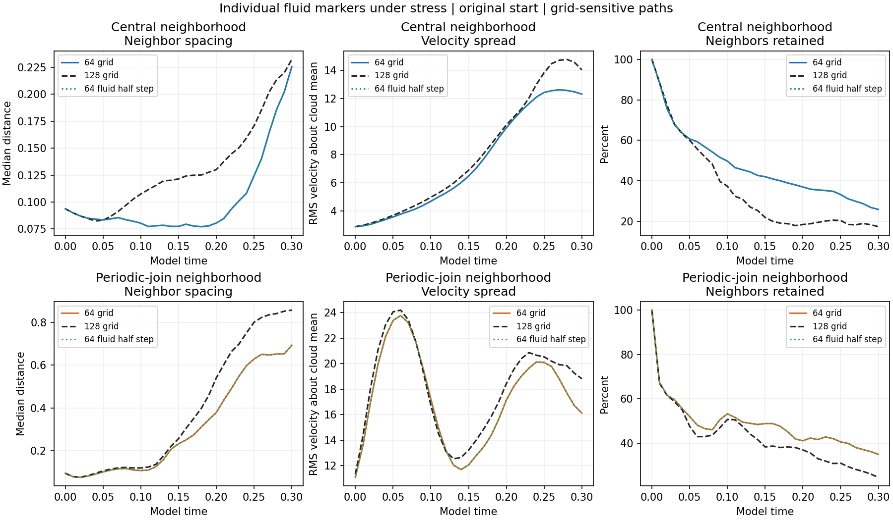
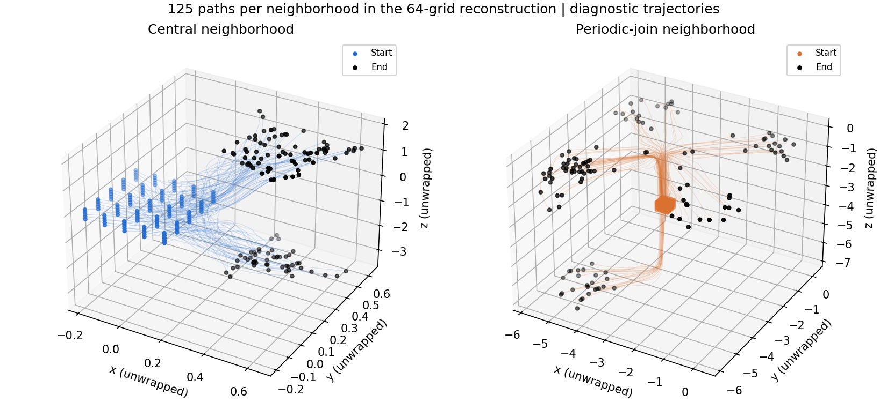
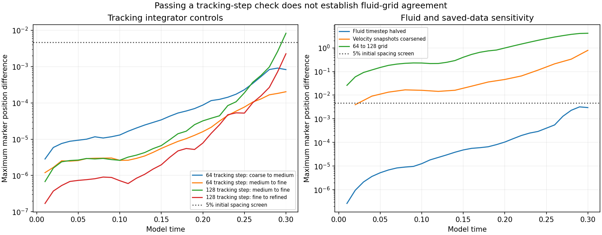
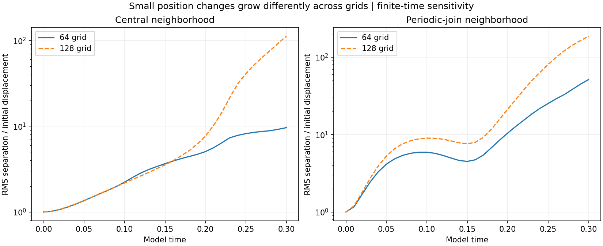

# Individual fluid markers: stress test

**The markers develop different motion. Their detailed paths fail the grid and saved-time sensitivity checks.**

The user selected individual fluid markers following the approved Navier–Stokes flow. This completed test reconstructs passive tracks from existing velocity fields through model time 0.30. It does not add a molecular model, particle forces, noise or a new fluid run. The ongoing 128-grid run contributes only already-saved observations through 0.30; its full run is not claimed complete.

## What individuality means here

Each label follows `dX_i/dt = u_h(X_i,t)`. Different positions sample different velocities. Within a cloud, `c_i = u_h(X_i,t) - mean_j u_h(X_j,t)` measures the difference from that cloud’s sampled mean. This c is a diagnostic of variations in the resolved/interpolated flow, not molecular thermal motion. The cloud mean is an equally weighted marker average, not a mass-weighted average of a filled fluid volume. Five exact copies of initial positions follow identical paths: a different label alone does not change the dynamics.

## Stress and controls

- 125 labels fill a 5x5x5 central neighborhood, and 125 fill a neighborhood of the original 64-grid initial global spin peak at (-2.90625,-2.90625,-2.90625), crossing the periodic join. Initial nearest lattice spacing is 0.09375; cloud side length is 0.375.
- 600 fixed links connect adjacent lattice sites. A separate nearest-six-neighbor diagnostic measures changes in proximity, with stable label-index tie breaking.
- Each label gets a companion initially displaced by exactly 0.0009375 (1% of spacing), using random-direction seed 104. This changes marker positions only.
- Eight reconstructions test smaller RK4 tracking steps, a halved fluid timestep, finer fluid grid and coarser saved-time spacing. The additional eighth check investigates the failed initial 128-grid tracking-step screen.
- The fluid remains the supplied original start, viscosity 0.001, periodic cube side 6, Heun evolution, preserved per-grid mean and zero external force.

## Measured group behavior

All positions, speeds and times use the original simulation model units.

| Grid | Neighborhood | Final median original-neighbor spacing | Final RMS velocity difference from cloud mean | Final initial-neighbor retention |
| --- | --- | ---: | ---: | ---: |
| 64 | Central neighborhood | 0.22559 | 12.3103 | 25.9% |
| 64 | Periodic-join neighborhood | 0.69339 | 16.1193 | 34.9% |
| 128 | Central neighborhood | 0.23234 | 14.0369 | 17.3% |
| 128 | Periodic-join neighborhood | 0.85753 | 18.8112 | 24.5% |

Every link starts with distance 0.09375. These values describe the sampled trajectories; differences between the rows are part of the result. Approach or separation follows the given flow and does not demonstrate a new attraction law. Crowding of labels is not fluid-density increase.

Coordinates above are continuously unwrapped across the periodic box. They are three-dimensional physical paths, not an autonomous phase portrait. Projected crossings and sparse sampled near approaches do not demonstrate molecule collisions or disprove trajectory uniqueness.

## Did the paths survive the controls?

The declared exploratory screen is maximum corresponding-label displacement no greater than 0.0046875 (5% of initial spacing). It is a descriptive tolerance, not a rigorous physical error bound.

| Comparison | Maximum through 0.10 | Maximum through 0.30 | Screen through 0.30 |
| --- | ---: | ---: | --- |
| 64 tracking step: coarse to medium | 0.0000131 | 0.0009111 | PASS |
| 64 tracking step: medium to fine | 0.0000030 | 0.0002035 | PASS |
| 128 tracking step: medium to fine | 0.0000030 | 0.0083206 | FAIL |
| 128 tracking step: fine to refined | 0.0000009 | 0.0022665 | PASS |
| Fluid timestep halved | 0.0000127 | 0.0031929 | PASS |
| Velocity snapshots coarsened | 0.0167396 | 0.7856360 | FAIL |
| 64 to 128 grid | 0.2299538 | 4.1423376 | FAIL |

The extra 128-grid half-step changes the maximum tracked position by 0.002266. The 64/128 grid comparison changes it by 4.142338. Subtracting the difference in each grid’s preserved uniform mean drift still leaves a maximum discrepancy of 4.066032. This frame adjustment is diagnostic only; it does not equalize the starting fields or their evolution.

The grids start with different sampled fields, mean velocities and energies. Their discrepancy therefore combines starting-field and spatial-discretization differences; it is not a clean same-smooth-start convergence result. Temporal coarsening from 0.01 to 0.02 is also a sensitivity test, not an upper bound on the error at0.01. The raw periodic-join mismatch and unresolved vorticity peaks remain.

## Small starting-position changes

| Grid | Neighborhood | Final RMS position amplification | Largest final individual amplification |
| --- | --- | ---: | ---: |
| 64 | Central neighborhood | 9.641 | 45.323 |
| 64 | Periodic-join neighborhood | 51.231 | 326.176 |
| 128 | Central neighborhood | 112.331 | 1073.661 |
| 128 | Periodic-join neighborhood | 185.918 | 1305.130 |

Amplification is shortest-periodic companion separation divided by its initial displacement. These are finite-time marker sensitivity ratios, not asymptotic Lyapunov exponents. A single perturbation direction per label and these two grids do not establish a universal rate, chaos classification, periodic breathing or physical molecular behavior.

## Verification and reproduction

All 93 distinct source fields were finite-checked and hashed. Initial velocity interpolation was cross-checked against SciPy; a known rigid-rotation trajectory checks RK4 convergence. Every stored trajectory is finite, preserves identical-clone agreement and has its own hash. Final sampled velocities and reported group diagnostics are checked by the separate verification script. Numerical fluid sources remain unchanged.

Rebuild this report and four charts with `python report.py` beside the supplied JSON and NPZ files. `run.py` and `refine.py` require the original workspace’s saved fluid fields. Reproduction does not require editing or rerunning the fluid solver.

[Changing separation roles](separation-roles.md) · [Fractal tests](fractal/README.md) · [Protocol](protocol.json) · [Results](results.json) · [Comparison details](summary.json) · [Verification](verification.json) · [Earlier tracked pairs](../central-response/tracked-patterns/README.md) · [Main study](../README.md)
