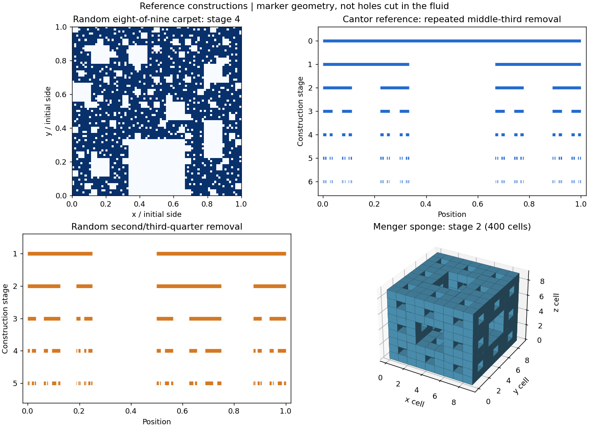
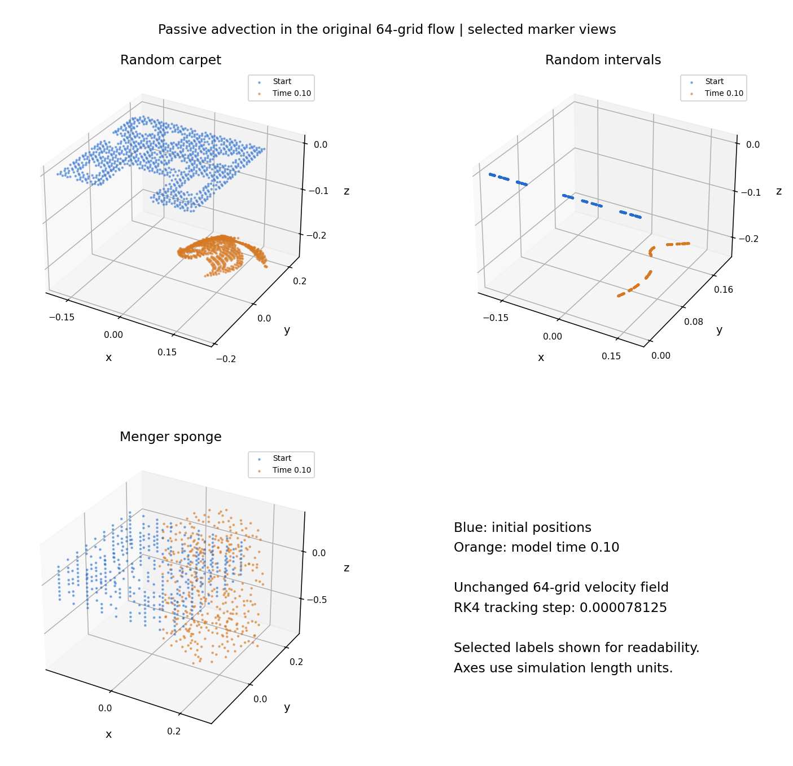
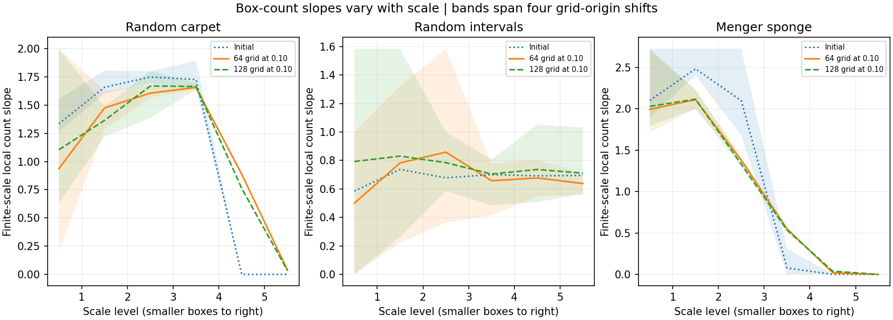
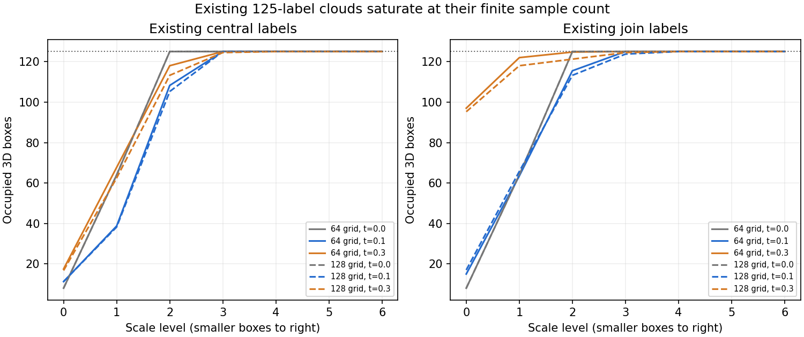

# Fractal marker tests: carpet, random intervals and Menger sponge

**All three marker patterns were followed through model time 0.10 in the unchanged fluid. The counting controls reproduce the known constructions. The finite moving samples do not establish that the fluid itself generates a fractal.**

[Individual-marker stress test](../README.md) · [Main study](../../README.md)

## What was tested

| Construction | Tracked sample sizes | Known ideal dimension |
| --- | ---: | ---: |
| Random eight-of-nine carpet | 512 and 4096 | log(8)/log(3) = 1.892789 |
| Random second/third-quarter removal | 256 and 1024 | log(phi)/log(2) = 0.694242 |
| Menger sponge, the selected “fractal cheese” | 400 and 8000 | log(20)/log(3) = 2.726833 |
| Cantor set: counting-method reference only | 256 reference points | log(2)/log(3) = 0.630930 |

The finest tracked groups contain 13,120 labels, with coarser sampling controls alongside them. They start in a central region of side 0.375. Carpet labels lie in an x-y square, interval labels lie along x, and sponge labels occupy three dimensions. Missing labels do not remove water or create solid walls. All follow `dX_i/dt=u_h(X_i,t)`; there is no added force, noise or replacement Navier–Stokes equation.

## The random-interval detail

One seeded coin flip per stage chooses second-quarter or third-quarter removal in every current connected interval. Each parent leaves **two** connected pieces of lengths one-quarter and one-half. Thus the dimension relation is `(1/4)^d+(1/2)^d=1`, giving d=log(phi)/log(2). Swapping their left/right placement leaves those contraction ratios unchanged. The retained total length after n stages is `(3/4)^n`.
The seed 551 realization deleted quarters [2, 3, 2, 2, 3, 3, 3, 2, 3, 3] at successive stages.

The first implementation mistakenly treated the three surviving quarter-cells as separate children. That excluded quarter subset and its source are preserved locally as an audit record. The corrected `quarter_connected.py` and its trajectories supply every random-interval result reported here. The independently advected Menger labels from the first batch were retained without repeating them.

## What the flow did

Each pattern is carried and deformed by the flow. These are markers seeded in an already fractal construction: observing their holes is not evidence that the fluid created those holes. Plots show selected physical positions in three dimensions, not a two-dimensional autonomous phase portrait. All lengths, velocities and times use the original model units.

| Finest marker pattern | Tracking half-step max difference | 64/128 grid max difference | Final shape RMS after centroid alignment | Coarser saved-time max difference |
| --- | ---: | ---: | ---: | ---: |
| Random carpet | 1.67e-07 | 0.145846 | 0.030667 | 0.005227 |
| Random intervals | 1.25e-07 | 0.142131 | 0.029036 | 0.004786 |
| Menger sponge | 1.73e-07 | 0.197563 | 0.040650 | 0.005577 |

The tracking step has little effect over this short window. Grid differences are much larger, even after removing cloud translation. Saved-time coarsening also changes the tracks. The two fluid grids have different sampled starts and preserved means; this is a sensitivity comparison, not a clean convergence proof. The original join mismatch and unresolved spin peaks remain.

## Box counting: what changes and what does not

We count occupied 3D boxes and x-y projection squares at seven scales, with four grid-origin shifts. Each cloud is centered to remove translation; its original 0.375 length scale is held fixed. No best-looking interval was selected after seeing the results: fits use levels 1–3 and 2–4. The raw counts, adjacent-scale slopes, shifted-grid fits, point-count saturation and both sample depths are in [analysis.json](analysis.json).

| Finest sample at time 0.10 | 64-grid 3D slope range, levels 1–3 | 128-grid 3D slope range, levels 1–3 |
| --- | ---: | ---: |
| Random carpet | 1.443–1.607 | 1.303–1.628 |
| Random intervals | 0.292–1.085 | 0.569–1.085 |
| Menger sponge | 1.692–1.794 | 1.658–1.771 |

These are **finite-scale fitted slopes**, not new limiting fractal dimensions. Their dependence on scale, origin and sampling is visible. Even the undeformed finite patterns can give shifted-grid fits different from their known ideal dimensions. Every finite point sample eventually saturates and has box dimension 0 as boxes become arbitrarily small. A smooth finite-time flow with a Lipschitz inverse preserves an ideal set’s box dimension, although its finite-scale geometry can change. See [box-dimension definition](https://www.math.stonybrook.edu/~scott/Book331/Fractal_Dimension.html) and [bi-Lipschitz invariance](https://link.springer.com/article/10.1007/s00209-019-02426-2).

## Existing marker patterns

The original stress-test clouds contain 125 markers each. Their counts saturate at that sample size across the tested scales. This data does not establish a scale-independent fractal dimension. The full 3D counts and 2D projection counts are kept separate.

## Verification, limits and reproduction

Construction-aligned counts exactly reproduce the carpet, Cantor, Menger, filled-line and filled-square benchmarks over their construction scales. For the unequal random intervals, every stage passes the retained-length and sum-of-lengths-to-the-d checks. Every trajectory file is finite-checked and hashed; initial interpolation agrees with an independent SciPy sampler. The fluid fields and numerical source were preserved. These checks concern implementation consistency, not physical fractal convergence.

The marker patterns include separations below a fluid grid cell. Interpolation can place and move those labels, but cannot supply missing small-scale fluid detail. This batch does not demonstrate molecular interactions, a strange attractor, a chaos theorem, sustained breathing or Navier–Stokes blowup.

Run `python analyze_fractals.py` and `python report_fractals.py` with the supplied data to rebuild the analysis and figures. Tracking scripts require the original saved fluid fields. The Menger-only reproduction entry point is `menger_tracks.py`; the saved Menger tracks were extracted losslessly from the historical independent-label batch. [Verification](verification.json) and the [protocol addendum](protocol-addendum.json) record these checks and the corrected random-interval construction. [Menger construction reference](https://www.math.uwaterloo.ca/~ervrscay/courses/amath343docs/week10.pdf). The user’s textbook images and private documents are not included.
