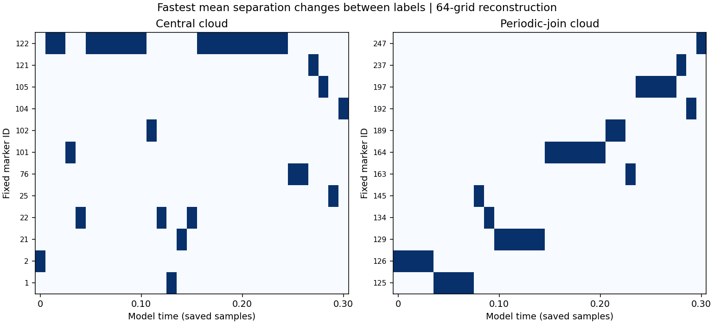

# Which marker separates from its neighbors fastest?

Each of the 125 labels in a cloud is eligible at every saved time. A fixed identity is kept throughout the track. The selected role depends on the current positions and velocities.

For marker i, calculate the mean of `(X_j-X_i) dot (u_j-u_i) / |X_j-X_i|` over its original lattice neighbors, using shortest periodic displacements. This is the instantaneous rate of increase in its mean distance to those neighbors. A positive maximum receives the role; near ties are retained. If every score is nonpositive within tolerance, no marker receives it. The fixed lattice gives each label three to six neighbors; their mean gives each label one comparable score.

## Observed changes through time 0.30

| Grid | Cloud | Different labels selected | Changes between recorded selected sets | Longest consecutive selected samples |
| --- | --- | ---: | ---: | ---: |
| 64 | Central | 12 | 15 | 9 |
| 64 | Periodic join | 12 | 11 | 6 |
| 128 | Central | 10 | 17 | 7 |
| 128 | Periodic join | 14 | 14 | 5 |

There are 31 observations separated by 0.01 model time. Consecutive observations do not establish uninterrupted residence between them. Every marker is eligible, but this finite run does not show that every marker eventually takes the role.

## Do the controls select the same IDs?

| Comparison | Central matches / 31 | Join matches / 31 |
| --- | ---: | ---: |
| tracking_medium vs reference | 31 | 31 |
| grid128 vs grid128_refined | 31 | 31 |
| reference vs fluid_half | 31 | 31 |
| reference vs grid128_refined | 7 | 13 |

Matching selected sets is a stringent rank diagnostic and may be sensitive to nearly tied scores. The full records retain the top-two score gap, ties and the score itself. Tracking-step agreement does not establish spatial resolution; grid comparisons also include the known differences in the sampled starting fields.

This measures relative motion. It does not show that a passive label makes other labels move, that it has a permanent trait, or that it follows an unbounded Hénon orbit. No feedback or force has been added.

[Full scores and checks](separation-roles.json) · [Rebuild this analysis](separation_roles.py) · [Marker stress test](README.md)
