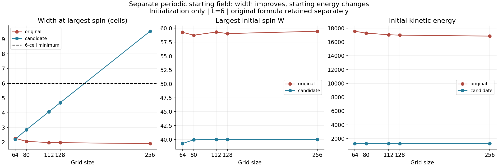
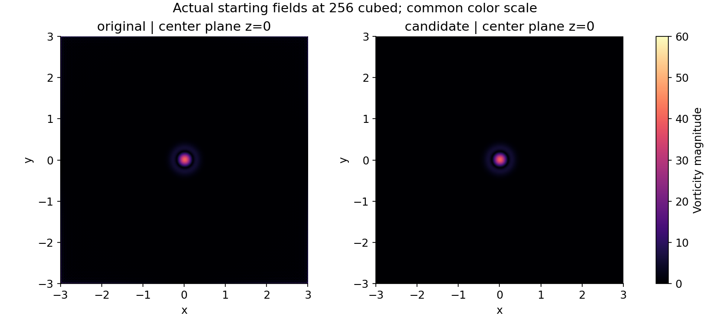

# Test of a periodic starting field

**The new start passes the initial width and spectral screens at 256 cubed. Its starting energy is only 7.56% of the original.** This is a different starting field whose later evolution has not been tested.

| Grid | Original peak width, cells | New peak width, cells | New peak spin | New energy / original | New initial screen |
| --- | --- | --- | --- | --- | --- |
| 64 | 2.267 | 2.195 | 39.251168 | 7.257% | Fail: width |
| 80 | 2.055 | 2.848 | 39.937136 | 7.370% | Fail: width |
| 112 | 1.978 | 4.067 | 39.999963 | 7.472% | Fail: width |
| 128 | 1.969 | 4.677 | 39.999999 | 7.497% | Fail: width |
| 256 | 1.907 | 9.532 | 40.000000 | 7.559% | Pass |

## What changed

The background strain now uses periodic sine coordinates and a periodic envelope. Near the origin, their leading Taylor terms match the old raw formula. The pressure projection is unchanged; its resulting center strain is measured in [results.json](results.json).

The central tube uses the exact Fourier coefficients of a periodized Gaussian with the same radius 0.2 and amplitude 0.4. Its velocity differs from the original tube by 4.06e-14 in relative L2 at 256 cubed. Thus the large starting-field change is in the surrounding strain.

Every new grid uses the same mean velocity, fixed to the original 256-grid mean: [0.2601639166870663, 0.2601639166870663, -0.5203278333741326]. The original grids retain their original means. No energy rescaling was applied.

The new background formula is:
- coordinate: sin(k*x)/k, with k=2*pi/6;
- squared distance: sum of 2*(1-cos(k*x))/k^2 over x,y,z;
- envelope: exp(-0.04*squared_distance);
- raw velocity: (-40*coordinate_x, -40*coordinate_y, 80*coordinate_z)*envelope, followed by the original divergence-free projection.

[Exact protocol](protocol.json) · [Runnable initial-field check](run.py)

## Where the original spike comes from

At the original maximum, the original tube contributes at most 2.49e-05% of the vorticity magnitude across these five grids. The background contributes the boundary spike. Vector addition was checked at the same location.

At 256 cubed, the new maximum is at [0.0, 0.0, -3.0], in the central tube. Its measured physical width is 0.223406, or 9.532 cells. Its high-band enstrophy fraction is 5.48e-25%.

These images show z=0. The original global maximum can lie outside that plane; the recorded peak coordinates identify it exactly.

## What the pass establishes

The starting peak passes the predefined six-cell and spectral checks on the 256 grid. The 128 grid still has fewer than six cells across the core. This is not a completed two-grid evolution comparison.

The energy drop is 92.44%. A later difference in growth would therefore combine the effects of changed geometry, strain and energy. It cannot be attributed solely to repairing the join. Uniform energy normalization would also change the central tube's spin, so that adjustment has not been silently applied.

No time stepping, forcing or replacement of old checkpoints occurred. The original 48-run matrix continues under its existing protocol. [Original-start diagnosis](../adaptive-peak/README.md).

[Measured results](results.json) · [Verification](verification.json)
